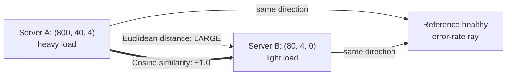

## Why Cosine Similarity Ignores Magnitude Entirely, and a Concrete Case Where That Is Exactly the Desired Behavior

### A Systems Analogy First

Think of two log files recording how many times a web server hit each HTTP status-code family in an hour: `(2xx, 4xx, 5xx)` counts. Server A, under heavy load, logs `(800, 40, 4)` — mostly successes, a few client errors, almost no server errors. Server B, under light load during a quiet overnight window, logs `(80, 4, 0)` — an order of magnitude fewer requests, but the *same proportions* of success to failure. A monitoring system that flags "these two servers are behaving the same way" is making a claim about *ratios*, not raw *volume*. Cosine similarity is the tool built specifically to formalize that claim: it answers "do these two vectors point in the same direction," while deliberately discarding "how long is each vector."

### Recalling Where This Behavior Comes From

Recall that cosine similarity is defined as

$$\cos\theta = \frac{\vec{a}\cdot\vec{b}}{\|\vec{a}\|\|\vec{b}\|}$$

where $\vec{a}\cdot\vec{b}$ is the dot product (sum of componentwise products) and $\|\vec{a}\|$, $\|\vec{b}\|$ are the norms (Euclidean lengths) of the two vectors. The division by $\|\vec{a}\|\|\vec{b}\|$ is not incidental — it is a deliberate *normalization* step, and this item is about proving precisely why that division makes magnitude vanish from the result, and then about when you actually want that.

### The Algebraic Proof That Scale Cancels

Suppose you scale $\vec{a}$ by any positive scalar $k$, producing $k\vec{a}$. This models exactly the log-file scenario above: Server B's vector is Server A's vector scaled down by roughly $k = 0.1$. We can show algebraically that cosine similarity is completely unaffected by this scaling.

First, the dot product scales linearly with $k$, since each term in the sum picks up one factor of $k$:

$$(k\vec{a}) \cdot \vec{b} = \sum_{i=1}^{n} (k a_i) b_i = k \sum_{i=1}^{n} a_i b_i = k(\vec{a}\cdot\vec{b})$$

Second, the norm scales by $k$ as well, but note it comes out of the square root as $k$, not $k^2$, because norm involves a square root over squared terms:

$$\|k\vec{a}\| = \sqrt{\sum_{i=1}^{n} (k a_i)^2} = \sqrt{k^2 \sum_{i=1}^{n} a_i^2} = |k| \cdot \|\vec{a}\|$$

(For $k > 0$, $|k| = k$.) Substituting both results into the cosine similarity formula for $k\vec{a}$ and $\vec{b}$:

$$\cos\theta' = \frac{(k\vec{a})\cdot\vec{b}}{\|k\vec{a}\|\|\vec{b}\|} = \frac{k(\vec{a}\cdot\vec{b})}{k\|\vec{a}\|\|\vec{b}\|}$$

The factor of $k$ appears once in the numerator and once in the denominator, so it cancels exactly:

$$\cos\theta' = \frac{\vec{a}\cdot\vec{b}}{\|\vec{a}\|\|\vec{b}\|} = \cos\theta$$

**Key Points**

- The cancellation is exact and holds for *any* positive $k$, not just an approximation for small scaling factors.
- This is a direct algebraic consequence of the norm being a square root of a sum of squares — it grows at the same *rate* ($k^1$) as the dot product, which is what forces the cancellation. A metric that normalized by, say, the sum of squares instead of its square root would not have this property.
- The same cancellation applies independently if you scale $\vec{b}$ instead, or both vectors by different positive scalars $k_1$ and $k_2$ — each factor cancels between numerator and denominator in the same way.
- Geometrically, scaling a vector by a positive $k$ stretches it along the same ray from the origin without changing its direction, so of course the *angle* to any other vector is unaffected — the algebra above is just confirming that the formula respects this geometric fact.

### Worked Numeric Confirmation

Take $\vec{a} = (8, 0, 4)$ representing Server A's status-code counts (scaled down for readability), and $\vec{b} = (0.8, 0, 0.4)$ representing Server B — exactly $\vec{a}$ scaled by $k = 0.1$.

**For $\vec{a}$ and a reference vector $\vec{r} = (1, 1, 0)$:**

$$\vec{a}\cdot\vec{r} = 8, \quad \|\vec{a}\| = \sqrt{64+0+16} = \sqrt{80} \approx 8.944, \quad \|\vec{r}\| = \sqrt{2} \approx 1.414$$

$$\cos\theta = \frac{8}{8.944 \times 1.414} \approx \frac{8}{12.65} \approx 0.632$$

**For $\vec{b}$ and the same $\vec{r} = (1, 1, 0)$:**

$$\vec{b}\cdot\vec{r} = 0.8, \quad \|\vec{b}\| = \sqrt{0.64+0+0.16} = \sqrt{0.8} \approx 0.894, \quad \|\vec{r}\| \approx 1.414$$

$$\cos\theta = \frac{0.8}{0.894 \times 1.414} \approx \frac{0.8}{1.265} \approx 0.632$$

**Output**

- Cosine similarity of $\vec{a}$ with $\vec{r}$: $\approx 0.632$
- Cosine similarity of $\vec{b}$ with $\vec{r}$: $\approx 0.632$

The two results are identical to three decimal places, despite $\vec{b}$ having a norm ten times smaller than $\vec{a}$'s. This confirms the algebraic proof: the tenfold difference in overall request volume between the two servers contributes nothing to the similarity score.

### A Concrete Case Where This Is Exactly the Desired Behavior

Return to the opening scenario. Suppose a monitoring dashboard is designed to detect servers exhibiting an unusual *error-rate pattern*, regardless of load. A traffic-mix vector like `(2xx, 4xx, 5xx)` naturally scales up and down with total request volume across the day and across servers of different sizes. If you compared these vectors with **Euclidean distance** instead of cosine similarity, a lightly loaded but perfectly healthy server would appear "far" from a heavily loaded but equally healthy server purely because the raw counts differ in scale — a false alarm driven entirely by volume rather than by behavior.

Cosine similarity was chosen deliberately for this dashboard because volume is a **nuisance variable**: it is real, it varies constantly, and it carries no information about whether the server is behaving in a healthy or unhealthy way. The only signal that matters is the *proportion* of successes to client errors to server errors — the direction of the vector, not its length. By construction, cosine similarity reports Server A (`800, 40, 4`) and Server B (`80, 4, 0`, or its exact scaled equivalent `80, 4, 0` after adding a matching zero for `5xx`) as behaving nearly identically, correctly identifying that both servers have the same healthy error-rate profile despite a tenfold difference in traffic.

This same reasoning is exactly why cosine similarity became the default metric for comparing text embedding vectors: a longer document and a short document discussing the same topic can produce embedding vectors of different magnitudes for reasons tied to model internals (such as token count or output normalization) that have nothing to do with semantic content, and a similarity metric for meaning needs to be blind to that magnitude difference in the same way the error-rate dashboard needs to be blind to traffic volume.

**Conclusion**

Cosine similarity ignores magnitude not as an accidental side effect but as a direct, provable algebraic consequence of dividing the dot product by the product of the two norms — a scaling factor $k$ applied to either vector cancels exactly between numerator and denominator. This makes cosine similarity the correct tool precisely when the *ratio* or *proportion* encoded in a vector's direction is the meaningful signal, and the vector's overall length is a nuisance variable driven by unrelated factors like total volume, document length, or measurement scale. Using cosine similarity implicitly asserts this belief about the data; using Euclidean distance or a raw dot product instead would treat magnitude as meaningful, which is the correct choice in other situations but the wrong one here.

**Related Topics**

- Euclidean distance versus cosine similarity: when magnitude *should* count
- Raw dot-product similarity as a middle ground that keeps magnitude information
- Vector normalization (rescaling to unit length) as a preprocessing step that makes cosine similarity and dot-product similarity equivalent
- Why embedding magnitude in transformer-based models is not always semantically meaningful
- Failure modes of magnitude-blind metrics when magnitude actually does carry signal (e.g., confidence-weighted embeddings)