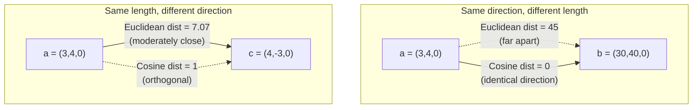

## Euclidean Distance Versus Cosine Distance: Two Different Questions You Can Ask About the Same Pair of Vectors

### A Systems Analogy First

Consider two ways a network operator might compare two hosts' traffic-mix vectors, `(HTTP, DNS, SSH)` byte counts. One question is: "How far apart are these two points in absolute terms?" — useful if you care about total bandwidth difference. A completely different question is: "Do these two hosts have the same *shape* of traffic, regardless of how much total bandwidth each used?" These are not two ways of asking the same thing and getting slightly different numbers — they are genuinely different questions, and a vector pair can score as "close" under one and "far" under the other simultaneously. Euclidean distance answers the first question; cosine distance answers the second.

### Recalling the Two Definitions

Recall that the **dot product** of $\vec{a}$ and $\vec{b}$ is $\vec{a}\cdot\vec{b} = \sum_i a_i b_i$, and the **norm** $\|\vec{a}\|$ is $\sqrt{\vec{a}\cdot\vec{a}}$, the straight-line length of the vector.

**Euclidean distance** between two vectors $\vec{a}$ and $\vec{b}$ is the straight-line distance between them as points in space:

$$d_{\text{euclidean}}(\vec{a}, \vec{b}) = \|\vec{a} - \vec{b}\| = \sqrt{\sum_{i=1}^{n} (a_i - b_i)^2}$$

Recall that **cosine similarity** is $\cos\theta = \dfrac{\vec{a}\cdot\vec{b}}{\|\vec{a}\|\|\vec{b}\|}$, the cosine of the angle between the two vectors. **Cosine distance** is simply defined as one minus this quantity, converting a similarity score (higher is more similar) into a distance score (lower is more similar):

$$d_{\text{cosine}}(\vec{a}, \vec{b}) = 1 - \cos\theta = 1 - \frac{\vec{a}\cdot\vec{b}}{\|\vec{a}\|\|\vec{b}\|}$$

### What Each Metric Is Actually Measuring

**Key Points**
- Euclidean distance measures the length of the straight segment connecting the tips of the two vectors when both are drawn from the origin. It is sensitive to both *direction* and *magnitude* simultaneously — two vectors can be Euclidean-close either because they point the same way and have similar length, or in principle even by coincidence of position, but critically, if their lengths differ a lot, Euclidean distance grows even when direction is identical.
- Cosine distance measures purely the angle $\theta$ between the two vectors and is, as established by the algebraic cancellation in the derivation of cosine similarity, completely blind to magnitude. Two vectors pointing in exactly the same direction have cosine distance exactly $0$, no matter how different their lengths are.
- Because they encode different information, Euclidean distance ranges over $[0, \infty)$ (unbounded, since vectors can be arbitrarily far apart in absolute terms), while cosine distance is bounded to $[0, 2]$ (since $\cos\theta \in [-1, 1]$).

### Worked Example Showing the Divergence

Let $\vec{a} = (3, 4, 0)$ and $\vec{b} = (30, 40, 0)$ — note $\vec{b} = 10\vec{a}$, so they point in *exactly* the same direction but differ hugely in length. Also let $\vec{c} = (4, -3, 0)$, a vector of the same length as $\vec{a}$ but pointing in a very different direction (rotated 90° from $\vec{a}$ within this plane, since $\vec{a}\cdot\vec{c} = 12-12+0=0$).

**Step 1 — Euclidean distance between $\vec{a}$ and $\vec{b}$ (same direction, different length).**

$$d_{\text{euclidean}}(\vec{a}, \vec{b}) = \sqrt{(3-30)^2 + (4-40)^2 + 0^2} = \sqrt{729 + 1296} = \sqrt{2025} = 45$$

**Step 2 — Cosine distance between $\vec{a}$ and $\vec{b}$.**

$$\vec{a}\cdot\vec{b} = 90+160+0=250, \quad \|\vec{a}\|=5, \quad \|\vec{b}\|=50$$
$$\cos\theta = \frac{250}{5\times 50} = 1 \quad\Rightarrow\quad d_{\text{cosine}}(\vec{a},\vec{b}) = 1-1=0$$

**Step 3 — Euclidean distance between $\vec{a}$ and $\vec{c}$ (same length, orthogonal direction).**

$$d_{\text{euclidean}}(\vec{a}, \vec{c}) = \sqrt{(3-4)^2 + (4-(-3))^2 + 0^2} = \sqrt{1+49} = \sqrt{50} \approx 7.07$$

**Step 4 — Cosine distance between $\vec{a}$ and $\vec{c}$.**

$$\vec{a}\cdot\vec{c} = 0 \quad\Rightarrow\quad \cos\theta = 0 \quad\Rightarrow\quad d_{\text{cosine}}(\vec{a},\vec{c}) = 1-0 = 1$$

**Output**

| Pair | Euclidean distance | Cosine distance |
|---|---|---|
| $\vec{a}, \vec{b}$ (same direction, 10x length) | $45$ (very far) | $0$ (identical) |
| $\vec{a}, \vec{c}$ (same length, orthogonal) | $\approx 7.07$ (moderate) | $1$ (maximally dissimilar in this range) |

This table is the entire point made numerically: $\vec{a}$ and $\vec{b}$ are the *closest possible pair* under cosine distance ($0$) but among the *farthest* under Euclidean distance ($45$) — the two metrics rank the same pairs in opposite order.

### Geometric Picture

### When Each Question Is the Right One to Ask

Euclidean distance is the right tool when absolute position or absolute magnitude carries real information — for example, comparing two points' physical coordinates, or comparing two numeric feature vectors (age, income, height) where the raw scale of each dimension is meaningful and should contribute to "closeness." Cosine distance is the right tool when only relative proportions matter and magnitude is a nuisance variable — the network-traffic-mix example above, or comparing text embedding vectors, where the direction of the vector is engineered to encode semantic content while the magnitude may reflect factors (document length, token count, model normalization behavior) unrelated to meaning. [Inference] Whether embedding magnitude in a specific model carries any usable signal at all is model-dependent and would need to be verified empirically for a given embedding model rather than assumed.

**Conclusion**

Euclidean distance and cosine distance are not two estimators converging on the same underlying quantity with different error characteristics — they are answers to two structurally different questions ("how far apart are these points" versus "how differently are these vectors oriented"), and a well-chosen worked example, as above, can push them to opposite extremes on the exact same pair of vectors. Selecting between them is a modeling decision about which question — absolute distance or relative proportion — is actually meaningful for the data at hand, not a matter of which formula is more "accurate."

**Related Topics**
- Dot-product similarity as a third option that keeps magnitude information but skips the angle normalization
- Vector normalization to unit length, after which Euclidean distance and cosine distance become monotonically related
- Choosing a distance metric for a specific ANN index (many implementations only support one metric natively)
- The curse of dimensionality's effect on Euclidean distance concentration in high-dimensional embedding spaces
- Similarity thresholds as an empirical engineering choice, and how the choice of metric changes what a "good" threshold looks like