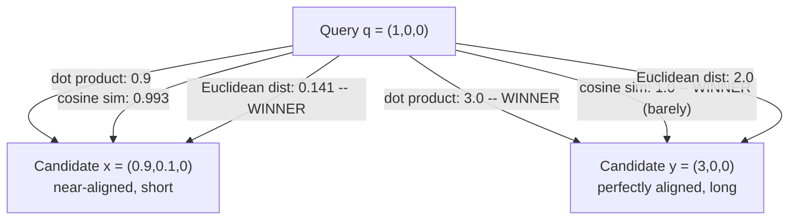

## Dot Product Similarity as a Third Option, and When the Choice Between These Three Metrics Actually Changes the Answer

### A Systems Analogy First

Think of a load balancer scoring candidate backend servers for a request, where each server is described by a vector `(available_CPU, available_memory, cache_warmth)`. One scoring rule could measure "how similar in *proportion* is this server's resource profile to an ideal profile" — that is a direction question. A different scoring rule could measure "how much total capacity does this server have, weighted toward the resources the ideal profile cares about most" — that is a question where a server with more of everything should score higher, not just a server with the right ratios. The first rule is what cosine similarity computes. The second rule — raw magnitude-sensitive alignment — is exactly what the plain **dot product**, used directly as a similarity score, computes.

### Recalling the Three Definitions Side by Side

Recall that for vectors $\vec{a}=(a_1,\dots,a_n)$ and $\vec{b}=(b_1,\dots,b_n)$:

**Dot product similarity** uses the raw dot product itself as the similarity score, with no normalization step at all:

$$\text{sim}_{\text{dot}}(\vec{a},\vec{b}) = \vec{a}\cdot\vec{b} = \sum_{i=1}^n a_i b_i$$

**Cosine similarity**, recall, divides the dot product by the product of the two norms, which — as shown by the scaling-cancellation proof — makes it a pure measure of direction, blind to length:

$$\text{sim}_{\text{cosine}}(\vec{a},\vec{b}) = \frac{\vec{a}\cdot\vec{b}}{\|\vec{a}\|\|\vec{b}\|}$$

**Euclidean distance**, recall, measures the straight-line distance between the two vectors as points, sensitive to both direction and magnitude jointly:

$$d_{\text{euclidean}}(\vec{a},\vec{b}) = \|\vec{a}-\vec{b}\| = \sqrt{\sum_{i=1}^n (a_i-b_i)^2}$$

Dot product similarity sits algebraically *between* the other two in a precise sense: it is the numerator of cosine similarity, un-normalized, and it is also directly related to Euclidean distance through the identity derived earlier in this chapter, $\|\vec{a}-\vec{b}\|^2 = \|\vec{a}\|^2+\|\vec{b}\|^2-2(\vec{a}\cdot\vec{b})$. This identity is the key fact this item builds on: it shows the dot product is one of the three terms that *makes up* squared Euclidean distance.

### What Dot Product Similarity Actually Rewards

**Key Points**

- Dot product similarity increases both when the angle between $\vec{a}$ and $\vec{b}$ shrinks (more aligned direction) *and* when either vector's magnitude grows, with no mechanism to separate the two effects. A long vector pointing only approximately toward $\vec{b}$ can out-score a short vector pointing exactly at $\vec{b}$.
- It has no fixed range: unlike cosine similarity's $[-1,1]$, dot product similarity can be any real number, since it grows with both dimensionality and magnitude with no ceiling. This makes raw dot-product scores hard to interpret in isolation or compare across vectors of very different scale.
- It is the *cheapest* of the three metrics to compute at query time: cosine similarity requires two norm computations (each a square root) in addition to the dot product, and Euclidean distance requires the same subtraction-and-square work as the identity above shows. In a system performing millions of comparisons, skipping the normalization step is a genuine, measurable performance win, which is precisely why many embedding models are trained so that their output vectors are already unit-length ($\|\vec{a}\|=1$ for every embedding) — under that constraint, cosine similarity and dot product similarity become numerically identical, letting a system use the cheaper dot product while still getting cosine similarity's answer.

### The Identity That Ties All Three Together

Recall the identity used earlier in this chapter to derive cosine similarity from the Law of Cosines:

$$\|\vec{a}-\vec{b}\|^2 = \|\vec{a}\|^2 + \|\vec{b}\|^2 - 2(\vec{a}\cdot\vec{b})$$

Rearranged, this says:

$$\vec{a}\cdot\vec{b} = \frac{\|\vec{a}\|^2 + \|\vec{b}\|^2 - \|\vec{a}-\vec{b}\|^2}{2}$$

This is worth sitting with: it shows the dot product is not an unrelated third quantity, but a specific algebraic combination of the two norms and the Euclidean distance. **If** $\|\vec{a}\|$ and $\|\vec{b}\|$ are both held fixed (for instance, both vectors are normalized to unit length), this identity shows that maximizing the dot product is *exactly equivalent* to minimizing Euclidean distance, since $\|\vec{a}\|^2+\|\vec{b}\|^2$ becomes a constant. This is the precise condition under which all three metrics collapse into agreement.

### Worked Example: When the Three Metrics Agree, and When They Diverge

Let a query vector be $\vec{q} = (1, 0, 0)$, and consider two candidate vectors:

$$\vec{x} = (0.9, 0.1, 0), \qquad \vec{y} = (3, 0, 0)$$

$\vec{x}$ points almost exactly where $\vec{q}$ points but is shorter than $\vec{q}$; $\vec{y}$ points *exactly* where $\vec{q}$ points but is three times longer than $\vec{q}$.

**Dot product similarity:**

$$\vec{q}\cdot\vec{x} = 0.9, \qquad \vec{q}\cdot\vec{y} = 3$$

By this metric, $\vec{y}$ is the far better match — three times higher score.

**Cosine similarity:**

$$\|\vec{q}\|=1,\ \|\vec{x}\|=\sqrt{0.81+0.01}=\sqrt{0.82}\approx0.906,\ \|\vec{y}\|=3$$

$$\cos\theta_{q,x} = \frac{0.9}{1\times0.906}\approx0.993, \qquad \cos\theta_{q,y} = \frac{3}{1\times3}=1.0$$

By this metric, $\vec{y}$ is *still* the better match (perfectly aligned direction), but the margin over $\vec{x}$ has shrunk dramatically compared to the dot-product margin — from a 3.3x gap down to a gap of only about 0.007 in the score.

**Euclidean distance:**

$$d(\vec{q},\vec{x}) = \sqrt{(1-0.9)^2+(0-0.1)^2} = \sqrt{0.01+0.01} = \sqrt{0.02}\approx0.141$$

$$d(\vec{q},\vec{y}) = \sqrt{(1-3)^2+0+0} = \sqrt{4} = 2.0$$

Here the ranking **flips entirely**: $\vec{x}$ is now the far better match (distance $\approx0.141$) and $\vec{y}$ is the far worse match (distance $2.0$), because Euclidean distance penalizes $\vec{y}$'s large length mismatch even though its direction is perfect.

**Output**

| Metric | Best match | Why |
| --- | --- | --- |
| Dot product | $\vec{y}$ (score $3$) | Rewards $\vec{y}$'s large magnitude directly |
| Cosine similarity | $\vec{y}$ (score $1.0$), barely ahead of $\vec{x}$ ($0.993$) | Direction only — $\vec{y}$'s perfect alignment edges out $\vec{x}$'s near-perfect alignment |
| Euclidean distance | $\vec{x}$ (distance $0.141$) | Penalizes $\vec{y}$'s magnitude mismatch heavily |

This is the concrete case where "the choice of metric actually changes the answer": dot product and Euclidean distance produce opposite rankings on the exact same three vectors, and cosine similarity agrees with dot product here only because $\vec{y}$ happens to be perfectly aligned — a coincidence of this particular example, not a general rule.

### When the Choice Genuinely Matters

**Key Points**

- If all vectors being compared are pre-normalized to unit length (a common, deliberate design choice for embedding models), dot product similarity, cosine similarity, and a monotonic transform of Euclidean distance all produce **identical rankings** — the identity above guarantees this, and the choice of metric becomes purely a matter of computational cost, not correctness.
- If vector magnitudes vary meaningfully across the vectors being compared — which is common when magnitude correlates with something like document length, confidence, or an un-normalized model's internal behavior — the three metrics can and will disagree, sometimes sharply, as the worked example shows.
- [Inference] Whether a given embedding model's output magnitudes carry usable signal, or are just an arbitrary side effect of training, is not something to assume either way — it should be checked for the specific model in use before deciding whether magnitude-sensitive metrics like the raw dot product are appropriate, or whether normalizing to unit length and using cosine similarity is safer.
- Many ANN index implementations (a class of index this curriculum reaches in Chapter 04) support only one or two of these metrics natively, so this choice is frequently made not purely on theoretical grounds but by the constraints of the indexing infrastructure being used — a practical reminder that the "best" metric mathematically and the "available" metric operationally do not always coincide.

**Conclusion**

Dot product similarity is not a compromise or an approximation of cosine similarity — it is the *un-normalized* raw quantity that cosine similarity is built from, and the identity connecting it to squared Euclidean distance shows all three metrics are different algebraic views of the same two underlying numbers (the dot product and the two norms). They agree completely only under the special condition that all vectors share the same magnitude, most commonly enforced by normalizing embeddings to unit length; outside that condition, as the worked example demonstrates concretely, the three metrics can rank the very same candidates in entirely different, even opposite, orders.

**Related Topics**

- Vector normalization to unit length as the standard technique that makes these three metrics agree
- Why many embedding models are trained to output near-unit-length vectors by design
- Computational cost comparison of dot product, cosine similarity, and Euclidean distance at index-query scale
- Which metric a given ANN index (e.g., HNSW-based systems) natively supports and why that constrains system design
- Similarity thresholds as an empirical choice, and why a threshold tuned for one metric does not transfer to another