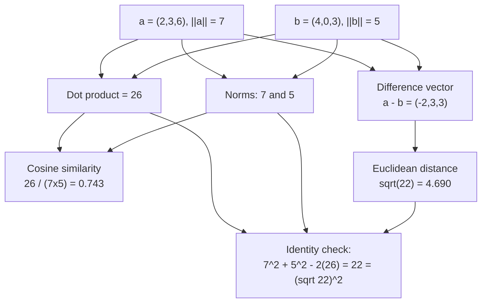

## Hand-Computing All Three Similarity Metrics on the Same Pair of Small Integer Vectors to See Where They Agree and Disagree

### A Systems Analogy First

Imagine a database index-tuning tool that needs to decide whether two query-execution-plan vectors — say `(rows_scanned, joins, sorts)` — represent "the same kind of plan." A tuning engineer could hand-check this on a small example with a calculator before trusting the tool's output on millions of plans. That is exactly the exercise in this item: rather than reasoning abstractly about dot product, cosine similarity, and Euclidean distance, we compute all three, by hand, on the same fixed pair of small integer vectors, so that the numbers themselves — not intuition — show precisely where the three metrics agree and where they diverge.

### The Fixed Pair of Vectors

Let the two vectors under comparison be:

$$\vec{a} = (2, 3, 6), \qquad \vec{b} = (4, 0, 3)$$

These are deliberately small integers with no unit-length normalization applied, so that magnitude differences are visible in the computation rather than hidden by preprocessing.

### Step 1 — Dot Product

Recall the dot product sums the componentwise products:

$$\vec{a}\cdot\vec{b} = (2)(4) + (3)(0) + (6)(3) = 8 + 0 + 18 = 26$$

**Output:** $\vec{a}\cdot\vec{b} = 26$

Used directly as a similarity score, dot-product similarity here reports $26$. Note this number alone carries no built-in scale of reference — whether $26$ counts as "high" or "low" similarity is not decidable from this number in isolation, unlike cosine similarity's fixed $[-1,1]$ range.

### Step 2 — Norms

Recall the norm is the square root of the vector dotted with itself:

$$\|\vec{a}\| = \sqrt{2^2+3^2+6^2} = \sqrt{4+9+36} = \sqrt{49} = 7$$

$$\|\vec{b}\| = \sqrt{4^2+0^2+3^2} = \sqrt{16+0+9} = \sqrt{25} = 5$$

**Output:** $\|\vec{a}\| = 7$, $\|\vec{b}\| = 5$

These two vectors were chosen deliberately so their norms come out to clean integers, making the remaining hand computation easier to verify step by step.

### Step 3 — Cosine Similarity

Recall cosine similarity divides the dot product by the product of the two norms:

$$\cos\theta = \frac{\vec{a}\cdot\vec{b}}{\|\vec{a}\|\|\vec{b}\|} = \frac{26}{7\times5} = \frac{26}{35} \approx 0.743$$

**Output:** $\cos\theta \approx 0.743$, corresponding to $\theta = \arccos(0.743) \approx 42.0^\circ$

Recall cosine similarity ranges over $[-1,1]$; a value of $0.743$ indicates the two vectors point in a fairly similar, though not near-identical, direction — meaningfully closer to "aligned" than to "orthogonal."

### Step 4 — Euclidean Distance

Recall Euclidean distance is the norm of the difference vector:

$$\vec{a}-\vec{b} = (2-4,\ 3-0,\ 6-3) = (-2, 3, 3)$$

$$d_{\text{euclidean}} = \sqrt{(-2)^2+3^2+3^2} = \sqrt{4+9+9} = \sqrt{22} \approx 4.690$$

**Output:** $d_{\text{euclidean}} \approx 4.690$

### Step 5 — Verifying the Cross-Metric Identity by Hand

Recall the identity connecting all three quantities computed so far, derived earlier in this chapter from the Law of Cosines:

$$\|\vec{a}-\vec{b}\|^2 = \|\vec{a}\|^2 + \|\vec{b}\|^2 - 2(\vec{a}\cdot\vec{b})$$

Plugging in the values already computed as an internal consistency check:

$$\text{Right side} = 7^2 + 5^2 - 2(26) = 49 + 25 - 52 = 22$$

$$\text{Left side} = (\sqrt{22})^2 = 22$$

**Output:** Both sides equal $22$ — the identity checks out exactly, confirming the four numbers computed above ($26$, $7$, $5$, $\sqrt{22}$) are mutually consistent rather than independent measurements that happen to agree.

### Summary Table of All Three Metrics

| Metric | Formula | Computed Value |
| --- | --- | --- |
| Dot product similarity | $\vec{a}\cdot\vec{b}$ | $26$ |
| Cosine similarity | $\dfrac{\vec{a}\cdot\vec{b}}{\|\vec{a}\|\|\vec{b}\|}$ | $\approx 0.743$ |
| Euclidean distance | $\|\vec{a}-\vec{b}\|$ | $\approx 4.690$ |

### Where the Three Metrics Agree and Where They Disagree

**Key Points**

- All three metrics were computed from the *same* two underlying quantities — the dot product ($26$) and the two norms ($7$ and $5$) — as the Step 5 identity makes explicit. They are not three independent measurements; they are three different algebraic combinations of the same raw ingredients.
- On this particular pair, all three metrics happen to agree qualitatively that $\vec{a}$ and $\vec{b}$ are "moderately similar but not near-identical": cosine similarity of $0.743$ is comfortably above $0$ (orthogonal) but well short of $1$ (identical direction); Euclidean distance of $4.690$ is neither tiny nor enormous relative to the vectors' own norms of $7$ and $5$.
- This qualitative agreement is a property of this specific example, not a general guarantee — the earlier item in this chapter comparing dot product, cosine similarity, and Euclidean distance on $\vec{q}=(1,0,0)$ against two candidates showed a case where dot product and Euclidean distance produced **opposite** rankings on the same data. The two exercises together demonstrate that agreement or disagreement between metrics depends entirely on the specific magnitudes and directions involved, and cannot be predicted without doing the computation.
- If $\vec{a}$ and $\vec{b}$ were rescaled to unit length before this computation (dividing $\vec{a}$ by $7$ and $\vec{b}$ by $5$), the dot product would become numerically identical to the cosine similarity ($0.743$), and Euclidean distance would become a fixed monotonic function of cosine similarity — this is the special case, described in the previous item's identity, where all three metrics collapse into full agreement on ranking.

**Conclusion**

Hand-computing all three metrics on a single fixed pair of small integer vectors makes visible what the earlier algebraic derivations only asserted abstractly: dot product, cosine similarity, and Euclidean distance are three different views onto the same two raw numbers (a dot product and two norms), tied together by an exact algebraic identity that can itself be checked by substitution, as done in Step 5. On this particular example the three metrics happen to tell a qualitatively consistent story; the earlier dot-product item shows a different example where they do not. The lesson generalizes: whether these metrics agree or disagree is a computable, checkable fact about the specific vectors involved, never an assumption to be made in advance.

**Related Topics**

- Hand-verifying the scale-invariance proof by recomputing cosine similarity on a scaled copy of $\vec{a}$ or $\vec{b}$
- Extending this hand computation to a five-vector worked example with a query and four candidates, ranked under each metric
- Vector normalization to unit length as the preprocessing step that forces all three metrics into agreement
- Similarity thresholds as an empirical engineering choice, and how a threshold like "$0.7$ cosine similarity" would classify this pair
- Moving from three-dimensional hand computation to high-dimensional embedding vectors, where hand-verification is no longer possible and correctness must be established by unit testing the implementation instead