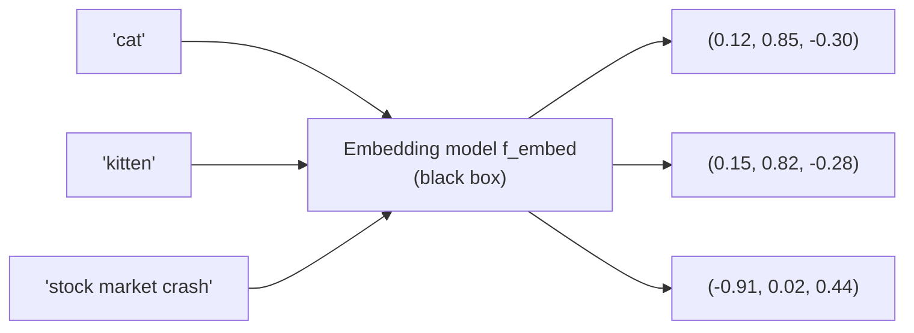

## Framing an Embedding Model as a Black-Box Function: Arbitrary Text Goes In, a Fixed-Length Vector Comes Out

### A Systems Analogy First

Consider a hash function like SHA-256: it accepts an input of *any* length — a single byte or a ten-gigabyte file — and always produces a fixed-length output, 256 bits, regardless of input size. As a software engineer, you do not need to know anything about the internal compression rounds or bit-mixing operations to use SHA-256 correctly; you treat it as a black box with a documented input type and a documented, fixed-shape output type. An **embedding model** should be treated, at this stage, in exactly the same way: a function with a variable-length input and a fixed-length output, usable correctly without understanding its internals. The critical difference — and the entire subject of the rest of this chapter — is *what the output is engineered to mean*, which for a hash function is nothing beyond "a fingerprint of these exact bits," but for an embedding model is something far richer.

### The Black-Box Signature

At this level of abstraction, an embedding model is a function with the following signature:

$$f_{\text{embed}}: \text{Text} \rightarrow \mathbb{R}^d$$

That is: the function accepts a string of arbitrary length as input, and returns a vector of exactly $d$ real numbers as output, where $d$ is a fixed constant determined by which specific model you are using — not by the length or content of the input text.

**Key Points**

- The input can be a single word, a sentence, a paragraph, or (for many models, up to some maximum token limit) an entire document. The function accepts all of these as valid input of the same type: text.
- The output dimensionality $d$ is fixed *per model*, not per call. A given model might always output vectors of dimension $d=384$, or $d=768$, or $d=1536$; whichever it is, that value never changes across calls to that same model, regardless of whether the input was one word or a thousand.
- Two calls to the same model on the same exact input text will, for a deterministic model, return the exact identical vector every time — the function is expected to behave like a pure function with no hidden state, in the same way calling SHA-256 twice on the same file returns the same hash twice. [Unverified] Some hosted embedding APIs and some model configurations may introduce nondeterminism (e.g., through batching effects or floating-point non-associativity across hardware), so this determinism should be verified for a specific model and deployment rather than assumed universally.
- Nothing about the black-box signature says anything about what the numbers in the output vector *mean*. At this stage of the curriculum, the vector is simply "some fixed-length list of real numbers this function deterministically produces for this text" — the semantic interpretation of that list is the subject of the next concept in this chapter, not this one.

### Worked Example

Suppose a hypothetical embedding model with output dimensionality $d=3$ (unrealistically small for illustration, since real models typically use hundreds or thousands of dimensions, but useful for a concrete worked trace).

| Input text | Output vector |
| --- | --- |
| `"cat"` | $(0.12, 0.85, -0.30)$ |
| `"kitten"` | $(0.15, 0.82, -0.28)$ |
| `"stock market crash"` | $(-0.91, 0.02, 0.44)$ |

**Output**

- Note the input lengths vary — one word, one word, three words — yet every output vector has exactly $3$ components. This is the fixed-length guarantee holding regardless of input length.
- Note also, without yet explaining *why* (that is the next item's concern), that `"cat"` and `"kitten"` produced numerically close vectors while `"stock market crash"` produced a vector far from both. Under this item's framing alone, that is simply an observed fact about the function's output — an engineered property, not a coincidence, but the mechanism behind it is intentionally deferred.

### Why the Black-Box Framing Is the Correct Starting Point

**Key Points**

- Nearly all production embedding models today are built on transformer neural network architectures, internally producing per-token representations and then combining them (commonly via a pooling operation over the final layer) into a single fixed-length vector for the whole input. [Inference] The exact internal architecture and pooling strategy varies across model families and is not necessary background for using the model correctly as a component in a larger system — much as SHA-256's internal Merkle–Damgård construction is not necessary background for using it as a hash function in an application.
- Treating the model as a black box is not a simplification made only for pedagogical convenience — it mirrors how these models are actually consumed in most real systems: as an API call or a library function call that returns a vector, with the internal weights typically pretrained and often not modified by the system calling them.
- This framing cleanly separates two questions that should not be conflated: "what does this function's input/output signature look like" (this item, purely a typing and shape question) versus "why does proximity between two output vectors correspond to anything meaningful" (the next item in this chapter, an entirely separate and non-obvious engineering claim).

**Conclusion**

At this stage, an embedding model should be understood purely by its type signature: it maps text of arbitrary length to a real-valued vector of fixed length $d$, deterministically, the same way a cryptographic hash function maps arbitrary-length input to a fixed-length digest. This framing is deliberately incomplete — it says nothing yet about why the output vector is useful — but it is the correct and necessary first step before asking the much less obvious question of why distances between these vectors are engineered to carry semantic meaning.

**Next Steps**

- Why proximity in the output vector space is engineered to correspond to semantic similarity in the input text
- Choosing and comparing specific embedding models by their fixed output dimensionality $d$
- Token limits: what happens when input text exceeds a model's maximum accepted length
- Dimensionality and the curse of dimensionality as $d$ grows into the hundreds or thousands
- Batching multiple texts through an embedding model efficiently in a production pipeline