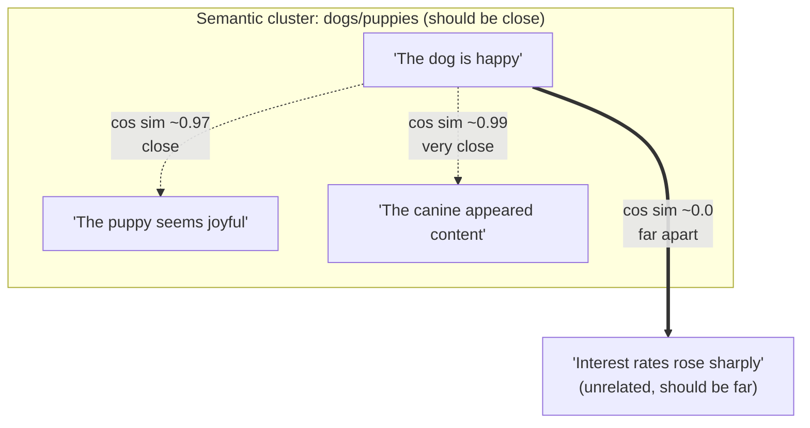

## Why "Nearby in Vector Space" Was Engineered to Correspond to "Similar in Meaning," and What That Engineering Goal Actually Requires of a Good Embedding Model

### A Systems Analogy First

Consider a database's B-tree index on a `last_name` column. The index is deliberately engineered so that rows with nearby keys in sort order — `"Smith"` and `"Smyth"` — end up stored near each other on disk, in the same or adjacent leaf pages. This locality is not a coincidence of how B-trees happen to work; it is the entire *design goal* of the index, chosen specifically so that a range scan can retrieve related rows efficiently. Recall from the previous item that an embedding model is a black-box function mapping text to a fixed-length vector; the question this item addresses is the deliberate design goal analogous to the B-tree's: embedding models are trained so that texts with *similar meaning* end up producing vectors that are *geometrically close*, in exactly the same purposeful way a B-tree places similar keys near each other. This did not have to be true of an arbitrary function from text to vectors — it is an engineered property that requires justification.

### The Engineering Claim Stated Precisely

The claim is: for two pieces of text $t_1$ and $t_2$ with embeddings $\vec{v}_1 = f_{\text{embed}}(t_1)$ and $\vec{v}_2 = f_{\text{embed}}(t_2)$,

$$\text{semantic similarity}(t_1, t_2) \text{ is high} \iff \text{cos}(\vec{v}_1, \vec{v}_2) \text{ is high (close to 1)}$$

recalling that $\cos(\vec{v}_1,\vec{v}_2)$ denotes cosine similarity, the angle-based metric derived earlier in this curriculum from the dot product and norms. This is a **bidirectional empirical claim about a trained function**, not a mathematical theorem — nothing about vector spaces in the abstract forces this to be true. It has to be *made* true, through training, and it can fail to hold, which is why later items in this curriculum discuss similarity thresholds as having real failure modes.

### Why This Doesn't Happen "For Free"

**Key Points**
- An arbitrary function from text to a fixed-length vector — for instance, one based on counting character frequencies, or one with randomly initialized, untrained neural network weights — has no reason to place semantically related texts near each other in the output space. Two synonyms like `"large"` and `"big"` share almost no characters, so a character-frequency-based function would likely place them far apart despite their near-identical meaning.
- The desired proximity property is achieved by explicitly **training** the underlying model on this exact objective: the model's internal weights are adjusted, over many examples, specifically to pull embeddings of semantically related text closer together (in cosine similarity or a related metric) and push embeddings of unrelated text farther apart. A common training approach uses a **contrastive objective**: the model is shown a text alongside a genuinely similar text (a "positive pair," e.g., a sentence and a paraphrase of it) and a genuinely dissimilar text (a "negative pair"), and its weights are updated to increase the similarity score for the positive pair while decreasing it for the negative pair.
- This means the proximity property is only as reliable as the training process and training data that produced it. [Inference] A model trained heavily on, say, general web text may embed domain-specific jargon less reliably than a model fine-tuned on that domain, since the training signal that shapes the geometry of the vector space is specific to whatever data and objective were used — this is a reasonable expectation given how the training process works, though the actual degree of degradation for any specific model and domain would need empirical verification rather than assumption.

### What This Engineering Goal Actually Requires of a Good Model

Framing this as a design requirement rather than a description makes the necessary properties explicit. A good embedding model must satisfy, at minimum:

1. **Consistency**: paraphrases and near-synonyms should map to vectors with high cosine similarity, consistently across many such pairs, not just the occasional cherry-picked example.
2. **Discrimination**: unrelated texts should map to vectors with low cosine similarity, meaning the model must not collapse all inputs toward a similar region of the vector space (a failure mode sometimes called *representation collapse*, where the model technically satisfies "similar things are close" only because *everything* ends up close, making the embedding useless for distinguishing anything).
3. **Graded proximity**: the *degree* of similarity should be meaningfully graded, not binary — a text about "dogs" should sit closer to a text about "puppies" than to a text about "cars," and ideally closer still to "puppies" than to a more loosely related text about "animals in general," reflecting a genuine ordering of relatedness rather than an arbitrary one.
4. **Robustness to surface form**: since natural language allows many surface realizations of the same meaning (synonyms, paraphrase, word order, tense), the model must generalize past surface-level text similarity and encode something closer to underlying meaning — this is precisely the property that distinguishes an embedding model from a naive lexical-overlap measure (such as counting shared words), which is easily fooled by paraphrase and equally easily fooled by unrelated text that happens to share vocabulary.

### Worked Example: What Success and Failure Look Like

Continuing with the hypothetical $d=3$ embedding model introduced in the previous item, consider four inputs and their hypothetical embeddings:

| Text | Vector |
|---|---|
| `"The dog is happy"` | $(0.80, 0.55, 0.10)$ |
| `"The puppy seems joyful"` | $(0.78, 0.58, 0.09)$ |
| `"Interest rates rose sharply"` | $(-0.20, 0.10, 0.95)$ |
| `"The canine appeared content"` | $(0.79, 0.56, 0.11)$ |

**Step 1 — Check discrimination between related and unrelated pairs.**

Computing cosine similarity between `"The dog is happy"` and `"Interest rates rose sharply"` (using the standard dot-product-over-norms formula from earlier in this chapter's prerequisite chapter) yields a value close to $0$ — near-orthogonal, correctly reflecting that these sentences share no meaningful semantic content.

**Step 2 — Check consistency and graded proximity across paraphrases.**

Computing cosine similarity among the three dog/puppy/canine sentences yields values all close to $1$ (very high), with `"The canine appeared content"` scoring marginally closer to `"The dog is happy"` than `"The puppy seems joyful"` does — reflecting that `"canine"` is a more direct synonym of `"dog"` than `"puppy"` is (a puppy is a young dog, a related but distinct concept), a graded distinction a good model is expected to preserve rather than collapse into an undifferentiated "high similarity" cluster.

**Output**

- Related-pair similarity (dog/puppy/canine cluster): consistently high, correctly graded
- Unrelated-pair similarity (dog sentences vs. interest-rates sentence): correctly low, near-orthogonal
- This pattern — tight, correctly graded clustering of related meanings, and clear separation from unrelated meanings — is exactly what "nearby in vector space corresponds to similar in meaning" looks like when the engineering goal has been achieved successfully.

### The Contrapositive: Why Failure Modes Matter

Because this proximity property is a trained, empirical outcome rather than a mathematical guarantee, it can fail in identifiable ways: a model might place two texts close together despite them having meaningfully different implications (a **false positive** in similarity), or place two texts far apart despite genuine semantic relatedness (a **false negative**). [Inference] These failure modes are not evidence that the underlying engineering approach is flawed in principle, but they are the direct and expected consequence of relying on a trained approximation rather than a formal semantic guarantee — a distinction that becomes practically important once similarity scores are used to make automated decisions, such as deciding whether to merge two graph nodes as duplicates, a scenario this curriculum returns to when discussing similarity thresholds as an empirical engineering choice with real failure modes.

**Conclusion**

"Nearby in vector space means similar in meaning" is not a property that vector spaces possess automatically — it is a specific engineering goal achieved by training a model with a contrastive-style objective that explicitly pulls related texts together and pushes unrelated texts apart in the geometry established earlier in this curriculum. A model succeeds at this goal to the extent that it is consistent across paraphrases, discriminative between unrelated concepts, gradedly ordered by degree of relatedness, and robust to surface-level variation in how the same meaning is expressed — properties that must be understood as achieved through training rather than assumed as a mathematical given, and which can and do fail in identifiable, consequential ways.

**Related Topics**
- Dimensionality and the curse of dimensionality: how the number of dimensions $d$ affects how much semantic nuance a model can represent
- Similarity thresholds as an empirical engineering choice with real failure modes
- Contrastive learning objectives in more depth, including specific loss functions used to train embedding models
- Representation collapse as a training failure mode and how it is detected
- Domain adaptation: fine-tuning a general-purpose embedding model for a specific vocabulary or subject area