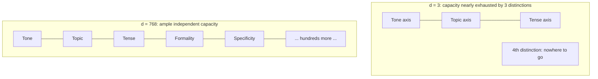

## What Dimensionality Means for an Embedding Vector, and Why Real Embedding Models Use Hundreds or Thousands of Dimensions Rather Than Two or Three

### A Systems Analogy First

Consider a database table with only two columns, `last_name` and `first_name`, used to identify a customer. Two entirely different customers could easily share both values — `"John Smith"` is common enough to collide constantly. Adding more columns — `date_of_birth`, `zip_code`, `phone_number` — gives the table more independent axes along which two genuinely different customers can be distinguished, even if they happen to collide on any one or two individual columns. Recall that an embedding vector's **dimensionality**, denoted $d$, is simply the fixed number of components (coordinates) in the output vector of an embedding model. Exactly like adding columns to that table, increasing $d$ gives the embedding model more independent axes along which to encode distinct aspects of meaning — and the central question this item answers is why real systems need hundreds or thousands of such axes rather than the two or three used in the toy examples so far in this curriculum.

### Dimensionality as a Budget of Independent Axes

Recall from Chapter 01 that a three-dimensional vector like $(2,3,6)$ can be visualized as a point in ordinary 3D space, with each of the three components measuring a position along one of three mutually independent axes (commonly labeled $x$, $y$, $z$). An embedding vector generalizes this exact idea to $d$ axes instead of $3$: a $d$-dimensional embedding is a point in a $d$-dimensional space, where each of the $d$ components can, in principle, vary independently of the others.

**Key Points**

- Each dimension does not correspond to a single, human-labelable concept like "formality" or "sentiment" in any guaranteed way. [Inference] The dimensions of a typical trained embedding model are not individually interpretable; meaning is generally understood to be encoded across combinations of many dimensions simultaneously (a property sometimes described as *distributed representation*), rather than one dimension per concept — this is a widely observed characteristic of neural embeddings, though the precise degree of distribution varies by model and would need model-specific analysis to characterize exactly.
- What matters for this curriculum is not what any individual dimension "means," but the *capacity* that $d$ provides: more dimensions mean more independent directions along which two texts can differ, which — analogous to the extra database columns — reduces the chance that two texts with genuinely different meanings are forced to collapse onto very similar vectors purely because the space was too small to tell them apart.
- Dimensionality is fixed per model, as established in the black-box framing earlier in this chapter; a system cannot request "more dimensions" from a given model at query time — the value of $d$ is baked into the model's architecture at training time.

### Why Two or Three Dimensions Is Not Enough: A Capacity Argument

Suppose, hypothetically, that a model tried to compress all of natural language meaning into a 3D vector, $d=3$. Any two texts, however different in meaning, would need to be distinguished using only three independent numbers. Because natural language expresses an enormous number of independent semantic distinctions — topic, tone, tense, negation, specificity, domain, sentiment, formality, and many more, all in principle capable of varying independently of one another — a 3D space simply does not have enough independent axes to keep all of these distinctions from interfering with each other.

**Concretely**: if two semantically unrelated texts happen to need similar values along two of the three available axes for unrelated reasons (for instance, both being written in a similar tone, even though their topics are unrelated), a 3D embedding has no fourth axis left to separate them on topic alone — the collision becomes unavoidable, no matter how well the model is trained, purely because there is no room left in the space. This is a hard capacity limit, not a training deficiency: no amount of additional training on a 3D model can create room that structurally doesn't exist.

### Worked Illustration of the Capacity Argument

Consider four short texts that a good embedding model should be able to keep clearly distinguishable:

- $t_1$: `"The stock market fell sharply today"` (topic: finance, tone: negative, tense: past)
- $t_2$: `"The stock market rose sharply today"` (topic: finance, tone: positive, tense: past)
- $t_3$: `"The football team fell to a sharp defeat today"` (topic: sports, tone: negative, tense: past)
- $t_4$: `"The stock market fell sharply last year"` (topic: finance, tone: negative, tense: distant past)

Each pair here differs along a *different* independent axis: $t_1$ vs $t_2$ differ in tone but share topic and tense; $t_1$ vs $t_3$ differ in topic but share tone and tense (and even overlap somewhat in surface wording, "fell sharply," despite unrelated topics — a case where a naive lexical-overlap approach would fail, reinforcing the need for real semantic axes); $t_1$ vs $t_4$ differ in tense but share topic and tone. A model with only $d=3$ dimensions has, at best, three independent "slots" to encode distinctions like these; a fourth genuinely independent distinction (say, formality, or specificity) has no room left to be represented without interfering with one of the three already assigned. With $d$ in the hundreds, there is ample independent capacity for topic, tone, tense, and dozens of other simultaneously-varying properties of text to each occupy their own combination of directions without forcing collisions.

**Output**

| Text pair | Distinguishing axis | Needs its own "room" in the vector |
| --- | --- | --- |
| $t_1$ vs $t_2$ | Tone (negative vs. positive) | Yes |
| $t_1$ vs $t_3$ | Topic (finance vs. sports) | Yes |
| $t_1$ vs $t_4$ | Tense (recent vs. distant past) | Yes |

Three genuinely independent distinctions already begin to exhaust a 3-dimensional budget; real language requires vastly more than three simultaneously-relevant distinctions to be preserved.

### Why Real Models Land in the Hundreds to Low Thousands, Not Millions

**Key Points**

- Increasing $d$ is not free: every additional dimension increases the storage cost per vector (a $d=1536$ embedding stored as 32-bit floats occupies roughly $1536 \times 4 = 6144$ bytes per vector, versus roughly $384\times4=1536$ bytes for $d=384$ — a system storing millions of embeddings feels this difference directly in storage and memory footprint), and increases the computational cost of every dot product, norm, or distance computation performed on those vectors, since all of these operations scale linearly with $d$.
- Popular embedding models in practice commonly use dimensionalities somewhere in the range of a few hundred to a couple of thousand (for example, models producing $d=384$, $d=768$, or $d=1536$ are common across widely used embedding model families), representing an empirically chosen balance point between representational capacity and storage/compute cost, rather than either extreme of "too small to be useful" or "as large as technically possible."
- This chapter's later concept, the curse of dimensionality, describes the *other* side of this tradeoff: pushing $d$ arbitrarily high does not straightforwardly keep improving things, because very high-dimensional spaces develop their own geometric pathologies that can make distance and similarity metrics behave less intuitively. The choice of $d$ in a real model is therefore a deliberately engineered middle ground, not simply "more is always better."

**Conclusion**

Dimensionality $d$ is the number of independent axes an embedding model has available to represent distinctions in meaning, directly analogous to the number of independent columns available to distinguish rows in a database table. Two or three dimensions, sufficient for the toy hand-worked examples used earlier in this curriculum to build geometric intuition, provide nowhere near enough independent capacity to keep the many simultaneously-varying aspects of real natural language — topic, tone, tense, formality, and more — from colliding with one another. Real embedding models instead use dimensionalities in the hundreds to low thousands, a range chosen empirically to provide enough independent capacity for these distinctions while keeping the storage and compute cost of every downstream vector operation manageable.

**Related Topics**

- The curse of dimensionality: how very high $d$ introduces its own geometric problems for similarity metrics
- Storage and memory footprint calculations for large-scale embedding vector collections
- Dimensionality reduction techniques (e.g., PCA) as a way to compress embeddings after the fact
- Comparing specific embedding models by their published dimensionality and intended use case
- How dimensionality interacts with approximate nearest-neighbor index structures introduced later in this curriculum