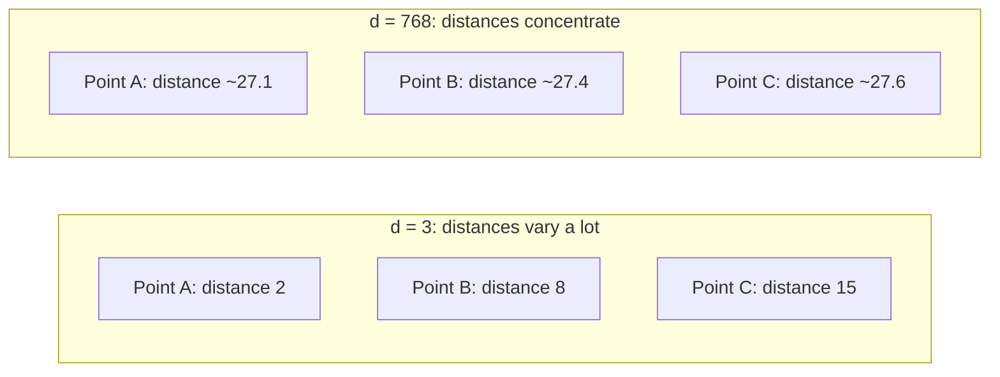

## A First Honest Look at the Curse of Dimensionality: Why Intuitions from Two-Dimensional and Three-Dimensional Space Stop Being Reliable at High Dimension

### A Systems Analogy First

Consider an operating system's virtual memory address space. In a 32-bit system, addresses range over about 4 billion values, and it is easy to reason intuitively about "nearby" addresses — pages next to each other, cache lines adjacent in physical memory. Extend that to a 64-bit address space, and intuitions about "nearby" addresses start to behave strangely: the space is so vast that two randomly chosen addresses are, for all practical purposes, never near each other, no matter what "near" means. Something structurally similar, though driven by different mathematics, happens to *geometric* intuition as dimensionality $d$ grows. Recall that dimensionality is the fixed number of components in an embedding vector; this item is an honest warning that the geometric reasoning built in two and three dimensions, comfortable and visualizable, silently stops describing reality once $d$ climbs into the hundreds — exactly the range real embedding models operate in, as established in the previous item.

### The Core Phenomenon: Distance Concentration

The single most important high-dimensional pathology for this curriculum is called **distance concentration**: as $d$ grows large, the distances between randomly distributed points in a $d$-dimensional space stop varying much relative to each other. Concretely, if you pick many random points in a high-dimensional space and compute the distance from one fixed reference point to each of them, the *ratio* between the largest and smallest of these distances tends toward $1$ as $d$ grows — meaning the farthest point and the nearest point become almost equally far away, in relative terms.

This is deeply counter to two- and three-dimensional intuition. In a 2D room, "the nearest wall" and "the farthest wall" are obviously, visibly different distances. Distance concentration says that in a sufficiently high-dimensional analog of that room, essentially every wall would appear to be at nearly the same distance from you — the very notion of "nearest" starts to lose its discriminative power.

### Why This Happens: An Intuition, Not a Full Proof

[Inference] A full formal treatment of distance concentration requires probabilistic arguments about sums of many independent random variables (related to concentration-of-measure results in high-dimensional probability), which is beyond the scope this curriculum needs; what follows is the shape of the argument, sufficient to explain the result correctly to a technical advisor without constructing the formal proof.

Consider a random point in $d$ dimensions with each coordinate drawn independently from a similar random process, and consider its squared Euclidean distance to the origin — recall that squared Euclidean distance is $\sum_{i=1}^d x_i^2$, a sum of $d$ independent terms. By the same statistical logic that says the sum of many independent random measurements tends to concentrate tightly around its expected value (the more terms you add, the smaller the *relative* fluctuation in the sum, since fluctuations partly cancel out across terms), the sum $\sum_{i=1}^d x_i^2$ concentrates increasingly tightly around its expected value as $d$ grows. Since this squared distance is what determines how far the point is from the origin, and it concentrates around a fairly narrow band of values as $d$ grows, essentially all randomly placed points end up at roughly the same distance from any fixed reference point — hence the near-collapse of "nearest" versus "farthest."

**Key Points**

- The driving mechanism is the same one behind the general statistical fact that averages of many independent quantities have proportionally less relative variability than any single one of those quantities alone — distance concentration is this same phenomenon, applied to the sum of squared coordinate differences that defines Euclidean distance.
- This is not a flaw in Euclidean distance as a formula; the formula is computing exactly what it always computes. The pathology is in how sums of many terms behave statistically at scale, not in any error in the distance calculation itself.
- The same underlying mechanism affects cosine similarity, though somewhat differently: [Inference] in very high dimensions, random vectors tend to become close to orthogonal to each other (cosine similarity near $0$) purely as a statistical consequence of having many independent coordinates to accumulate small positive and negative products that increasingly cancel out — a claim with the same statistical shape as the distance-concentration argument above, though the precise behavior depends on how the vector components are distributed and would need to be verified for any actual embedding model's output distribution rather than assumed from this general argument alone.

### A Small Worked Illustration of the Trend

To make the *direction* of this effect concrete without requiring a full formal derivation, consider a simplified setup: a fixed reference point at the origin, and random points where each coordinate is independently drawn from the same distribution. Compute, for increasing $d$, the ratio of the standard deviation of the squared distance to its mean — a measure of how much *relative* spread remains among the distances.

| Dimensionality $d$ | Relative spread of squared distances (illustrative trend) |
| --- | --- |
| $d = 3$ | High — distances vary substantially from point to point |
| $d = 50$ | Noticeably reduced |
| $d = 768$ | Small — most points cluster within a narrow band of distances from the reference point |

**Output**

This table expresses a *trend*, not a precise formula to memorize: [Unverified] the exact numeric rate at which relative spread shrinks depends on the specific distribution the coordinates are drawn from, and would need to be computed or simulated for any specific case rather than read off a universal constant. The qualitative direction — spread shrinks as $d$ grows — is the reliable, general part of the claim; the exact numbers in any specific scenario are not.

### Why This Matters for This Curriculum

**Key Points**

- The whole premise of using cosine similarity or Euclidean distance to identify "the most similar embedding" to a query rests on distances being meaningfully *discriminative* — that some points really are much closer than others. Distance concentration threatens exactly this premise at high $d$: if all candidate distances are nearly equal, "find the nearest neighbor" risks becoming closer to "find an arbitrary point" than a meaningful ranking.
- This is not a reason to abandon high-dimensional embeddings — the previous item in this chapter already established why hundreds or thousands of dimensions are necessary for representational capacity. It is instead a reason for genuine caution: the geometric intuitions comfortable in 2D and 3D (visualizing "nearest," "farthest," "clusters," and "empty regions" by eye) do not transfer safely to the dimensionalities real embedding models actually use, and claims about high-dimensional geometry should be checked against the mathematics or against empirical measurement, not against what seems visually obvious.
- [Inference] In practice, real trained embedding models do not distribute their output vectors as pure independent random noise across all $d$ dimensions — the training process discussed earlier in this chapter concentrates meaningful structure into the space, which is part of why real embedding systems still function usefully as similarity search tools despite this curse. However, this is a claim about how *trained* embeddings differ from *random* points, and does not eliminate the underlying mathematical pressure toward distance concentration as $d$ grows — it means the practical severity of the effect depends on the specific structure a given trained model imposes, not on the dimensionality count in isolation.

### An Honest Statement of What This Item Does and Does Not Claim

This item's purpose is calibration, not alarm: it establishes that geometric reasoning built from two- and three-dimensional examples (including every worked example so far in this curriculum) is a pedagogical scaffold for building formulas and intuition correctly, but is not a reliable guide to *how those same formulas behave statistically* once $d$ grows into the range real embedding models use. The formulas themselves — dot product, norm, cosine similarity, Euclidean distance — remain exactly correct at any dimensionality; what changes is the statistical behavior of their *outputs* across large populations of high-dimensional vectors, which is precisely the reason approximate nearest-neighbor search, the subject of the next chapter in this curriculum, exists as a distinct and necessary engineering problem rather than a straightforward extension of brute-force search from low dimensions.

**Conclusion**

The curse of dimensionality, in its most immediately relevant form for this curriculum, is the tendency of distances between points in high-dimensional space to concentrate — nearest and farthest points becoming statistically similar in distance — driven by the same general statistical mechanism that makes sums of many independent quantities have proportionally less relative variability than any one quantity alone. This directly threatens the naive intuition, built from 2D and 3D worked examples, that "nearest neighbor" is always an obviously meaningful and easily visualized notion. Real trained embedding models mitigate but do not eliminate this pressure, and the honest takeaway is that geometric intuition from low dimensions must be treated as a scaffold for learning the formulas, not as a reliable guide to how those formulas behave once real systems operate at the dimensionalities that give embeddings their representational power.

**Related Topics**

- Nearest-neighbor search stated precisely, and why brute-force linear scan is the honest baseline against which approximate methods are measured
- Approximate nearest-neighbor search as a response to both computational cost and high-dimensional geometric pathologies
- How real trained embeddings structurally differ from random high-dimensional points, and why that matters for the severity of distance concentration in practice
- Dimensionality reduction as a technique sometimes used to counteract high-dimensional geometric effects
- Empirically measuring distance concentration on a real embedding model's output vectors rather than relying on theoretical trend alone