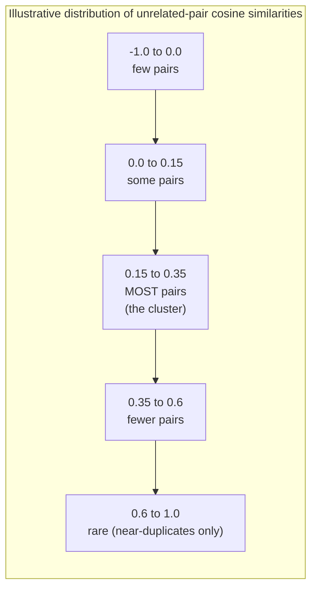

## What the Distribution of Cosine Similarity Scores Actually Looks Like Across Many Unrelated Pieces of Text, and Why Almost Nothing Sits at Exactly Zero

### A Systems Analogy First

Consider a network operator measuring round-trip latency between a fixed server and thousands of unrelated clients scattered around the world. In principle, "unrelated clients" have no reason to share any particular latency value, yet the measured latencies do not scatter uniformly from zero to infinity — they cluster into a recognizable bell-shaped band, with some clients faster, some slower, and almost none landing at exactly the same millisecond value as another, even though none of them coordinated. Recall that cosine similarity, derived earlier in this curriculum from the dot product and norms, measures the angle between two vectors as a value in $[-1,1]$. When you compute cosine similarity between many pairs of genuinely unrelated pieces of text, the resulting scores behave similarly to that latency measurement: they form a describable distribution clustered somewhere, rather than either scattering uniformly across the whole $[-1,1]$ range or landing precisely on the single value $0$ that "unrelated" might naively suggest.

### The Naive Expectation, and Why It's Wrong

Recall that a cosine similarity of exactly $0$ corresponds to two vectors being **orthogonal** — perpendicular, at a $90°$ angle, sharing no directional component whatsoever. A natural but mistaken intuition is: "if two texts are truly unrelated, their embeddings should be orthogonal, so cosine similarity between unrelated text pairs should sit at or very near $0$."

This intuition fails for a structural reason connected directly to the curse of dimensionality discussed earlier in this chapter. Exact orthogonality between two vectors requires their dot product to equal precisely zero — a knife-edge condition. Recall the dot product is $\vec{a}\cdot\vec{b} = \sum_{i=1}^d a_i b_i$, a sum of $d$ individual terms. For this sum to land on the exact value $0$ would require the positive and negative contributions across all $d$ terms to cancel *perfectly* — an event with essentially zero probability for any continuous-valued vectors, in the same way that two independently measured real-valued latencies landing on the *exact* same millisecond value, to infinite decimal precision, is essentially impossible. What actually happens instead, as the previous item's discussion of high-dimensional statistics suggests, is that the sum concentrates *near* zero across many unrelated pairs, without ever landing exactly on it.

### What the Distribution Actually Looks Like

**Key Points**

- Empirically and by the statistical reasoning carried over from the distance-concentration discussion, cosine similarity scores between many pairs of genuinely unrelated texts tend to cluster in a band around a small positive value — commonly observed to sit somewhat above zero rather than centered exactly on it — with a roughly bell-shaped spread around that center, rather than a uniform scatter across the full $[-1,1]$ range.
- [Inference] The center of this band sitting above zero, rather than exactly at zero, is a widely observed pattern across many embedding models, though the precise center and width of the band are properties of the specific model, its training data, and the specific text domain being compared — this is not a universal constant and would need to be measured empirically for any given model rather than assumed to match a textbook figure.
- One structural contributor to this above-zero clustering: many embedding models do not produce vectors whose components are symmetrically distributed around zero in every direction — if there is any shared, non-directional structure across a model's embeddings (for instance, a tendency for certain dimensions to be consistently active regardless of input content, sometimes discussed under the heading of anisotropy in embedding spaces), that shared structure alone contributes a small positive dot product between essentially any two vectors, nudging typical "unrelated" similarity scores upward, away from a naive expectation of zero. [Unverified] The exact mechanism and magnitude of this effect is model-specific and is an active topic of study in the embeddings literature rather than a single settled fact applicable identically to every model.

### A Concrete Worked Illustration of the Shape of the Distribution

Suppose an experiment computes cosine similarity for every pair among 500 sentences drawn from entirely unrelated domains (weather reports, cooking instructions, legal contracts, sports commentary), producing roughly $500 \times 499 / 2 \approx 124{,}750$ pairwise similarity scores. Rather than these scores scattering uniformly between $-1$ and $1$, or clustering tightly at $0$, a histogram of the results would typically show a shape like this:

**Output**

- The bulk of unrelated-pair scores sit in a moderate positive band (illustrated here as roughly $0.15$ to $0.35$), not at $0$.
- Very few pairs land near $-1$ or near $1$; scores near $1$ are effectively reserved for pairs that are actual near-duplicates or paraphrases, not for pairs that are merely both "text."
- This shape means a cosine similarity of, say, $0.25$ between two texts is not automatically evidence of meaningful relatedness — it may simply reflect where the entire background distribution of *unrelated* pairs happens to sit for this particular model, rather than indicating any real semantic connection.

### Why This Matters: The Threshold Problem It Creates

**Key Points**

- If unrelated pairs cluster around, say, $0.2$ rather than $0.0$, then any system that uses a *fixed* cosine similarity threshold to decide "these two texts are related" must set that threshold meaningfully above the unrelated-pair background level, or it will systematically produce false positives — flagging pairs as related purely because they share the same baseline elevation every unrelated pair in this model tends to have.
- This is a direct preview of the next concept in this chapter: similarity thresholds are not a universal constant like "$0.8$ means related" that transfers across models — a threshold must be calibrated against the actual background distribution of a specific model's unrelated-pair scores, precisely because that background does not sit at the naively expected value of zero.
- [Inference] Practically, this means a system built on cosine similarity should ideally characterize its chosen embedding model's baseline unrelated-pair distribution (for example, by sampling many random pairs from its own actual data domain and inspecting the resulting histogram) before committing to a fixed decision threshold, rather than importing a threshold value used successfully with a different model or in a different published context.

**Conclusion**

Cosine similarity between genuinely unrelated pieces of text does not sit at exactly $0$, despite orthogonality being the naive geometric expectation for "unrelated" — exact orthogonality is a knife-edge condition on a sum of many terms that essentially never occurs exactly, and structural properties of trained embedding spaces typically shift the entire background distribution of unrelated-pair scores into a positive band above zero, with a bell-like spread rather than a uniform scatter. Recognizing the shape and location of this background distribution is a practical prerequisite for the next concept in this chapter: setting similarity thresholds correctly requires knowing where "unrelated" actually sits for a specific model, not assuming it sits at the mathematically clean but empirically incorrect value of zero.

**Related Topics**

- Similarity thresholds as an empirical engineering choice, and how a threshold should be calibrated against a model's actual background distribution
- Anisotropy in embedding spaces and post-hoc techniques (such as mean-centering) sometimes used to correct for it
- Empirically measuring a specific embedding model's unrelated-pair similarity distribution before deploying it
- The curse of dimensionality's role in why exact orthogonality becomes vanishingly unlikely as dimensionality grows
- How this background-distribution problem carries forward into entity resolution and duplicate-detection tasks later in this curriculum