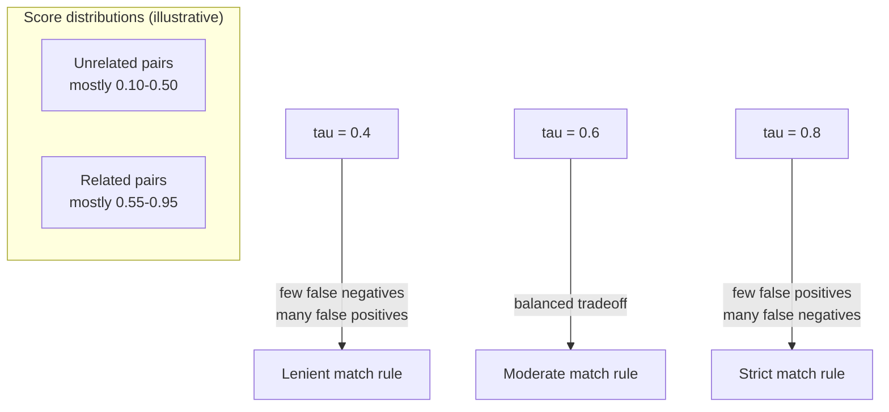

## Similarity Thresholds as an Empirical Engineering Choice: What It Means to Fix a Cutoff Like 0.6 and Treat Everything Above It as a Match

### A Systems Analogy First

Consider a TCP retransmission timeout (RTO): a network stack cannot know with certainty whether a packet was lost or merely delayed, so it picks a cutoff — if no acknowledgment arrives within the RTO window, treat the packet as lost and retransmit. That cutoff is not derived from a mathematical proof that "exactly this many milliseconds separates loss from delay." It is an engineered value, tuned against measured round-trip-time statistics, that trades off two costs against each other: set it too low and you retransmit packets that were only slightly delayed (wasted bandwidth, false positives); set it too high and you wait too long before recovering from genuine loss (added latency, false negatives). A **similarity threshold** — fixing a cutoff like cosine similarity $\geq 0.6$ and treating everything above it as "a match" — is exactly this same kind of engineered decision boundary, applied to the background distribution of similarity scores discussed in the previous item, rather than to network timing.

### Stating the Mechanism Precisely

Recall that cosine similarity produces a continuous score in $[-1,1]$ for any pair of embedding vectors. A **threshold-based match rule** converts this continuous score into a binary decision by fixing a constant $\tau$ (the threshold, e.g., $\tau = 0.6$) and applying:

$$\text{match}(\vec{a}, \vec{b}) = \begin{cases} \text{true} & \text{if } \cos(\vec{a},\vec{b}) \geq \tau \\ \text{false} & \text{if } \cos(\vec{a},\vec{b}) < \tau \end{cases}$$

**Key Points**

- $\tau$ is a free parameter chosen by whoever builds the system — there is no formula that derives the "correct" value of $\tau$ from first principles the way there is a formula for cosine similarity itself. Recall that cosine similarity's formula (dot product over the product of norms) is a mathematical derivation with a fixed, provably correct result; $\tau$, by contrast, is a design decision, and a different reasonable engineer could choose a different value from the same data and not be simply wrong.
- The threshold rule collapses a graded, continuous notion of similarity into a hard yes/no boundary. Recall from the previous item that unrelated-pair scores cluster in a band, not at a single point — this means the region immediately around $\tau$ is exactly where genuinely ambiguous cases pile up, since real data does not arrange itself into two cleanly separated clusters with a natural gap at exactly $\tau$.
- Because the background distribution of unrelated-pair scores is model-specific and domain-specific, as established in the previous item, a threshold value tuned for one embedding model or one text domain does not transfer safely to a different model or domain — $\tau = 0.6$ might sit comfortably above the unrelated-pair background for one model and sit right in the middle of it for another.

### The Two Costs a Threshold Trades Off

Just as the TCP RTO analogy trades wasted retransmissions against added latency, a similarity threshold trades two distinct error types against each other, using the same vocabulary as any binary classification decision:

- **False positive**: two texts that are *not* meaningfully related produce a similarity score $\geq \tau$ and get incorrectly flagged as a match. This happens when a pair from the unrelated background distribution happens to land, by chance, above the cutoff.
- **False negative**: two texts that *are* meaningfully related produce a similarity score $< \tau$ and get incorrectly flagged as not a match. This happens when a pair's similarity, for any of the reasons discussed under embedding failure modes, falls short of the cutoff despite genuine relatedness.

**Setting $\tau$ higher** reduces false positives (fewer unrelated pairs will exceed a stricter cutoff) but increases false negatives (more genuinely related pairs, especially loosely related ones, will now fall short of the stricter cutoff). **Setting $\tau$ lower** does the reverse. There is no value of $\tau$ that minimizes both error types simultaneously in general — this is a structural tradeoff, not a bug to be engineered away.

### Worked Illustration: Sliding the Cutoff

Suppose an experiment collects the cosine similarity scores of two known groups of pairs: 100 pairs known to be genuinely related (e.g., true paraphrases) and 100 pairs known to be genuinely unrelated (drawn from the background distribution discussed in the previous item). Suppose the scores fall out roughly like this:

| Group | Typical score range |
| --- | --- |
| Genuinely related pairs | mostly $0.55$ to $0.95$ |
| Genuinely unrelated pairs | mostly $0.10$ to $0.50$ |

Note the two ranges **overlap** between roughly $0.10$ and $0.50$ on the unrelated side and $0.55$ to $0.95$ on the related side — with actual overlap concentrated in the $0.4$ to $0.6$ region, which is typical of real data rather than a contrived worst case.

**Step 1 — Try $\tau = 0.4$ (a low cutoff).**

Nearly all related pairs score above $0.4$ (few false negatives), but a substantial share of unrelated pairs also exceed $0.4$ (many false positives).

**Step 2 — Try $\tau = 0.6$ (a moderate cutoff).**

Most related pairs still clear $0.6$, and far fewer unrelated pairs do — but some related pairs with weaker similarity (perhaps looser paraphrases) now fall just short and become false negatives, while a smaller number of coincidentally high-scoring unrelated pairs still slip through as false positives.

**Step 3 — Try $\tau = 0.8$ (a high cutoff).**

Almost no unrelated pairs exceed $0.8$ (very few false positives), but a meaningful fraction of genuinely related pairs — especially ones that are related but not near-duplicates — also fall short, producing many false negatives.

**Output**

| Threshold $\tau$ | False positives | False negatives |
| --- | --- | --- |
| $0.4$ (low) | Many | Few |
| $0.6$ (moderate) | Some | Some |
| $0.8$ (high) | Few | Many |

No row of this table is simply "correct" in isolation — which row is preferable depends entirely on which error type is more costly for the specific system being built, a judgment call external to the mathematics of cosine similarity itself.

### Why This Is Explicitly an Engineering Choice, Not a Mathematical One

**Key Points**

- The correct value of $\tau$ depends on facts entirely outside the mathematics of cosine similarity: what the false-positive and false-negative costs actually are in the specific system being built. A duplicate-detection system merging customer records might tolerate more false negatives (missed duplicates can often be caught later) but want very few false positives (incorrectly merging two different customers' data can be a serious, hard-to-reverse error) — pushing $\tau$ high. A recommendation system surfacing "similar articles" might tolerate more false positives (a slightly-off recommendation is low-cost) but want few false negatives (missing genuinely relevant content) — pushing $\tau$ lower.
- Because the background distribution shifts with model and domain, as the previous item established, a responsible engineering process determines $\tau$ empirically for the specific model and specific data domain in use — for example, by examining a labeled sample of known-related and known-unrelated pairs, as in the worked illustration above, rather than adopting a threshold value reported for a different model or a different published benchmark.
- [Inference] A single fixed global threshold is also not the only possible design — some systems instead use *relative* ranking (take the top-$k$ most similar candidates regardless of their absolute score) or *adaptive* thresholds calibrated per query, precisely because a single fixed cutoff can behave inconsistently across different regions of the data if the background distribution itself varies across subpopulations of the data; whether such an approach is warranted is a judgment call specific to the system being built, not a universal recommendation.

**Conclusion**

Fixing a similarity threshold like $\tau = 0.6$ converts a continuous, graded cosine similarity score into a binary match decision, and doing so is an engineering choice with real consequences, not a mathematically derived constant. Because genuinely related and genuinely unrelated pairs typically produce overlapping ranges of scores rather than two cleanly separated clusters, any choice of $\tau$ necessarily trades false positives against false negatives, and the right point on that tradeoff curve depends on the specific costs of each error type in the system being built — a judgment that must be made deliberately and validated empirically against the actual model and data domain in use, never assumed from a value that worked well elsewhere.

**Related Topics**

- What the distribution of cosine similarity scores looks like across unrelated text, and why it doesn't center at zero
- Precision and recall as the formal vocabulary for describing the false-positive/false-negative tradeoff a threshold controls
- Why brute-force linear search still requires a threshold decision even before approximate methods are introduced
- Entity resolution as a systems problem where threshold choice has direct, consequential downstream effects
- Two-stage embedding-plus-LLM decision pipelines as an alternative to relying on a single fixed similarity threshold