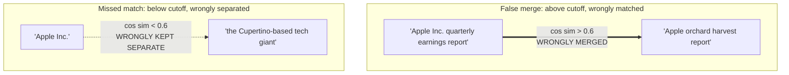

## Concrete Failure Modes of a Fixed Similarity Threshold: False Merges Above the Cutoff and Missed Matches Just Below It

### A Systems Analogy First

Consider a database deduplication job that treats two customer records as "the same person" whenever their fuzzy string-match score on name and address exceeds some cutoff. A pair of unrelated customers who happen to share a common name and live on streets with similar-sounding names can slip over that cutoff and get merged into one record — silently corrupting both customers' data. Meanwhile a genuine duplicate — the same customer who moved address and had their name transliterated slightly differently — can fall just under the cutoff and never get merged, leaving two fragmented records for the same real person. Recall from the previous item that a similarity threshold $\tau$ converts a continuous cosine similarity score into a binary match decision; this item examines, with concrete worked cases, exactly what goes wrong on each side of that cutoff, moving beyond the abstract false-positive/false-negative vocabulary into specific, recognizable failure shapes.

### Failure Mode 1: The False Merge (Above the Cutoff)

A **false merge** occurs when two texts that are *not* meaningfully the same entity or concept produce a cosine similarity score $\geq \tau$, purely by coincidence of surface features or by shared background structure discussed in the earlier item on the distribution of unrelated-pair scores, and the system treats them as a match anyway because the score cleared the cutoff.

**Worked example.** Suppose $\tau = 0.6$, and consider two graph-node candidate labels being evaluated for a knowledge graph:

- $t_1$: `"Apple Inc. quarterly earnings report"`
- $t_2$: `"Apple orchard harvest report"`

Both texts share the token `"Apple"` and the token `"report"`, and both describe a periodic report about a named subject. [Inference] Depending on the specific embedding model in use, this surface and structural overlap could plausibly push the cosine similarity between $t_1$ and $t_2$ above a threshold like $0.6$, despite the two texts referring to entirely unrelated real-world entities — a technology company's financial disclosure versus an agricultural harvest summary — a specific numeric outcome that would need to be verified against an actual model rather than assumed, but which illustrates the exact *shape* of failure this threshold rule is vulnerable to: shared vocabulary and shared sentence structure inflating similarity independent of genuine conceptual identity.

**Output**

If a knowledge-graph construction pipeline (the subject of a later chapter in this curriculum) used this false merge as grounds to link or collapse two graph nodes, the resulting graph would contain an incorrect edge or an incorrectly unified node — conflating an agricultural entity with a technology company under a single node, corrupting every downstream query or traversal that relies on that node's identity.

### Failure Mode 2: The Missed Match (Just Below the Cutoff)

A **missed match** occurs when two texts that genuinely *do* refer to the same entity or concept produce a cosine similarity score just under $\tau$, because their surface expression differs enough (different vocabulary, different phrasing, different level of specificity) that the embedding model's proximity signal, while still meaningfully elevated compared to the unrelated background, does not clear the fixed cutoff.

**Worked example.** Continuing with $\tau = 0.6$, consider:

- $t_3$: `"Apple Inc."`
- $t_4$: `"the Cupertino-based consumer electronics and technology giant"`

These two texts refer to the identical real-world entity, but share almost no surface vocabulary at all — no repeated words, no shared proper nouns beyond an indirect geographic reference. [Inference] A well-trained embedding model should place these two texts closer together than two truly unrelated texts, since the semantic content does substantially overlap, but the *degree* of similarity for such a paraphrase-like, low-lexical-overlap pair is plausibly lower than for a pair sharing direct vocabulary, and could easily land in a range like $0.5$ that falls just under a $\tau = 0.6$ cutoff — again, an illustrative outcome whose exact value depends on the specific model and would need empirical verification, but which demonstrates the general failure shape: genuine relatedness expressed through paraphrase rather than shared vocabulary is exactly the case a rigid numeric cutoff is least equipped to handle reliably.

**Output**

If a knowledge-graph construction pipeline relied on this missed match to decide whether $t_3$ and $t_4$ refer to the same entity, it would incorrectly create two separate nodes for what should be a single entity — a form of graph fragmentation that, at scale across many entities, degrades the overall graph's usefulness by scattering information about the same real-world thing across disconnected nodes.

### Why Both Failures Are Structural, Not Just Bad Luck

**Key Points**
- Both failure modes are direct, predictable consequences of the two facts already established in this chapter: unrelated-pair scores cluster in a band above zero rather than at exactly zero (making some unrelated pairs land unexpectedly high), and genuinely related pairs form a graded, continuous spectrum of similarity rather than a uniform high cluster (making some related pairs, especially loosely related or differently phrased ones, land unexpectedly low). A hard cutoff drawn anywhere through the middle of two overlapping, continuous distributions will always slice through some of both.
- Neither failure mode indicates the embedding model is "broken." The embedding model may be doing exactly what it was trained to do — ranking $t_1$ moderately similar to $t_2$ and $t_3$ moderately similar to $t_4$ — and the failure arises specifically from the act of converting that graded ranking into a rigid binary decision at one fixed numeric point, which is a design choice layered on top of the model's output rather than a property of the model itself.
- Moving $\tau$ to fix one failure mode directly worsens the other, exactly as established in the previous item's tradeoff analysis: raising $\tau$ to prevent the "Apple orchard" false merge would push the cutoff even further above the already-marginal `"Apple Inc."` / `"Cupertino-based tech giant"` pair, converting a near-miss into a more decisive missed match; lowering $\tau$ to catch that same paraphrase pair would let more coincidental lexical-overlap pairs like the orchard example slip through as new false merges.

### The Downstream Consequence for Graph Construction Specifically

**Key Points**
- A false merge in a growing knowledge graph is often the more *destructive* of the two failure modes in practice: it actively corrupts the graph by fusing two distinct entities' information under one identity, and — depending on how the pipeline is built — may be difficult to detect or reverse later, since the erroneous merge itself destroys the information needed to tell the two original entities apart.
- A missed match is more often a *cost* than a corruption: it leaves the graph in a recoverable but degraded state — fragmented, with redundant nodes — that a later reconciliation pass could, in principle, still repair, since the original distinct records still exist unmodified rather than being incorrectly fused.
- [Inference] This asymmetry in the practical cost of each failure mode is itself a strong argument for why a system's chosen $\tau$ should reflect a deliberate judgment about which failure is more costly to correct after the fact, rather than being set at a single "reasonable-sounding" round number such as $0.6$ purely by convention — a point this curriculum returns to more fully once graph-specific consequences of insertion strategy are discussed directly.

**Conclusion**

A fixed similarity threshold fails in two concrete, structurally inevitable ways: false merges, where unrelated texts coincidentally clear the cutoff and get wrongly unified, and missed matches, where genuinely related texts fall just short of the cutoff due to paraphrase or differing specificity and get wrongly kept separate. Both failures trace directly back to the overlapping, continuous nature of similarity score distributions established earlier in this chapter, and neither can be eliminated by simply moving $\tau$ — moving it only trades one failure mode for more of the other. Recognizing these as the concrete, worked shape of the abstract false-positive/false-negative tradeoff is the necessary bridge from a purely numeric understanding of thresholds to the real, consequential errors a growing knowledge graph can accumulate from relying on this decision rule.

**Related Topics**
- Similarity thresholds as an empirical engineering choice and the false-positive/false-negative tradeoff they encode
- LLM-as-a-judge as an alternative or complement to a raw numeric threshold for entity-identity decisions
- Entity resolution as a systems problem where these exact failure modes have direct, named consequences
- The generator-verifier-pruner architectural pattern as one response to unreliable single-step match decisions
- Graph drift under streaming updates, and how accumulated false merges or missed matches compound as a graph scales