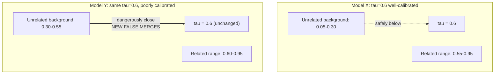

## Why a Threshold Tuned on One Dataset or One Embedding Model Does Not Automatically Transfer to a Different One

### A Systems Analogy First

Consider a database query planner's cost model, tuned against a specific table's statistics — row counts, index selectivity, disk I/O latency on a specific storage tier. That cost model produces a threshold (say, "use an index scan when selectivity is below 5%") that works well precisely because it was calibrated against that table's actual data distribution and that server's actual hardware characteristics. Move the same fixed threshold to a different table with a completely different data distribution, or to a different server with different disk latency, and the threshold can silently produce bad query plans — not because the threshold was wrong in the abstract, but because it was calibrated against conditions that no longer hold. Recall from earlier in this chapter that a similarity threshold $\tau$ is fixed by examining a model's actual background distribution of scores; this item makes explicit why that calibration is tied to the specific model and dataset it was measured on, and fails to transfer for the same structural reason the query planner's threshold fails to transfer.

### The Core Reason: $\tau$ Is Calibrated Against a Specific Background Distribution

Recall from the earlier item on the distribution of cosine similarity scores that unrelated pairs of text do not cluster at exactly $0$ — they cluster in a band whose center and width are properties of the specific embedding model and specific text domain being measured. Recall further that a threshold is chosen, in a responsible engineering process, precisely by locating that background band and setting $\tau$ high enough above it to avoid excessive false merges, as covered in the threshold-tuning item earlier in this chapter. This means $\tau$ is not an independent, freestanding number — it is a value defined *relative to* a specific background distribution. Change the background distribution, and a $\tau$ chosen relative to the old one has no guaranteed relationship to the new one.

**Key Points**

- Two different embedding models, even when both are well-trained and both satisfy the general engineering goal of "similar meaning maps to nearby vectors," are not required to place their unrelated-pair background distributions at the same location. One model's unrelated pairs might cluster around $0.2$; another model's might cluster around $0.4$, purely due to differences in training data, training objective, or architectural details such as dimensionality, discussed earlier in this chapter. A $\tau = 0.6$ chosen for the first model, which is comfortably above its $0.2$ background, might sit uncomfortably close to the second model's $0.4$ background, letting through far more false merges than intended.
- Two different text *domains*, even using the identical embedding model, can also shift the effective background distribution. Recall the false-merge example earlier in this chapter (`"Apple Inc."` versus `"Apple orchard"`) — a dataset dominated by short, name-heavy entity labels sharing common words is likely to produce a different unrelated-pair background than a dataset of long, discursive paragraphs, purely because of how much incidental lexical and structural overlap short labels are statistically likely to share compared to long, more distinctive passages.
- A threshold's calibration is therefore a joint property of (model, domain) — not of the threshold value in isolation. Reporting "$\tau=0.6$ works well" without specifying which model and which domain it was measured against is roughly as incomplete as reporting a query planner's cost threshold without specifying which table and which hardware it was tuned on.

### Worked Illustration: The Same $\tau$, Two Different Outcomes

Suppose Model X and Model Y are both legitimate, well-trained embedding models, but their unrelated-pair background distributions (measured exactly as in the earlier worked histogram example in this chapter) turn out to differ:

| Model | Unrelated-pair background band (illustrative) | Related-pair typical range (illustrative) |
| --- | --- | --- |
| Model X | $0.05$ to $0.30$ | $0.55$ to $0.95$ |
| Model Y | $0.30$ to $0.55$ | $0.60$ to $0.95$ |

**Step 1 — Apply $\tau = 0.6$ to Model X.**

Model X's unrelated background tops out around $0.30$, comfortably below $0.6$; almost no unrelated pairs will falsely clear this cutoff. Most of Model X's related pairs ($0.55$–$0.95$) do clear it, aside from a few weaker matches near $0.55$–$0.6$. This is a well-calibrated threshold for Model X.

**Step 2 — Apply the same $\tau = 0.6$ to Model Y.**

Model Y's unrelated background extends up to $0.55$, meaning a substantial share of genuinely unrelated pairs — anything scoring between roughly $0.30$ and $0.55$ under this hypothetical shifted background — now sit uncomfortably close to the $0.6$ cutoff, and any unrelated pairs that happen to land between $0.55$ and $0.6$ or slightly above produce **new false merges** that did not occur under Model X. The identical numeric threshold, unchanged, now performs meaningfully worse simply because it was transplanted without re-calibration.

**Output**

|  | Model X, $\tau=0.6$ | Model Y, $\tau=0.6$ (unchanged) |
| --- | --- | --- |
| False merge risk | Low (background well below cutoff) | Elevated (background approaches cutoff) |
| Missed match risk | Some (a few weak matches near 0.55–0.6) | Similar or worse |

The same number, $0.6$, produces two different real-world outcomes purely because the background distribution it is being compared against shifted.

### Why This Is Easy to Get Wrong in Practice

**Key Points**

- A threshold value reported in a paper, a blog post, or a previous project's documentation carries an implicit, often unstated dependency on the specific model and dataset it was measured against. Copying the numeric value into a new system while silently swapping out the model or the data domain discards the calibration that made the number meaningful in the first place, while keeping the number itself, which looks unchanged and therefore easy to trust without re-examination.
- This risk is not limited to switching to an entirely different model vendor or architecture — [Inference] even updating to a newer version of the *same* model family, or fine-tuning an existing model further on new data, can plausibly shift its output geometry enough to move the background distribution, since the calibration depends on the model's trained weights rather than only its name or architecture family; whether any specific version update actually causes a meaningful shift would need to be checked empirically rather than assumed either way.
- The practical corrective is the same discipline already established in the threshold-tuning item earlier in this chapter: treat $\tau$ as a value that must be re-measured against the current (model, domain) pair whenever either changes, using the same kind of labeled-sample histogram approach illustrated there, rather than treating a previously chosen numeric threshold as a portable constant.

### The General Principle

The underlying reason a threshold fails to transfer is the same reason a cache-eviction policy tuned for one workload's access pattern fails to transfer to a workload with a different access pattern, or a garbage collector's heap-size threshold tuned for one application's allocation pattern fails to transfer to another: any threshold calibrated empirically against a measured distribution is only as valid as the assumption that the distribution it was measured against still holds. A similarity threshold is not an exception to this general systems principle — it is a direct instance of it, applied to the specific case of embedding-model output distributions.

**Conclusion**

A similarity threshold $\tau$ is not a portable, model-independent constant — it is a value calibrated against the specific background distribution of unrelated-pair scores for a specific (embedding model, text domain) pair, as established earlier in this chapter. Because different models and different domains can and do shift where that background distribution sits, transplanting a fixed numeric threshold from one context to another silently changes its effective strictness, potentially reintroducing exactly the false-merge and missed-match failure modes the threshold was originally tuned to avoid. The correct discipline is to treat threshold calibration as tied to the specific model and dataset in use, and to re-measure it whenever either changes, rather than treating a previously successful numeric value as a fixed, transferable constant.

**Related Topics**

- Similarity thresholds as an empirical engineering choice, and the process of measuring a background distribution before fixing a cutoff
- Concrete false-merge and missed-match failure modes as the direct consequence of a poorly calibrated threshold
- Domain adaptation and fine-tuning as processes that can shift an embedding model's output geometry
- LLM-as-a-judge as a complementary decision mechanism less dependent on a single fixed numeric cutoff
- Building empirical validation pipelines that re-measure threshold calibration whenever a model or dataset changes