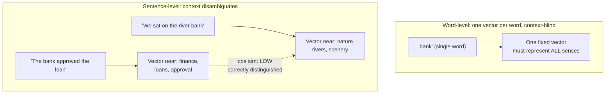

## Sentence-Level Versus Word-Level Embeddings, and Why the Choice of Granularity Changes What "Similar" Ends Up Meaning

### A Systems Analogy First

Consider the difference between a database index built on individual `word` tokens extracted from a `documents` table (an inverted index, as used in full-text search) versus an index built on precomputed per-row summary vectors, one per entire document. Both are legitimate indexing strategies, but they answer different questions: the token-level index tells you "which documents contain this specific word," while the document-level index tells you "which documents are, as a whole, about a similar topic to this one." Neither is a more "correct" granularity in the abstract — the right choice depends entirely on what question the system needs to answer. Recall that an embedding model, framed earlier in this chapter as a black-box function mapping text to a fixed-length vector, can be applied at different **granularities** of input text — a single word, or an entire sentence — and this item examines how that choice of granularity changes what a resulting high cosine similarity score actually tells you.

### Two Distinct Kinds of Embedding, Stated Precisely

A **word-level embedding** (sometimes called a word vector) is produced by applying $f_{\text{embed}}$ to a single word or short token in isolation, producing a vector intended to capture that word's meaning independent of any surrounding sentence: $\vec{v}_{\text{word}} = f_{\text{embed}}(\text{"bank"})$.

A **sentence-level embedding** is produced by applying $f_{\text{embed}}$ to an entire sentence (or, more generally, a longer span of text — a paragraph or document), producing a single vector intended to capture the combined meaning of the whole span: $\vec{v}_{\text{sentence}} = f_{\text{embed}}(\text{"The bank approved the loan application"})$.

Both fit the same black-box signature established earlier in this chapter — text in, fixed-length vector out — so the *mechanism* is identical. What differs entirely is *what unit of meaning* is being compressed into that fixed-length vector, and that difference has direct consequences for what a high similarity score between two such vectors is entitled to mean.

### Why Word-Level Embeddings Struggle with a Specific Kind of Ambiguity

**Key Points**
- A classic limitation of word-level embeddings, especially older ones trained to produce exactly one fixed vector per distinct word regardless of context, is that a single word with multiple distinct meanings — a **polysemous** word, one word with genuinely different senses — gets forced into a single vector that must somehow represent all of its senses at once, or defaults toward whichever sense dominates its training data.
- **Worked example**: the word `"bank"` can mean a financial institution or the sloped edge of a river. A single, context-free word-level embedding for `"bank"` cannot simultaneously sit close to `"loan"` and `"deposit"` (financial sense) *and* close to `"river"` and `"shore"` (geographic sense) as cleanly as two separate vectors could — it is architecturally forced to be one point in the vector space representing an average, blend, or dominant-sense compromise across both meanings.
- This means a high cosine similarity between two word-level embeddings can sometimes reflect co-occurrence patterns and blended senses rather than a clean, single shared meaning, which is a subtlety a word-level system must account for if it is applied to genuinely ambiguous vocabulary. [Inference] Whether this ambiguity meaningfully degrades a specific downstream task depends on how often ambiguous words actually appear in that task's vocabulary, and would need to be assessed for the specific application rather than assumed to be a universal blocker.

### Why Sentence-Level Embeddings Resolve This Differently

**Key Points**
- A sentence-level embedding is computed from the *entire sentence*, so the surrounding words disambiguate the intended sense before the vector is ever produced. `"The bank approved the loan"` and `"We sat on the river bank"` are two entirely different inputs to $f_{\text{embed}}$, and a well-trained sentence-level model can place their resulting vectors far apart, correctly reflecting that these two sentences are about different things, even though both contain the literal word `"bank"`.
- This resolves the specific word-level ambiguity problem, but it introduces a different granularity concern: a sentence-level vector compresses an entire sentence's meaning — subject, action, object, qualifiers, tone — into one fixed-length vector, so two sentences that share a topic but differ in a smaller but important detail can end up close together in a way that obscures that detail. `"The bank approved the loan application"` and `"The bank rejected the loan application"` share almost every word and almost every syntactic structure, differing only in one crucial verb with an opposite meaning; [Inference] depending on the specific model, these two sentences could plausibly still receive a fairly high cosine similarity score, since so much of the sentence's vector-influencing content is identical, potentially masking the one word that reverses the sentence's actual meaning — a concrete illustration that "similar" at sentence granularity means "similar as a whole," not "identical in every semantically load-bearing detail."

### Worked Comparison: The Same Word, Two Granularities

| Granularity | Input | What a high similarity score would mean |
|---|---|---|
| Word-level | `"bank"` alone | These two words tend to occur in similar contexts across many sentences — potentially blending multiple senses of the word |
| Sentence-level | `"The bank approved the loan"` | These two entire sentences convey similar overall meaning — topic, actors, and action taken together |

Consider three inputs processed at each granularity:

- $w_1 = $ `"bank"` (word-level)
- $s_1 = $ `"The bank approved the loan application"` (sentence-level)
- $s_2 = $ `"We sat on the river bank and watched the water"` (sentence-level)

At word-level granularity, comparing $w_1$ to itself is trivially identical, but $w_1$ alone gives no mechanism to distinguish which of $s_1$'s or $s_2$'s sense of "bank" is intended — the word-level vector for `"bank"` is a single fixed point regardless of which sentence it later appears in. At sentence-level granularity, comparing $s_1$ and $s_2$ directly, a well-trained sentence-level model should place these two vectors far apart despite the shared literal word `"bank"`, since the surrounding context in each sentence unambiguously signals a different sense.

**Output**

- Word-level granularity: same input token `"bank"` regardless of which sentence it will eventually appear in — cannot resolve sense ambiguity by construction.
- Sentence-level granularity: distinct inputs ($s_1$ versus $s_2$) that include disambiguating context — capable of resolving sense ambiguity, but at the cost of compressing an entire sentence's structure (including small but meaningful differences like negation) into one vector.

### Why This Granularity Choice Matters for Downstream System Design

**Key Points**
- Choosing word-level embeddings is appropriate when the system genuinely needs to reason about individual vocabulary items — for example, building a thesaurus-like synonym suggestion tool, or a spelling/vocabulary-normalization step — where the unit of interest really is the word, and context-sensitivity may even be undesirable if the system wants one canonical representation per term.
- Choosing sentence-level (or longer-span) embeddings is appropriate when the system needs to reason about propositions, claims, or descriptions as a whole — which is the relevant granularity for the knowledge-graph construction problem this curriculum builds toward, where a graph node's label or description is typically a phrase or sentence describing an entity or relationship, not a single bare word, and the system needs to judge whether two such descriptions refer to the same real-world thing.
- The negation example above (`"approved"` versus `"rejected"`) previews a specific and important pitfall relevant to later chapters: sentence-level similarity being high does not guarantee that two sentences are *interchangeable* or make the *same claim* — it means they are similar *as whole units of text*, which is a broader and coarser notion than logical equivalence or entailment, a distinction taken up explicitly when this curriculum discusses LLM-as-a-judge as a mechanism for making finer-grained semantic judgments that raw sentence-level similarity is not designed to make.

**Conclusion**

Word-level and sentence-level embeddings apply the identical black-box mechanism established earlier in this chapter to different units of text, and that difference in granularity changes what a resulting cosine similarity score is entitled to claim: a high word-level similarity reflects contextless co-occurrence patterns across a word's blended senses, while a high sentence-level similarity reflects overall likeness between two complete propositions, potentially at the cost of obscuring a single small but meaningful difference like a negated verb. Neither granularity is universally correct — the right choice is determined by whether the system's actual unit of interest is an individual vocabulary item or a complete description, a design decision with direct consequences for what downstream "similarity" is actually measuring.

**Related Topics**
- LLM-as-a-judge as a mechanism for entailment and subsumption judgments that sentence-level similarity alone cannot make
- Contextual embeddings and how modern transformer-based models produce different word-level vectors depending on surrounding context
- Chunking strategies for embedding documents longer than a single sentence
- Similarity thresholds as an empirical choice, and how the appropriate threshold may differ between word-level and sentence-level use cases
- Entity resolution as a systems problem that typically operates at sentence- or phrase-level granularity rather than word-level