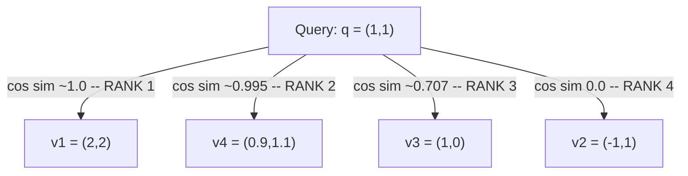

## Defining the Nearest-Neighbor Search Problem Precisely: Given a Query Vector and a Set of Candidate Vectors, Find the Most Similar Ones

### A Systems Analogy First

Consider a database `SELECT` query with an `ORDER BY` clause and a `LIMIT`: `SELECT * FROM orders ORDER BY total_amount DESC LIMIT 10` asks the database engine to rank every row by a computed value and return the top few. The engine does not need to understand what "total_amount" *means* to execute this correctly — it needs a well-defined ranking function and a well-defined cutoff. The **nearest-neighbor search problem** is structurally the same kind of query, just with the ranking function replaced by a vector similarity or distance metric, and the rows replaced by embedding vectors. Stating this problem with full precision — rather than the informal phrasing "find similar vectors" used loosely throughout this curriculum so far — is the necessary first step before asking why doing this ranking efficiently turns out to be hard at scale.

### The Problem Stated Precisely

**Given:**
- A **query vector** $\vec{q} \in \mathbb{R}^d$ — a single fixed-length vector, produced the same way any embedding is produced (recall the black-box framing from Chapter 02: text goes in, a fixed-length vector of dimension $d$ comes out).
- A **candidate set** $S = \{\vec{v}_1, \vec{v}_2, \dots, \vec{v}_N\}$ — a collection of $N$ vectors, all of the same dimensionality $d$ as $\vec{q}$, against which the query will be compared. In a real system, each $\vec{v}_i$ typically corresponds to some stored item (a document, a graph node's description, a database record) that was embedded and indexed at some earlier point in time.
- A **similarity or distance function** — commonly cosine similarity or Euclidean distance, both derived earlier in this curriculum — used to compare $\vec{q}$ against each $\vec{v}_i$.

**Find:** the subset of $S$ consisting of the $k$ vectors most similar to $\vec{q}$ under the chosen metric, for some specified $k$ (commonly called **$k$-nearest-neighbor search**, or **k-NN search**), or, in the single-best-match special case, the one vector in $S$ closest to $\vec{q}$ ($k=1$).

Formally, using cosine similarity as the example metric:

$$\text{k-NN}(\vec{q}, S, k) = \underset{V \subseteq S,\ |V|=k}{\arg\max} \sum_{\vec{v} \in V} \cos(\vec{q}, \vec{v})$$

**Key Points**
- This definition says nothing yet about *how* to find this subset efficiently — it defines only *what counts as a correct answer*. The distinction between defining a problem and solving it efficiently is exactly the distinction this chapter is built around: the next item in this chapter addresses brute-force linear scan as one honest, always-correct way to solve this exact definition, and the cost of doing so.
- The definition is agnostic to which metric is used — cosine similarity, Euclidean distance, or raw dot-product similarity (all three derived and compared earlier in this curriculum) — but recall from that earlier comparison that these metrics can rank the same candidate set differently. This means the nearest-neighbor problem is not fully specified until the metric is also fixed; "find the nearest neighbors" implicitly means "nearest under this specific metric," and changing the metric changes what counts as a correct answer, not just how fast you can compute it.
- $k$ is a parameter of the problem, not a fixed constant. $k=1$ asks for the single closest match (relevant, for instance, to an entity-resolution decision asking "is there an existing node this new item matches"); larger $k$ asks for a ranked shortlist (relevant to a recommendation-style use case surfacing several related candidates).
- The candidate set $S$ is typically **static relative to a single query** — during the execution of one search, $S$ does not change — but recall that the graph-construction problems this curriculum builds toward are explicitly about $S$ growing over time as new items are inserted, one node at a time. This chapter deliberately treats $S$ as fixed for now, precisely to isolate the *search* problem from the *insertion* problem before Chapter 07 fuses them.

### Worked Example: A Small, Fully Traceable Instance

Let $d=2$ for visualizability, and let the query vector be $\vec{q} = (1, 1)$. Let the candidate set be:

$$S = \{\vec{v}_1=(2,2),\ \vec{v}_2=(-1,1),\ \vec{v}_3=(1,0),\ \vec{v}_4=(0.9,1.1)\}$$

**Step 1 — Compute cosine similarity between $\vec{q}$ and each candidate.**

$\|\vec{q}\| = \sqrt{1^2+1^2} = \sqrt{2} \approx 1.414$

For $\vec{v}_1=(2,2)$: $\vec{q}\cdot\vec{v}_1 = 2+2=4$, $\|\vec{v}_1\|=\sqrt{8}\approx2.828$, $\cos\theta = \dfrac{4}{1.414\times2.828} \approx 1.0$

For $\vec{v}_2=(-1,1)$: $\vec{q}\cdot\vec{v}_2 = -1+1=0$, $\|\vec{v}_2\|=\sqrt{2}\approx1.414$, $\cos\theta = \dfrac{0}{1.414\times1.414} = 0.0$

For $\vec{v}_3=(1,0)$: $\vec{q}\cdot\vec{v}_3 = 1+0=1$, $\|\vec{v}_3\|=1$, $\cos\theta = \dfrac{1}{1.414\times1} \approx 0.707$

For $\vec{v}_4=(0.9,1.1)$: $\vec{q}\cdot\vec{v}_4 = 0.9+1.1=2.0$, $\|\vec{v}_4\|=\sqrt{0.81+1.21}=\sqrt{2.02}\approx1.421$, $\cos\theta = \dfrac{2.0}{1.414\times1.421}\approx0.995$

**Step 2 — Rank the candidates by similarity score, descending.**

| Rank | Candidate | Cosine similarity |
|---|---|---|
| 1 | $\vec{v}_1=(2,2)$ | $\approx 1.0$ |
| 2 | $\vec{v}_4=(0.9,1.1)$ | $\approx 0.995$ |
| 3 | $\vec{v}_3=(1,0)$ | $\approx 0.707$ |
| 4 | $\vec{v}_2=(-1,1)$ | $0.0$ |

**Output**

- For $k=1$: the answer is $\{\vec{v}_1\}$ — $\vec{v}_1$ points in exactly the same direction as $\vec{q}$ (it is literally $2\vec{q}$), so it achieves the maximum possible cosine similarity of $1.0$, illustrating directly the scale-invariance property of cosine similarity established in Chapter 01: $\vec{v}_1$ is simply a longer copy of $\vec{q}$ pointing the same way.
- For $k=2$: the answer is $\{\vec{v}_1, \vec{v}_4\}$ — note $\vec{v}_4$ narrowly outranks $\vec{v}_3$ despite $\vec{v}_3$ lying exactly along one coordinate axis and looking, at a glance, structurally simpler; the ranking is determined strictly by the computed similarity value, not by visual simplicity.
- This worked instance demonstrates the full mechanism the formal definition describes: compute the metric against every candidate, then select the top $k$ by that computed value — no shortcut was taken, and none is available yet at this stage of the curriculum, which is exactly the setup the next item examines under the heading of brute-force linear scan.

### What This Precise Definition Deliberately Leaves Open

**Key Points**
- The definition says nothing about the **algorithm** used to find the top-$k$ subset — computing all $N$ similarity scores and sorting them is one valid algorithm (the subject of the next item), but the definition itself is algorithm-agnostic, exactly as `ORDER BY ... LIMIT` in SQL specifies a required result without dictating whether the database engine uses a full sort, a heap-based top-$k$ selection, or an index-assisted shortcut.
- The definition says nothing about whether the returned top-$k$ result must be **exact** — this chapter's subsequent items will establish brute-force linear scan as always producing the mathematically exact top-$k$ answer, which is precisely the property that makes it the correct baseline against which the *approximate* methods in the next chapter are measured and judged.
- The definition does not specify how the candidate set $S$ was constructed or where the vectors in it came from — those vectors might be sentence-level or word-level embeddings (a distinction covered earlier in this curriculum), and the choice of granularity affects what a "correct" nearest-neighbor answer even means, but the search problem itself is defined purely in terms of vectors and a metric, independent of their provenance.

**Conclusion**

The nearest-neighbor search problem, stated precisely, takes a query vector $\vec{q}$, a candidate set $S$ of $N$ vectors of the same dimensionality, and a fixed similarity or distance metric, and asks for the $k$ members of $S$ that score best against $\vec{q}$ under that metric — a definition that specifies exactly what counts as a correct answer while remaining deliberately silent on how that answer should be computed. This precision matters because it cleanly separates the *problem* from any particular *solution method*, setting up the rest of this chapter to examine one honest, always-correct solution method — brute-force linear scan — and to establish exactly why its cost, while correct, does not scale, motivating the shift to approximate methods in the chapter that follows.

**Related Topics**
- Brute-force linear scan as the honest baseline solution to this exact problem definition
- The true linear cost model of brute-force search as $N$ grows
- Exact versus approximate nearest-neighbor search as a tradeoff introduced in the next chapter
- How the choice of similarity metric changes what counts as a "correct" top-$k$ answer
- Framing insertion into a growing candidate set $S$ as a distinct problem, addressed later in this curriculum