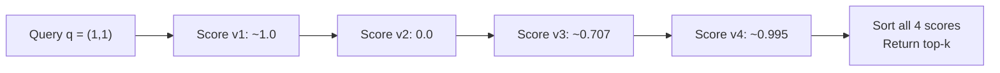

## Brute-Force Linear Scan as the Honest Baseline: Comparing the Query Against Every Single Candidate Vector in Turn

### A Systems Analogy First

Consider a `grep` scan through a text file with no index: to find every line containing a pattern, the tool reads every single line from start to finish and tests each one, with no shortcut. It is slow relative to a pre-built index, but it is also completely trustworthy — it cannot possibly miss a match, because it never skips anything. **Brute-force linear scan** for nearest-neighbor search is the exact same strategy applied to the problem defined in the previous item: to find the top-$k$ nearest neighbors of a query vector $\vec{q}$ among a candidate set $S$, compute the similarity or distance between $\vec{q}$ and *every single* candidate in $S$, with no shortcut, no skipping, and no shortcut structure exploited.

### The Algorithm Stated Precisely

Given a query vector $\vec{q}$, a candidate set $S = \{\vec{v}_1, \dots, \vec{v}_N\}$, a chosen metric (cosine similarity, used here as the running example), and a desired result size $k$:

1. For each $\vec{v}_i \in S$, compute $\cos(\vec{q}, \vec{v}_i)$ using the standard formula derived in Chapter 01: dot product divided by the product of the two norms.
2. Collect all $N$ computed scores.
3. Sort (or select via a top-$k$ selection method) the $N$ scores in descending order.
4. Return the $k$ candidates corresponding to the $k$ highest scores.

**Key Points**

- Step 1 is exhaustive by design — every single one of the $N$ candidates is scored, with no candidate ever excluded from consideration before its score is computed. This is precisely what makes the result **exact**: since every candidate was actually compared, there is no possibility that a genuinely closer candidate was skipped and missed.
- This algorithm requires no preprocessing, no auxiliary data structure, and no assumptions whatsoever about the distribution or structure of $S$ — it works correctly on any candidate set, including one with no discoverable internal structure at all, which is precisely the property that makes it the correct baseline to compare more sophisticated methods against.
- The word "brute-force" describes the *lack of cleverness* in the search strategy, not an error in the computation — every individual similarity computation is exactly as mathematically correct as any similarity computation performed by a more sophisticated method; the only difference is how many of them get performed and in what order.

### Worked Trace on the Chapter's Running Example

Recall the small worked instance from the previous item: query $\vec{q}=(1,1)$, candidate set $S=\{\vec{v}_1=(2,2),\ \vec{v}_2=(-1,1),\ \vec{v}_3=(1,0),\ \vec{v}_4=(0.9,1.1)\}$, $N=4$.

Brute-force linear scan proceeds by visiting each candidate in turn, in whatever order they happen to be stored, computing its score, and only *after all four* have been scored does it become possible to know the correct ranking:

| Step | Candidate visited | Score computed | Running best-known top-1 so far |
| --- | --- | --- | --- |
| 1 | $\vec{v}_1=(2,2)$ | $\approx1.0$ | $\vec{v}_1$ (score $1.0$) |
| 2 | $\vec{v}_2=(-1,1)$ | $0.0$ | still $\vec{v}_1$ |
| 3 | $\vec{v}_3=(1,0)$ | $\approx0.707$ | still $\vec{v}_1$ |
| 4 | $\vec{v}_4=(0.9,1.1)$ | $\approx0.995$ | still $\vec{v}_1$ (as $0.995 < 1.0$) |

**Output**

- Final top-1 result: $\vec{v}_1$, score $\approx1.0$ — matching exactly the answer already established in the previous item's fully worked computation.
- Note that the algorithm could not have stopped early after visiting $\vec{v}_1$ and declared it the winner with certainty, even though $\vec{v}_1$'s score of $1.0$ happens to be the maximum possible cosine similarity value: in general, the algorithm has no way of knowing, part-way through the scan, whether a later unvisited candidate might outscore everything seen so far, so — absent extra reasoning specific to this instance — it must visit every remaining candidate before it can guarantee correctness. This is the essential behavior brute-force scan always exhibits: certainty is only available once nothing has been left unchecked.

### Why "Honest" Is the Right Word for This Baseline

**Key Points**

- Brute-force linear scan makes no approximation and relies on no assumption about the data — it is the search-problem equivalent of a mathematical proof by exhaustive case-check: tedious, but airtight. Every subsequent method introduced in this curriculum, beginning with the approximate methods in the next chapter, must be understood as trading away some portion of this airtight guarantee in exchange for speed, and the size of that tradeoff can only be measured by comparing against this exact, brute-force result.
- This is why brute-force linear scan is described as the "baseline" rather than merely "one option among several": it defines **ground truth**. When a later chapter asks "how much accuracy does an approximate method sacrifice," the only way to answer that question is to know what the *exact* top-$k$ result would have been — and brute-force linear scan is what computes that exact answer.
- Because it visits every candidate without exception, brute-force linear scan's correctness does not depend on any structural assumption about how the vectors in $S$ are distributed in space — it works identically whether the vectors are tightly clustered, uniformly scattered, or adversarially arranged. This structural indifference is a genuine strength for correctness, but it is also, as the next item in this chapter will show, the direct source of its scaling weakness: since it exploits no structure, it cannot skip work on the basis of structure either.

### What Brute-Force Scan Deliberately Does Not Try to Exploit

A well-designed database index (a B-tree, for instance) exploits *sortedness* to skip over large ranges of data it can prove cannot contain a match. Brute-force nearest-neighbor scan, by contrast, exploits nothing: it does not presume the candidate vectors are stored in any particular geometric order, it does not build any auxiliary structure summarizing regions of the vector space, and it does not use the result of comparing $\vec{q}$ to one candidate to say anything at all about a different candidate. Each of the $N$ comparisons in the worked trace above was computed completely independently of every other comparison — the fact that $\vec{v}_1$ scored $1.0$ told the algorithm nothing whatsoever about what $\vec{v}_2$'s score would turn out to be.

**Conclusion**

Brute-force linear scan solves the nearest-neighbor search problem defined earlier in this chapter in the most direct way possible: score every candidate against the query using the chosen metric, then sort and take the top $k$. Its defining property is exhaustiveness — no candidate is ever skipped, no structure in the data is assumed or exploited, and as a direct consequence, its result is always the mathematically exact answer to the problem as defined. This combination of total correctness and total lack of cleverness is exactly what qualifies it as the "honest baseline" for this chapter: honest in the sense that it never sacrifices accuracy, and a baseline in the sense that every more sophisticated method introduced later in this curriculum will be judged by how well it approximates this exact result while doing meaningfully less work — which raises directly the question the next item addresses: precisely how much work "every single candidate" actually costs as $N$ grows large.

**Related Topics**

- The true linear cost model of brute-force scan and how it scales with candidate set size $N$
- A precise framing of the problem that approximate nearest-neighbor methods exist to solve
- Exact versus approximate search as an explicit tradeoff, introduced in the next chapter
- Using brute-force scan as ground truth to measure the accuracy of an approximate method
- How brute-force scan's cost interacts with insertion cost once the candidate set $S$ is allowed to grow