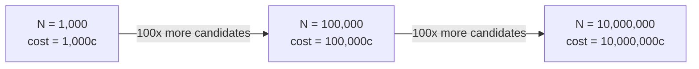

## Deriving the True Cost Model of Brute-Force Search: Why It Costs One Comparison Per Existing Candidate, Every Single Time

### A Systems Analogy First

Consider a linked list with no index, where finding a specific value requires walking node by node from the head until either the value is found or the list ends. Even in the best case of an early match, an engineer cannot rely on that best case when reasoning about a system's guaranteed behavior — a correctness-preserving analysis must account for the case where the target is the very last node, or absent entirely, requiring a full traversal of all $N$ nodes. Brute-force nearest-neighbor search, established in the previous item as exhaustive by construction, admits exactly this same style of cost analysis: this item derives, precisely, why its cost is always proportional to $N$, the size of the candidate set, with no better case to fall back on.

### Deriving the Cost, Step by Step

Recall from the previous item that brute-force linear scan performs exactly one similarity computation — for instance, one cosine similarity computation — per candidate vector in $S$, with $S=\{\vec{v}_1,\dots,\vec{v}_N\}$. The total cost of the search is the sum of the cost of each individual comparison:

$$\text{Total cost} = \sum_{i=1}^{N} \text{cost of comparing } \vec{q} \text{ to } \vec{v}_i$$

**Step 1 — Cost of a single comparison.** Recall that cosine similarity between two $d$-dimensional vectors requires computing a dot product (a sum of $d$ multiplications) and two norms (each itself a sum of $d$ squared terms followed by a square root). Every one of these operations is proportional to $d$: computing the dot product takes $d$ multiply-and-add operations, and each norm takes $d$ multiply-and-add operations plus one square root. So the cost of a single comparison is proportional to $d$ — commonly written as $O(d)$, meaning the cost scales linearly with dimensionality.

**Step 2 — Cost across all candidates.** Since the algorithm performs this $O(d)$ comparison once for *every* candidate in $S$, and there are $N$ candidates, the total cost is:

$$\text{Total cost} = N \times O(d) = O(N \cdot d)$$

**Step 3 — Why there is no better case.** Because brute-force scan, as established in the previous item, has no mechanism for skipping a candidate before computing its score — no auxiliary structure, no sorted order, no early-termination rule that can be trusted in general — every one of the $N$ comparisons must actually be performed before the algorithm can guarantee it has found the true top-$k$ result. This means $O(N \cdot d)$ is not merely brute-force scan's *average* or *worst-case* cost — it is its cost in **every single case**, with no variability based on the data or the query. This is a stronger and more specific claim than a typical worst-case bound: there is no lucky input that lets brute-force scan finish early while still guaranteeing correctness.

**Key Points**
- The phrase "one comparison per existing candidate, every single time" in this item's title is deliberately not "up to $N$ comparisons in the worst case" — brute-force scan's cost is not merely bounded above by $N$, it is *exactly* $N$ comparisons on every query, always, by construction. Recall from the previous item that even after finding a perfect-score match early in the scan (as $\vec{v}_1$ was in the worked trace), the algorithm still had to check every remaining candidate, because nothing about the algorithm allowed it to know in advance that no later candidate could tie or exceed that score.
- This cost model has two independent scaling factors: $N$ (the number of candidates) and $d$ (the dimensionality of each vector, established in Chapter 02 to commonly sit in the hundreds or thousands for real embedding models). Both factors matter in practice — recall from Chapter 02 that increasing $d$ increases the cost of every single dot product and norm computation performed, compounding directly with however large $N$ happens to be.
- The dependence on $N$ specifically is what "doesn't scale" refers to in this chapter's title: as a system's candidate set grows — exactly the scenario this curriculum is building toward, where $S$ represents a knowledge graph accumulating nodes over time — every single query against that growing set costs strictly more than it did before, with no ceiling on how much more, since cost grows without bound as $N$ grows without bound.

### Worked Numeric Illustration of the Scaling

Suppose a single cosine similarity comparison at $d=768$ (a realistic dimensionality established earlier in this curriculum) takes some small, roughly fixed amount of time — call it $c$ microseconds, dominated by the $O(d)$ arithmetic described in Step 1. The following table traces the total query cost as $N$ grows, holding $d$ and therefore $c$ fixed:

| Candidate set size $N$ | Total comparisons required | Total cost (relative to $c$) |
|---|---|---|
| $1{,}000$ | $1{,}000$ | $1{,}000c$ |
| $100{,}000$ | $100{,}000$ | $100{,}000c$ |
| $10{,}000{,}000$ | $10{,}000{,}000$ | $10{,}000{,}000c$ |

**Output**

Growing $N$ by a factor of $100$ (from $1{,}000$ to $100{,}000$) grows the total query cost by exactly the same factor of $100$ — this is precisely what "linear scaling" means: cost is directly proportional to $N$, with no diminishing or amortizing effect as $N$ grows. Doubling the candidate set doubles the cost of every single future query against it, forever, for as long as brute-force scan remains the search strategy.

### Why This Cost Model Is "True" Rather Than Optimistic

**Key Points**
- It would be a mistake to describe brute-force scan's cost using only asymptotic worst-case language ("at most $O(N)$") without also stating the stronger fact established in Step 3: it is not merely bounded by $N$, it *equals* $N$ comparisons unconditionally. This distinction matters directly for this curriculum's later comparison between brute-force and other insertion or search strategies, since a method whose cost is merely bounded by something can sometimes do better in practice, while brute-force scan's cost is a fixed, guaranteed quantity with no such possibility.
- This cost model says nothing yet about whether $O(N\cdot d)$ is "acceptable" or "unacceptable" for any given system — that is a judgment relative to how large $N$ is expected to grow and how frequently queries are issued, a framing this curriculum takes up explicitly once it reaches the discussion of insertion cost as a function of existing structure size in Chapter 07. What this item establishes is only the shape of the cost curve itself: linear in $N$, with no better behavior available to brute-force scan under any circumstances.
- The absence of any exploitable structure, noted as a strength for correctness in the previous item, is now visible as the direct cause of this cost floor: a method that *could* exploit structure in the data — clustering, sorted order, spatial locality — might in principle avoid checking every candidate, but doing so requires abandoning the very property (structural indifference) that made brute-force scan's correctness guarantee unconditional. This tension — between exploiting structure for speed and giving up unconditional correctness — is precisely the tradeoff the next chapter's approximate methods are built to navigate.

**Conclusion**

The true cost of brute-force nearest-neighbor search is derived directly from its exhaustive mechanism established in the previous item: since every one of the $N$ candidates must be individually compared against the query at a per-comparison cost proportional to dimensionality $d$, the total cost is $O(N\cdot d)$, and — critically — this is not merely an upper bound but the algorithm's exact, unconditional cost on every query, with no favorable case available. This linear dependence on $N$ is the precise, derivable reason brute-force search "doesn't scale," as this chapter's title states: as a candidate set grows without bound, so too, proportionally and without any ceiling, does the cost of every single future query against it — setting up the exact problem that approximate nearest-neighbor methods, introduced in the next chapter, are engineered specifically to solve.

**Related Topics**
- A precise framing of the problem that approximate nearest-neighbor methods exist to solve
- The exact-versus-approximate tradeoff introduced at the start of the next chapter
- How dimensionality $d$ independently compounds this cost, connecting back to Chapter 02's discussion of embedding dimensionality
- Reframing this per-query cost as part of a larger insertion-cost analysis once the candidate set is allowed to grow, in Chapter 07
- Amortized analysis as a distinct cost-accounting framework, introduced independently in Chapter 05, later fused with this search-cost model