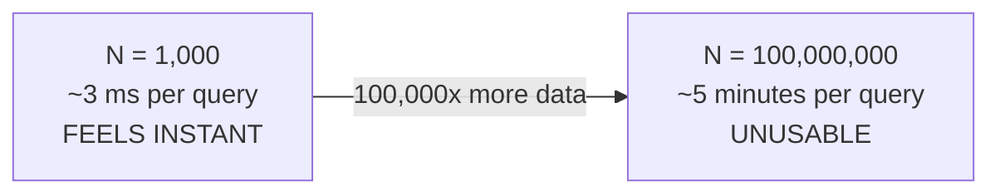

## Concrete Numbers on Where Linear Scan Becomes Impractical, and Why "It Still Works on My Laptop" Is a Misleading Signal at Production Scale

### A Systems Analogy First

Consider a junior engineer who benchmarks a new database query against a development table with 500 rows, sees it return in 2 milliseconds, and concludes the query is fast. The query might contain a full table scan with no index — invisible at 500 rows, catastrophic at 500 million. The gap between "works fine in development" and "works fine in production" is almost never a difference in correctness; it is a difference in **scale**, and linear-cost operations are exactly the category of code where that gap is most dangerous, because the cost model derived in the previous item — $O(N \cdot d)$, exact and unconditional — guarantees that performance which looks perfectly fine at small $N$ will degrade in direct proportion as $N$ grows, with no natural point at which the degradation announces itself except by actually happening.

### Putting Concrete Numbers on the Derived Cost Model

Recall from the previous item that brute-force scan's cost is $O(N\cdot d)$, and that this is an exact, per-query cost with no favorable case. To make this concrete, suppose a single cosine similarity comparison at a realistic embedding dimensionality of $d=768$ takes on the order of a few microseconds on typical modern hardware — this specific figure is illustrative rather than a benchmark result, but it is a reasonable order-of-magnitude estimate given that a single comparison performs roughly $3\times768\approx2{,}300$ floating-point multiply-and-add operations (a dot product and two norms, each of length $768$), well within the range of a few microseconds on typical CPU hardware. [Unverified] The actual figure for any specific hardware, implementation, and compiler optimization level would need to be measured directly rather than assumed from this order-of-magnitude estimate.

| Candidate set size $N$ | Illustrative total scan time (at ~3 microseconds/comparison) |
| --- | --- |
| $1{,}000$ | ~3 milliseconds |
| $100{,}000$ | ~300 milliseconds |
| $10{,}000{,}000$ | ~30 seconds |
| $1{,}000{,}000{,}000$ | ~50 minutes |

**Output**

At $N=1{,}000$ — a plausible size for a development dataset, a demo, or an early prototype — a single query completes in a few milliseconds, fast enough to feel completely unproblematic during interactive development and testing. At $N=1{,}000{,}000{,}000$ — a plausible size for a production knowledge graph or document corpus that has been accumulating data for months or years — the identical algorithm, with no bug and no change in logic, now takes on the order of tens of minutes for a *single* query. Recall from the previous item that this scaling is not a worst case that might be avoided by luck — it is the algorithm's exact, unconditional cost, so this degradation is guaranteed to occur as $N$ grows, not merely a risk that might occur.

### Why "It Still Works on My Laptop" Is Specifically Misleading Here

**Key Points**

- A developer testing locally almost always tests against a candidate set orders of magnitude smaller than a production system's actual data volume — a sample dataset, a subset of real records, or synthetic test data generated for convenience. Because the cost model is linear and the multiplicative constant ($d$, and the per-operation hardware cost) does not change between development and production, a working local test at small $N$ provides **no information whatsoever** about whether the same code will be acceptable at production $N$ — it only confirms the code is *correct*, which is a separate property from whether it is *fast enough*, and the table above shows these two properties can diverge completely once $N$ grows by several orders of magnitude.
- This is a specific instance of a more general and well-known engineering trap: any $O(N)$ or worse algorithm can appear to perform perfectly well under a testing regime that never exercises the actual scale the system will face in production, precisely because linear (and especially superlinear) cost curves are, by definition, nearly flat and unremarkable over a small range of $N$ and only become visually dramatic once $N$ spans several orders of magnitude — exactly the range a laptop-scale test almost never covers.
- The specific danger for a growing knowledge graph — the system this curriculum is building toward — is that $N$ is not fixed at deployment time; it grows continuously as new nodes are inserted, as established in this chapter's problem framing. A system that felt fast during its first weeks of operation, when $N$ was still small, can degrade smoothly and continuously as $N$ grows, with no single moment marking a clear "before" and "after" — making this degradation easy to miss until users are already experiencing it, unless it is specifically tested for in advance using the derived cost model rather than only observed after deployment.

### The Correct Way to Reason About This, Instead of Empirical Feel

**Key Points**

- Because the cost model $O(N\cdot d)$ was *derived* in the previous item, rather than only observed empirically, its scaling behavior can be reasoned about analytically at any target $N$, including values of $N$ far larger than anything convenient to actually test on a laptop — this is precisely the value of having a derived cost model rather than relying solely on empirical benchmarking at whatever scale happens to be convenient.
- A responsible engineering practice is to identify the target production scale for $N$ *before* committing to brute-force scan, and to check the derived cost model against that target scale directly, rather than inferring acceptability from a small-scale empirical test that, as established above, provides no reliable signal about behavior at a much larger scale.
- [Inference] This same reasoning generalizes beyond nearest-neighbor search specifically: any time a system's cost model has been derived to depend on a quantity ($N$ here) that is expected to grow substantially between development and production, empirical testing at development scale should be treated as validating correctness only, with scaling behavior evaluated separately through the derived cost model rather than through feel — though the specific numeric thresholds at which a given system becomes "impractical" always depend on that system's own latency requirements and hardware, and cannot be read off a single universal table.

**Conclusion**

The gap between brute-force scan "still working" during development and becoming impractical in production is not a mysterious or unpredictable failure — it is the direct, arithmetic consequence of the exact linear cost model $O(N\cdot d)$ derived in the previous item, which guarantees that cost grows in direct, unconditional proportion to candidate set size. Because development and testing environments almost always operate at a far smaller $N$ than production, and because linear cost curves are unremarkable at small scale and dramatic only across several orders of magnitude, empirical "it feels fast" testing at development scale provides essentially no evidence about production-scale performance — the derived cost model, evaluated directly at the expected production $N$, is the only reliable way to know in advance where brute-force scan will stop being viable.

**Related Topics**

- The true linear cost model of brute-force scan derived in the previous item
- A precise framing of the problem approximate nearest-neighbor methods exist to solve
- The exact-versus-approximate tradeoff introduced at the start of the next chapter
- Insertion cost as a function of existing structure size, connecting query-time cost to the growth of $N$ over time
- Benchmarking methodology: designing load tests that reflect projected production scale rather than convenient development scale