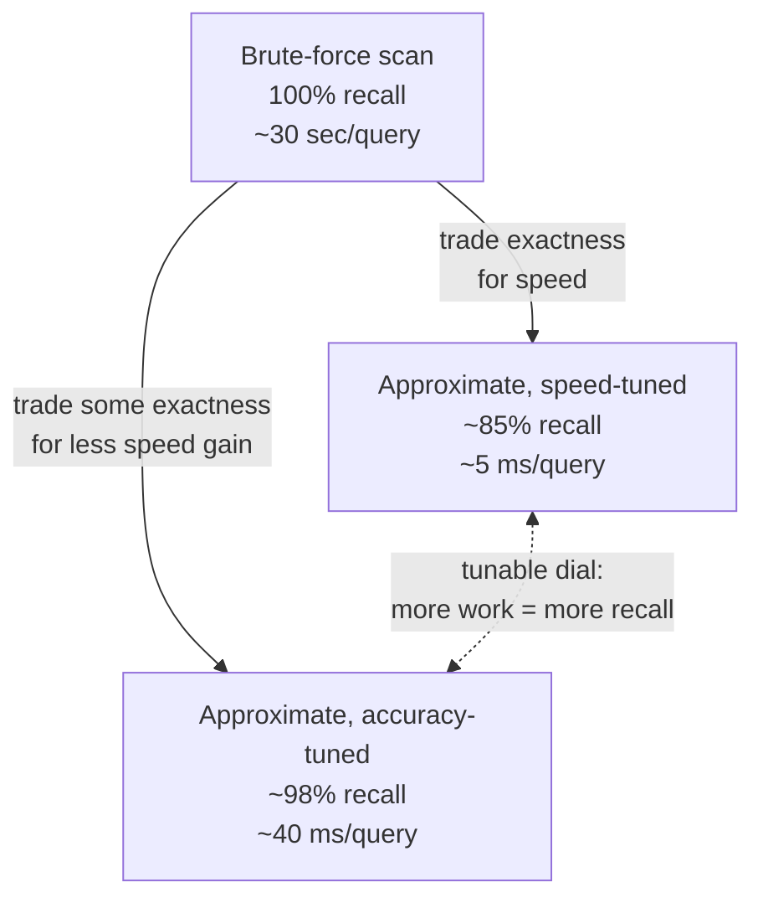

## Precisely Framing the Problem That Approximate Nearest-Neighbor Methods Exist to Solve, Stated as a Tradeoff Rather Than a Free Lunch

### A Systems Analogy First

Consider a database engineer choosing between a strongly consistent distributed database and an eventually consistent one. The eventually consistent system is not "just better" — it buys lower latency and higher availability by deliberately giving up a guarantee (that every read reflects the most recent write) that the strongly consistent system provides unconditionally. No engineer describes this choice as a free improvement; it is a tradeoff, made deliberately, with a named cost and a named benefit, and the right choice depends on whether the specific application can tolerate the cost. Approximate nearest-neighbor search must be framed with exactly this same honesty: it does not make brute-force scan's cost problem, derived precisely in this chapter, simply disappear. It trades away brute-force scan's one unconditional guarantee — always finding the mathematically exact top-$k$ result — in exchange for a cost that does not grow linearly with $N$. Stating this precisely, before this curriculum moves into the mechanics of any specific approximate method, is the purpose of this item.

### What Brute-Force Scan Guarantees, Restated Precisely

Recall from earlier in this chapter that brute-force linear scan, by comparing the query against every single candidate without exception, always returns the mathematically exact top-$k$ result under the chosen metric — this is not a probabilistic or typical outcome, it is a guarantee that holds on every query, unconditionally. Recall also that this guarantee is purchased at an exact, unconditional cost of $O(N\cdot d)$ per query, with no better case available, and that this cost becomes impractical at production scale, as the concrete numbers in the previous item demonstrated directly.

### The Problem Approximate Methods Exist to Solve, Stated Precisely

**The problem is not** "find a faster way to compute the exact top-$k$ result." [Inference] For the nearest-neighbor problem as generally defined — an arbitrary candidate set with no assumed structure — it is a reasonable and widely-held expectation that no algorithm can guarantee the exact top-$k$ answer while examining meaningfully fewer than all $N$ candidates in the worst case, since an adversarially placed nearest neighbor could in principle be any one of the $N$ candidates, and skipping even one candidate risks skipping the true answer; this is stated as a reasonable expectation given the problem's structure rather than as a formally proven impossibility result this curriculum has derived.

**The problem approximate methods actually solve is:** given that examining every candidate is expensive at scale, find a method that examines meaningfully fewer than $N$ candidates, at the cost of a small, quantifiable, and ideally controllable probability of returning a top-$k$ result that is not the exact one brute-force scan would have returned — but is close to it under the same metric.

This reframes the goal from "eliminate the cost" to "accept a specific, bounded, named cost in one dimension (accuracy) in exchange for a large reduction in a different, more urgent cost (query latency at scale)."

**Key Points**

- The tradeoff has two independently measurable sides: **recall** (informally, what fraction of the true top-$k$ results the approximate method actually finds, compared to what brute-force scan would have found) and **query latency or computational cost** (how much cheaper the approximate method is compared to the $O(N\cdot d)$ cost derived earlier in this chapter). An approximate method is evaluated by reporting both numbers together, never one without the other — a method that is fast but finds almost none of the true nearest neighbors is not a solution to this problem, and neither is a method that finds every true nearest neighbor but costs the same as brute-force scan.
- Because this is a tradeoff and not a free improvement, there typically exist tunable parameters that let a system trade more of one side for more of the other — examining more candidates to increase recall at the cost of latency, or examining fewer to reduce latency at the cost of recall. Chapter 04 in this curriculum introduces specific parameters (named $M$ and $\text{ef}$ in the context of a specific graph-based method) that instantiate exactly this kind of dial.
- "Approximate" in this context specifically means "not guaranteed to be the exact top-$k$ result under the chosen metric" — it does not mean "arbitrary," "unreliable," or "unpredictable." A well-designed approximate method's recall is a property that can be measured empirically against a brute-force ground truth (recall from earlier in this chapter that brute-force scan's exactness is precisely why it serves as the ground truth an approximate method's recall is measured against), and can often be pushed arbitrarily close to $100\%$ by tuning parameters — at the cost of correspondingly increasing the query cost back toward the same figures derived earlier in this chapter.

### Worked Illustration: The Tradeoff Made Concrete

Suppose a hypothetical approximate method is applied to a candidate set of $N=10{,}000{,}000$, the same scale used in the previous item's cost table, where brute-force scan required roughly 30 seconds per query.

| Method | Approx. query latency | Recall (fraction of true top-10 found) |
| --- | --- | --- |
| Brute-force scan | ~30 seconds | 100% (exact, by construction) |
| Approximate method, tuned for speed | ~5 milliseconds | ~85% |
| Approximate method, tuned for accuracy | ~40 milliseconds | ~98% |

**Output**

Note that even the accuracy-tuned configuration, at ~40 milliseconds, remains roughly 750 times faster than brute-force scan's ~30 seconds, while still not reaching $100\%$ recall — this is the tradeoff stated numerically: a large, multiple-orders-of-magnitude reduction in cost, purchased with a small but genuinely nonzero, measurable reduction in guaranteed accuracy. [Unverified] These specific figures are illustrative of the shape of the tradeoff rather than a benchmark result for any particular method; actual recall and latency figures depend on the specific method, its parameter settings, and the specific data distribution, and would need to be measured directly for any real deployment.

### Why This Framing as a Tradeoff Matters Going Forward

**Key Points**

- Describing approximate nearest-neighbor search as a "free lunch" — faster with no real cost — would misrepresent what is actually happening and would leave a system designer unable to reason correctly about when the tradeoff is acceptable. Recall the earlier item's warning about "it still works on my laptop": an approximate method's recall, like brute-force scan's latency, must be evaluated against the specific requirements of the system being built, not assumed to be adequate by default.
- This framing directly sets up the specific question this curriculum's later chapters return to repeatedly: for the knowledge-graph insertion problem this curriculum is building toward, is a small, nonzero chance of missing the true nearest existing node an acceptable cost in exchange for insertion remaining fast as the graph scales? That is precisely a recall-versus-latency tradeoff of the shape defined in this item, and answering it requires exactly the two-sided measurement (recall and cost, together) established here.
- Every approximate method introduced later in this curriculum — beginning with the specific graph-based method covered in the next chapter — should be evaluated by asking the same two questions this item establishes as the correct evaluation criteria: how much of brute-force scan's guaranteed correctness does it give up, and how much of brute-force scan's cost does it save in return. A method that cannot answer both questions with concrete, measured numbers has not been properly characterized, regardless of how it works internally.

**Conclusion**

The problem approximate nearest-neighbor methods exist to solve is not "make exact search fast" — it is "trade a small, measurable, and ideally tunable reduction in guaranteed accuracy (recall, relative to the brute-force ground truth established earlier in this chapter) for a large, necessary reduction in query cost, at the scale where brute-force scan's derived linear cost model becomes impractical." Stating the problem this way, explicitly as a tradeoff with two named and independently measurable sides rather than as an unqualified improvement, is what allows every specific approximate method introduced in the remainder of this curriculum to be evaluated honestly, on the same two axes, against the same exact baseline this chapter has spent its full length establishing.

**Next Steps**

- The exact-versus-approximate tradeoff explored in full mechanical detail through a specific method
- Navigable small-world graphs and greedy routing as one concrete way to realize this tradeoff
- HNSW's layered hierarchy and its tunable $M$ and $\text{ef}$ parameters as the tradeoff's tunable dial made concrete
- Measuring recall empirically against brute-force ground truth for a real approximate index
- Framing this recall-versus-cost tradeoff specifically in terms of graph node insertion, in Chapter 07