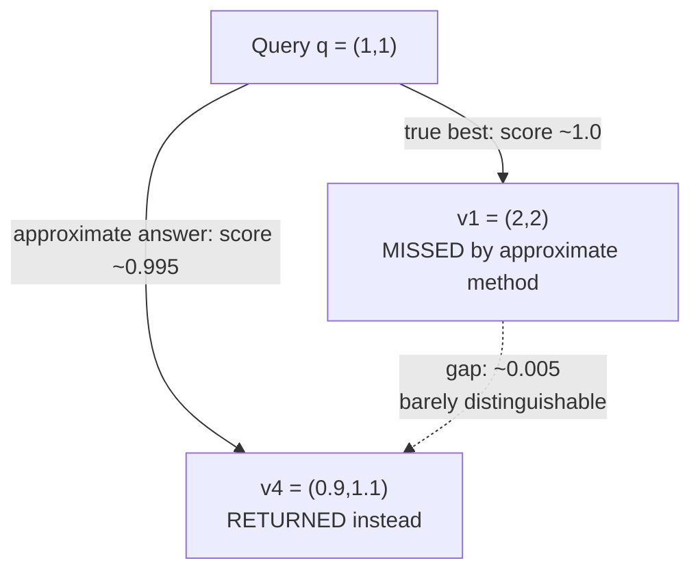

## The Exact-Versus-Approximate Tradeoff Stated Honestly: What Accuracy Is Being Given Up, and Why That Loss Is Usually Acceptable in Practice

### A Systems Analogy First

Consider a network path-finding protocol like OSPF's use of shortest-path routing versus a simpler distance-vector heuristic: the shortest-path calculation guarantees the mathematically optimal route, while the heuristic can occasionally settle on a route that is a few hops longer than optimal, in exchange for converging faster and using less router memory. No competent network engineer treats the heuristic's occasional sub-optimality as a hidden flaw to be quietly ignored — it is a named, quantifiable, and generally acceptable cost, because a route that is slightly longer than optimal almost never matters to the application sending traffic over it, while a routing protocol that takes too long to converge can cause real outages. Approximate nearest-neighbor search asks for exactly this same honest accounting: recall that brute-force linear scan, covered in the previous chapter, guarantees the mathematically exact top-$k$ result at a cost that grows linearly with candidate set size $N$; an approximate method gives up that unconditional guarantee in exchange for cost that does not grow linearly. This item states plainly what is actually being given up, and why, in most practical settings, that specific loss turns out not to matter much.

### What "Giving Up Accuracy" Actually Means, Precisely

Recall from the nearest-neighbor problem definition established in the previous chapter that a correct answer to a top-$k$ query is precisely the $k$ candidates with the highest similarity score under the chosen metric. An approximate method can fail to return this exact set in one specific, characterizable way: it may return a candidate that is *not* among the true top-$k$, while missing one that *is* — typically because the search procedure examined only a subset of the candidate set (guided by some internal structure, rather than the exhaustive check brute-force scan performs) and that subset happened not to include the true best match.

**Key Points**

- The metric used to quantify this loss is called **recall**: the fraction of the true top-$k$ results (as brute-force scan would report them) that the approximate method actually returns. A recall of $0.95$ at $k=10$ means that, averaged across many queries, the approximate method finds 9.5 of the 10 truly correct nearest neighbors.
- Critically, when an approximate method misses a true top-$k$ result, it does not typically return a wildly unrelated candidate in its place — because it is still guided by the same underlying similarity structure, the substituted candidate is very often only slightly less similar than the true best match, not a random or nonsensical one. This is the qualitative shape of the loss: near-misses, not gross errors.
- This loss is a property of the *search* step specifically. It says nothing about the embedding model's own accuracy (covered in Chapter 02), nor about whether the similarity metric itself is well-chosen — recall is a separate, additional source of imperfection layered on top of whatever imperfections the embedding and metric already carry, and it should be reasoned about independently.

### Worked Example: What a Near-Miss Actually Looks Like

Recall the small worked instance used repeatedly in the previous chapter: query $\vec{q}=(1,1)$ and candidate set $S=\{\vec{v}_1=(2,2),\ \vec{v}_2=(-1,1),\ \vec{v}_3=(1,0),\ \vec{v}_4=(0.9,1.1)\}$, where brute-force scan established the exact ranking $\vec{v}_1$ (score $\approx1.0$), $\vec{v}_4$ ($\approx0.995$), $\vec{v}_3$ ($\approx0.707$), $\vec{v}_2$ ($0.0$).

Suppose an approximate method, examining only a subset of this candidate set guided by some internal structure not yet covered in this curriculum, happens not to examine $\vec{v}_1$ at all for this particular query, and instead returns $\vec{v}_4$ as its top-1 answer.

**Output**

- Exact (brute-force) top-1: $\vec{v}_1$, score $\approx1.0$
- Approximate top-1: $\vec{v}_4$, score $\approx0.995$
- The "error" here is a difference of about $0.005$ in cosine similarity — the approximate method's answer is, geometrically, barely distinguishable from the truly optimal one. This is the concrete shape of what "giving up accuracy" tends to look like: not a wrong answer in any meaningful practical sense, but a slightly-less-than-optimal one.

### Why This Kind of Loss Is Usually Acceptable in Practice

**Key Points**

- Recall from Chapter 02's honest treatment of similarity thresholds that even the embedding model itself, combined with a fixed similarity cutoff, already produces false merges and missed matches as a normal, expected part of how these systems behave — the embedding step alone does not guarantee a clean, unambiguous ranking of "correct" versus "incorrect" matches to begin with. Introducing a small additional chance of a near-miss at the search step, on top of an already-approximate embedding and threshold layer, is frequently a marginal addition to an already-present source of uncertainty, rather than an entirely new category of failure being introduced into an otherwise perfect pipeline.
- Because the substituted candidate in a near-miss is typically close in score to the true best match (as the worked example demonstrates), the *practical consequence* of the miss is often small. If the downstream use of a nearest-neighbor query is, for instance, deciding whether a new item is similar enough to an existing graph node to be considered a candidate match, a search that finds the second-best match instead of the best match by a margin of $0.005$ is very unlikely to change the ultimate accept-or-reject decision at a reasonably chosen threshold, since both candidates score well above or below that threshold together in the overwhelming majority of cases.
- The size of the acceptable loss is, however, not a universal constant — it depends on how consequential a missed match actually is for the specific system. Recall the earlier discussion in Chapter 02 of false merges as often the more destructive of the two threshold failure modes for knowledge graph construction specifically; a system where an occasional near-miss could contribute to more graph fragmentation, rather than an incorrect merge, is generally a lower-stakes context for tolerating imperfect recall than one where a missed match risks something less reversible.
- Crucially, unlike brute-force scan's fixed, unconditional cost, an approximate method's recall is typically a **tunable** property (previewed in the previous chapter's discussion of a controllable tradeoff) — a system that finds a specific method's default recall unacceptably low for its use case can generally trade back some of the speed advantage to raise recall, rather than being stuck accepting a single fixed level of accuracy loss.

### The Honest Statement of the Tradeoff

**Key Points**

- The tradeoff is not "approximate search is almost as good as exact search, so the difference doesn't matter" as a blanket claim — that would understate the fact that a real, measurable, nonzero chance of a near-miss is genuinely being accepted, not eliminated. The honest statement is narrower and more specific: the *kind* of error introduced (a near-miss in score, not a wild misclassification) combined with the *magnitude* of typical recall figures (often into the high nineties of a percent for well-tuned methods) means that, for the majority of practical similarity-search use cases, this specific, bounded, tunable cost is worth paying in exchange for avoiding the linear cost model that makes brute-force scan impractical at production scale.
- This does not mean every use case should accept this tradeoff without scrutiny. [Inference] A use case with an unusually low tolerance for any missed match — for instance, a safety-critical or legally consequential identity-matching decision — would need to evaluate whether even a small, tunable recall loss is acceptable on its own terms, rather than assuming the general practical acceptability argued for here transfers automatically to every specific application; this is a judgment that depends on the specific stakes of the system being built; it is not a property of the search algorithm alone.

**Conclusion**

Approximate nearest-neighbor search gives up brute-force scan's one unconditional guarantee — always returning the mathematically exact top-$k$ result — in exchange for avoiding its linear cost. What is actually lost, precisely, is not a large or unpredictable degradation but a specific, measurable, and typically small chance of returning a near-miss whose similarity score sits close to that of the true best match, layered on top of a pipeline (embedding plus threshold) that was already carrying its own acceptable imperfections before search was even considered. Because this loss is usually small in magnitude, typically tunable, and rarely changes a downstream threshold-based decision, it is, in most practical settings, a cost worth paying — but that acceptability is a property of the specific system's stakes and tolerance, not a universal guarantee, and should be reasoned about explicitly rather than assumed.

**Related Topics**

- Precisely framing the exact-versus-approximate tradeoff, established in the previous chapter, as the foundation for this honest accounting
- Similarity thresholds and their own independent false-merge and missed-match failure modes, layered beneath this search-level tradeoff
- Navigable small-world graphs and greedy routing as the specific mechanism that produces this kind of near-miss behavior
- The $M$ and $\text{ef}$ parameters as the tunable dial that trades recall against query cost
- Measuring recall empirically against brute-force ground truth as the concrete practice this honest framing motivates