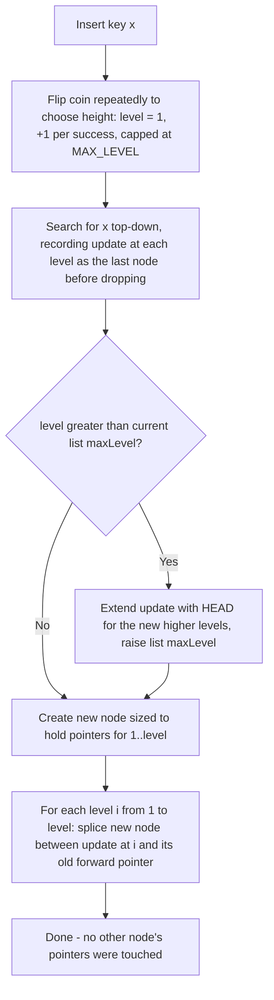

## Skip Lists from First Principles: Building Intuition for a Layered Structure That Lets You Skip Past Most of the Data

### The Problem: Sorted Order Alone Doesn't Buy You Speed

Think about how a database engine speeds up lookups on a large table. If rows are stored in an unsorted heap file, finding a row means scanning every block — an $O(n)$ scan. The first fix taught in any database course is: sort the rows (or build a B+-tree over them) and use binary search, dropping the cost to $O(\log n)$.

Now apply that same fix to a plain sorted **linked list** instead of a sorted array. The list is sorted, but binary search is unavailable, because binary search depends on random access: you need to jump directly to the middle element in $O(1)$ time. A linked list only gives you sequential access — to reach the middle node you must walk past every node before it. So even though the keys are sorted, searching a sorted linked list is still $O(n)$. Sortedness alone is not what makes binary search fast; random access is the missing ingredient, and linked lists are the classic data structure that trades away random access in exchange for cheap $O(1)$ insertion and deletion at any point (no shifting elements, unlike an array).

This is the actual tension a skip list resolves: **how do you get array-like, logarithmic-time search on a structure that keeps the linked list's cheap, local insertion and deletion?**

### First Attempt: One Express Lane

Database engines have already solved a version of this problem with a **sparse index over a dense index**: instead of indexing every row, you index every $k$-th row, and each indexed entry points to a block of $k$ consecutive rows in the dense (fully sorted) file. To find a key, you binary-search the small sparse index to find the right block, then linearly scan just that block.

Apply the identical idea to a sorted linked list. Alongside the normal "walk one node at a time" pointers, add a second, sparser set of pointers that skip every $k$-th node — an **express lane** running parallel to the **local lane**. A search first walks the express lane until the next express stop would overshoot the target, then drops down into the local lane and walks the remaining short stretch node by node.

**Worked example.** Take the sorted list `[3, 6, 9, 12, 17, 21, 25, 29]` ($n = 8$) with an express pointer every $k = 3$ nodes: express stops at `3 → 12 → 25 → end`. Searching for `21`:
- Express lane: `3` → is `12 < 21`? yes, move to `12`. Is `25 < 21`? no, stop.
- Drop into local lane at `12`: `12 → 17 → 21`, found in 2 more steps.

Total: 2 express hops + 2 local hops = 4 comparisons, versus 7 for a plain scan. The saving is real but modest at this small $n$; the payoff grows with scale.

**Quantifying the tradeoff.** With an express pointer every $k$ nodes, a search costs at most $\lceil n/k \rceil$ express hops to find the right block, plus at most $k$ local hops inside the block:

$$T(k) = \frac{n}{k} + k$$

Treating $k$ as continuous and minimizing ($dT/dk = -n/k^2 + 1 = 0$) gives $k = \sqrt{n}$, and $T(\sqrt n) = 2\sqrt n$ — that is, $O(\sqrt n)$. One express lane alone already beats the linear scan asymptotically.

### Generalizing: Recursively Stacking Express Lanes

The natural next move, familiar from multi-level index structures in databases (an index over an index over an index, which is exactly how a B+-tree's internal levels work) or from paged virtual memory (a page table pointing to page tables), is to not stop at one express lane. Add a second, even sparser lane over the first express lane, then a third over that, and so on.

If each level skips over $b$ nodes of the level below it (branching factor $b$, a small constant — commonly $b=2$), and you keep stacking levels until there is nothing left to skip, the number of levels needed is $c = \log_b n$, and each level costs $O(b)$ work to traverse. Total search cost:

$$T(n) = O(b \cdot \log_b n) = O(\log n)$$

This is the same asymptotic shape as a balanced binary search tree or a B+-tree of fan-out $b$ — unsurprising, since a multi-level index *is* structurally a tree turned sideways. Each level is a coarser "shortcut" over the level beneath it, exactly the way a B-tree's root page indexes its child pages, which index their own children, down to the leaves.

**The catch with the deterministic version.** Maintaining "an express pointer at exactly every $k$-th node" is an exact structural invariant. Insert one new node into the base list and every subsequent express pointer's target may need to shift to preserve exact spacing — the same reason balanced trees need rotations and B-trees need node splits/merges on insertion: a global invariant (exact balance, exact spacing) requires nonlocal repair work when the structure changes.

A **skip list** removes the exact-spacing requirement. Instead of placing express pointers at deterministic, evenly spaced positions, each node is independently given a random **height** (how many levels it participates in) by flipping a coin. This trades an exact worst-case guarantee for an *expected* (probabilistic) guarantee of the same asymptotic shape, and in return, insertion becomes a purely local operation: a new node's height is decided once, independently of every other node, and splicing it in touches only the handful of pointers immediately around it — no cascading rebalancing.

### Formal Structure

A skip list node holds a key/value pair plus an array of **forward pointers**, one per level the node participates in. A node with height (level count) $h$ has forward pointers `forward[1..h]`, where `forward[i]` points to the next node that also has height $\ge i$. Two sentinel nodes — `HEAD` and `NIL` — span every level in use, so every level's traversal always starts at `HEAD` and terminates at `NIL` (treated as $+\infty$ for comparisons).

A node's height is chosen when it is created by repeated coin flips with a fixed success probability $p$ (Pugh's original paper uses $p = 1/2$): flip once; on success, increment the height and flip again; stop on the first failure (or a hard cap, `MAX_LEVEL`, to bound worst-case space). This makes the height distribution **geometric**: $P(\text{height} \ge i) = p^{\,i-1}$. A node reaching level $i$ is exactly as likely as "$i-1$ heads in a row" — most nodes stop at height 1 (present only in the dense bottom list), a smaller fraction reach height 2, fewer still reach height 3, and so on, which is precisely the shrinking-density pattern the express-lane analogy needs.

**Search** (start at the top level of `HEAD`, move right while safe, otherwise drop a level):

```text
function search(list, target):
    x = list.head
    for i = list.maxLevel downto 1:
        while x.forward[i] != NIL and x.forward[i].key < target:
            x = x.forward[i]
    x = x.forward[1]
    if x != NIL and x.key == target:
        return x
    return NOT_FOUND
```

### Worked Example: The Structure and a Search Trace

Using the same key set `[3, 6, 9, 12, 17, 21, 25, 29]`, suppose the coin flips assigned these heights: `3→1, 6→1, 9→2, 12→1, 17→3, 21→1, 25→2, 29→1`. Because height is cumulative (a height-$h$ node appears at every level from 1 up to $h$), the resulting per-level chains are:

- Level 1 (everyone): `HEAD → 3 → 6 → 9 → 12 → 17 → 21 → 25 → 29 → NIL`
- Level 2 (height ≥ 2): `HEAD → 9 → 17 → 25 → NIL`
- Level 3 (height ≥ 3): `HEAD → 17 → NIL`

<svg xmlns="http://www.w3.org/2000/svg" viewBox="0 0 1040 340" font-family="monospace" font-size="14">
<text x="520" y="25" text-anchor="middle" font-size="16" font-weight="bold">Skip List Layered Structure (svg_diagram)</text>
<text x="20" y="65" font-weight="bold">L3</text>
<text x="20" y="155" font-weight="bold">L2</text>
<text x="20" y="245" font-weight="bold">L1</text>
<line x1="125" y1="60" x2="565" y2="60" stroke="#333333" stroke-width="2" marker-end="url(#arrow)" />
<line x1="635" y1="60" x2="965" y2="60" stroke="#333333" stroke-width="2" marker-end="url(#arrow)" />
<line x1="125" y1="150" x2="365" y2="150" stroke="#333333" stroke-width="2" marker-end="url(#arrow)" />
<line x1="435" y1="150" x2="565" y2="150" stroke="#333333" stroke-width="2" marker-end="url(#arrow)" />
<line x1="635" y1="150" x2="765" y2="150" stroke="#333333" stroke-width="2" marker-end="url(#arrow)" />
<line x1="835" y1="150" x2="965" y2="150" stroke="#333333" stroke-width="2" marker-end="url(#arrow)" />
<line x1="125" y1="240" x2="165" y2="240" stroke="#333333" stroke-width="2" marker-end="url(#arrow)" />
<line x1="235" y1="240" x2="265" y2="240" stroke="#333333" stroke-width="2" marker-end="url(#arrow)" />
<line x1="335" y1="240" x2="365" y2="240" stroke="#333333" stroke-width="2" marker-end="url(#arrow)" />
<line x1="435" y1="240" x2="465" y2="240" stroke="#333333" stroke-width="2" marker-end="url(#arrow)" />
<line x1="535" y1="240" x2="565" y2="240" stroke="#333333" stroke-width="2" marker-end="url(#arrow)" />
<line x1="635" y1="240" x2="665" y2="240" stroke="#333333" stroke-width="2" marker-end="url(#arrow)" />
<line x1="735" y1="240" x2="765" y2="240" stroke="#333333" stroke-width="2" marker-end="url(#arrow)" />
<line x1="835" y1="240" x2="865" y2="240" stroke="#333333" stroke-width="2" marker-end="url(#arrow)" />
<line x1="935" y1="240" x2="965" y2="240" stroke="#333333" stroke-width="2" marker-end="url(#arrow)" />
<line x1="90" y1="75" x2="90" y2="135" stroke="#999999" stroke-width="1.5" stroke-dasharray="4,3" />
<line x1="90" y1="165" x2="90" y2="225" stroke="#999999" stroke-width="1.5" stroke-dasharray="4,3" />
<line x1="400" y1="165" x2="400" y2="225" stroke="#999999" stroke-width="1.5" stroke-dasharray="4,3" />
<line x1="600" y1="75" x2="600" y2="135" stroke="#999999" stroke-width="1.5" stroke-dasharray="4,3" />
<line x1="600" y1="165" x2="600" y2="225" stroke="#999999" stroke-width="1.5" stroke-dasharray="4,3" />
<line x1="800" y1="165" x2="800" y2="225" stroke="#999999" stroke-width="1.5" stroke-dasharray="4,3" />
<line x1="1000" y1="75" x2="1000" y2="135" stroke="#999999" stroke-width="1.5" stroke-dasharray="4,3" />
<line x1="1000" y1="165" x2="1000" y2="225" stroke="#999999" stroke-width="1.5" stroke-dasharray="4,3" />
<rect x="55" y="45" width="70" height="30" rx="4" fill="#d1d5db" stroke="#1f2937" />
<text x="90" y="65" text-anchor="middle">HEAD</text>
<rect x="565" y="45" width="70" height="30" rx="4" fill="#dbeafe" stroke="#1f2937" />
<text x="600" y="65" text-anchor="middle">17</text>
<rect x="965" y="45" width="70" height="30" rx="4" fill="#d1d5db" stroke="#1f2937" />
<text x="1000" y="65" text-anchor="middle">NIL</text>
<rect x="55" y="135" width="70" height="30" rx="4" fill="#d1d5db" stroke="#1f2937" />
<text x="90" y="155" text-anchor="middle">HEAD</text>
<rect x="365" y="135" width="70" height="30" rx="4" fill="#dbeafe" stroke="#1f2937" />
<text x="400" y="155" text-anchor="middle">9</text>
<rect x="565" y="135" width="70" height="30" rx="4" fill="#dbeafe" stroke="#1f2937" />
<text x="600" y="155" text-anchor="middle">17</text>
<rect x="765" y="135" width="70" height="30" rx="4" fill="#dbeafe" stroke="#1f2937" />
<text x="800" y="155" text-anchor="middle">25</text>
<rect x="965" y="135" width="70" height="30" rx="4" fill="#d1d5db" stroke="#1f2937" />
<text x="1000" y="155" text-anchor="middle">NIL</text>
<rect x="55" y="225" width="70" height="30" rx="4" fill="#d1d5db" stroke="#1f2937" />
<text x="90" y="245" text-anchor="middle">HEAD</text>
<rect x="165" y="225" width="70" height="30" rx="4" fill="#dbeafe" stroke="#1f2937" />
<text x="200" y="245" text-anchor="middle">3</text>
<rect x="265" y="225" width="70" height="30" rx="4" fill="#dbeafe" stroke="#1f2937" />
<text x="300" y="245" text-anchor="middle">6</text>
<rect x="365" y="225" width="70" height="30" rx="4" fill="#dbeafe" stroke="#1f2937" />
<text x="400" y="245" text-anchor="middle">9</text>
<rect x="465" y="225" width="70" height="30" rx="4" fill="#dbeafe" stroke="#1f2937" />
<text x="500" y="245" text-anchor="middle">12</text>
<rect x="565" y="225" width="70" height="30" rx="4" fill="#dbeafe" stroke="#1f2937" />
<text x="600" y="245" text-anchor="middle">17</text>
<rect x="665" y="225" width="70" height="30" rx="4" fill="#dbeafe" stroke="#1f2937" />
<text x="700" y="245" text-anchor="middle">21</text>
<rect x="765" y="225" width="70" height="30" rx="4" fill="#dbeafe" stroke="#1f2937" />
<text x="800" y="245" text-anchor="middle">25</text>
<rect x="865" y="225" width="70" height="30" rx="4" fill="#dbeafe" stroke="#1f2937" />
<text x="900" y="245" text-anchor="middle">29</text>
<rect x="965" y="225" width="70" height="30" rx="4" fill="#d1d5db" stroke="#1f2937" />
<text x="1000" y="245" text-anchor="middle">NIL</text>
</svg>

**Trace: searching for `21`.**

| Step | Position | Level | Action |
|---|---|---|---|
| 1 | `HEAD` | 3 | `forward[3] = 17`; is `17 < 21`? Yes → move to `17` |
| 2 | `17` | 3 | `forward[3] = NIL`; can't move right → drop to level 2 |
| 3 | `17` | 2 | `forward[2] = 25`; is `25 < 21`? No → drop to level 1 |
| 4 | `17` | 1 | `forward[1] = 21`; is `21 < 21`? No → drop to level 1's next step, check equality |
| 5 | `17` | 1 | move to `forward[1] = 21`; `21 == 21` → found |

Four pointer comparisons located the target in an 8-element list by touching only 3 real nodes (`17` twice, then `21`) instead of scanning all 8 — and the saving compounds as $n$ grows, because the top levels stay sparse regardless of how large the bottom level becomes.

### Insertion: Why No Rebalancing Is Needed

Insertion reuses the search traversal, but at every level records the last node visited before dropping down — this is the node whose `forward` pointer at that level will need to be redirected to the new node. That recorded path is conventionally called `update[]`.

```text
function randomLevel(p):
    level = 1
    while random() < p and level < MAX_LEVEL:
        level += 1
    return level

function insert(list, key, value):
    update = array of size list.maxLevel, all initialized to list.head
    x = list.head
    for i = list.maxLevel downto 1:
        while x.forward[i] != NIL and x.forward[i].key < key:
            x = x.forward[i]
        update[i] = x
    level = randomLevel(p)
    if level > list.maxLevel:
        for i = list.maxLevel + 1 to level:
            update[i] = list.head
        list.maxLevel = level
    newNode = makeNode(key, value, level)
    for i = 1 to level:
        newNode.forward[i] = update[i].forward[i]
        update[i].forward[i] = newNode
```



The crucial property: only the nodes recorded in `update[]` — at most `MAX_LEVEL` of them, expected $O(\log n)$ — have their pointers modified. No node's height changes, no subtree rotates, no page splits. This is qualitatively different from a balanced binary search tree or a B-tree, where an insertion can trigger a cascading sequence of rotations or splits to preserve an exact structural invariant (balance factor, minimum fill). A skip list has no such invariant to preserve — the height distribution only needs to hold *on average*, so a single insertion never obligates the structure to "fix" anything beyond the node's own tower.

### Why the Layering Gives Logarithmic Time: The Intuition

The formal guarantee, due to William Pugh's original 1990 skip list paper, is:

**Claim.** With coin-flip probability $p$ (typically $p = 1/2$), the expected cost of a search, insertion, or deletion in a skip list of $n$ elements is $O(\log n)$, and the maximum height reached by any node is $O(\log n)$ with high probability.

It is worth being precise about what kind of guarantee this is, since it looks superficially similar to results covered elsewhere: this is a **randomized, expected-case** bound, not a worst-case amortized bound. An adversary who is only allowed to choose *which keys* to insert (not the coin flips) cannot force bad performance — a skip list has no pathological input, only unlucky coin sequences, and those become vanishingly improbable as $n$ grows. That is a different flavor of guarantee from an amortized bound, which instead makes a worst-case promise about the average cost over a sequence of operations, deterministically, with no randomness involved. Skip lists get their bound from probability theory, not from bounding a potential function over the worst possible operation sequence.

**Where the $O(\log n)$ comes from, informally.** Pugh's argument (known as the "backward analysis") runs the search path in reverse: start at the node where the target was found and walk backward toward `HEAD`, asking at each step "am I at the top of my current tower, or not?" If yes (probability $p$ of *not* having flipped another head, i.e., probability $1-p$... more precisely, the chance the current node's height doesn't extend one level higher), the walk must move *up* a level before it can continue moving left; if no, it simply moves left along the current level. Because each node's height was decided independently by a geometric coin-flip process, this backward walk is itself statistically a biased random walk, and a geometric distribution's expected number of trials until "success" is $1/p$ — bounded by a constant. Summing a constant amount of expected work across the $O(\log_{1/p} n)$ levels that a walk can possibly pass through gives the $O(\log n)$ total. A full derivation carries this through with expectation linearity across levels; the shape of the argument is what matters here, not reproducing every algebraic step.

### Where This Sits Among Structures You Already Know

Skip lists are not just a textbook curiosity. They are the default in-memory sorted structure inside several production systems this reader's database and systems background will recognize immediately: Redis implements its sorted-set type with a skip list, and RocksDB's and LevelDB's default in-memory **memtable** (the mutable, sorted buffer that later gets flushed to disk as an immutable sorted file) is a skip list rather than a red-black tree or B-tree.

[Inference] The usual reason cited for this choice in practice is concurrency: a skip list's insertion only ever touches a small, localized set of pointers and never needs to lock or restructure an entire subtree, which makes lock-free or fine-grained-locking concurrent implementations considerably simpler to reason about than for a self-balancing tree that must rotate nodes; the exact performance comparison against a well-tuned B-tree depends heavily on workload, cache behavior, and implementation, so this should be read as a general engineering tendency rather than a universal ranking.

### Why This Matters for What Comes Next

Everything above solves the layered-shortcut problem for keys that live on a single sorted axis — a total order, where "left" and "right" are always well defined. A collection of points in a high-dimensional vector space has no such total order: there is no single sorted axis two arbitrary embedding vectors both sit on, only a pairwise similarity or distance between any two of them. The open question this raises is whether the same core trick — a layered structure where higher levels are sparse, long-range shortcuts and lower levels are dense, local connections, built and maintained through local, randomized decisions rather than global rebalancing — can be generalized from a *line of sorted keys* to a *graph of points connected by proximity rather than by order*. That generalization, using proximity graphs and greedy routing instead of sorted forward pointers, is the design problem that navigable small-world graphs and, built on top of them, HNSW exist to solve.

**Key Points**
- A sorted linked list cannot binary-search because it lacks random access; sortedness alone does not give $O(\log n)$ search.
- A single express lane over a sorted list gives $O(\sqrt n)$ search by balancing $n/k$ express hops against $k$ local hops, minimized at $k=\sqrt n$.
- Recursively stacking express lanes (a multi-level index, structurally the same idea as a B-tree's internal levels) gives $O(\log n)$, but maintaining exact spacing deterministically makes insertion expensive.
- A skip list replaces exact spacing with independent, geometrically distributed random heights per node, keeping the same expected $O(\log n)$ search/insert/delete cost while making insertion a purely local splice — no rotations, no rebalancing.
- The $O(\log n)$ guarantee is a randomized, expected-case bound (via backward analysis over the coin-flip process), not a worst-case amortized bound — these are guarantees from different proof families and should not be conflated.
- Skip lists are the real in-memory structure behind Redis sorted sets and LSM-tree memtables (RocksDB, LevelDB), largely for their concurrency-friendly, local-update property.

**Related Topics**
- Navigable small-world graphs and greedy routing (generalizing the layered-shortcut idea from a sorted line to a proximity graph)
- HNSW's layered hierarchy and the step-by-step query algorithm
- The $M$ and $ef$ construction/query parameters in HNSW
- B-trees and LSM-trees as alternative bounded-update, amortization-friendly incremental structures
- The aggregate and potential methods for analyzing worst-case amortized cost, as a contrast to skip lists' probabilistic guarantee