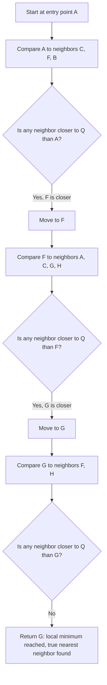

## From Skip Lists to Navigable Small-World Graphs

### Recap: What a Skip List's Trick Actually Depends On

Recall that a skip list gets logarithmic search out of a sorted linked list by stacking sparse "express lanes" over a dense "local lane," where higher levels contain progressively fewer, longer-reaching pointers. That trick depends on one structural fact: the keys sit on a single sorted axis, so "closer to the target" and "farther from the target" are always unambiguous, and a pointer can always be judged as "overshooting" or "undershooting."

An embedding space has no such axis. Recall that an embedding is a fixed-dimensionality vector produced by an embedding model such that geometric proximity (cosine similarity or Euclidean distance) is engineered to track semantic similarity. With two or three dimensions you could still eyeball a rough ordering, but in the dozens-to-thousands of dimensions real embeddings occupy, there is no total order — no single line to walk along, no way to say a candidate vector "overshot" the query the way a linked-list pointer overshoots a target key. The layered-shortcut trick has to be rebuilt from scratch for a *space* instead of a *line*. The structure that generalizes it is a **proximity graph** searched by **greedy routing**, and the specific proximity graph that makes greedy routing actually work well is the **navigable small-world (NSW) graph**.

### Proximity Graphs and Greedy Search

A proximity graph over a set of vectors is simply a graph where each node is a vector and each edge connects two vectors judged "close" by some criterion — most commonly, each node is connected to some small number of its nearest neighbors found by whatever process built the graph. The point of building such a graph at all is to avoid computing the query's distance to every stored vector (the brute-force linear scan); instead, the search only computes distances to a small, connected subset of candidates, hopping from node to node.

**Greedy search** on a proximity graph works like this: start at some designated **entry point**. At each step, examine the current node's neighbors, compute each neighbor's distance to the query, and move to whichever neighbor is closest to the query — but only if that neighbor is closer to the query than the current node is. If no neighbor beats the current node, stop; the current node is returned as the (approximate) answer.

```text
function greedySearch(graph, entryPoint, query):
    current = entryPoint
    loop:
        best = current
        for neighbor in graph.neighbors(current):
            if distance(neighbor, query) < distance(best, query):
                best = neighbor
        if best == current:
            return current   // local minimum reached: no neighbor is closer
        current = best
```

This is structurally the same move a skip list search makes at each level — "keep moving right as long as it helps, otherwise stop and reconsider" — except there is no notion of "levels" yet, and no guarantee about how many hops it takes or how good the answer is. Both of those guarantees have to be earned by how the graph's edges are chosen.

### The Failure Mode: Getting Stuck in a Local Minimum

Suppose the graph is built the "obvious" way: connect every node only to its true nearest neighbors (a $k$-nearest-neighbor graph). This looks reasonable, but greedy search over it can fail badly.

**Worked illustration.** Picture three tight clusters of points far apart in space — call them cluster $\alpha$, $\beta$, $\gamma$ — and a pure $k$-NN graph where every node's edges stay inside its own cluster, because a node's true nearest neighbors are always its cluster-mates. Start greedy search at some node in cluster $\alpha$, with a query vector that actually belongs near cluster $\gamma$. Every neighbor examined at every step is also in cluster $\alpha$, and every one of them is farther from a cluster-$\gamma$ query than the current node roughly is (they're all clustered together, so their distances to a far-away query are all similar). The stopping condition — "no neighbor is closer than the current node" — triggers almost immediately. Greedy search reports some node in cluster $\alpha$ as the answer, when the true nearest neighbor sits in cluster $\gamma$ entirely unreached.

This is a **local minimum** in the same sense the term is used for gradient-based optimization or hill-climbing search in general CS: the algorithm behaves correctly with respect to its immediate neighborhood but has no visibility into distant, better options, because nothing in the graph connects the two regions. A purely local $k$-NN graph is the vector-space analogue of a sorted linked list with *no* express lane at all — technically connected, but only ever one dense, local hop at a time.

### The Small-World Fix: Deliberately Keep Some Long-Range Edges

The fix is the same one the skip list already taught: mix a few long-range shortcuts in with the dense local edges, so that a greedy walk can cover most of the distance to a far-away query in a handful of hops, then switch to fine-grained local hops once it's in the right neighborhood — exactly the express-lane-then-local-lane pattern.

The difference is *how* those long-range edges arise. A skip list manufactures them explicitly, per node, via an independent coin flip that decides a node's height. A navigable small-world graph gets them **for free, as a side effect of the order in which nodes were inserted**, without ever explicitly deciding "this edge is long-range."

**The construction algorithm.** To insert a new vector into the graph:

```text
function insertNSW(graph, newVector, M):
    if graph.isEmpty():
        graph.addNode(newVector)
        graph.entryPoint = newVector
        return
    candidates = greedySearch(graph, graph.entryPoint, newVector)
        // in practice, greedy search here keeps a short candidate list,
        // not just a single running best, so it can return the M closest
        // nodes it encountered along the way
    nearestFound = candidates.takeClosest(M)
    graph.addNode(newVector)
    for node in nearestFound:
        graph.addEdge(newVector, node)   // undirected
```

**Why this produces long-range edges automatically.** Early in construction, the graph has very few nodes, so "the nearest nodes greedy search can find" are, almost by necessity, *not actually close* in absolute terms — there simply isn't anything closer yet. A node inserted third, when only two other nodes exist anywhere in the space, gets wired to those two nodes regardless of how far away they are. That edge becomes a durable long-range shortcut for the rest of the graph's life. Later insertions, once the graph is dense, find genuinely nearby candidates through the same search process and end up with short, local edges instead. No coin flip, no explicit "level" is assigned to any node — the mix of long-range and short-range edges is an emergent consequence of *when* each node happened to arrive, which is precisely why this class of graph is called "navigable small-world": it reproduces the same qualitative property as a Milgram-style social small-world network (most pairs of nodes are connected by a surprisingly short chain of intermediate hops) without anyone designing it in directly.

### Worked Example: Building a Tiny NSW Graph and Tracing a Query

Take eight 2-dimensional points forming three well-separated clusters (two-dimensional so the geometry is easy to check by hand):

- Cluster $\alpha$: $A=(0,0)$, $B=(1,1)$
- Cluster $\beta$: $C=(10,10)$, $D=(11,10)$, $E=(10,11)$
- Cluster $\gamma$: $F=(20,0)$, $G=(21,0)$, $H=(20,1)$

Insert in the order $A, C, F, B, D, G, E, H$, with $M=2$ (each new node connects to the 2 nearest nodes greedy search can find):

1. **Insert $A$.** Graph is empty; $A$ becomes the sole node and the entry point.
2. **Insert $C$.** Only $A$ exists. $C$ connects to $A$ — a long-range edge ($A$ and $C$ are 14.1 units apart), purely because nothing closer was available yet.
3. **Insert $F$.** $A$ and $C$ both exist; $F$ connects to both. Now $A$–$C$–$F$ form a triangle of long-range edges spanning all three future clusters.
4. **Insert $B$.** Greedy search from $A$ finds $A$ itself as very close (distance 1.4) and, while exploring $A$'s neighbors, also touches $C$. With $M=2$, $B$ connects to $A$ (genuinely near — a short edge) and $C$ (a medium-length edge, an artifact of $C$ simply being one of the few nodes reachable at this point in construction).
5. **Insert $D$.** Greedy search quickly reaches $C$ (distance 1) and stays local; $D$ connects to $C$ and $E$'s eventual cluster-mate territory — short, cluster-$\beta$-internal edges.
6. **Insert $G$, $E$, $H$** similarly wire up mostly short, within-cluster edges to $F$ or $C$ respectively, since by now each cluster has enough internal density that greedy search converges locally.

The resulting graph (long-range hub edges shown as dashed, short cluster edges as solid):

<svg xmlns="http://www.w3.org/2000/svg" viewBox="0 0 760 420" font-family="monospace" font-size="14">
<text x="380" y="25" text-anchor="middle" font-size="16" font-weight="bold">Navigable Small-World Graph: Hub Triangle + Local Clusters (svg_diagram)</text>
<line x1="130" y1="330" x2="380" y2="90" stroke="#9ca3af" stroke-width="2" stroke-dasharray="6,4" />
<line x1="130" y1="330" x2="630" y2="330" stroke="#9ca3af" stroke-width="2" stroke-dasharray="6,4" />
<line x1="380" y1="90" x2="630" y2="330" stroke="#9ca3af" stroke-width="2" stroke-dasharray="6,4" />
<line x1="130" y1="330" x2="170" y2="370" stroke="#1f2937" stroke-width="2" />
<line x1="380" y1="90" x2="170" y2="370" stroke="#9ca3af" stroke-width="1.5" stroke-dasharray="3,3" />
<line x1="380" y1="90" x2="430" y2="130" stroke="#1f2937" stroke-width="2" />
<line x1="380" y1="90" x2="400" y2="150" stroke="#1f2937" stroke-width="2" />
<line x1="430" y1="130" x2="400" y2="150" stroke="#1f2937" stroke-width="2" />
<line x1="630" y1="330" x2="670" y2="330" stroke="#1f2937" stroke-width="2" />
<line x1="630" y1="330" x2="650" y2="290" stroke="#1f2937" stroke-width="2" />
<line x1="670" y1="330" x2="650" y2="290" stroke="#1f2937" stroke-width="2" />
<circle cx="130" cy="330" r="22" fill="#dbeafe" stroke="#1f2937" stroke-width="2" />
<text x="130" y="335" text-anchor="middle" font-weight="bold">A</text>
<circle cx="170" cy="370" r="22" fill="#fef9c3" stroke="#1f2937" stroke-width="2" />
<text x="170" y="375" text-anchor="middle" font-weight="bold">B</text>
<circle cx="380" cy="90" r="22" fill="#dbeafe" stroke="#1f2937" stroke-width="2" />
<text x="380" y="95" text-anchor="middle" font-weight="bold">C</text>
<circle cx="430" cy="130" r="22" fill="#fef9c3" stroke="#1f2937" stroke-width="2" />
<text x="430" y="135" text-anchor="middle" font-weight="bold">D</text>
<circle cx="400" cy="150" r="22" fill="#fef9c3" stroke="#1f2937" stroke-width="2" />
<text x="400" y="155" text-anchor="middle" font-weight="bold">E</text>
<circle cx="630" cy="330" r="22" fill="#dbeafe" stroke="#1f2937" stroke-width="2" />
<text x="630" y="335" text-anchor="middle" font-weight="bold">F</text>
<circle cx="670" cy="330" r="22" fill="#fef9c3" stroke="#1f2937" stroke-width="2" />
<text x="670" y="335" text-anchor="middle" font-weight="bold">G</text>
<circle cx="650" cy="290" r="22" fill="#fef9c3" stroke="#1f2937" stroke-width="2" />
<text x="650" y="295" text-anchor="middle" font-weight="bold">H</text>
<text x="30" y="150" font-size="12" fill="#4b5563">dashed = long-range hub edges</text>
<text x="30" y="170" font-size="12" fill="#4b5563">solid = short local/cluster edges</text>
</svg>

**Query trace.** Search for the point nearest to $Q = (20.6, 0.4)$, starting at entry point $A$:

| Step | Node | Distance to $Q$ | Neighbors checked | Move? |
|---|---|---|---|---|
| 1 | $A$ | $\approx 20.51$ | $C\,(\approx 14.16)$, $F\,(\approx 0.72)$, $B\,(\approx 19.51)$ | $F$ is closer → move to $F$ |
| 2 | $F$ | $0.72$ | $A$ (worse), $C$ (worse), $G\,(\approx 0.57)$, $H\,(\approx 0.85)$ | $G$ is closer → move to $G$ |
| 3 | $G$ | $0.57$ | $F$ (worse), $H$ (worse) | no neighbor closer → **stop** |

Greedy search returns $G$, which is in fact the true nearest of all eight points to $Q$. It took exactly **2 hops** and touched **7 distance computations** — but the decisive move was the very first one: the single long-range edge $A$–$F$ let the walk jump across nearly the entire space in one step, after which two short local hops (through $F$'s cluster-internal edges) refined the answer. This is the identical two-phase pattern as the skip list's express-hop-then-local-hop search, produced here entirely by insertion-order accident rather than by any explicit "level" mechanism.

Contrast this with the pure $k$-NN graph from the local-minimum illustration above: without the $A$–$F$ edge, greedy search from $A$ would have compared only $A$, $B$, and $C$ — all far from $Q$ — declared one of them "locally optimal," and returned a wrong answer, never discovering cluster $\gamma$ existed.



### Why This Works: Informal Intuition, and Its Honest Limits

The intuition for why greedy search over an NSW graph tends to need only a small number of hops mirrors the classic small-world network argument: because a handful of early-inserted nodes end up wired across large portions of the space (the $A$–$C$–$F$ hub triangle above), most long-distance jumps a query needs can be satisfied by traversing just one or two of these accidental long-range edges, after which the query is already in the right neighborhood and only needs a few short local hops to converge — the same qualitative shape as $O(\log n)$ behavior, since each hop tends to roughly close a large fraction of the remaining distance rather than inching forward linearly.

It is worth being precise about what kind of claim this is, in contrast to the skip list result. [Unverified] Unlike the skip list's backward-analysis argument, which yields a clean expected-$O(\log n)$ bound derivable from the geometric height distribution, navigable small-world graphs do not have an equivalently clean, widely-accepted formal proof that greedy search always achieves logarithmic hop count in general — the hub structure that makes search fast is an emergent property of insertion order and graph density rather than a designed invariant with a matching probability calculation, and search quality can degrade as the graph grows very large or as the few early "hub" nodes become disproportionately high-degree bottlenecks. This is a genuinely open, implementation-and-scale-dependent question rather than a settled theorem, which is different in kind from the well-established skip list guarantee.

### Where This Falls Short, and What Comes Next

Two concrete problems remain even with the small-world property in hand:

- **The long/short split is implicit, not controllable.** A skip list can *decide* how many levels to use and how sparse each level should be, because heights are assigned by an explicit, tunable coin-flip probability. An NSW graph's long-range edges are whatever insertion order happened to produce — there's no dial to turn if the hub structure that emerged isn't well-shaped for the eventual dataset size.
- **High-degree hub nodes become a bottleneck.** As more nodes accumulate, the earliest-inserted hub nodes keep collecting edges (since later greedy searches keep passing through them), and searching their growing neighbor lists becomes increasingly expensive — a single flat graph has no mechanism to keep this from concentrating on a few congested nodes.

Both problems point toward the same fix a skip list already models: **make the long-range/short-range separation explicit again, as distinct levels, rather than letting it emerge implicitly from one flat graph.** That is exactly what HNSW (Hierarchical Navigable Small World) does — it takes the greedy-routing-over-a-proximity-graph idea developed here and layers multiple NSW-style graphs on top of one another, sparse at the top and dense at the bottom, restoring the skip list's explicit, tunable hierarchy while keeping the graph-based (rather than linear-order-based) routing this item introduced.

**Key Points**
- A sorted-line structure like a skip list can't generalize directly to vector space because there's no total order — the generalization is a proximity graph searched by greedy routing.
- Greedy search moves to whichever neighbor is closest to the query and stops at a local minimum; on a purely local $k$-NN graph, this local minimum is often wrong, because there's no path to distant regions of the space.
- Navigable small-world graphs fix this by having some edges be long-range, but — unlike a skip list's explicit, coin-flip-assigned levels — the long-range/short-range split emerges automatically from insertion order: early nodes get wired to whatever exists yet, which is necessarily far away.
- The worked example showed a single long-range edge collapsing most of the search distance in one hop, followed by short local hops to converge — the same two-phase pattern as a skip list, arrived at without any explicit levels.
- NSW's search-time behavior lacks as rigorous a formal guarantee as the skip list's expected-$O(\log n)$ bound, and its implicit hub structure creates a scaling bottleneck — the motivation for HNSW's explicit layering.

**Related Topics**
- HNSW's explicit layered hierarchy, built from stacked NSW-style graphs
- The step-by-step HNSW query algorithm across layers
- The $M$ and $ef$ construction/query parameters governing graph degree and search breadth
- Build cost versus query cost tradeoffs in graph-based ANN indexes
- Sub-linear scaling behavior of HNSW compared to brute-force linear scan