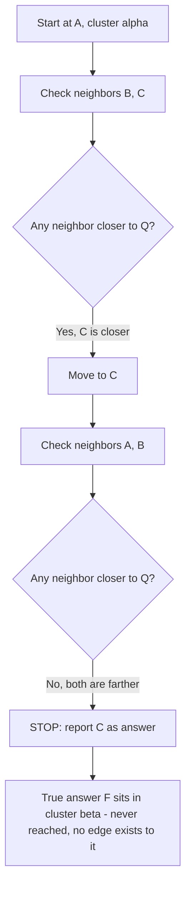

## What "Greedy Routing" Means as a Search Strategy, and Why It Can Get Stuck Without a Layered Structure

### Greedy Routing as a General Algorithmic Pattern

"Greedy" here means exactly what it means anywhere else in algorithms: at each decision point, make the locally best choice available, without backtracking and without looking ahead to see whether that choice is globally optimal. A greedy scheduling algorithm picks the next-earliest-deadline job without checking whether that choice ruins a later, better schedule. Greedy routing over a graph of vectors applies the identical discipline to navigation: standing at some node, look only at that node's immediate neighbors, move to whichever one improves the objective (distance to the query) the most, and never reconsider a move once made.

Recall that a proximity graph connects each vector to some small set of other vectors judged "close" to it, and that greedy search on such a graph starts at a designated entry point and repeatedly hops to the neighbor closest to the query, stopping when no neighbor improves on the current node. Formally:

```text
function greedySearch(graph, entryPoint, query):
    current = entryPoint
    loop:
        best = current
        for neighbor in graph.neighbors(current):
            if distance(neighbor, query) < distance(best, query):
                best = neighbor
        if best == current:
            return current   // no improving move exists — stop
        current = best
```

Two properties define this as a genuinely greedy algorithm rather than, say, a full graph traversal like breadth-first search: it commits to a move as soon as an improving neighbor is found (or, in a common variant, always to the *best* improving neighbor, but never revisits a rejected alternative), and it maintains no memory of alternatives once it moves past them. That second property — no memory, no backtracking — is exactly what will turn out to be the source of the failure mode this item covers.

### The Formal Notion: Local Optimum vs. Global Optimum

Borrow the vocabulary directly from general optimization and hill-climbing search, since greedy routing on a graph is a discrete instance of the same idea. Define, for a query $q$ and a node $v$ with neighbor set $N(v)$:

$$v \text{ is a local optimum for } q \iff \text{dist}(v, q) \le \text{dist}(u, q) \ \ \forall u \in N(v)$$

That is, $v$ is at least as close to $q$ as every node directly reachable from $v$ in one hop. The **global optimum** is the node $v^*$ across the *entire graph* that minimizes $\text{dist}(v^*, q)$. Every global optimum is trivially a local optimum (if it weren't, some neighbor would beat it, contradicting global optimality) — but the converse is false, and that gap is the entire problem. A local optimum is only guaranteed correct with respect to what it can *see*: its own edge list. It has no way to know whether a much better answer exists three hops away through a region of the graph its neighbors don't touch.

This is the same structural gap as a local minimum in continuous gradient-based optimization: a point where every nearby direction is worse, but which is not the lowest point overall, because the surface has multiple basins separated by ridges the local search can't see over. Greedy routing on a graph is hill-climbing on a discrete surface defined by "distance to $q$," where the graph's edges are the only directions the climber is permitted to check.

### Why a Local Optimum Isn't Just Bad Luck — It's Structural

The critical point is that this isn't a matter of an occasional unlucky query. It follows mechanically from the two ingredients above: greedy routing's no-backtracking rule, plus a graph whose edges only encode strictly local proximity. If every edge only ever connects a node to things that are already near it, then the graph itself simply contains no path out of a tight cluster toward a distant region — there is no edge to take that would even let the search *consider* moving farther away in service of eventually getting closer. The search doesn't fail because it made a bad choice; it fails because the only choices ever offered to it were choices that stay local.

**Worked example.** Build a graph purely from mutual $k$-nearest-neighbors ($k=2$) over three well-separated clusters of 2-dimensional points (low dimensionality on purpose, to make the geometry checkable by hand):

- Cluster $\alpha$: $A=(0,0)$, $B=(1,0)$, $C=(0,1)$
- Cluster $\beta$: $D=(50,50)$, $E=(51,50)$, $F=(50,51)$

Each point's 2 true nearest neighbors are always its cluster-mates (the clusters are 70+ units apart, so no cross-cluster pair is ever anyone's nearest neighbor). The resulting graph:

<svg xmlns="http://www.w3.org/2000/svg" viewBox="0 0 700 300" font-family="monospace" font-size="14">
<text x="350" y="25" text-anchor="middle" font-size="16" font-weight="bold">Pure k-NN Graph: No Edge Between Clusters (svg_diagram)</text>
<line x1="120" y1="150" x2="220" y2="90" stroke="#1f2937" stroke-width="2" />
<line x1="120" y1="150" x2="220" y2="210" stroke="#1f2937" stroke-width="2" />
<line x1="220" y1="90" x2="220" y2="210" stroke="#1f2937" stroke-width="2" />
<line x1="480" y1="150" x2="580" y2="90" stroke="#1f2937" stroke-width="2" />
<line x1="480" y1="150" x2="580" y2="210" stroke="#1f2937" stroke-width="2" />
<line x1="580" y1="90" x2="580" y2="210" stroke="#1f2937" stroke-width="2" />
<circle cx="120" cy="150" r="22" fill="#dbeafe" stroke="#1f2937" stroke-width="2" />
<text x="120" y="155" text-anchor="middle" font-weight="bold">A</text>
<circle cx="220" cy="90" r="22" fill="#dbeafe" stroke="#1f2937" stroke-width="2" />
<text x="220" y="95" text-anchor="middle" font-weight="bold">B</text>
<circle cx="220" cy="210" r="22" fill="#dbeafe" stroke="#1f2937" stroke-width="2" />
<text x="220" y="215" text-anchor="middle" font-weight="bold">C</text>
<circle cx="480" cy="150" r="22" fill="#fef9c3" stroke="#1f2937" stroke-width="2" />
<text x="480" y="155" text-anchor="middle" font-weight="bold">D</text>
<circle cx="580" cy="90" r="22" fill="#fef9c3" stroke="#1f2937" stroke-width="2" />
<text x="580" y="95" text-anchor="middle" font-weight="bold">E</text>
<circle cx="580" cy="210" r="22" fill="#fef9c3" stroke="#1f2937" stroke-width="2" />
<text x="580" y="215" text-anchor="middle" font-weight="bold">F</text>
<text x="350" y="155" text-anchor="middle" font-size="20" fill="#dc2626">✕</text>
<text x="300" y="250" text-anchor="middle" font-size="12" fill="#4b5563">no edge exists between the clusters at all</text>
</svg>

Query for $Q = (50, 52)$, starting greedy search at $A$:

| Step | Node | dist to $Q$ | Neighbors checked | Move? |
| --- | --- | --- | --- | --- |
| 1 | $A$ | $71.6$ | $B\,(71.4)$, $C\,(70.7)$ | $C$ is closer → move to $C$ |
| 2 | $C$ | $70.7$ | $A$ (worse, $71.6$), $B\,(71.4,$ worse$)$ | no neighbor closer → **stop** |

The algorithm reports $C$ as the answer. The true nearest neighbor is $F$, at distance $1.4$ — roughly 50 times closer — and it is never even examined, because no path in the graph leads out of cluster $\alpha$ at all. This is not the search making a mistake; every step it took was the locally correct move. The graph itself is the problem: it has no edge encoding "these two regions of the space are both worth checking against each other."



### Why "No Layered Structure" Is the Precise Diagnosis

It's worth being specific about what's missing, because the fix has to target exactly this gap. The failure above is not caused by greedy routing itself being a bad strategy in general — recall that a navigable small-world graph made greedy routing work well precisely by ensuring a few edges reach far across the space, so that a greedy walk can cover most of the distance to a distant query in one or two hops before switching to fine local refinement. Greedy routing works fine as long as *some* edge, at *some* point along the path, offers a long enough jump to escape the current region. The $k$-NN graph above fails specifically because every single edge, at every node, only ever encodes short-range proximity — there is no tier of edges built for covering distance, only the tier built for precision.

This is exactly the two-tier distinction a skip list makes explicit through its levels (a sparse express lane for covering distance, a dense local lane for precision) and that a navigable small-world graph makes implicit through insertion-order accident (a few incidentally long edges from early nodes, plus a mass of genuinely local edges from later ones). Both structures solve the local-optimum problem the same way: by guaranteeing that *some* subset of edges exists whose job is specifically to jump across large regions of the space, decoupled from the subset of edges whose job is to refine the answer once nearby. A flat $k$-NN graph has only the second kind of edge and none of the first, which is why greedy routing on it is structurally guaranteed to stall inside whatever cluster it starts in whenever the query's true answer lies in a different, disconnected-by-proximity region.

**The general principle this establishes:** greedy routing is only as good as the graph it's given permission to walk. A flat, purely-local proximity graph offers greedy routing no way to trade a small amount of "getting farther" for a large amount of eventual "getting closer," because every available move is locally monotonic toward whatever is nearby right now. Escaping a local optimum requires *some* edges in the graph that are not locally optimal to have at all — edges that exist specifically to connect distant regions, layered conceptually on top of (or, in NSW's case, mixed probabilistically among) the dense local edges that do the fine-grained work.

### Setting Up the Next Step: Making the Layering Explicit and Tunable

Recall that navigable small-world graphs solve this by mixing long-range and short-range edges within a single flat graph, with the mixture emerging implicitly from insertion order rather than being explicitly designed. That solves the local-optimum problem the worked example above illustrates, but leaves two costs unaddressed: the long/short split isn't tunable (there's no way to decide in advance how many long-range edges a given dataset size should have), and the earliest-inserted hub nodes accumulate disproportionate degree as the graph grows, becoming a bottleneck every query has to pass through.

The natural next move, and the one the skip list already modeled cleanly, is to stop mixing long-range and short-range edges together in one graph and instead separate them into **explicit layers** — a sparse top layer built almost entirely from long-range connections for covering distance quickly, and progressively denser layers below it for local refinement, with a formal, tunable rule (rather than insertion-order accident) governing how many nodes appear at each layer. That explicit, multi-layer generalization of greedy routing over a navigable small-world graph is precisely what HNSW (Hierarchical Navigable Small World) is.

**Key Points**

- Greedy routing moves to the best-improving neighbor at each step, never backtracks, and stops the instant no neighbor improves — the same discipline as any greedy algorithm, applied to graph navigation.
- A local optimum is a node at least as close to the query as all its direct neighbors; every global optimum is a local optimum, but not vice versa, and greedy routing can only ever detect local optimality, never global optimality.
- On a purely local proximity graph (e.g., a mutual $k$-NN graph), greedy routing is structurally guaranteed to stall inside whichever cluster it starts in whenever the true answer lies in a disconnected region — this is a property of the graph's edge set, not a rare unlucky outcome.
- The fix requires edges whose specific purpose is to jump across large regions of the space, decoupled from the edges whose purpose is local refinement — the same two-tier idea a skip list makes explicit through levels and an NSW graph makes implicit through insertion-order accident.
- This motivates making that layering explicit and tunable rather than leaving it to insertion-order accident, which is the design step HNSW takes.

**Related Topics**

- HNSW's explicit layered hierarchy and how layer membership is assigned per node
- The step-by-step HNSW query algorithm, descending from sparse to dense layers
- The $M$ and $ef$ parameters controlling graph degree and search breadth
- Build cost versus query cost tradeoffs in graph-based ANN indexes
- Sub-linear scaling behavior of HNSW relative to brute-force linear scan