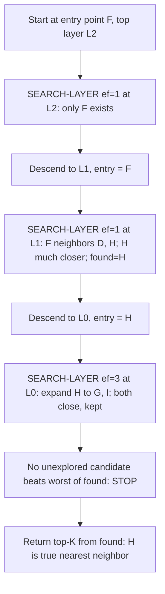

## Walking Through a Full HNSW Query Step by Step: Entering at the Top Layer, Greedily Descending, and Refining the Answer at the Bottom Layer

### Recap: The Structure Being Queried

Recall that an HNSW index is a stack of navigable-small-world-style proximity graphs, numbered from a sparse top layer $L$ down to a dense bottom layer $0$, where layer $0$ contains every indexed vector and each higher layer contains a shrinking, randomly-selected subset of nodes, with strict containment (a node present at layer $i$ is also present at every layer below it). Recall also that greedy search on any one of these graphs means: starting from some node, repeatedly hop to whichever neighbor is closest to the query, and stop once no neighbor improves on the current position — a search that is only as good as the graph it's allowed to walk, since it can never see past its immediate neighbor list.

A full HNSW query stitches these single-layer greedy searches together into one top-to-bottom pass, using the sparse layers to travel long distances cheaply and the dense bottom layer to do the precise work.

### The Two-Phase Shape of a Query, and Why It Splits This Way

An HNSW query is not one uniform search — it deliberately behaves differently at the top than at the bottom, for a reason worth stating explicitly before looking at the algorithm itself.

**Upper layers (from $L$ down to layer $1$): find a good starting point, not the final answer.** At every layer above $0$, the search only needs to produce *one* reasonably good node to serve as the entry point for the next layer down — it is not trying to identify the true nearest neighbor yet, because the upper layers don't even contain most of the dataset to compare against. Because only a single best candidate is needed, this phase keeps a candidate list of size $1$: at each layer, move to the closest neighbor found, descend, repeat.

**The bottom layer (layer $0$): do the actual work.** Layer $0$ holds every vector, so it is the only layer capable of producing a genuinely accurate answer. Here, the search keeps a wider list of the best candidates seen so far — of size $ef$ (a search-breadth parameter set by the caller; a full discussion of how to tune it belongs with HNSW's other construction/query parameters, not here) — so that instead of committing to a single local optimum, it explores enough of the neighborhood to return a high-quality set of near-neighbors rather than just whichever one happened to be found first.

This split is the direct payoff of the layered structure: the expensive, wide-candidate-list search only ever runs once, at the one layer where precision actually matters, while all the distance-covering work in the sparse layers above it is done with the cheapest possible search (candidate list of size 1).

### The Algorithm, Formally

Both phases are implemented with the same underlying routine, `SEARCH-LAYER`, differing only in the candidate-list size `ef` passed to it.

```text
function SEARCH-LAYER(q, entryPoints, ef, layer):
    visited = set(entryPoints)
    candidates = minHeap(entryPoints, keyed by distance to q)   // to explore
    found = maxHeap(entryPoints, keyed by distance to q)        // best ef found so far
    while candidates is not empty:
        c = candidates.popClosest()
        f = found.peekFarthest()
        if distance(c, q) > distance(f, q) and |found| >= ef:
            break   // nothing left in candidates can possibly improve `found`
        for e in neighbors(c, layer):
            if e not in visited:
                visited.add(e)
                f = found.peekFarthest()
                if distance(e, q) < distance(f, q) or |found| < ef:
                    candidates.push(e)
                    found.push(e)
                    if |found| > ef:
                        found.popFarthest()
    return found
```

```text
function HNSW-SEARCH(hnsw, q, K, efSearch):
    ep = hnsw.entryPoint                    // the single node at the top layer
    L  = hnsw.topLayer
    for lc = L downto 1:
        W  = SEARCH-LAYER(q, {ep}, ef=1, layer=lc)
        ep = W.closest()                     // becomes the entry point one layer down
    W = SEARCH-LAYER(q, {ep}, ef=efSearch, layer=0)
    return W.takeClosest(K)
```

The stopping condition inside `SEARCH-LAYER` (`distance(c,q) > distance(f,q) and |found| >= ef`) is exactly the generalization of the single-node greedy stopping rule ("no neighbor is closer than the current node") to a list of $ef$ candidates: once the closest *unexplored* candidate is already farther than the current worst kept answer, and the answer set is full, nothing left to explore can possibly improve it, so the search halts.

### Worked Example: A Full Trace Across Three Layers

Take nine 2-dimensional points (low-dimensional deliberately, so every distance is hand-checkable) in three clusters:

- Cluster $\alpha$: $A=(0,0)$, $B=(1,1)$, $C=(2,0)$
- Cluster $\beta$: $D=(20,20)$, $E=(21,21)$, $F=(20,22)$
- Cluster $\gamma$: $G=(40,0)$, $H=(41,1)$, $I=(40,2)$

Layer assignment (mirroring the exponential-decay shape a real index produces, simplified to fixed values for the example): **layer 2** contains only $F$ (the entry point); **layer 1** contains $\{A, D, F, H\}$, connected in a cycle $A$–$D$–$F$–$H$–$A$; **layer 0** contains all nine nodes, with each cluster internally connected ($A$–$B$–$C$–$A$, $D$–$E$–$F$–$D$, $G$–$H$–$I$–$G$) plus the same four bridge edges from layer 1 ($A$–$D$, $D$–$F$, $F$–$H$, $H$–$A$) carried down, since every node's neighbor list exists independently at each layer it participates in.

Query $Q = (41, 0.5)$ — its true nearest neighbor is clearly $H = (41,1)$, at distance $0.5$.

**Phase 1 — layer 2 (ef = 1).** The only node is $F$; nothing to search. `W = {F}`, `ep = F`.

**Phase 1 — layer 1 (ef = 1), starting at $F$.**

| Step | Pop from candidates | dist to $Q$ | Neighbors examined | Update to `found` (size 1) |
|---|---|---|---|---|
| 1 | $F=(20,22)$ | $30.05$ | $D=(20,20)$: $28.66$; $H=(41,1)$: $0.50$ | $D$ closer → `found={D}`; then $H$ closer → `found={H}` |
| 2 | $H$ (dist $0.50$, now closest unexplored) | — | $F$ (visited); $A=(0,0)$: $41.01$, not closer than $H$ → discarded | `found={H}` unchanged |
| 3 | $D$ (dist $28.66$) | — | $28.66 > 0.50$ and `\|found\|≥1` → **stop** | — |

Result: `W = {H}`, so `ep = H` for the next layer down.

**Phase 2 — layer 0 (ef = 3), starting at $H$.**

| Step | Pop from candidates | dist to $Q$ | Neighbors examined | Update to `found` (size ≤ 3) |
|---|---|---|---|---|
| 1 | $H=(41,1)$ | $0.50$ | $G=(40,0)$: $1.12$; $I=(40,2)$: $1.80$; $F$: $30.05$ | $\lvert found\rvert<3$ so add $G$, add $I$ → `found={H,G,I}`; $F$ is farther than the current worst ($I{=}1.80$) and `\|found\|=3=ef` → discarded |
| 2 | $G$ (dist $1.12$) | — | $H$ (visited), $I$ (already found) — nothing new | unchanged |
| 3 | $I$ (dist $1.80$) | — | $G$, $H$ (both visited) — nothing new | unchanged |
| — | candidates empty → **stop** | | | |

Result: `W = {H(0.50), G(1.12), I(1.80)}`. Returning top-$K{=}1$ gives $H$ — the true global nearest neighbor — found by touching only 3 of the 9 nodes at layer 0, after the upper layers routed the search directly into cluster $\gamma$ in a single long hop.

<svg xmlns="http://www.w3.org/2000/svg" viewBox="0 0 900 480" font-family="monospace" font-size="13">
<text x="450" y="22" text-anchor="middle" font-size="16" font-weight="bold">HNSW Query Trace: Layer 2 to Layer 0 (svg_diagram)</text>

<text x="20" y="75" font-weight="bold">L2</text>
<rect x="90" y="55" width="760" height="40" fill="none" stroke="#d1d5db" stroke-dasharray="3,3" />
<circle cx="480" cy="75" r="16" fill="#b91c1c" stroke="#1f2937" stroke-width="2" />
<text x="480" y="80" text-anchor="middle" fill="white" font-size="11">F</text>
<line x1="480" y1="75" x2="480" y2="145" stroke="#b91c1c" stroke-width="2" />

<text x="20" y="155" font-weight="bold">L1</text>
<rect x="90" y="135" width="760" height="40" fill="none" stroke="#d1d5db" stroke-dasharray="3,3" />
<circle cx="160" cy="155" r="16" fill="#93c5fd" stroke="#1f2937" stroke-width="2" />
<text x="160" y="160" text-anchor="middle" font-size="11">A</text>
<circle cx="420" cy="155" r="16" fill="#93c5fd" stroke="#1f2937" stroke-width="2" />
<text x="420" y="160" text-anchor="middle" font-size="11">D</text>
<circle cx="480" cy="155" r="16" fill="#b91c1c" stroke="#1f2937" stroke-width="2" />
<text x="480" y="160" text-anchor="middle" fill="white" font-size="11">F</text>
<circle cx="740" cy="155" r="16" fill="#b91c1c" stroke="#1f2937" stroke-width="2" />
<text x="740" y="160" text-anchor="middle" fill="white" font-size="11">H</text>
<line x1="160" y1="155" x2="420" y2="155" stroke="#1f2937" stroke-width="1.5" />
<line x1="420" y1="155" x2="480" y2="155" stroke="#1f2937" stroke-width="1.5" />
<line x1="480" y1="155" x2="740" y2="155" stroke="#b91c1c" stroke-width="3" />
<line x1="740" y1="155" x2="160" y2="155" stroke="#1f2937" stroke-width="1.5" stroke-dasharray="0" />
<line x1="740" y1="155" x2="740" y2="225" stroke="#b91c1c" stroke-width="2" />

<text x="20" y="235" font-weight="bold">L0</text>
<text x="20" y="252" font-size="11" fill="#4b5563">(all)</text>
<rect x="90" y="215" width="760" height="170" fill="none" stroke="#d1d5db" stroke-dasharray="3,3" />
<circle cx="140" cy="260" r="15" fill="#dbeafe" stroke="#1f2937" stroke-width="1.5" />
<text x="140" y="265" text-anchor="middle" font-size="10">A</text>
<circle cx="190" cy="320" r="15" fill="#dbeafe" stroke="#1f2937" stroke-width="1.5" />
<text x="190" y="325" text-anchor="middle" font-size="10">B</text>
<circle cx="240" cy="260" r="15" fill="#dbeafe" stroke="#1f2937" stroke-width="1.5" />
<text x="240" y="265" text-anchor="middle" font-size="10">C</text>
<circle cx="400" cy="260" r="15" fill="#dbeafe" stroke="#1f2937" stroke-width="1.5" />
<text x="400" y="265" text-anchor="middle" font-size="10">D</text>
<circle cx="450" cy="320" r="15" fill="#dbeafe" stroke="#1f2937" stroke-width="1.5" />
<text x="450" y="325" text-anchor="middle" font-size="10">E</text>
<circle cx="480" cy="260" r="15" fill="#dbeafe" stroke="#1f2937" stroke-width="1.5" />
<text x="480" y="265" text-anchor="middle" font-size="10">F</text>
<circle cx="670" cy="260" r="15" fill="#16a34a" stroke="#1f2937" stroke-width="2" />
<text x="670" y="265" text-anchor="middle" fill="white" font-size="10">G</text>
<circle cx="740" cy="260" r="16" fill="#b91c1c" stroke="#1f2937" stroke-width="2" />
<text x="740" y="265" text-anchor="middle" fill="white" font-size="10">H</text>
<circle cx="790" cy="320" r="15" fill="#16a34a" stroke="#1f2937" stroke-width="2" />
<text x="790" y="325" text-anchor="middle" fill="white" font-size="10">I</text>
<circle cx="880" cy="270" r="14" fill="none" stroke="#7c3aed" stroke-width="2" stroke-dasharray="3,2" />
<text x="880" y="255" text-anchor="middle" font-size="10" fill="#7c3aed">Q</text>
<line x1="140" y1="260" x2="190" y2="320" stroke="#1f2937" stroke-width="1" />
<line x1="140" y1="260" x2="240" y2="260" stroke="#1f2937" stroke-width="1" />
<line x1="190" y1="320" x2="240" y2="260" stroke="#1f2937" stroke-width="1" />
<line x1="400" y1="260" x2="450" y2="320" stroke="#1f2937" stroke-width="1" />
<line x1="400" y1="260" x2="480" y2="260" stroke="#1f2937" stroke-width="1" />
<line x1="450" y1="320" x2="480" y2="260" stroke="#1f2937" stroke-width="1" />
<line x1="670" y1="260" x2="740" y2="260" stroke="#16a34a" stroke-width="3" />
<line x1="670" y1="260" x2="790" y2="320" stroke="#1f2937" stroke-width="1" />
<line x1="740" y1="260" x2="790" y2="320" stroke="#16a34a" stroke-width="3" />
<line x1="140" y1="260" x2="400" y2="260" stroke="#1f2937" stroke-width="1" />
<line x1="480" y1="260" x2="740" y2="260" stroke="#b91c1c" stroke-width="3" />
<line x1="740" y1="260" x2="140" y2="260" stroke="#1f2937" stroke-width="1" />

<text x="90" y="410" font-size="12" fill="#4b5563">Red = greedy descent path (F, L2 to L1 to L0 entry at H). Green = layer-0 candidate-list expansion (H, G, I returned).</text>
</svg>



### Why This Two-Phase Design Is the Payoff of the Whole Hierarchy

Trace the total work done: 1 comparison at layer 2 (trivial), roughly 3 distance computations at layer 1, and roughly 3 more at layer 0 — a handful of comparisons against a 9-node dataset. That ratio only improves at real scale: recall that layer population shrinks geometrically going up the hierarchy, so the upper-layer phase (ef = 1, cheapest possible search) is doing the expensive part of the job — crossing most of the distance to the right region of the vector space — using only a tiny fraction of the total nodes, while the layer-0 phase (the only place a wider, more expensive $ef$-sized search runs) only has to search a small local neighborhood once it's already been routed there. This is the direct payoff of stacking sparse layers over a dense one rather than running one flat, wide-candidate-list search over the whole graph: precision-costing work (large $ef$) is confined to the one layer where it's actually necessary, and the layers that merely need to cover distance use the cheapest possible search the whole way down.

It's also worth naming precisely what made this example work: had the graph at layer 1 not included a long bridge edge reaching from the $\beta$-cluster region ($F$, $D$) across to the $\gamma$-cluster region ($H$), the layer-1 greedy descent would have stalled near $D$ and $F$ with no way to discover that a much better answer existed elsewhere — the same local-optimum failure mode that occurs whenever a greedy search is only given locally-proximal edges to walk. The upper layers only work because their sparsity forces exactly the kind of long-range connectivity that solves that problem, which is why layer height cannot be assigned arbitrarily — it has to follow the geometric-decay process that reliably produces a well-connected sparse skeleton at the top.

### What's Deliberately Left for Other Items

This item establishes the mechanics of a query's control flow — entry point, single-candidate descent, wide-candidate refinement, and how the two phases hand off to each other. It does not derive why this produces sub-linear scaling as $n$ grows (a separate cost-analysis item), does not examine what $M$ (the per-node connectivity limit) and $ef$ actually control during construction versus during search or how to tune them, and does not compare the cost of building this structure against the cost of querying it once built. Each of those builds directly on the query walk traced here.

**Key Points**
- An HNSW query has two distinct phases: a cheap, single-candidate ($ef{=}1$) greedy descent through the sparse upper layers to find a good entry point, followed by a wider, $ef$-sized candidate-list search at the dense bottom layer to produce the actual answer.
- Both phases use the same `SEARCH-LAYER` routine, differing only in `ef`; the stopping condition generalizes single-node greedy search's "no neighbor improves" rule to "no unexplored candidate can possibly improve the current best $ef$ found."
- The worked trace showed a long bridge edge at the sparse layer 1 routing the search directly into the correct cluster in a single hop, after which a small, cheap expansion at layer 0 confirmed the true nearest neighbor by touching only 3 of 9 total nodes.
- The two-phase design is the direct payoff of the layered hierarchy: expensive, wide-candidate work is confined to the one layer where precision matters, while all the distance-covering work above it runs at minimum cost.

**Related Topics**
- The $M$, `efConstruction`, and `efSearch` parameters: what each controls and how to tune them
- Build cost versus query cost in HNSW, and why construction is more expensive than search
- Sub-linear scaling behavior of HNSW relative to brute-force linear scan as $n$ grows
- How neighbor lists are selected and pruned during insertion (the heuristic that decides which candidates actually become edges)