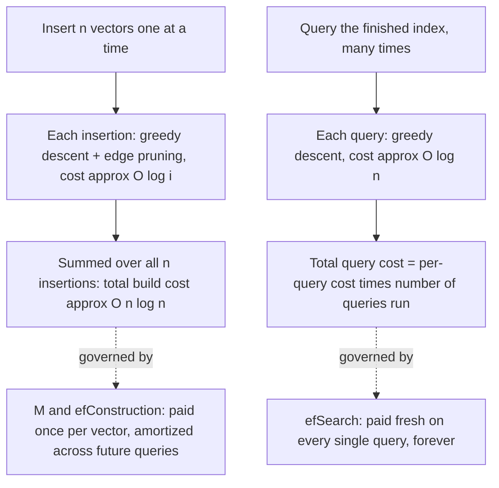

## HNSW Build Cost Versus HNSW Query Cost as Two Separate Quantities That Trade Off Against Each Other

### Why These Two Costs Need to Be Pulled Apart

Recall that HNSW's per-query cost was shown to be roughly $O(\log n)$ against an already-built index, composing a logarithmic number of layers with a per-layer cost bounded by fixed constants $M$ and $ef$. That analysis deliberately treated the index as a finished, static artifact — the way analyzing binary search treats a sorted array as already sorted, without accounting for the cost of sorting it. But an HNSW index doesn't arrive pre-built; it is constructed by inserting vectors one at a time, and each insertion does real, nontrivial work. Build cost and query cost are genuinely separate quantities, measured differently, paid at different times, and — critically — controllable by different, sometimes conflicting, sets of parameters. Conflating them is the same category error as conflating a database's write throughput with its read latency: both matter, but optimizing one is not the same problem as optimizing the other, and a schema tuned purely for fast reads (heavy indexing) typically makes writes slower, and vice versa.

### Build Cost: What Happens When a Vector Is Inserted

Recall that inserting a new node into a navigable small-world graph means running a greedy search to find nearby candidates, then wiring the new node to some of them. HNSW's insertion procedure is exactly this, applied per layer: to insert a new vector, first draw its maximum layer $\ell$ from the exponential-decay distribution, then, starting from the current top-layer entry point, greedily descend layer by layer exactly as a query does — except at every layer from $\ell$ downward (not just at layer 0), the search runs with a build-time candidate-list width, `efConstruction`, and the resulting nearby candidates become the new node's edges at that layer.

```text
function INSERT-HNSW(hnsw, newVector, M, efConstruction):
    ell = drawLayerFromExponentialDecay(hnsw.mL)
    ep = hnsw.entryPoint
    L  = hnsw.topLayer
    for lc = L downto ell + 1:
        W  = SEARCH-LAYER(newVector, {ep}, ef=1, layer=lc)
        ep = W.closest()                       // descend without connecting
    for lc = min(L, ell) downto 0:
        W = SEARCH-LAYER(newVector, {ep}, ef=efConstruction, layer=lc)
        neighbors = selectNeighbors(W, M)       // prune down to M edges
        addBidirectionalEdges(newVector, neighbors, lc)
        for each neighbor n in neighbors:
            if |n.edges at layer lc| > Mmax:
                pruneWorstEdge(n, lc)           // keep each node's degree bounded
        ep = W                                  // candidates carry into next layer down
    if ell > L:
        hnsw.entryPoint = newVector
        hnsw.topLayer = ell
```

Two costs are paid per insertion: the greedy-search cost to find candidates at each layer from $\ell$ down to $0$ (structurally identical to a query's descent, just with `efConstruction` substituted for `efSearch`), and the edge-pruning cost of keeping every touched node's degree bounded at $M_{\max}$ (so that no node, however central, accumulates unbounded edges over the index's lifetime — this is the same bounded-degree discipline that prevented flat NSW's hub-bottleneck problem from recurring here).

### The Total Build Cost Is Worse Than Query Cost, by a Factor of $n$

Recall that a single query against an already-built index costs roughly $O(\log n)$. A single *insertion* costs about the same order — it is, after all, a query-shaped graph descent plus a bounded amount of edge bookkeeping, so one insertion is also $O(\log n \cdot M \cdot ef_{\text{construction}})$, the same asymptotic family as a query.

The difference is that building the whole index means performing this operation once for **every one of the $n$ vectors being inserted** — and, crucially, most of that work happens against a partially-built, and typically much smaller, index at the time of insertion. Summing insertion cost across all $n$ insertions:

$$T_{\text{build}}(n) = \sum_{i=1}^{n} O(\log i) = O(n \log n)$$

This is the same asymptotic shape as sorting a list comparison-by-comparison, or as building a balanced binary search tree one insertion at a time — a single operation is cheap ($O(\log n)$), but doing it $n$ times to build the whole structure costs $O(n \log n)$ in total, which is **not sub-linear**. Recall that sub-linear scaling specifically describes the cost of *one query* against a finished index; it says nothing about the cost of producing that index in the first place, and $O(n \log n)$ total build cost grows faster than linear, not slower.

**Worked comparison.** Take $c=1$ cost-unit per $\log$ factor for simplicity (illustrative units, not calibrated to any real system):

| $n$ | Per-query cost $\approx \log_2 n$ | Total build cost $\approx n\log_2 n$ | Build cost ÷ single-query cost |
| --- | --- | --- | --- |
| $1{,}000$ | $\approx 10$ | $\approx 9{,}966$ | $\approx 1{,}000\times$ |
| $1{,}000{,}000$ | $\approx 20$ | $\approx 19{,}931{,}569$ | $\approx 1{,}000{,}000\times$ |
| $1{,}000{,}000{,}000$ | $\approx 30$ | $\approx 29{,}897{,}352{,}854$ | $\approx 1{,}000{,}000{,}000\times$ |

The ratio of build cost to single-query cost tracks $n$ itself almost exactly, which is the expected shape: build cost is (per-insertion cost) $\times n$, roughly, so it inherits an extra factor of $n$ that pure query cost never pays. This is why an HNSW index is something you build once (or incrementally amortize) and then query many, many times — the economics only work out if the number of queries run against a built index vastly exceeds $n$ itself.

### The Parameters Governing Each Cost, and Where They Conflict

Three parameters shape this tradeoff, and it matters that they are not all pulling in the same direction:

- **$M$** (edges per node per layer, and $M_{\max}$, the hard cap): a larger $M$ produces a denser, more richly connected graph, which tends to improve recall and can shorten query paths — but every edge added at insertion time is itself extra work during construction (more candidates to prune, more bidirectional edges to write, more neighbor lists to maintain), and every stored edge is extra memory, permanently, for the life of the index (recall memory scales as $O(n \cdot M)$). $M$ costs build time and memory to buy query quality.
- **`efConstruction`** (candidate-list width used only during insertion): a wider `efConstruction` lets each insertion consider more candidates before choosing its $M$ edges, generally producing a better-connected, higher-quality graph — at the direct, linear cost of more distance computations per insertion, which multiplies straight through the $O(n \log n)$ build-cost sum above. This parameter affects build cost only; it has no effect on the cost of running a query after the index already exists.
- **`efSearch`** (candidate-list width used only during querying): a wider `efSearch` explores more candidates at the bottom layer per query, generally improving recall at the direct cost of more comparisons per query — but this cost is paid fresh, every single query, for the life of the index. It has no effect on how expensive the index was to build.

The asymmetry is the point worth internalizing: `efConstruction` is a cost paid once per vector, amortized across however many future queries that vector participates in; `efSearch` is a cost paid on every single query, forever. A system expecting to serve an enormous number of queries against a comparatively static, rarely-rebuilt index can afford to spend generously on `efConstruction` (better graph quality, paid once) while keeping `efSearch` modest — but a system with a small, frequently-rebuilt index and few queries per rebuild faces the opposite calculus, where build cost dominates the total cost of ownership and is worth minimizing even at some recall expense.



### Why This Distinction Matters for Reasoning About Total System Cost

This split is exactly the kind of distinction that separates a clean theoretical bound from the actual, engineered cost of operating a real system — the same distinction that came up when separating "cost of one query against a finished index" from "cost of building that index." Neither number alone answers the practically important question, which is closer to: *given an expected number of insertions and an expected number of queries over the system's lifetime, where does the total cost actually concentrate, and which parameter is worth spending on to reduce it?* A workload dominated by insertions (a graph under constant, heavy write pressure) weighs build-cost parameters heavily; a workload dominated by queries against a comparatively fixed dataset weighs query-cost parameters heavily. Treating "HNSW cost" as one undifferentiated number obscures exactly the tradeoff a system designer needs to reason about.

**Key Points**

- Insertion reuses the same layer-by-layer greedy-descent mechanism as a query, but runs at every layer from the node's assigned height down to $0$ (not just at layer 0), using `efConstruction` as its candidate-list width, and additionally performs edge selection and degree-bounded pruning.
- A single insertion costs about the same order as a single query, $O(\log n)$ — but building an entire index sums this cost across all $n$ insertions, giving total build cost $O(n\log n)$, which is not sub-linear and grows strictly faster than the per-query cost.
- $M$/$M_{\max}$ and `efConstruction` are build-time costs paid once per vector and amortized over however many future queries use that vector; `efSearch` is a query-time cost paid fresh on every single query for the life of the index — they are not interchangeable levers, and optimizing one does not optimize the other.
- Whether build cost or cumulative query cost dominates a system's total cost of ownership depends on the ratio of insertions to queries the index will actually see over its lifetime, not on either cost model in isolation.

**Related Topics**

- Insertion cost as a function of existing structure size, and the distinction between a theoretical bound and an empirically measured cost curve
- The neighbor-selection heuristic used during insertion to choose which candidates become permanent edges
- Recall@k as the accuracy measure that `efConstruction` and `efSearch` are ultimately being traded against
- Why brute-force and embedding-threshold insertion remain linear while an ANN index changes the shape of the growth-cost curve