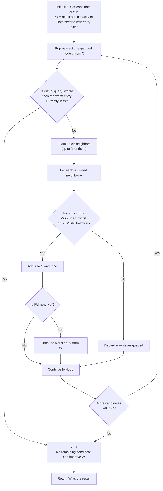

## The Parameters M and ef Explained Concretely: What Each One Controls, and What Happens to Accuracy and Speed as You Turn Each Dial

### Recap: Where These Two Dials Sit in HNSW

Recall that HNSW (Hierarchical Navigable Small World) is a multi-layer graph index: each layer is a navigable small-world graph, higher layers hold exponentially fewer nodes and act as express lanes, and a query is answered by greedy routing — starting at the top layer's entry point, repeatedly hopping to whichever neighbor is closest to the query vector, dropping down a layer whenever no neighbor improves the distance, until layer 0 (the bottom layer, which holds every node in the dataset) is reached and the final candidates are read off.

Two numbers, chosen before you build or query the index, determine almost everything about how well and how fast that routing works:

- $M$ — a build-time constant that shapes the graph's connectivity.
- $ef$ — a knob (with two variants) that shapes how thoroughly the greedy search explores whatever graph $M$ produced.

A useful frame: $M$ decides the shape of the road network you build; $ef$ decides how many alternate routes your GPS is willing to keep checking before it commits to an answer.

### M: The Maximum Node Degree

**Definition.** For a given node at a given layer, $M$ is the maximum number of bidirectional edges that node is allowed to keep to other nodes at that same layer.

**Analogy.** Think of a router's forwarding table with a fixed number of slots. A router doesn't need a direct line to every other router on the internet — it needs enough well-chosen neighbors that a packet can always be handed off in a generally better direction. $M$ is that slot count, applied per node per layer.

**How the M edges get chosen.** When a node is inserted, the construction procedure finds a pool of nearby candidate nodes at that layer (the size of this pool is controlled by `efConstruction`, covered below), then keeps only up to $M$ of them using a neighbor-selection heuristic that favors both proximity and directional diversity, so a node's neighbors don't all cluster on one side of it, leaving other directions unreachable. [Inference: the exact heuristic weighting differs slightly across implementations such as hnswlib and FAISS, since the original paper describes the heuristic's goals precisely but leaves some tuning choices open.]

**Layer 0 gets extra room.** In the standard design, layer 0 — the layer holding every single node — is allowed up to $M_{max0}$ neighbors, commonly set to $2M$. This is because layer 0 is the fallback layer where the actual final answer is always read off, so it needs denser local connectivity than the sparser upper layers, which exist only to skip long distances quickly.

**What turning M up does:**

| Effect | Direction as $M$ increases |
| --- | --- |
| Memory per node | Grows roughly linearly — each node stores up to $M$ (or $2M$ at layer 0) neighbor pointers per layer it belongs to |
| Build time | Increases — more candidates are evaluated per insertion, and inserting a new node can trigger re-pruning of existing nodes' neighbor lists when a better edge becomes available |
| Recall | Improves, with diminishing returns — more edges per node means fewer "dead ends," i.e., fewer cases where the greedy walk has nowhere better to go even though a better node exists elsewhere in the graph |
| Query latency (per node visited) | Slightly increases — visiting a node with more neighbors means more distance computations at that hop, though this can be partly offset by needing fewer total hops |

Commonly cited practical ranges for $M$ fall around 5 to 48, with harder datasets (higher intrinsic dimensionality, less clustered structure) benefiting from values on the higher end. [Unverified: these are empirical guidelines drawn from benchmark practice, not a guarantee for any specific dataset.]

The important structural point: $M$ is baked into the graph at build time. Changing your mind about $M$ later means rebuilding the index, not adjusting a query-time setting.

### ef: The Candidate List Size During Search

**Definition.** $ef$ controls the size of the bounded, dynamic candidate list that greedy search keeps "alive" while exploring a layer. It comes in two variants:

- **`efConstruction`** — used only while building the index. It sets how large a candidate pool the neighbor-selection heuristic gets to choose each new node's up-to-$M$ edges from. A larger `efConstruction` means better-informed edge choices (and thus a generally more navigable graph), but it does not itself change how many final edges a node keeps — that ceiling is $M$'s job.
- **`efSearch`** (often just written $ef$) — used at query time. It sets how many candidates the search keeps comparing before finalizing the top-$k$ result at layer 0.

**The mechanism, concretely.** The standard search-layer procedure keeps two structures: a candidate queue $C$ (a min-heap, ordered by distance to the query, of nodes still worth expanding) and a result set $W$ (a max-heap, bounded to size $ef$, holding the best candidates found so far). The loop:

**Analogy.** This is structurally a beam search: $ef$ is the beam width. A wider beam keeps more partial hypotheses (candidate nodes) alive simultaneously, so a branch that looks mediocre right now doesn't get permanently discarded before it's had a chance to lead somewhere better.

**What turning ef up does:**

- **Recall improves, with diminishing returns.** A wider live candidate set means the search is less likely to commit prematurely to a path that looks locally best but is globally wrong.
- **Latency and distance computations rise roughly with $ef$**, since more live candidates generally means more neighbor expansions.
- **$ef$ has a hard floor of $k$** (the number of results requested) — you cannot return more results than you tracked.
- **`efSearch` is a per-query knob.** Unlike $M$, it requires no rebuild — a single index can be queried with a small $ef$ for a fast, lower-recall path and a large $ef$ for a slow, higher-recall path, sometimes even varying it per query based on how much accuracy that query needs.

### A Fully Worked Example: The Same Query, Two Different ef Values

This is a small, hand-constructed graph built to isolate exactly the mechanism $ef$ protects against — it is not the output of running the real HNSW insertion procedure on this data, only a valid $M=2$ graph (no node exceeds 2 neighbors) used for tracing purposes.

**Nodes and their distance to the query $Q$:**

| Node | Role | Distance to $Q$ |
| --- | --- | --- |
| $A$ | entry point | $10.0$ |
| $B$ | looks promising, but a dead end | $7.0$ |
| $Z$ | looks worse initially, but is the only path onward | $9.219$ |
| $F$ | $B$'s only other neighbor, also a dead end | $8.062$ |
| $D$ | $Z$'s neighbor — the true nearest neighbor | $0.707$ |

Edges ($M=2$, each node keeps at most 2): $A\text{–}B$, $A\text{–}Z$, $B\text{–}F$, $Z\text{–}D$.

**Trace with $ef=1$:**

1. Start at $A$ (10.0). Expand its neighbors $B$ (7.0) and $Z$ (9.219). $B$ is checked first and, since it beats $A$, is added — $W=\{B\}$.
2. $Z$ is checked next, but by now the worst (and only) entry in $W$ is already $B$ (7.0), and $Z$'s distance (9.219) is worse than that. Because $ef=1$ leaves no room to keep an underperforming-but-promising candidate around, $Z$ is discarded on the spot — it never even enters the candidate queue.
3. Expanding $B$'s only unvisited neighbor $F$ (8.062) doesn't beat $B$ either, so nothing is added.
4. The candidate queue empties. **Result: $B$, distance 7.0.** The true nearest neighbor $D$ (distance 0.707) is never found, because the only path to it ran through $Z$, and $Z$ was pruned the instant a locally-better-looking dead end appeared.

**Trace with $ef=3$:**

1. Expanding $A$: this time $W$ has room for 3 entries, so both $B$ (7.0) and $Z$ (9.219) survive into $W=\{A, B, Z\}$.
2. Expanding $B$ adds $F$ (8.062); $W$ now exceeds capacity and drops its worst entry — but that worst entry is $Z$ (9.219), which gets evicted from $W$. Critically, however, $Z$ remains in the separate candidate queue $C$, so it hasn't been abandoned, only demoted from the "current best" list.
3. Expanding $F$ adds nothing new.
4. Eventually $Z$ is popped from $C$ for expansion. At this moment, $W$'s current worst entry happens to still be a mediocre node ($A$, at 10.0) that hasn't been evicted yet — and since $Z$'s distance (9.219) is still better than that worst entry, the stop condition doesn't fire, and $Z$ gets expanded.
5. Expanding $Z$ reveals $D$ (0.707), which trivially beats everything in $W$ and is added. **Result: $D$, distance 0.707 — the correct answer.**

The lesson generalizes past this toy graph: increasing $ef$ doesn't just "keep more final answers," it keeps the exploration frontier open longer, giving indirect or shortcut paths — like the one through $Z$ — enough time to be reached before the search commits to stopping. In practice, with real embeddings and real-sized graphs, this same effect shows up statistically as a smooth recall-vs-$ef$ curve rather than a single dramatic miss, but the underlying mechanism is identical to what this trace shows step by step.

### Visualizing the Toy Graph

<svg xmlns="http://www.w3.org/2000/svg" viewBox="0 0 520 320" font-family="sans-serif">
<text x="260" y="24" text-anchor="middle" font-size="15" font-weight="bold" fill="#222">M=2 Toy Graph — Node Distances to Query Q (svg_diagram)</text>
<line x1="70" y1="230" x2="190" y2="130" stroke="#888" stroke-width="2" />
<line x1="70" y1="230" x2="330" y2="230" stroke="#888" stroke-width="2" />
<line x1="190" y1="130" x2="190" y2="50" stroke="#888" stroke-width="2" />
<line x1="330" y1="230" x2="430" y2="90" stroke="#888" stroke-width="2" />
<circle cx="70" cy="230" r="26" fill="#dbe9ff" stroke="#2b5fa8" stroke-width="2" />
<text x="70" y="226" text-anchor="middle" font-size="14" font-weight="bold">A</text>
<text x="70" y="242" text-anchor="middle" font-size="11">10.0</text>
<circle cx="190" cy="130" r="26" fill="#ffe8d1" stroke="#c07a2b" stroke-width="2" />
<text x="190" y="126" text-anchor="middle" font-size="14" font-weight="bold">B</text>
<text x="190" y="142" text-anchor="middle" font-size="11">7.0</text>
<circle cx="190" cy="50" r="26" fill="#eeeeee" stroke="#777777" stroke-width="2" />
<text x="190" y="46" text-anchor="middle" font-size="14" font-weight="bold">F</text>
<text x="190" y="62" text-anchor="middle" font-size="11">8.062</text>
<circle cx="330" cy="230" r="26" fill="#e3d9ff" stroke="#6a3fc4" stroke-width="2" />
<text x="330" y="226" text-anchor="middle" font-size="14" font-weight="bold">Z</text>
<text x="330" y="242" text-anchor="middle" font-size="11">9.219</text>
<circle cx="430" cy="90" r="28" fill="#d6ffe0" stroke="#2b8a4a" stroke-width="3" />
<text x="430" y="86" text-anchor="middle" font-size="14" font-weight="bold">D</text>
<text x="430" y="102" text-anchor="middle" font-size="11">0.707</text>

<text x="430" y="40" text-anchor="middle" font-size="11" fill="`#2b8a4a`" font-weight="bold">true nearest to Q</text>

<text x="260" y="300" text-anchor="middle" font-size="11" fill="#555">ef=1 stops at B; ef=3 reaches D via the B→dead-end, then Z→D branch</text>

</svg>

### Turning Both Dials Together

$M$ and $ef$ are partial substitutes, not independent knobs:

- A **larger `efConstruction`** gives the neighbor-selection heuristic a bigger pool to pick each node's $M$ edges from, which tends to produce a graph with fewer local optima like $B$ in the trace above — meaning a smaller $efSearch$ can get away with more.
- A **larger $M$** likewise reduces the odds that any given node is a dead end, for the same reason: more edges means more chances that at least one of them heads in a genuinely useful direction.
- **Neither substitution is free.** $M$ trades memory and build time; `efConstruction` trades build time; `efSearch` trades query latency. A system that "fixes" a low-recall problem by cranking `efSearch` at query time is paying a per-query latency cost indefinitely, whereas fixing it via $M$ pays a one-time (but recurring on every insert) build cost.

A rough intuition for the combined memory footprint per node:

$$\text{edges per node} \approx M \times (\text{layers above 0 that this node belongs to}) + M_{max0}$$

Since most nodes belong to only layer 0 (the probability of being promoted to a higher layer shrinks geometrically with height), this sum is dominated by $M_{max0} = 2M$ for the overwhelming majority of nodes, which is why total index memory scales close to linearly in $M$ rather than exploding with layer count.

**Key Points**

- $M$ is baked into the graph at build time; it mainly trades memory and build time for structural recall headroom (fewer dead ends to begin with).
- `efConstruction` only matters during building — it improves the *quality* of the $M$ edges chosen, without changing how many there are.
- `efSearch` (commonly just called $ef$) is the one knob that can be changed per query, with no rebuild — it trades query latency for the ability to keep more branches alive and escape local optima.
- Recall as a function of either $M$ or $ef$ follows a concave, diminishing-returns curve — pushing either dial past a certain point buys progressively less accuracy for progressively more cost, which is why production tuning targets a recall level empirically rather than maximizing either number.

**Conclusion**

$M$ decides the shape of the map available to the search; $ef$ decides how carefully the search is willing to look at that map before answering. Because the two only partially substitute for each other — one spent at build time, one spent at query time — reporting a system's accuracy or speed without stating both values is close to meaningless: the same graph queried with $ef=1$ and $ef=200$ can behave like two entirely different indexes. This distinction matters directly for the notion of insertion cost developed later in Chapter 07: The Cost of Growing a Structure: Fusing the Vector Track and the Amortization Track, where an ANN-index insertion strategy that looks sub-linear on paper can quietly require a growing $ef$ to hold its recall steady as the graph scales — a real cost that a bound stated only in terms of $M$ would miss entirely.

**Related Topics**

- The neighbor-selection heuristic itself: how it balances proximity against directional diversity when pruning down to $M$ edges
- Recall@k as a formal evaluation metric, and how it's measured against an exact brute-force ground truth
- Empirical recall-latency curves and how practitioners choose an operating point on them
- How `efConstruction`, $M$, and dataset dimensionality jointly affect index build time in practice
- The distinction between a build-time cost and a query-time cost, generalized beyond HNSW to other incremental structures