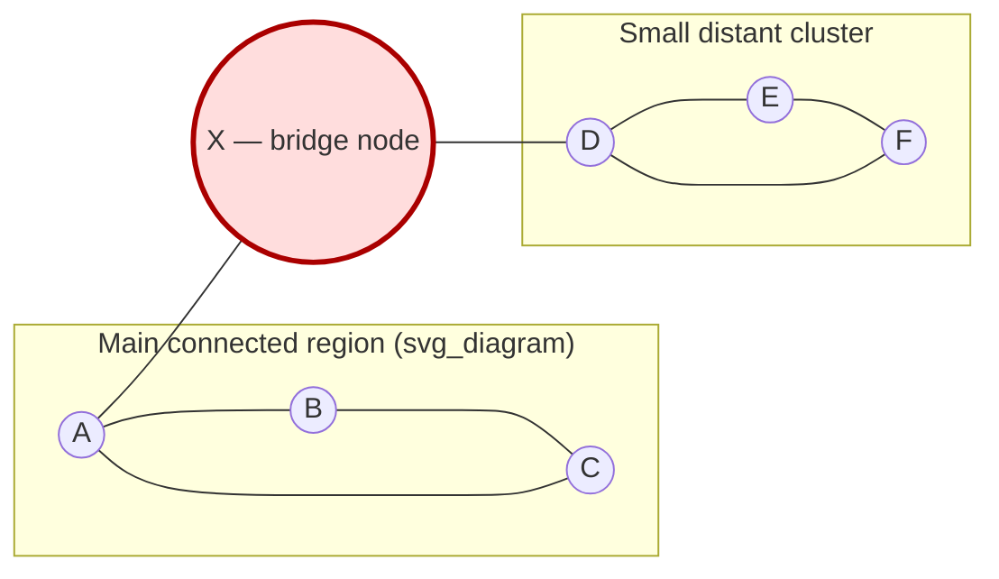

## Where HNSW Can Go Wrong in Practice: Recall Loss, Graph Connectivity Issues, and the Cost of Inserting into an Already-Built Index

### Framing: HNSW's Guarantees Are Weaker Than They Look

Recall that HNSW (Hierarchical Navigable Small World) answers a query by greedy routing through a multi-layer graph, using the bounded candidate list `efSearch` to control how thoroughly each layer is explored before descending. Recall also that HNSW is fundamentally an *approximate* nearest-neighbor method: unlike brute-force linear scan, it carries no worst-case correctness guarantee. The published theory behind navigable small-world graphs establishes that greedy routing *tends* to find good results with high probability under certain structural assumptions, but there is no theorem stating "this query will return the true top-$k$." Everything in this item is about the gap between that probabilistic tendency and what actually happens on real, evolving data.

This item groups the practical failure modes into three families: ones that erode *recall* even on a well-built, static graph; ones that come from *connectivity* damage to the graph's structure itself; and ones that come specifically from the *cost of insertion* as the graph keeps growing. The first two are about answer quality; the third is about the resource bill.

### Failure Family 1: Recall Loss on an Otherwise Healthy Graph

**Local optima the search never escapes.** The core recall failure mode in HNSW is the same one worked through in the $M$/$ef$ item: greedy search can get trapped at a node that looks locally best even though a much better node is one indirect hop further away. A small `efSearch` makes this worse because the candidate list has no room to keep a mediocre-looking detour alive long enough to discover what's past it. This isn't a bug to be "fixed" — it's the structural price of approximate search, and it is why recall is always reported as a statistic over many queries, never as a per-query guarantee.

**Distribution mismatch between build-time and query-time data.** HNSW's graph structure is shaped entirely by whatever data existed when each edge was formed. If the vectors inserted later come from a meaningfully different region of the embedding space or a different density profile than what came before — for example, a document corpus that starts as one language and later mixes in a second language whose embeddings cluster in a different sub-region — queries landing in the newer, sparser region may find that the graph's "express lanes" (the upper layers) were shaped for the *old* distribution and route new queries inefficiently. [Inference: this failure mode is a natural consequence of HNSW's layer assignment being decided once, at insertion time, per node, without any mechanism to later re-balance layer structure toward a changed distribution.]

**Filtered search interacting badly with $ef$.** In real systems, nearest-neighbor search is rarely unconditional — a query commonly comes with a metadata filter, e.g., "find the nearest neighbors that were created after Tuesday." If the filter is applied only *after* the top-$ef$ candidates are retrieved rather than during graph traversal, a highly restrictive filter can eliminate almost every candidate the search found, leaving far fewer than $k$ usable results even though better matches genuinely exist elsewhere in the graph. Some implementations address this with filter-aware traversal; naive implementations simply return a degraded, small result set. [Unverified: exact filtering strategy and its recall impact vary substantially by library — hnswlib, FAISS, and vector-database-specific HNSW implementations all handle this differently.]

**Recall degrading under concurrent modification.** If a system allows deletes and inserts to happen concurrently with queries, a query's greedy walk can be routed through a node that gets logically deleted mid-traversal (common implementations use "tombstoning" — marking a node deleted without immediately removing its edges — precisely to avoid a full graph rewrite on every delete). A query that routes through a tombstoned node still uses its edges for navigation but must exclude it from the final result, which can silently shrink the effective candidate pool below what `efSearch` intended.

### Failure Family 2: Graph Connectivity Damage

This family is structural rather than statistical — it's about the graph itself becoming pathologically shaped, in ways that hurt every subsequent query through the damaged region, not just an unlucky one.

**Orphaned or under-connected nodes from deletion.** Deleting a node naively — simply removing it and its edges — can strand its former neighbors. Concretely: suppose node $X$ was the *only* bridge between a small cluster of five nodes and the rest of the graph (this can happen when $M$ is small and a cluster is geometrically distant from the rest of the dataset). If $X$ is deleted and its edges are simply dropped, those five nodes become reachable only from each other — any query entering the graph from the usual entry point can no longer route into that cluster at all, regardless of how large $ef$ is set. This is why production-grade implementations favor tombstoning over immediate structural deletion: the tombstoned node's edges are kept alive for *routing* purposes even though the node itself is excluded from results, preserving connectivity until an explicit graph-rebuild or repair pass can properly re-link the orphaned region.

**Layer-0 disconnection.** Because layer 0 is the only layer guaranteed to contain every node, its connectivity is what ultimately determines whether *any* correct answer is even reachable. Aggressive deletion, or insertion patterns that repeatedly evict useful edges during neighbor-list pruning (the same up-to-$M$ pruning step used at insertion time also runs when an existing node's neighbor list would benefit from replacing an edge with a newly inserted, closer node), can over time thin out layer 0 in specific regions faster than in others, creating locally sparse pockets that behave like the orphaned-cluster case above but without a single identifiable cause — more a gradual erosion than a single dropped edge.

**Entry-point fragility.** The single node designated as the top-layer entry point is a structural bottleneck: essentially every query's traversal begins there. If that node is deleted, the index must select a new entry point, typically by picking another node present at the current top layer. [Unverified: exact re-election policy is implementation-specific.] Poorly handled entry-point replacement — for example, falling back to an arbitrary node rather than one confirmed to still be well-connected at the top layer — can degrade the average quality of *every* query's starting position at once, since a single degraded entry point affects the whole index rather than one region of it.

**Layer-assignment skew.** Each new node is probabilistically assigned to a random maximum layer (commonly using an exponentially decaying distribution, so most nodes land only at layer 0 and progressively fewer reach each higher layer). Because this is a random draw per node, an unlucky sequence of insertions can, by chance, leave an upper layer either too sparse to route efficiently or unevenly distributed across the vector space — for instance, all upper-layer nodes happening to cluster in one geometric region, leaving queries near a different region with a much longer path down to layer 0 than the layered design intends. This is a probabilistic risk rather than a certainty, and its severity shrinks as the total node count grows, but it is a genuine source of variance in smaller or moderately sized indexes.

### Diagram: A Bridge Node Deletion Fragmenting the Graph

Deleting node $X$ by simply removing it and its edges severs the only path from `MainGraph` into `Cluster` — nodes $D$, $E$, and $F$ become permanently unreachable from the entry point even though they still physically exist in the index, unless a repair or rebuild pass explicitly re-links them.

### Failure Family 3: The Cost of Inserting into an Already-Built Index

**What a single insertion actually does.** Inserting a new node $v$ is not a constant-time pointer append. The procedure: (1) greedily route down from the top layer to find good entry candidates at each layer, the same descent logic used for queries; (2) at each layer $v$ is assigned to (down through layer 0), search for a pool of nearby candidates (sized by `efConstruction`) and run the neighbor-selection heuristic to choose up to $M$ edges for $v$; (3) — and this is the expensive, easy-to-underestimate part — for *each* of $v$'s new neighbors, check whether adding $v$ as *their* neighbor would exceed *their* own edge budget ($M$, or $M_{max0}$ at layer 0); if so, that existing node's neighbor list must be re-pruned, potentially dropping an edge it previously held to make room. A single insertion can therefore trigger a cascade of small re-pruning operations across multiple existing nodes, not just the addition of edges to the new node.

**Cost grows with the density of the region being inserted into, not with total graph size directly.** Because the search-and-prune work described above is bounded by $M$ and `efConstruction` rather than by the total node count $n$, a single insertion's direct cost is close to independent of $n$ in principle — this is the entire structural reason HNSW insertion is often described as roughly logarithmic rather than linear in $n$. In practice, however, insertions into a densely populated region of the vector space involve more candidate comparisons during the layer-0 search step (more nodes competing to be in the top-$ef$ set) than insertions into a sparse region, so the *constant factor* behind that near-logarithmic cost is not uniform across the space — it is a genuine, measurable variation, not just noise. [Inference: this density-dependent constant factor is a direct consequence of the search-layer procedure's candidate-queue mechanics, though its exact magnitude is dataset-specific and best measured empirically rather than derived analytically.]

**No global rebalancing.** Unlike a self-balancing tree, HNSW performs no global restructuring in response to insertions — each insertion only touches the small local neighborhood it lands in. This is precisely what keeps individual insertions cheap, but it also means the graph has no built-in mechanism to correct accumulated structural drift (the distribution-mismatch and connectivity-erosion problems from the two families above). Over a long enough stream of insertions and deletions, quality can degrade gradually with no single insertion being expensive enough to trigger a fix — the only real remedy is a periodic full rebuild from the current dataset, which *is* linear-time (or worse) in $n$, concentrated into one large maintenance operation rather than smoothed across insertions.

**Concurrency cost under simultaneous insertion.** Because inserting $v$ can modify the neighbor lists of multiple existing nodes, concurrent insertions that happen to land near each other can contend for the same nodes' neighbor-list locks, and a naive locking scheme can serialize what should be independent work. Production implementations typically use fine-grained, per-node locking rather than a single global lock precisely to keep unrelated insertions from blocking each other, but this adds implementation complexity relative to a simpler bulk-build path where the whole graph is constructed offline in one pass.

**Practical implication for growth-cost comparisons.** The insertion cost described here — search-and-prune per insertion, roughly independent of $n$ but density-dependent, with no global rebalancing — is the concrete mechanism behind the claim, developed further in Chapter 07: The Cost of Growing a Structure: Fusing the Vector Track and the Amortization Track, that an ANN-index insertion strategy changes the *shape* of the growth-cost curve relative to brute-force or embedding-threshold insertion. It is important going into that comparison to recognize that "roughly independent of $n$" is an empirical tendency shaped by $M$, `efConstruction`, and local density — not a proven worst-case bound the way an amortized-analysis theorem would state one.

### Table: Failure Mode Summary

| Failure Mode | Family | Root Cause | Typical Mitigation |
|---|---|---|---|
| Local-optimum stalls | Recall loss | Greedy search commits before finding a better indirect path | Increase `efSearch` |
| Distribution drift | Recall loss | Later data differs from data the graph structure was shaped by | Periodic rebuild or re-indexing |
| Post-filter over-pruning | Recall loss | Metadata filter applied after candidate retrieval, not during traversal | Filter-aware traversal, larger `efSearch` |
| Orphaned clusters | Connectivity | Naive deletion removes a bridge node's edges | Tombstoning instead of hard deletion |
| Layer-0 erosion | Connectivity | Repeated re-pruning gradually thins specific regions | Periodic connectivity audit / rebuild |
| Entry-point fragility | Connectivity | Single structural bottleneck for all queries | Careful re-election policy on deletion |
| Layer-assignment skew | Connectivity | Random per-node layer draw, unlucky at small $n$ | Self-corrects as $n$ grows; rebuild if severe |
| Cascading re-pruning cost | Insertion cost | New node's neighbors must themselves stay within $M$ | Inherent to the algorithm; tune $M$ |
| Density-dependent constant factor | Insertion cost | Denser regions mean larger candidate pools during insertion search | Empirical profiling per dataset region |
| Lock contention | Insertion cost | Concurrent insertions modifying shared neighbor lists | Fine-grained per-node locking |

**Key Points**
- Recall loss, connectivity damage, and insertion cost are three distinct failure families with different root causes — a fix for one (e.g., raising `efSearch` for recall) does nothing for the others (e.g., an orphaned cluster from deletion).
- HNSW carries no worst-case correctness guarantee; every failure mode here is a probabilistic tendency, which is why production systems monitor recall empirically rather than trusting a theoretical bound.
- Deletion is the single riskiest operation for connectivity, which is why tombstoning (soft deletion that preserves routing edges) is the standard mitigation over immediate structural removal.
- Insertion cost is close to independent of total graph size but is not constant — local data density is a real, measurable driver of per-insertion cost.

**Conclusion**
HNSW's practical failure surface is best understood as the cost of the design choices that make it fast in the first place: no worst-case guarantee is what buys sub-linear expected query time; local-only updates on insertion are what keep individual insertions cheap; and both of these choices leave the door open to gradual, hard-to-detect degradation that only a global rebuild fully corrects. This tension between local cheapness and global correctness is exactly the lens Chapter 07: The Cost of Growing a Structure: Fusing the Vector Track and the Amortization Track uses to compare ANN-index insertion against brute-force and embedding-threshold insertion as the underlying graph scales — and it is also the reason Chapter 09: Building and Maintaining Knowledge Graphs Incrementally treats graph drift under streaming updates as a first-class systems concern rather than an edge case.

**Related Topics**
- Tombstoning and periodic compaction strategies in HNSW-based vector databases
- Filter-aware ANN search (pre-filtering vs. post-filtering vs. hybrid traversal)
- Empirical recall benchmarking methodology: ground-truth computation via brute-force and recall@k measurement
- Index rebuild scheduling strategies for streaming or continuously updated vector stores
- How graph drift under streaming updates connects to entity resolution challenges in incremental knowledge graph construction