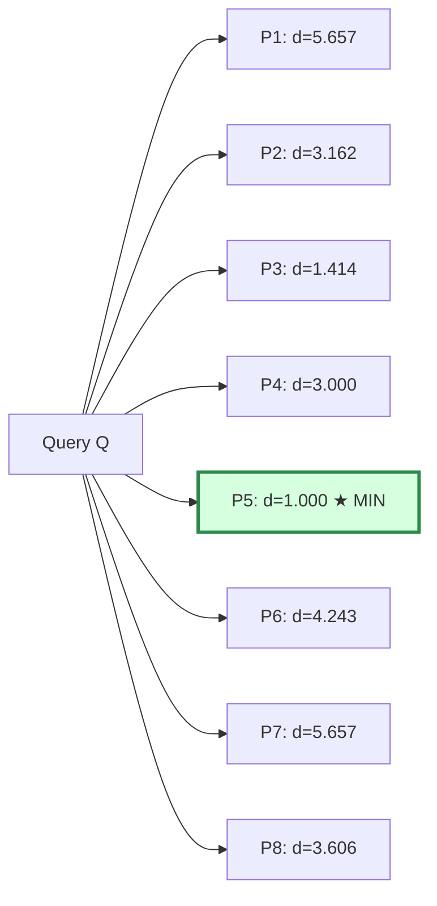
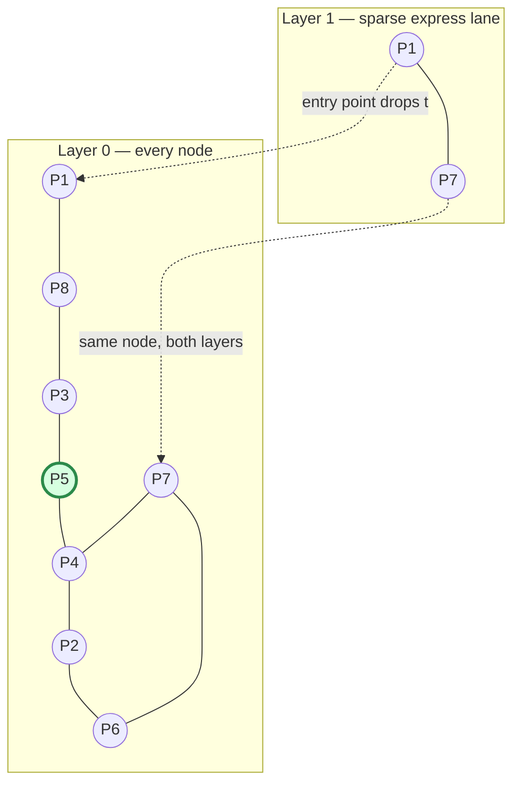

## Comparing Brute-Force Search, a Single Flat Index, and HNSW Side by Side on the Same Conceptual Query to Make the Tradeoffs Tangible

### Why This Comparison Needs a Shared Frame

The chapters up to this point have introduced brute-force linear scan, and then approximate methods culminating in HNSW, largely as separate ideas. This item does not introduce new mechanisms — it puts three concrete search strategies through the *exact same* query on the *exact same* small dataset, so the cost and accuracy tradeoffs stop being abstract claims and become something traced by hand. The three strategies:

1. **Brute-force linear scan** — compare the query against every vector, no index structure at all.
2. **A single flat index** — a term worth defining precisely, since it's easy to conflate with brute force.
3. **HNSW** — the layered graph structure built in this chapter.

**Defining "flat index" precisely, since it's the one term here without an obvious everyday analogy.** In vector-search terminology, a "flat" index is not a separate algorithm from brute-force scan — it *is* brute-force scan, just organized as a formal index type in libraries like FAISS. The word "flat" contrasts with "hierarchical" or "clustered": a flat index stores every vector in one undifferentiated array with no internal structure, tree, or graph layered on top. Calling it an "index" at all is mostly a naming convention for API consistency — a flat index still examines every stored vector on every query, exactly like the brute-force scan discussed in Chapter 03: Exact Nearest-Neighbor Search and Why It Doesn't Scale. For the purposes of this comparison, treat "brute-force scan" and "flat index" as the same underlying strategy, and list them separately only because real systems expose them as separately named options — the interesting three-way contrast in this item is really flat/brute-force versus HNSW, examined carefully enough to show *why* they cost what they cost.

### The Shared Dataset and Query

A small, concrete dataset of 8 two-dimensional vectors, plus a query point $Q$:

| Node | Coordinates | Distance to $Q = (5, 5)$ |
|---|---|---|
| $P_1$ | $(1, 1)$ | $5.657$ |
| $P_2$ | $(2, 6)$ | $3.162$ |
| $P_3$ | $(4, 4)$ | $1.414$ |
| $P_4$ | $(5, 8)$ | $3.000$ |
| $P_5$ | $(6, 5)$ | $1.000$ |
| $P_6$ | $(8, 2)$ | $4.243$ |
| $P_7$ | $(9, 9)$ | $5.657$ |
| $P_8$ | $(3, 2)$ | $3.606$ |

Task: find the single nearest neighbor to $Q$. By inspection of the full distance column, the true answer is $P_5$, distance $1.000$.

Two-dimensional coordinates and 8 points are used deliberately, per the "simple before complex" principle — every step below can be checked by hand, and the same three procedures apply unchanged to embeddings with 768 or 1536 dimensions and millions of points; only the *scale* of the cost changes, not the mechanism.

### Strategy 1: Brute-Force Linear Scan / Flat Index

**Procedure.** Compute the distance from $Q$ to every one of the 8 points, keep a running minimum, return it.

**Cost.** Exactly 8 distance computations — one per point, no exceptions, no shortcuts. In general, this is $O(n)$ per query for $n$ stored vectors, with no dependence on the query's position: querying near $P_5$ or querying somewhere with no nearby points at all costs precisely the same 8 comparisons.

**Accuracy.** Exact, by construction. There is no possibility of missing $P_5$, because every candidate was examined.

**Build cost.** Effectively zero — a flat/brute-force index requires no preprocessing beyond storing the raw vectors. This is worth stating plainly because it's the flat index's one genuine structural advantage: no build phase, no parameters to tune, no risk of a poorly constructed index.

### Strategy 2: HNSW

Reuse a small hand-built HNSW-style structure over the same 8 points, with $M=2$ (each node keeps at most 2 neighbors per layer) and two layers: a sparse upper layer (Layer 1) with just $P_1$ and $P_7$, and the full lower layer (Layer 0) with all 8 points.

**Layer 1 edges:** $P_1 \text{—} P_7$ (the only two nodes here, connected to each other).
**Layer 0 edges (illustrative, respecting $M{=}2$):** $P_1\text{—}P_8$, $P_8\text{—}P_3$, $P_3\text{—}P_5$, $P_5\text{—}P_4$, $P_4\text{—}P_2$, $P_2\text{—}P_6$, $P_6\text{—}P_7$, $P_7\text{—}P_4$.

**Query trace, starting at entry point $P_1$ (Layer 1):**

1. At Layer 1, $P_1$'s only neighbor is $P_7$. Compare: $d(P_1,Q)=5.657$, $d(P_7,Q)=5.657$ — a tie in this toy example; take $P_1$ as the local minimum since it doesn't improve. No further neighbors to check at Layer 1. **Drop to Layer 0 at $P_1$.**
2. At Layer 0, expand $P_1$'s neighbor: $P_8$, $d=3.606$. Improves on $P_1$ (5.657) → move to $P_8$.
3. Expand $P_8$'s neighbor: $P_3$, $d=1.414$. Improves → move to $P_3$.
4. Expand $P_3$'s neighbor: $P_5$, $d=1.000$. Improves → move to $P_5$.
5. Expand $P_5$'s neighbor: $P_4$, $d=3.000$. Does *not* improve on $P_5$ (1.000). With $ef=1$, no other neighbor is being tracked, so the search stops here.

**Result: $P_5$, distance $1.000$ — correct, matching brute force.**

**Cost.** 2 comparisons at Layer 1, plus 4 comparisons at Layer 0 ($P_1, P_8, P_3, P_5$ — the walk didn't need to touch $P_2$, $P_4$, $P_6$, or $P_7$ again at all) = **6 total distance computations**, versus brute force's 8. On a dataset this small the saving looks modest — 6 versus 8 — but recall that HNSW's expected query cost scales roughly logarithmically in $n$, so on a dataset of 8 million points rather than 8, the brute-force cost grows to roughly 8 million comparisons while HNSW's expected cost grows to something on the order of tens of comparisons, not millions. The gap between the two strategies is invisible at toy scale and enormous at real scale — this toy trace is meant to show *the mechanism* of why HNSW skips work, not to show a proportionally accurate speedup.

**Accuracy.** Correct in this trace, but not *guaranteed* correct in general — this is the load-bearing distinction from brute force. Had the graph's edges been shaped slightly differently — for instance, if $P_3$'s only Layer-0 neighbors had been $P_8$ and $P_4$, skipping a direct edge to $P_5$ — the greedy walk could have stalled at $P_3$ or $P_4$ and returned a wrong answer, exactly the local-optimum failure mode.

**Build cost.** Nontrivial and paid up front (or incrementally, per insertion): each of the 8 points required a search-and-prune step to select its edges, and higher-degree hub nodes ($P_1$, $P_7$) needed to be identified as worth promoting to Layer 1. This cost does not appear anywhere in the query trace above, but it is real, and it is the reason HNSW is worth using only when a dataset will be queried enough times to amortize it.

### Side-by-Side Summary

| Property | Brute-Force / Flat | HNSW |
|---|---|---|
| Query cost (this toy example) | 8 distance computations | 6 distance computations |
| Query cost, general | $O(n)$, exact | Roughly logarithmic in $n$, expected |
| Accuracy | Always exact | Approximate; probabilistic recall |
| Build cost | None (just store vectors) | Real — search-and-prune per node, cascading re-pruning of neighbors |
| Memory overhead | Just the raw vectors | Vectors plus per-node edge lists across all layers |
| Behavior on distribution shift | Unaffected — every query examines everything | Can degrade — graph shaped by earlier data may route new queries poorly |
| Tunable at query time | Nothing to tune | `efSearch` — trades latency for recall, no rebuild needed |
| Best fit | Small $n$, or where 100% recall is a hard requirement | Large $n$, where near-perfect recall at a fraction of the cost is worth the build investment and worth tolerating occasional misses |

### The Crossover Point, Conceptually

There is no universal $n$ at which HNSW "becomes worth it" — the crossover depends on query volume, tolerance for occasional wrong answers, and how expensive an individual distance computation is (which itself depends on embedding dimensionality). But the shape of the tradeoff is fixed regardless of the exact numbers: brute force's query cost is a straight line growing linearly in $n$; HNSW's expected query cost is a curve that grows far more slowly, at the price of a build cost that brute force never pays and a correctness guarantee that brute force never gives up. [Inference: the specific crossover point for a given production system is best found by benchmarking actual query latency and recall on that system's real data rather than assumed from the general asymptotic shape, since constant factors — embedding dimensionality, hardware, chosen $M$/$ef$ values — materially shift where the curves cross.]

**Key Points**
- A "flat index" is brute-force linear scan under a different name — it has no internal structure and examines every vector on every query.
- On a toy 8-point dataset the query-cost gap between brute force and HNSW looks small (8 vs. 6); at real scale that gap becomes the entire reason HNSW exists, because brute force's cost keeps growing linearly while HNSW's grows far more slowly.
- HNSW's speed is bought with two things brute force never needs: an upfront build cost, and a correctness guarantee traded for probabilistic recall.
- The right strategy is not universal — it depends on $n$, query volume, dimensionality, and how much occasional wrong answers can be tolerated.

**Conclusion**
Placed side by side on identical data, brute-force scan and HNSW are not simply "slow and correct" versus "fast and approximate" as abstract labels — the worked trace shows *mechanically* why each behaves the way it does: brute force pays a fixed, guaranteed cost by refusing to skip anything, while HNSW pays a smaller expected cost by trusting a graph structure that was shaped by an earlier build process and is not guaranteed to route every query correctly. This exact framing — a fixed linear cost with a correctness guarantee versus a smaller expected cost with a probabilistic one — is the comparison that Chapter 07: The Cost of Growing a Structure: Fusing the Vector Track and the Amortization Track extends from a single static query into the harder question of how each strategy's cost curve behaves as the underlying graph keeps growing through repeated insertions.

**Related Topics**
- FAISS's IndexFlatL2 and IndexFlatIP as concrete flat-index implementations
- How embedding dimensionality inflates the constant factor behind each distance computation
- Recall@k measurement methodology for quantifying HNSW's approximation gap against a brute-force ground truth
- Hybrid strategies that use a flat index for small datasets and switch to HNSW past a size threshold
- How this static-query comparison extends to a growth-cost comparison across insertion strategies