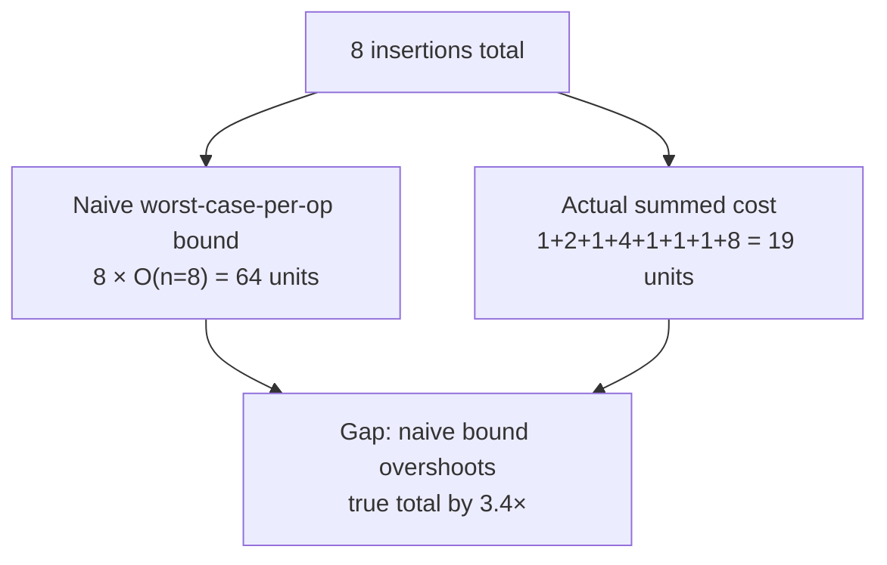

## The Gap Between Worst-Case Analysis and What Actually Happens Over a Long Sequence of Operations

### Starting From a Familiar Habit: Per-Operation Worst-Case Bounds

Standard algorithmic analysis reports a single number per operation — insert into a hash table is $O(1)$, insert into a balanced binary search tree is $O(\log n)$ — and that number is meant to describe the worst case: the most expensive that operation could possibly be, on the worst possible input, at the worst possible moment. This habit is so deeply built into how algorithms are taught that it's easy to stop noticing an assumption hiding inside it: that the worst case for *one* operation, examined in isolation, tells you something useful about a long *sequence* of operations. This item is about exactly where that assumption breaks down, and why it breaks down in a specific, structured way rather than randomly.

**Grounding analogy.** Consider a database's write-ahead log getting flushed to disk. Most writes append a small record — fast, cheap, effectively constant time. But periodically, the log file fills its current segment and the system must roll over to a new segment: close the old file, allocate a new one, update metadata. That rollover operation is dramatically more expensive than a normal append — call it $O(k)$ for some large constant $k$ representing the rollover overhead. If someone reports "the worst-case cost of a write is $O(k)$," that statement is technically true and also deeply misleading about what using this log actually feels like in practice, because rollovers are rare and the other 999 writes out of 1000 cost almost nothing.

### Making the Gap Precise With a Concrete Sequence

Take a hypothetical structure where inserting the $i$-th element costs 1 unit of work *unless* $i$ is a power of 2, in which case that insertion costs $i$ units (this is a deliberately simplified stand-in for the real dynamic-array-doubling behavior traced in the next item of this chapter). Trace the cost of the first 8 insertions:

| Insertion $i$ | Is $i$ a power of 2? | Cost of this insertion |
|---|---|---|
| 1 | Yes | 1 |
| 2 | Yes | 2 |
| 3 | No | 1 |
| 4 | Yes | 4 |
| 5 | No | 1 |
| 6 | No | 1 |
| 7 | No | 1 |
| 8 | Yes | 8 |

**The worst-case-per-operation view.** If asked "what is the worst-case cost of a single insertion into this structure?", the honest answer, looking only at individual operations, is: it depends which one — insertion 8 alone costs 8 units, insertion 4 alone costs 4 units. The tightest true statement about a single arbitrary insertion, without knowing its position in the sequence, is that its cost is $O(n)$ where $n$ is the total number of elements inserted so far, since an adversary could always ask "what if this operation happens to be at a power-of-2 position?"

**The naive multiplication.** If someone takes that per-operation worst case of $O(n)$ and multiplies it by the number of operations to bound the whole sequence, they get: 8 insertions $\times$ worst case of $n=8$ per insertion $= 64$ units, as an upper bound on the total cost of the 8 insertions above.

**What actually happened.** Sum the actual column: $1+2+1+4+1+1+1+8 = 19$ units total. The naive bound of 64 overshoots the true total by more than 3×, and the gap only widens as the sequence grows longer, because the naive bound assumes every single operation could simultaneously be an expensive one, when the structure's own rules (only powers of 2 trigger the expensive case) guarantee that most of them cannot be.

### Why the Gap Exists: A Hidden Independence Assumption

The naive multiplication silently assumes that the worst case for operation 1, the worst case for operation 2, and so on can all happen *simultaneously and independently* — as if each operation's cost were drawn fresh from the same worst-case distribution with no memory of what came before. But in real structures, expensive operations are usually expensive *because* of accumulated state from previous cheap operations, and that same accumulated state is exactly what gets reset or consumed once the expensive operation fires. Concretely, in the example above: insertion 8 is expensive precisely because insertions 5, 6, and 7 were cheap and left the structure in a state primed for an expensive step at position 8. The cheap operations and the expensive operation are not independent events that could both be worst-case simultaneously — the cheap ones are a *precondition* for the expensive one, and there's a fixed ratio between how many cheap operations must happen before another expensive one can recur.

This is the exact structural insight that amortized analysis is built to formalize and exploit. Recall (this is the term this chapter itself introduces) that amortized analysis produces a bound on the *average* cost per operation over a worst-case *sequence* of operations, rather than a bound on any single operation viewed in isolation. It doesn't deny that some individual operations are expensive — insertion 8 costing 8 units is not disputed by anyone — it instead proves that the sequence as a whole cannot contain expensive operations often enough, or without enough cheap operations subsidizing them, for the *average* to blow up the way naive per-operation multiplication suggests.

### Why "On Average" Here Is Not the Same as "On Average" in Probability

It's worth being explicit about a term collision that trips up readers coming from a probability or statistics background. When amortized analysis says "average cost per operation," it is not making a probabilistic claim about typical or expected behavior over random inputs — recall that expected-value reasoning (as used, for instance, in describing average-case hash table performance) depends on an assumed input distribution, and can be wrong if that distribution assumption fails to hold for real inputs. Amortized analysis makes no distributional assumption whatsoever. Its claim is a **worst-case claim about the total**, over *any* sequence of operations an adversary could construct, that happens to be phrased as a per-operation average once divided by the sequence length. The 19-unit total computed above holds for *this specific* sequence of 8 insertions, but the technique that proves such totals stay bounded (developed later in this chapter as the aggregate method and the potential method) proves it for every possible sequence of insertions, not just typical ones. This is why an amortized bound is a legitimate, rigorous worst-case guarantee — it is not a statistical hedge or an appeal to "usually," even though the word "amortized" colloquially sounds like it might be.

### Restating the Gap as a General Principle

Three ways of looking at cost, from most pessimistic to most precise, all applied to the same sequence of operations:

| Approach | What it computes | Result on the 8-insertion example | What it gets wrong |
|---|---|---|---|
| Naive worst-case × count | Multiply the single worst possible per-operation cost by the number of operations | 64 units | Assumes every operation can simultaneously hit its individual worst case, ignoring that expensive operations require cheap ones to precede them |
| True per-operation worst case | Correctly identifies that a single arbitrary operation's cost is genuinely bounded by $O(n)$ | Still technically true, still $O(n)$ per op | Not wrong, but not useful for bounding a full sequence without knowing operation *counts and structure* |
| Amortized (sequence total ÷ count) | Sums the actual cost across the entire real sequence, divided by sequence length | $19/8 \approx 2.4$ units per operation | Nothing — this is the number that actually describes what a long sequence of these operations costs, on any input |

The gap between the first row and the third row is precisely the gap this chapter is named for: "sometimes expensive" operations (insertion 8, costing 8 units) can coexist with a provably reasonable — here, small constant — bound on the average, *because* the analysis accounts for the structural relationship between when expensive operations can occur and what must happen beforehand to enable them, rather than treating each operation as an isolated worst case.

### Why This Matters Before Meeting the Formal Techniques

The two formal techniques this chapter introduces next — the aggregate method (directly summing total cost across a sequence, as done by hand above, then generalizing it algebraically) and the potential method (assigning a numeric "stored potential" to the structure's state, so that cheap operations are shown to bank potential that expensive operations later spend) — are both, at their core, disciplined ways of doing exactly the subtraction this item has been building toward: correctly crediting cheap operations for making expensive ones affordable, instead of pricing every operation as if it might be the expensive one. Understanding *why* the naive per-operation bound overshoots — because it assumes an independence between operations that the structure's own rules forbid — is what makes the formal machinery in the aggregate and potential methods feel like a natural way to state something already true, rather than a algebraic trick invented to produce a nicer-looking number.

**Key Points**
- A per-operation worst-case bound is a true statement about a single arbitrary operation, but multiplying it by the sequence length overstates the true cost of a real sequence, because it wrongly assumes independence between operations.
- Expensive operations in real structures are typically enabled by, and consume, state accumulated by preceding cheap operations — they are not independent events that could all occur simultaneously.
- Amortized analysis is a worst-case guarantee about the total cost of any possible sequence, phrased as a per-operation average — it is not a probabilistic or expected-value claim, despite superficial resemblance to one.
- The 19-unit worked total versus the 64-unit naive bound on the same 8-insertion sequence is the concrete gap this entire chapter exists to close with formal technique.

**Conclusion**
The gap between worst-case-per-operation analysis and real sequence behavior is not a flaw in worst-case analysis — both the "insertion 8 costs 8 units" statement and the "64-unit naive bound" statement are true, just about different questions. The gap exists because the natural instinct to multiply a single operation's worst case by the operation count silently assumes every operation could be simultaneously unlucky, when real data structures typically enforce a structural relationship where expensive operations are rationed by the cheap operations that must precede them. Making that rationing relationship rigorous — rather than just plausible by inspection, as this item has shown by hand — is exactly the job of the aggregate method and the potential method introduced next in this chapter, and is the same rationing logic that reappears, in a different guise, wherever Chapter 06: Classical Incremental Data Structures as Worked Amortization Case Studies argues that a bounded-size structure like a B-tree or an LSM-tree stays cheap on average despite occasional expensive rebalancing operations.

**Related Topics**
- The aggregate method: turning the by-hand summation shown here into a general algebraic technique
- The potential method: assigning a "stored credit" interpretation to why cheap operations subsidize expensive ones
- Dynamic array doubling as the canonical worked case study for this exact cost pattern
- How to correctly read and state an amortized-cost theorem without overclaiming what it guarantees
- The distinction between amortized analysis and average-case (expected-value, distribution-dependent) analysis