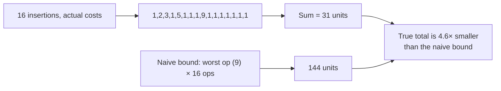

## Dynamic Array Doubling as the Canonical Example: Most Insertions Are Cheap, Occasional Insertions Trigger a Full Resize

### Starting From the Concrete Mechanism

Recall from the previous item in this chapter that amortized analysis exists to correctly account for sequences where expensive operations are rationed by preceding cheap ones, rather than treating every operation as independently capable of hitting its worst case. Dynamic array doubling is the single most commonly taught worked example of this pattern, largely because the mechanism is simple enough to trace by hand and the algebra behind its bound is genuinely clean.

**Grounding analogy.** Think of a database allocating a fixed-size buffer page for a table's rows. As long as new rows fit in the current page, an insert is just writing into the next free slot — cheap. Once the page is completely full, the system can't just write past the end; it must allocate a new, larger page, copy every existing row into it, then continue. That copy step is what makes an otherwise routine insert suddenly expensive. Dynamic array doubling is exactly this pattern, formalized: an array-backed list (as used, for instance, inside a Python list, a C++ `std::vector`, or a Java `ArrayList`) that grows its backing storage by allocating a new array and copying everything over, whenever the current array fills up.

### The Concrete Rule: Doubling on Overflow

**Setup.** The structure maintains a backing array of some current capacity $C$ and a current element count $n \le C$. Inserting a new element:

- If $n < C$ (there's still room), write the new element into slot $n$, increment $n$. **Cost: 1 unit** (one write).
- If $n = C$ (the array is completely full), allocate a new backing array of capacity $2C$, copy all $C$ existing elements into it, then write the new element into the freed-up slot. **Cost: $C+1$ units** (C copies plus one write) — call this $n+1$ for the case where the resize happens exactly when $n=C$.

**Why doubling specifically, and not, say, adding a fixed amount each time.** This is worth pausing on before tracing the sequence, because it's the detail that makes the whole bound work. If the array instead grew by adding a *fixed* amount $k$ each time it filled up (rather than doubling), the structure would need to resize roughly every $k$ insertions forever, and each resize would cost proportional to the *current* size, which keeps growing — the total cost of $n$ insertions under fixed-increment growth turns out to be $O(n^2)$, not $O(n)$. Doubling avoids this because the *number of times a resize can occur* by the time $n$ elements have been inserted is only $\log_2 n$ (each resize doubles capacity, so it takes only a logarithmic number of doublings to reach any given size), and — critically — each resize's cost is proportional to the size *at the time of that resize*, which itself grows geometrically. A geometric series of resize costs, as shown numerically below, sums to something proportional to the *final* size, not to the size multiplied by the number of resizes.

### Tracing 16 Insertions by Hand

Start with an empty array, initial capacity $C=1$ (a common convention; some implementations start at a small constant like 4 or 8, which changes constants but not the asymptotic behavior).

| Insertion $i$ | Capacity before | Full? | Action | Cost this step |
|---|---|---|---|---|
| 1 | 1 | Yes ($n=0=C$... treat first insert as filling capacity 1) | Resize to $C=1\to$ wait: start $C=0\to1$. Insert directly. | 1 |
| 2 | 1 | Yes ($n=1=C$) | Resize $C{:}1\to2$, copy 1, write 1 | $1+1=2$ |
| 3 | 2 | Yes ($n=2=C$) | Resize $C{:}2\to4$, copy 2, write 1 | $2+1=3$ |
| 4 | 4 | No ($n=3<4$) | Direct write | 1 |
| 5 | 4 | Yes ($n=4=C$) | Resize $C{:}4\to8$, copy 4, write 1 | $4+1=5$ |
| 6 | 8 | No | Direct write | 1 |
| 7 | 8 | No | Direct write | 1 |
| 8 | 8 | No | Direct write | 1 |
| 9 | 8 | Yes ($n=8=C$) | Resize $C{:}8\to16$, copy 8, write 1 | $8+1=9$ |
| 10–15 | 16 | No (six times) | Direct writes | 1 each |
| 16 | 16 | No | Direct write | 1 |

**Total cost of 16 insertions:** $1 + 2 + 3 + 1 + 5 + 1 + 1 + 1 + 9 + (1{\times}7) = 31$ units.

**The naive per-operation bound, for comparison.** The single most expensive insertion in this trace cost 9 units (insertion 9, the resize from capacity 8 to 16). Multiplying that worst-case-per-operation figure by 16 total insertions gives a naive bound of $9 \times 16 = 144$ units — more than 4.6× the true total of 31. This is the exact same overshoot pattern the previous item in this chapter demonstrated abstractly, now grounded in the real structure that pattern was built to describe.

### The Aggregate-Method Argument, Applied to This Example

Recall (from earlier in this chapter) that the aggregate method proves an amortized bound by directly summing the total cost across a sequence and dividing by the number of operations, rather than reasoning about any single operation in isolation. Applied here:

**Separate the cost into two categories.** Every one of the $n$ insertions contributes exactly 1 unit for its own direct write, regardless of whether a resize also happens on that step — the element still has to be written somewhere. That accounts for $n$ units total across any sequence of $n$ insertions. On top of that baseline, resizes contribute additional *copying* cost, and only copying cost needs separate accounting.

**Bound the total copying cost using the geometric series.** A resize occurs only when capacity is exactly reached, and each resize copies exactly the current capacity's worth of elements: $1, 2, 4, 8, 16, \ldots$ up to whatever the largest capacity reached before or at $n$ is (at most $n$, in fact at most the smallest power of 2 that is $\ge n$). The sum of a doubling sequence up to some value $C_{max}$ is:

$$
1 + 2 + 4 + 8 + \cdots + C_{max} = 2 \cdot C_{max} - 1
$$

This is the standard closed form for a geometric series with ratio 2 — worth stating plainly since it is exactly why doubling (ratio 2, or any ratio greater than 1) works and fixed-increment growth does not: a geometric series is dominated by its *last* term (here, roughly $2C_{max}$), whereas an arithmetic series of the same length grows proportionally to the *count* of terms times their average size, which is what produces the quadratic blowup under fixed-increment growth. Since $C_{max}$ is at most about $n$ (doubling never overshoots by more than a factor of 2), total copying cost across the whole sequence is bounded by roughly $2n$.

**Combine.** Total cost across $n$ insertions $\le n$ (direct writes) $+\ 2n$ (copying, bounded by the geometric series) $= 3n$, i.e., $O(n)$ total for $n$ insertions. Dividing by $n$ operations gives an **amortized cost of $O(1)$ per insertion** — a small constant, even though individual insertions (the resize steps) can cost as much as $O(n)$ each in the worst case.

Checking this bound against the hand-traced numbers: the formula predicts a total of roughly $3 \times 16 = 48$ as an upper bound; the actual traced total was 31, comfortably under that bound, as a correct upper bound should be.

### Why the Copy Cost "Amortizes Away": An Intuitive Credit Story

A useful intuitive framing, which anticipates the formal potential-method machinery covered next in this chapter: imagine that every cheap direct-write insertion is required to pay a small insurance premium — say, 2 extra units — into a shared account, on top of its own 1-unit cost. By the time the array is about to overflow at capacity $C$, roughly $C$ insertions have occurred since the last resize (specifically, $C/2$ insertions happened since capacity was last doubled to $C$, each paying into the account), so the account holds enough banked credit to pay for the $C$-unit copy that's about to happen. This is not a rigorous proof on its own — the potential method to follow makes it rigorous by formalizing the "account balance" as a precise function of the array's state — but it correctly captures *why* an expensive resize is not actually a surprise or a violation of the amortized bound: it was paid for in advance, incrementally, by the cheap insertions that preceded it, in exactly the quantity needed and no more.

### Table: What Changes and What Stays Fixed Across the Trace

| Property | Behavior across the 16-insertion trace |
|---|---|
| Cost of a non-resizing insertion | Always exactly 1 unit, regardless of $n$ |
| Cost of a resizing insertion at capacity $C$ | $C+1$ units — grows with $C$, hence with $n$ |
| Number of resizes in $n$ insertions | $\lfloor \log_2 n \rfloor$ — logarithmic, hence rare at large $n$ |
| Total cost across $n$ insertions | $O(n)$ — proven via the geometric series above |
| Amortized cost per insertion | $O(1)$ — a small constant, independent of $n$ |
| True worst-case cost of a single, specific insertion | Still $O(n)$ — the amortized bound never claims otherwise |

**Key Points**
- Dynamic array doubling makes at most $\lfloor \log_2 n \rfloor$ resizes across $n$ insertions, and the geometric-series sum of their copying costs is bounded by roughly $2n$ — proportional to the final size, not to the count of resizes times their average cost.
- Doubling (any growth ratio greater than 1) is what makes the total copying cost geometric rather than arithmetic; fixed-increment growth produces an $O(n^2)$ total instead of $O(n)$.
- The amortized cost per insertion is $O(1)$, even though a single resizing insertion can cost $O(n)$ in the worst case — these are compatible, not contradictory, statements about two different questions.
- The traced 31-unit total for 16 real insertions, versus the 144-unit naive per-operation bound, is a concrete instance of the general gap the previous item in this chapter established abstractly.

**Conclusion**
Dynamic array doubling earns its status as the canonical amortized-analysis example because every part of its cost can be traced by hand, summed exactly, and matched against a clean closed-form bound — the geometric series $1+2+4+\cdots+C_{max} = 2C_{max}-1$ does essentially all the analytical work. The same rationing structure this example makes concrete — many cheap operations banking the credit that a rare expensive operation later spends — reappears in more complex disguises in the next chapter, where B-trees, LSM-trees, incremental minimum spanning trees, and incremental Voronoi diagrams are all shown to share this same bounded-update proof family, and again later where Chapter 07: The Cost of Growing a Structure: Fusing the Vector Track and the Amortization Track asks whether ANN-index insertion into a growing graph exhibits this same kind of amortized-cheap behavior or instead behaves closer to the $O(n)$-per-operation cost of brute-force and embedding-threshold insertion.

**Related Topics**
- The potential method, which formalizes the "banked credit" intuition offered here into a precise mathematical accounting tool
- Why a growth ratio less than 2 (e.g., 1.5×) still gives $O(1)$ amortized cost, and why a ratio of exactly 1 (fixed-increment growth) does not
- Shrinking/halving policies for dynamic arrays and the "thrashing" pitfall of naively halving on underflow
- How real language runtimes (Python lists, Java ArrayLists, C++ vectors) choose their specific growth factors in practice
- The shared bounded-update proof family across B-trees, LSM-trees, and dynamic arrays