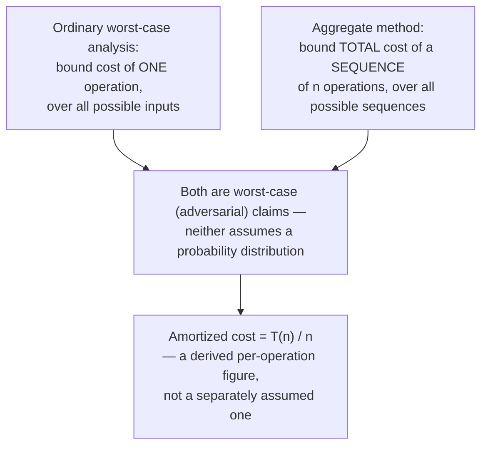

## The Aggregate Method Explained Intuitively: Total Up the Cost of Many Operations and Divide by How Many There Were

### The Core Move, Stated Plainly Before Any Formalism

The aggregate method is the simplest of the amortized-analysis techniques, and it is worth stating its entire strategy in one sentence before adding any notation: **compute (or bound) the total cost of an arbitrary sequence of $n$ operations directly, then divide that total by $n$ to get the amortized cost per operation.** That's the whole idea. What makes it a legitimate proof technique rather than just an arithmetic trick is the requirement that the total-cost bound must hold for *every possible sequence* of $n$ operations an adversary could construct — not just a convenient or typical one. The two prior items in this chapter already performed this exact method by hand, once abstractly (the power-of-2 toy example) and once concretely (dynamic array doubling); this item steps back to name the technique explicitly, state its logical shape precisely, and clarify exactly what kind of claim it does and does not license.

**Grounding analogy.** Picture a company auditing its total cloud compute spend over a year rather than trying to characterize "the cost of a typical API call." Some calls are cheap (a cache hit), some are expensive (a cold-start database query that triggers a connection pool expansion). The auditor doesn't try to bound the cost of *the single worst call* and multiply by call volume — that would wildly overstate the bill, for the same independence-assumption reason discussed in this chapter's first item. Instead, the auditor sums the actual total from the invoice and divides by call count to get a meaningful per-call figure. The aggregate method formalizes exactly this instinct, but as a *worst-case* guarantee rather than an after-the-fact accounting exercise: it proves a bound on the total that holds no matter how the sequence of expensive and cheap operations is arranged.

### Stating the Method Formally, With Restraint

For a sequence of $n$ operations with individual (possibly wildly varying) actual costs $c_1, c_2, \ldots, c_n$, the aggregate method proceeds in two steps:

1. **Prove an upper bound $T(n)$ on the true total** $\sum_{i=1}^{n} c_i \le T(n)$, valid for *every* possible sequence of $n$ operations on the structure — not derived by summing individual worst cases, but by reasoning directly about how many times an expensive operation can structurally recur within $n$ operations (as the doubling-array item did via the geometric series $1+2+4+\cdots \le 2n$).
2. **Divide:** the amortized cost per operation is defined as $T(n)/n$.

That's the complete method. No potential function, no credit-banking formalism (that machinery belongs to the potential method, covered next in this chapter) — just a direct total-cost bound and a division. This is intentionally the minimal viable version of amortized analysis, and it is the right tool exactly when a direct sum or a clean closed-form series (like the geometric series behind array doubling) is available to bound the total.

### Why This Counts as a Rigorous Worst-Case Proof, Not an Average-Case Hand-Wave

Recall (from this chapter's first item) that "amortized" is easily and wrongly conflated with "expected" or "average-case" in the probabilistic sense. The aggregate method makes the distinction structurally unambiguous: nowhere in the two-step recipe above does any probability distribution over inputs appear. Step 1 requires the bound $T(n)$ to hold for *every* sequence, which is precisely the same universal quantifier ("for all inputs") that ordinary worst-case analysis uses — the only difference is that the quantity being bounded is a *sum over a sequence* rather than a *single operation's cost*. An adversary is free to arrange operations in the sequence in whatever order and combination would seem most damaging; the aggregate method's guarantee is that even the adversary's best attempt cannot push the total above $T(n)$.

### Re-Deriving the Array-Doubling Bound in the Aggregate Method's Own Terms

To make the two-step recipe concrete rather than abstract, restate the dynamic-array-doubling result from this chapter's previous item using the aggregate method's exact vocabulary:

**Step 1 — bound the total.** Split the cost of $n$ insertions into two categories, as done previously: every insertion costs at least 1 unit for its own direct write ($n$ units total, unconditionally), plus additional copying cost that occurs only at resizes. Resizes happen at capacities $1, 2, 4, 8, \ldots$ up to at most roughly $n$, and their copying costs form the geometric series $1+2+4+\cdots+C_{max} = 2C_{max}-1 \le 2n$. This bound — $T(n) \le n + 2n = 3n$ — holds for *every* sequence of $n$ insertions, because the doubling rule itself (not any assumption about the input) is what forces resizes to occur only at those specific, geometrically spaced points; an adversary inserting elements in any order still triggers a resize only when the array is genuinely full.

**Step 2 — divide.** Amortized cost per insertion $= T(n)/n \le 3n/n = 3 = O(1)$.

Nothing new is computed here relative to the previous item — this is deliberately the same result, restated to show that "trace the costs, sum a geometric series, divide by $n$" *is* the aggregate method, not merely an example that happens to resemble it.

### A Second Worked Example: Binary Counter Increment, Traced by Hand

A second canonical aggregate-method example, chosen because it involves a different underlying mechanism (bit-flipping rather than array resizing) while producing the same shape of result — worth including because seeing the *same technique* applied to a *structurally different* problem is what confirms genuine understanding of the method rather than memorization of one example.

**Setup.** A binary counter starts at 0, represented as a bit string. An "increment" operation adds 1, implemented the standard way: flip the rightmost 0 bit to 1, and flip every 1 bit to its right (i.e., every trailing 1) to 0 first. Cost is measured as the number of bit flips.

**Trace of the first 8 increments**, starting from `000`:

| Increment | Before | After | Bits flipped | Cost |
|---|---|---|---|---|
| 1 | 000 | 001 | 1 | 1 |
| 2 | 001 | 010 | 2 | 2 |
| 3 | 010 | 011 | 1 | 1 |
| 4 | 011 | 100 | 3 | 3 |
| 5 | 100 | 101 | 1 | 1 |
| 6 | 101 | 110 | 2 | 2 |
| 7 | 110 | 111 | 1 | 1 |
| 8 | 111 | 1000 | 4 | 4 |

**Naive per-operation bound.** The worst single increment (going from `111` to `1000`) costs 4 flips. Naive multiplication: $4 \times 8 = 32$.

**Actual total:** $1+2+1+3+1+2+1+4 = 15$.

**The aggregate-method argument for why the total stays low, in general.** Rather than tracing forever, bound the total by asking a different question: across $n$ increments, how many times, *in total across the whole sequence*, does bit position $k$ (counting from the rightmost bit as position 0) get flipped? Bit position 0 flips on *every* increment — $n$ times. Bit position 1 flips only every other increment — at most $n/2$ times. Bit position $k$ flips at most $n/2^k$ times, because it only flips when all lower bits have just rolled over from all-1s to all-0s, which by construction happens with frequency halving at each higher bit position. Summing over all bit positions up to $\log_2 n$:

$$
T(n) \le \sum_{k=0}^{\lfloor \log_2 n \rfloor} \frac{n}{2^k} = n \sum_{k=0}^{\infty} \frac{1}{2^k} = n \cdot 2 = 2n
$$

This uses the standard geometric series identity $\sum_{k=0}^{\infty} 1/2^k = 2$ — the same "geometric series collapses to a constant multiple of $n$" shape that made the array-doubling bound work, now arising from bit-flip frequency instead of resize-copy cost, which is exactly the point of including this second example: the aggregate method's shape (sum a geometric or otherwise well-behaved series across all operations, get something proportional to $n$) recurs across structurally unrelated problems.

**Amortized cost per increment:** $T(n)/n \le 2n/n = 2 = O(1)$ flips per increment — again a small constant, despite individual increments costing as much as $O(\log n)$ (an all-1s counter of $\log n$ bits flipping every position on overflow).

### When the Aggregate Method Is (and Isn't) the Right Tool

| Situation | Aggregate method fits well | Better suited to the potential method instead |
|---|---|---|
| A clean total-cost formula or convergent series describes the whole sequence directly (array doubling, binary counter) | Yes | — |
| All operations are the same type (e.g., only insertions, no deletions mixed in) | Yes — sequence is homogeneous, easy to sum directly | — |
| Mixed operation types with costs that interact in complex, state-dependent ways (e.g., insertions *and* deletions on the same structure, where a deletion can undo the "credit" built up by insertions) | Harder — direct summation gets complicated fast | Yes — a potential function tracks structure state explicitly, handling mixed operations more gracefully |
| Need to bound the cost of an arbitrary *individual* operation part-way through a sequence, not just the total | Not directly suited — the aggregate method's output is a total/average, not a per-step bound at an arbitrary point | Yes — the potential method naturally produces a bound on each individual amortized cost as it's charged |

This table anticipates, without yet explaining, why the next item in this chapter introduces the potential method as a complementary rather than redundant technique: the aggregate method is the right first tool whenever the sequence is simple enough that its total cost can be summed or bounded in closed form directly, and its main limitation is that it becomes unwieldy once a structure supports several different kinds of operations whose costs depend on each other's history in complicated ways.

**Key Points**
- The aggregate method's entire logic is two steps: bound the true total cost $T(n)$ of any possible sequence of $n$ operations, then divide by $n$.
- The bound $T(n)$ must hold for every possible sequence (a worst-case, adversarial claim), which is exactly why the aggregate method is a rigorous proof technique and not a probabilistic average.
- Both array doubling and binary counter increment reduce to the same underlying shape: a geometric series that sums to a constant multiple of $n$, yielding $O(1)$ amortized cost per operation despite occasional expensive individual operations.
- The aggregate method works best on homogeneous sequences with a clean total-cost formula; structures with multiple interacting operation types are usually better handled by the potential method.

**Conclusion**
The aggregate method earns its place as the first formal technique in this chapter precisely because it requires no new machinery beyond what the two preceding items already demonstrated by hand — it simply names the pattern (bound the sequence total, divide by count) and states clearly why that pattern constitutes a legitimate worst-case guarantee rather than a statistical hedge. Its cleanliness is also its boundary: the moment a structure needs to reason about several kinds of operations whose costs are entangled with each other's history — the situation Chapter 06: Classical Incremental Data Structures as Worked Amortization Case Studies will confront directly when analyzing B-trees and LSM-trees under mixed insertions and rebalances — the potential method introduced next in this chapter becomes the more natural and more powerful tool.

**Related Topics**
- The potential method: assigning a numeric "stored potential" to structure state to handle mixed operation types
- Geometric series identities and why convergent series recur across seemingly unrelated amortized-analysis proofs
- Binary counter increment as an amortized-analysis case study distinct from array doubling
- How to correctly state an amortized-cost theorem's guarantee without overclaiming what it proves about any single operation
- Extending the aggregate method's total-cost framing to insertion-cost curves in Chapter 07