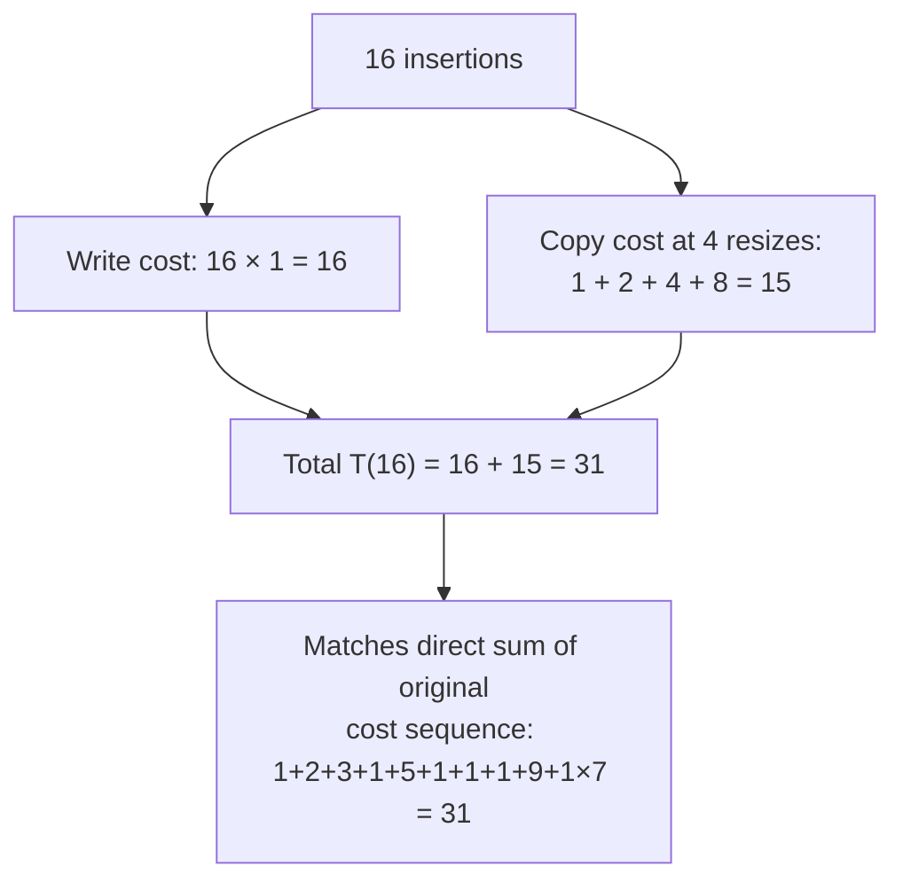

## Working the Dynamic Array Doubling Example Through the Aggregate Method by Hand, With Concrete Small Numbers

### Purpose of This Pass: A Fully Explicit, No-Shortcuts Trace

Recall that the aggregate method's entire logic, stated in the previous item, is two steps: bound the true total cost $T(n)$ of a sequence of $n$ operations, then divide by $n$. Recall also that a prior item in this chapter already traced 16 insertions into a doubling array and reported a total of 31 units, and a later restatement summarized that result using the aggregate method's own vocabulary via a geometric-series bound. This item exists to do something neither of those did in full: walk the aggregate method's derivation step by step, on paper, with every intermediate number shown — the geometric series summed term by term, the algebraic bound built piece by piece, and the final division carried out explicitly — so that the mechanics of *how* the $O(1)$ result is produced, not just the fact that it holds, is completely transparent.

### Setting Up the Concrete Numbers

Use the same rule as before: backing array starts at capacity $C=1$; inserting when $n<C$ costs 1 unit; inserting when $n=C$ costs $C+1$ units (a resize doubling capacity, copying $C$ existing elements, then writing 1 new element). Trace exactly $n=16$ insertions, recording capacity, action, and cost at every single step — no steps skipped this time, including the ones that repeat identically.

| Insertion $i$ | Capacity $C$ before | $n$ before | Resize? | New capacity | Cost $c_i$ |
| --- | --- | --- | --- | --- | --- |
| 1 | 1 | 0 | No — wait, $n=0<C=1$, direct write | — | 1 |
| 2 | 1 | 1 | Yes, $n=1=C$ | 2 | $1+1=2$ |
| 3 | 2 | 2 | Yes, $n=2=C$ | 4 | $2+1=3$ |
| 4 | 4 | 3 | No, $3<4$ | — | 1 |
| 5 | 4 | 4 | Yes, $n=4=C$ | 8 | $4+1=5$ |
| 6 | 8 | 5 | No | — | 1 |
| 7 | 8 | 6 | No | — | 1 |
| 8 | 8 | 7 | No | — | 1 |
| 9 | 8 | 8 | Yes, $n=8=C$ | 16 | $8+1=9$ |
| 10 | 16 | 9 | No | — | 1 |
| 11 | 16 | 10 | No | — | 1 |
| 12 | 16 | 11 | No | — | 1 |
| 13 | 16 | 12 | No | — | 1 |
| 14 | 16 | 13 | No | — | 1 |
| 15 | 16 | 14 | No | — | 1 |
| 16 | 16 | 15 | No | — | 1 |

This reproduces exactly the sequence used previously: $1, 2, 3, 1, 5, 1, 1, 1, 9, 1, 1, 1, 1, 1, 1, 1$.

### Step 1 of the Aggregate Method: Separate Costs Into Two Additive Categories

The core algebraic move that makes the total summable in closed form is splitting each $c_i$ into two non-overlapping parts, applied uniformly across every insertion regardless of whether it triggers a resize:

$$c_i = \underbrace{1}_{\text{the write, always charged}} + \underbrace{\text{(copy cost, 0 unless this insertion resizes)}}_{\text{extra cost only at resizes}}$$

Checking this split against the table: insertion 2 has $c_2 = 2 = 1 + 1$ (1 write + 1 copy, since $C=1$ before this resize). Insertion 3 has $c_3 = 3 = 1 + 2$ (1 write + 2 copies, since $C=2$ before this resize). Insertion 9 has $c_9 = 9 = 1 + 8$ (1 write + 8 copies, since $C=8$ before this resize). Every non-resizing insertion has $c_i = 1 + 0$.

**Summing the "always charged" part first, since it's trivial.** There are exactly 16 insertions, each contributing exactly 1 unit for its own write, no exceptions:

$$\text{Total write cost} = 16 \times 1 = 16$$

### Step 2: Summing the Copy-Cost Part as an Explicit Geometric Series

Copy cost is nonzero only at the four resize events in this trace, at capacities $C = 1, 2, 4, 8$ (the capacities *before* doubling, at insertions 2, 3, 5, and 9 respectively):

$$\text{Total copy cost} = 1 + 2 + 4 + 8$$

Summing left to right, one term at a time, exactly as a by-hand check:

$$1 + 2 = 3, \qquad 3 + 4 = 7, \qquad 7 + 8 = 15$$

$$\text{Total copy cost} = 15$$

**Cross-checking against the closed-form geometric series identity.** The general formula used in the prior item was $1+2+4+\cdots+C_{max} = 2 \cdot C_{max} - 1$. Here $C_{max} = 8$ (the largest capacity at which a resize occurred within this 16-insertion sequence), so the formula predicts:

$$2 \times 8 - 1 = 15$$

This matches the direct term-by-term sum exactly, confirming the closed-form identity on this concrete instance before trusting it for larger, harder-to-trace-by-hand sequences.

### Step 3: Combining the Two Parts Into the Total

$$T(16) = \text{Total write cost} + \text{Total copy cost} = 16 + 15 = 31$$

This matches the sum computed by direct term-by-term addition of the original cost sequence in the earlier trace ($1+2+3+1+5+1+1+1+9+1+1+1+1+1+1+1 = 31$), which is exactly the consistency check the aggregate method's split is supposed to satisfy: splitting each $c_i$ into "always 1" plus "copy cost" and summing each part separately must reproduce the same total as summing the original $c_i$ values directly, since the split is just an algebraic regrouping of the same numbers, not an approximation.

### Step 4: Generalizing the Bound Beyond This One Specific Sequence

The number 31 is correct for *this exact* 16-insertion sequence, but the aggregate method's requirement (stated in the previous item) is a bound that holds for *every* sequence of $n$ insertions, not just this one traced instance. Generalize each piece:

**Write cost, general $n$:** always exactly $n$ — this part required no assumption about resize timing at all, since every insertion writes exactly once regardless of history.

**Copy cost, general $n$:** the largest capacity any resize can occur at, given $n$ total insertions, is bounded by $n$ itself (capacity can never exceed roughly the number of elements actually inserted, since resizing only happens in response to real insertions filling the array). So:

$$\text{Total copy cost} \le 1 + 2 + 4 + \cdots + n = 2n - 1$$

using the same geometric series identity, now with $C_{max} \le n$ substituted in place of the concrete value 8 used above.

**Combined general bound:**

$$T(n) \le n + (2n - 1) = 3n - 1 < 3n$$

Checking this general formula against the concrete case: $T(16) \le 3 \times 16 = 48$. The actual value, 31, is comfortably below this bound — exactly the relationship a correct upper bound should have with the true value: never below it, not necessarily tight to it.

### Step 5: The Final Division

$$\text{Amortized cost per insertion} = \frac{T(n)}{n} \le \frac{3n}{n} = 3 = O(1)$$

Checking numerically on the concrete trace: $31/16 \approx 1.94$, comfortably under the general bound of 3 — again consistent with the bound being a correct upper limit rather than an exact prediction of any one specific sequence's average.

### Table: Every Number Produced in This Derivation, Side by Side

| Quantity | Concrete value ($n=16$) | General formula |
| --- | --- | --- |
| Write cost total | 16 | $n$ |
| Copy cost total | 15 | $\le 2n - 1$ |
| Combined total $T(n)$ | 31 | $\le 3n - 1$ |
| Naive worst-case-per-op bound | $9 \times 16 = 144$ | worst single $c_i \times n$, structurally overshoots |
| Amortized cost per operation | $31/16 \approx 1.94$ | $\le 3$, i.e., $O(1)$ |

### Why Walking Through the Arithmetic Explicitly Matters Here

It would be possible to simply cite "$O(1)$ amortized" for array doubling without ever performing the term-by-term sum $1+2=3$, $3+4=7$, $7+8=15$ shown above — and indeed, most treatments of this example skip straight to the closed-form geometric series identity. The reason this item performs the addition by hand anyway is to make explicit exactly where the proof's two load-bearing claims come from: first, that copy cost only ever occurs at capacities that are themselves powers of 2 (a direct consequence of the doubling rule, not an assumption), and second, that a geometric series with ratio 2 is dominated by its last term rather than growing proportionally to its term count (the algebraic fact $2 \cdot C_{max} - 1$, verified here by direct summation before being trusted as a general formula). Both of these are the precise mechanical reasons dynamic array doubling achieves $O(1)$ amortized cost, and neither is visible if the derivation is only ever quoted, never carried out.

**Key Points**

- Splitting each insertion's cost into "always 1 unit for the write" plus "copy cost, nonzero only at resizes" is the algebraic move that makes the total summable in closed form.
- The copy-cost total for 16 insertions, $1+2+4+8=15$, matches the closed-form geometric series identity $2C_{max}-1$ exactly, confirming the formula on a concrete case before trusting it generally.
- The general bound $T(n) \le 3n-1$ predicts an upper limit of 48 for $n=16$; the true traced value of 31 sits comfortably below it, exactly as a correct upper bound should.
- Dividing $T(n)$ by $n$ produces the amortized cost, $O(1)$ per insertion — a small constant, arrived at through pure arithmetic on the concrete trace, not asserted by appeal to the general theorem alone.

**Conclusion**

Carrying every step of the aggregate method's derivation through by hand on a concrete 16-insertion sequence — separating cost categories, summing a geometric series term by term, cross-checking against the closed-form identity, generalizing to arbitrary $n$, and finally dividing — turns "dynamic array doubling has $O(1)$ amortized insertion cost" from a memorized fact into a derivation whose every intermediate number has been verified twice, once concretely and once in general form. This same two-part cost-splitting technique — a fixed baseline charge plus an occasional structurally-bounded surcharge, summed via a convergent series — is the exact template Chapter 06: Classical Incremental Data Structures as Worked Amortization Case Studies reuses when analyzing B-trees and LSM-trees, where "baseline write cost" plus "occasional rebalancing or compaction cost" plays precisely the role that "write cost" plus "copy cost" played here.

**Related Topics**

- Applying the same two-part cost-splitting technique to B-tree node splits and LSM-tree compactions
- The potential method's alternative way of proving the identical $O(1)$ amortized bound for array doubling
- How the choice of growth factor (2× versus 1.5× versus other ratios) changes the constant in the $O(1)$ bound without changing its asymptotic order
- Binary counter increment as a second aggregate-method worked example with a structurally different but numerically analogous derivation
- Extending this bounded-total framing to insertion-cost curves for growing graphs in Chapter 07