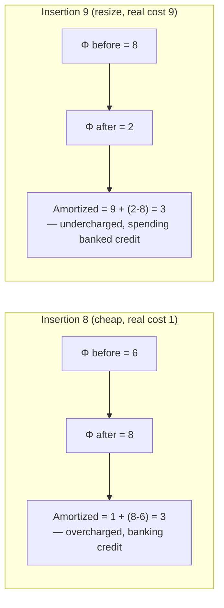

## The Potential Method Explained Intuitively: Thinking of Stored-Up "Credit" That Pays for an Expensive Operation Before It Happens

### Why a Second Technique Is Needed at All

Recall that the aggregate method, covered earlier in this chapter, proves an amortized bound by summing the total cost of an entire sequence and dividing by the operation count — and recall that its main limitation, noted at the end of that item, is that it becomes unwieldy once a structure supports several different kinds of operations whose costs are entangled with each other's history. The potential method is the tool built to handle exactly that harder case. Its central idea, however, is not a different destination — it proves the same kind of amortized bound — but a different, more local *way of accounting* that turns out to generalize far more gracefully.

**Grounding analogy.** Think of a database connection pool that pre-warms idle connections during low-traffic periods specifically so that a sudden burst of incoming requests can be served instantly instead of each new request paying the full cost of establishing a fresh connection. The pool's current number of pre-warmed, idle connections is a kind of stored "readiness" — a resource banked during cheap moments that gets spent down during an expensive moment. The potential method formalizes this instinct precisely: instead of tracking total historical cost across an entire sequence (as the aggregate method does), it tracks a single number describing the current *state* of the structure — how much "banked credit" that state represents — and shows that cheap operations increase this number while expensive operations decrease it, in a way that keeps the *sum of real cost plus credit spent or banked* bounded at every single step.

### The Formal Setup, Introduced Piece by Piece

**The potential function.** Define a function $\Phi$ (the Greek letter phi, the conventional symbol in every standard treatment of this method) that maps the structure's current state to a single non-negative real number — its "potential," read as banked credit. $\Phi$ is defined once, up front, by the person doing the analysis, based on whatever feature of the structure's state seems to predict how much expensive work is looming. For dynamic array doubling, a natural choice — justified concretely in the worked trace below — is:

$$
\Phi(\text{state}) = 2n - C
$$

where $n$ is the current number of elements stored and $C$ is the current backing-array capacity. This particular formula is not arbitrary; it is chosen, and will be verified below, specifically because it produces the right accounting behavior for this specific structure.

**The amortized cost of an operation.** For the $i$-th operation, with true (actual) cost $c_i$, define its **amortized cost** $\hat{c}_i$ as:

$$
\hat{c}_i = c_i + \Phi(\text{state after operation } i) - \Phi(\text{state before operation } i)
$$

In words: the amortized cost is the real cost, adjusted by however much the potential changed as a result of doing this operation. If the operation increased the potential (banked more credit), its amortized cost is *higher* than its real cost — it's being charged extra to pay into the account. If the operation decreased the potential (spent banked credit), its amortized cost is *lower* than its real cost — some of its real cost is being covered by credit paid in previously.

**Why summing $\hat{c}_i$ over a whole sequence gives a clean total.** This is the mechanism that makes the whole method work, and it deserves to be shown algebraically rather than just asserted. Summing the amortized cost over $n$ operations:

$$
\sum_{i=1}^{n} \hat{c}_i = \sum_{i=1}^{n} c_i + \sum_{i=1}^{n} \big[\Phi(\text{state}_i) - \Phi(\text{state}_{i-1})\big]
$$

The second sum is a **telescoping sum** — recall that a telescoping sum is one in which each term's leading part cancels the previous term's trailing part, so that everything in the middle vanishes and only the very first and very last terms survive. Concretely: $\big[\Phi_1 - \Phi_0\big] + \big[\Phi_2-\Phi_1\big] + \cdots + \big[\Phi_n - \Phi_{n-1}\big]$ collapses to just $\Phi_n - \Phi_0$, since every intermediate $\Phi_i$ appears once with a plus sign and once with a minus sign. So:

$$
\sum_{i=1}^{n} \hat{c}_i = \sum_{i=1}^{n} c_i + \Phi_n - \Phi_0
$$

Rearranging to isolate the quantity actually wanted — the true total cost:

$$
\sum_{i=1}^{n} c_i = \sum_{i=1}^{n} \hat{c}_i - \Phi_n + \Phi_0 \le \sum_{i=1}^{n} \hat{c}_i + \Phi_0
$$

(using $\Phi_n \ge 0$, since potential is defined to be non-negative, so subtracting it can only help the bound). This says: **the true total cost of the whole sequence is at most the sum of the amortized costs, plus whatever potential existed at the very start.** If $\Phi_0 = 0$ (the structure starts empty, with no banked credit) and each individual $\hat{c}_i$ can be shown to be bounded by some small constant, then the true total is bounded by that same small constant times $n$ — precisely the kind of bound the aggregate method was built to produce, now arrived at by summing per-operation amortized costs instead of reasoning about the whole sequence globally.

### Working the Array-Doubling Example Through the Potential Method, Step by Step

Reuse $\Phi = 2n - C$, and verify it produces the correct answer on the same insertions traced by hand in earlier items of this chapter.

**Sanity check on the formula's shape before tracing anything.** Right after a resize doubling capacity from $C$ to $2C$, the array holds $n = C$ elements (the array had just filled up) and now has capacity $2C$, so $\Phi = 2C - 2C = 0$ — potential resets to zero immediately after paying for a resize, exactly as "the account was just spent down to nothing" should look. Right before that same resize, $n=C$ still, but capacity is still the old $C$, so $\Phi = 2C - C = C$ — a large stored potential, exactly matching the $C$ units of copying that resize is about to cost. This is not a coincidence; it's the reason $2n-C$ was chosen as the potential function in the first place.

**Tracing insertions 8 and 9 explicitly (the step where capacity 8 fills and resizes to 16), building on the earlier trace's numbers:**

| Step | State before | State after | $\Phi$ before | $\Phi$ after | Real cost $c_i$ | Amortized $\hat{c}_i = c_i + \Delta\Phi$ |
|---|---|---|---|---|---|---|
| Insertion 8 | $n=7, C=8$ | $n=8, C=8$ | $2(7)-8=6$ | $2(8)-8=8$ | 1 | $1 + (8-6) = 3$ |
| Insertion 9 (resize) | $n=8, C=8$ | $n=9, C=16$ | $2(8)-8=8$ | $2(9)-16=2$ | $8+1=9$ | $9 + (2-8) = 3$ |

Notice what happened: insertion 8, a *cheap* real operation (cost 1), gets an amortized cost of 3 — it's being charged 2 extra units, which flow into the potential (rising from 6 to 8), banking credit. Insertion 9, the *expensive* real operation (cost 9), gets an amortized cost of only 3 — dramatically less than its real cost, because the potential dropped sharply (from 8 to 2), meaning most of insertion 9's real cost was paid for by previously banked credit rather than charged fresh. Both operations, despite wildly different real costs (1 versus 9), are charged the *same* amortized cost of 3 — this uniformity across operations of very different real cost is exactly the signature of a well-chosen potential function, and it is why the amortized bound comes out to a clean constant.

**Verifying the general claim: every insertion has amortized cost exactly 3, regardless of whether it resizes.**

*Case 1 — no resize (direct write, real cost 1).* $n$ increases by 1, $C$ stays fixed. $\Delta\Phi = 2(n+1) - C - (2n - C) = 2$. Amortized cost $= 1 + 2 = 3$.

*Case 2 — resize (real cost $C+1$, where $C$ was the capacity that just filled up).* Before: $n=C$, potential $= 2C - C = C$. After: $n=C+1$, new capacity $2C$, potential $= 2(C+1) - 2C = 2$. $\Delta\Phi = 2 - C$. Amortized cost $= (C+1) + (2 - C) = 3$.

Both cases produce exactly 3, confirming algebraically — not just on the two traced examples above — that **every single insertion, cheap or expensive, has amortized cost exactly 3 under this potential function.** Since the amortized cost per operation is a flat constant with no dependence on $n$ or on which case applies, the total cost of any sequence of $n$ insertions is bounded by $3n$ plus the starting potential $\Phi_0$ (which is 0 for an empty array) — reproducing precisely the $O(1)$ amortized, $O(n)$ total result the aggregate method also produced, now derived through a per-operation local argument instead of a global sequence-sum argument.

### Comparing What Each Method Actually Proved

| Aspect | Aggregate method (prior items) | Potential method (this item) |
|---|---|---|
| What is computed | Total cost of the whole sequence, divided by $n$ | A per-operation amortized cost, shown constant regardless of position in the sequence |
| Where the insight lives | In a global sum (a geometric series) | In a local function of current state ($\Phi = 2n - C$) |
| Result for array doubling | $T(n) \le 3n-1$, amortized $\le 3$ | Every individual $\hat{c}_i = 3$ exactly |
| Handles mixed operation types (e.g., insertions and deletions together) | Awkwardly — requires re-deriving the total-cost formula for every new combination of operation types | Naturally — $\Phi$ is redefined once, and each operation type's amortized cost is checked independently against the same $\Phi$ |

The fact that both methods agree exactly (both cap out at amortized cost 3, or a bound of $3n$) on the identical problem is not a coincidence — they are two different bookkeeping strategies proving the same underlying truth about the structure. The potential method's real payoff, not fully visible on this single-operation-type example, appears once a structure needs to support several operation types whose costs interact — a scenario Chapter 06: Classical Incremental Data Structures as Worked Amortization Case Studies takes up directly when B-trees and LSM-trees must account for insertions, splits, and compactions together under one shared potential function.

**Key Points**
- The potential function $\Phi$ maps the structure's current state to a single non-negative number representing banked credit; amortized cost is real cost plus the change in potential caused by the operation.
- The telescoping-sum algebra is what guarantees that summing amortized costs across a whole sequence bounds the true total cost, up to the starting potential $\Phi_0$.
- For dynamic array doubling, $\Phi = 2n - C$ makes every single insertion's amortized cost come out to exactly 3, regardless of whether that specific insertion is cheap or triggers an expensive resize.
- The potential method and the aggregate method prove the same class of bound through different bookkeeping; the potential method's advantage shows up once multiple interacting operation types are involved.

**Conclusion**
The stored-credit intuition — cheap operations overpay into an account, expensive operations draw the account down — turns out to be exactly capturable in a single algebraic object, the potential function, and the telescoping-sum argument is what proves that this local, per-operation accounting correctly bounds the true global total. Verifying by hand that insertion 8 (cheap) and insertion 9 (a resize) both amortize to exactly 3 under $\Phi = 2n-C$ is what turns "credit" from a metaphor into a checkable calculation — the same calculation this analysis will need to redo, with a differently chosen $\Phi$, for each new structure examined in Chapter 06: Classical Incremental Data Structures as Worked Amortization Case Studies.

**Related Topics**
- Choosing a potential function for structures with multiple operation types, such as a combined insert/delete workload
- Why $\Phi$ must be non-negative and start at (or near) zero for the bound to be meaningful
- B-trees and LSM-trees as potential-method case studies with node-count or buffer-size based potential functions
- The relationship between the potential method and the "banker's method" (a closely related credit-based framing sometimes taught as an alternative name for the same idea)
- Reading a published amortized-cost theorem statement and identifying which method (aggregate or potential) its proof likely uses