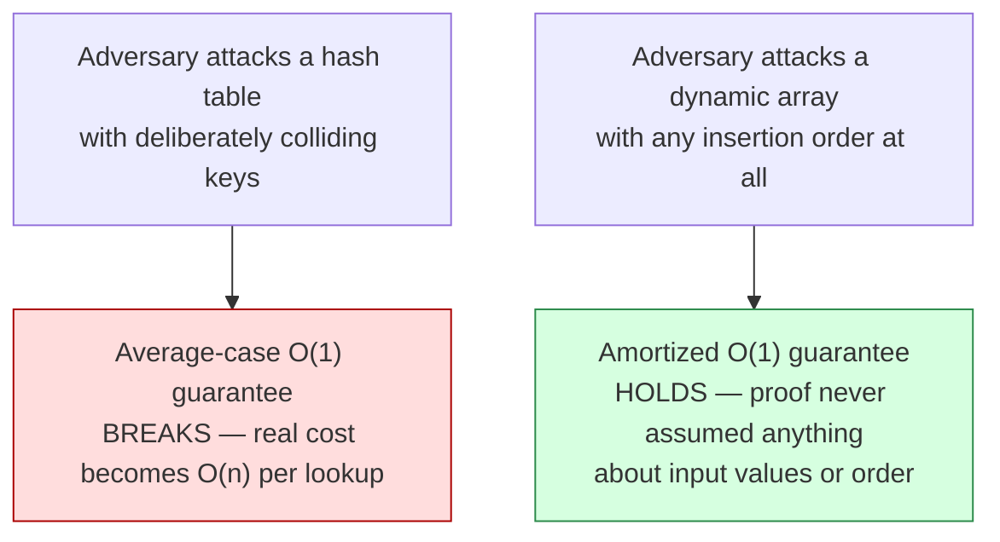

## Why Average-Case Analysis and Amortized Analysis Are Different Claims, Even Though They Can Produce the Same-Looking Number

### The Collision This Item Exists to Resolve

Two earlier items in this chapter each flagged, in passing, that "amortized" is easily and wrongly conflated with "average" or "expected" in the probabilistic sense — one when first introducing the gap between worst-case-per-operation and sequence behavior, another when distinguishing the aggregate method's worst-case guarantee from a statistical hedge. This item is where that warning gets its full, dedicated treatment: both terms can attach the word "average" to a per-operation cost figure, both can produce a number like "$O(1)$ per operation" for the exact same data structure, and yet the two numbers answer fundamentally different questions, are proven by fundamentally different arguments, and fail in different ways when their respective assumptions are violated. Treating them as interchangeable is a common enough error that it's worth dismantling carefully, term by term.

**Grounding analogy.** Consider two separate claims a database engineer might make about a hash table's lookup performance. Claim one: "assuming keys are reasonably well-distributed by the hash function, a lookup takes $O(1)$ time on average." Claim two: "even though an individual insert can occasionally trigger a full table resize costing $O(n)$, the amortized cost per insert across any sequence of insertions is $O(1)$." Both claims mention "$O(1)$ average" in casual speech, but the first is a statement about *typical behavior under an assumed input distribution* (specifically, that keys don't adversarially collide), while the second is a statement about *worst-case total cost across any sequence whatsoever*, with no assumption about the keys at all. Confusing these two claims means potentially trusting a performance guarantee that doesn't actually hold under the conditions being assumed.

### Average-Case Analysis, Defined Precisely

**What it claims.** Average-case analysis computes the expected cost of an operation, where the expectation is taken over a specified probability distribution on inputs. The classic example: hash table lookup is described as $O(1)$ *on average* under the assumption that keys are drawn from a distribution that spreads them roughly uniformly across hash buckets (or, more carefully, under a stated assumption about the hash function's behavior — such as "simple uniform hashing," where every key is equally likely to land in any bucket, independent of other keys).

**What it depends on.** Average-case analysis is only as trustworthy as the distributional assumption it's built on. If real-world keys are adversarially chosen, or simply happen to cluster in a way the assumed distribution didn't anticipate (a well-known concrete failure: hash-flooding attacks, where an attacker deliberately submits keys engineered to collide under a known hash function), the average-case guarantee can fail completely — not degrade gracefully, but fail, because the entire proof rested on an assumption about input distribution that adversarial or unlucky real input can simply violate.

**How the guarantee is usually stated.** As an expectation: $E[\text{cost}]$, computed by summing (or integrating) cost over all possible inputs weighted by their assumed probability. This is fundamentally a probabilistic claim; a *specific* run of the algorithm on a *specific* input can cost far more than the average, and average-case analysis makes no promise about any individual run, only about the expectation over the assumed distribution.

### Amortized Analysis, Restated Alongside It for Direct Contrast

**What it claims.** Recall (from earlier in this chapter) that amortized analysis bounds the *total* cost of any possible sequence of $n$ operations, then expresses that bound as a per-operation average by dividing by $n$. Recall also that this "any possible sequence" is a universal, adversarial quantifier — precisely the same kind of quantifier ordinary worst-case analysis uses for a single operation, just applied to a sequence total instead.

**What it depends on.** Nothing about input distribution whatsoever. The dynamic-array-doubling bound proven earlier in this chapter — $T(n) \le 3n$, hence $O(1)$ amortized — holds no matter what values are being inserted, no matter what order they arrive in, no matter whether an adversary is deliberately trying to construct the worst possible sequence. The proof (via the aggregate method's geometric series, or the potential method's telescoping sum) never once referenced a probability or an assumed input pattern.

**How the guarantee is usually stated.** As a bound on $T(n)/n$ or, equivalently in the potential method, as a per-operation $\hat{c}_i$ shown constant regardless of position in the sequence. This is a deterministic worst-case claim about totals, not a probabilistic claim about typical behavior.

### Side-by-Side Table Making the Distinction Concrete

| Property | Average-case analysis | Amortized analysis |
|---|---|---|
| What kind of claim | Probabilistic — an expectation over an assumed input distribution | Deterministic worst-case — a bound on the total over any possible sequence |
| Depends on assumptions about input? | Yes — correctness of the guarantee depends on the distributional assumption holding | No — holds for literally any sequence, adversarial or not |
| Can an adversary defeat the guarantee? | Yes — an adversary who violates the assumed distribution (e.g., hash-flooding) can push real cost above the "average" | No — the bound was proven to hold even for a sequence an adversary deliberately constructs to be as damaging as possible |
| What a single bad outcome means for the theorem | A single expensive lookup doesn't violate the theorem, since the theorem is about an expectation, not any single case | A single expensive operation (e.g., a resize) doesn't violate the theorem either — but for a completely different reason: the theorem already accounts for it as part of the guaranteed total |
| Canonical example | Hash table lookup under simple uniform hashing | Dynamic array doubling; binary counter increment |
| Proof technique | Probability theory — computing or bounding an expectation | Aggregate method or potential method — summing real totals or telescoping a potential function |

### Why the Numbers Can Look Identical Despite Meaning Different Things

Both a hash table's average-case lookup and a dynamic array's amortized insertion can be quoted as "$O(1)$" — and this surface-level agreement is exactly what invites the conflation. But consider what happens under adversarial pressure in each case:

**Hash table under adversarial keys.** If an attacker crafts a sequence of keys that all hash to the same bucket, every lookup degrades to $O(n)$ (a full linear scan of that one overloaded bucket's chain), and this happens for *every single lookup* in the adversarial sequence — the "$O(1)$ on average" guarantee simply does not apply, because the input no longer matches the distributional assumption the guarantee was built on. There is no fallback bound recoverable from the average-case theorem itself once the assumption is violated.

**Dynamic array under adversarial insertion order.** There is no analogous attack. Recall the amortized proof held for *any* sequence of $n$ insertions — an adversary gets to choose the values inserted, the order, anything at all about the sequence, and the bound $T(n) \le 3n$ still holds, because the proof never depended on the values at all, only on the mechanical rule that a resize happens exactly when $n$ reaches the current capacity $C$, which is a structural fact about the algorithm, not a statistical property of the input.

This is the sharpest possible illustration of the difference: an amortized bound is *adversary-proof* by construction, while an average-case bound is only as strong as its distributional assumption, and that assumption is exactly the kind of thing a sufficiently motivated adversary can target directly.

### A Second Point of Confusion: "Average" Cost Per Operation vs. "Average-Case" Input

Part of why the terminology collides so easily is that the English word "average" appears in both phrases while modifying entirely different nouns. "Amortized cost is the *average* cost per operation" is a statement about dividing a total by a count — pure arithmetic, applied after a worst-case total has already been established. "Average-case analysis" is a statement about the *case* — i.e., about which input scenario is being analyzed, chosen as a representative or expected one rather than the worst one. The word "average" in the amortized phrase describes an arithmetic operation (division); the word "average" in "average-case" describes a category of input being assumed. These are grammatically similar but semantically unrelated uses of the same English word, and recognizing that similarity as coincidental rather than meaningful is most of what's needed to keep the two techniques straight going forward.

### A Quick Diagnostic for Telling Which Kind of Claim Is Being Made

When encountering a stated "$O(f(n))$ average" or "$O(f(n))$ amortized" claim about some operation, three questions settle which category it belongs to:

1. **Does the proof mention a probability distribution over inputs, explicitly or implicitly?** If yes, it's average-case.
2. **Does the guarantee hold for literally any sequence of operations, including ones an adversary would deliberately construct?** If yes, it's amortized.
3. **Would a hostile, non-random choice of inputs break the guarantee?** If yes, the guarantee was average-case (and the input distribution assumption has been violated); if no, the guarantee was amortized (and it was never vulnerable to input choice in the first place).

**Key Points**
- Average-case analysis is a probabilistic claim — an expectation computed under an assumed input distribution — and can fail under adversarial or unluckily distributed real input.
- Amortized analysis is a deterministic worst-case claim about the total cost of any possible sequence of operations, with no dependence on input distribution whatsoever.
- The word "average" appears in both phrases but modifies different things: an arithmetic division (amortized) versus a category of assumed input (average-case) — a coincidental linguistic overlap, not a conceptual one.
- A concrete stress test — imagining an adversary choosing the worst possible input or sequence — reliably distinguishes the two: average-case guarantees can break under adversarial input, amortized guarantees cannot.

**Conclusion**
Two structures can each be described as having "$O(1)$ per operation," and the surface-level agreement in that phrase is precisely what makes this distinction worth stating explicitly rather than assuming it's obvious: one of those $O(1)$ claims is a statistical statement that a sufficiently adversarial or unlucky input can defeat, and the other is a worst-case guarantee that no choice of input can ever defeat, because its proof — via the aggregate method's summed total or the potential method's telescoping argument — never depended on input distribution to begin with. Keeping this distinction sharp matters directly for the comparisons Chapter 07: The Cost of Growing a Structure: Fusing the Vector Track and the Amortization Track will draw between insertion strategies for a growing graph, since claiming a strategy is "cheap on average" and claiming it is "amortized cheap" are different promises with different failure conditions — and conflating them there would risk trusting a growth-cost guarantee that a real, non-randomly-arriving stream of graph insertions could actually violate.

**Related Topics**
- Hash-flooding attacks as a concrete real-world case where an average-case guarantee is deliberately defeated
- Randomized algorithms and expected-case bounds that hold regardless of adversarial input (a third category distinct from both discussed here)
- How to read a published complexity claim carefully enough to identify which of the two categories it belongs to
- Worst-case-per-operation bounds as a third, even more conservative category distinct from both average-case and amortized
- Why insertion-cost claims for growing graph structures need to specify which of these guarantee types they're making