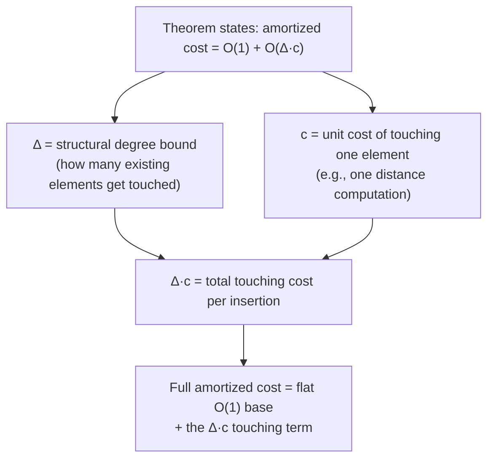

## How to Read an Amortized-Cost Theorem Statement, Including What an Expression Like O(Delta Times Some Per-Operation Cost) Is Actually Claiming

### Why This Is Its Own Skill, Separate From Doing the Proofs

Everything in this chapter so far has been about *constructing* an amortized bound — tracing costs by hand, summing a geometric series, building a potential function. This item is about the different, and in some ways more immediately useful, skill of *reading* an amortized-cost theorem that someone else has already proven and published, without re-deriving it from scratch. This matters concretely and specifically for later material: Chapter 06: Classical Incremental Data Structures as Worked Amortization Case Studies will present theorem statements for B-trees, LSM-trees, incremental minimum spanning trees, and incremental Voronoi diagrams without re-proving each one line by line, and Chapter 10: Capstone: The Named Mechanisms This Thesis Builds On will require correctly parsing a real published result — EraRAG's Theorem 4 — well enough to explain what it actually guarantees. A reader who can only reconstruct proofs by hand but cannot correctly parse someone else's finished theorem statement will misread both.

**Grounding analogy.** Reading an amortized-cost theorem is structurally similar to reading a database index's documented complexity guarantee — say, "B-tree lookup is $O(\log_B n)$ where $B$ is the branching factor." Getting real value out of that statement requires knowing precisely what $n$ and $B$ refer to, what's being quantified over (any tree? a specific balanced construction?), and what the statement does *not* claim (it says nothing about insertion cost, nothing about worst-case disk seeks under a specific storage engine). An amortized-cost theorem carries the same kind of precision, and the same kind of risk if that precision is skimmed past.

### The Generic Anatomy of an Amortized-Cost Theorem Statement

Nearly every amortized-cost theorem, however it's phrased in the original source, decomposes into four parts, and reading one correctly means identifying all four explicitly rather than skimming past any of them:

1. **The quantifier: what is this claim true for?** Almost always "for any sequence of $m$ operations," sometimes restricted further ("...starting from an empty structure," or "...consisting only of insertions, with no deletions"). This quantifier is exactly the adversarial "for all sequences" scope discussed earlier in this chapter — recall that this is what makes the claim a worst-case guarantee rather than a statistical one.
2. **The variables and what each one actually counts.** Commonly $n$ (the number of elements currently stored) and $m$ (the number of operations in the sequence being analyzed) — and a very common, easy-to-miss subtlety: $n$ and $m$ are *not always the same number*, even though in a pure insertion-only sequence (like the array-doubling example) they happen to coincide. A sequence that mixes insertions and deletions can have $m$ operations while $n$, the current element count, fluctuates up and down independently.
3. **What kind of quantity is being bounded — a total, or a per-operation average?** A theorem might state "the total cost of the sequence is $O(m)$" or, equivalently but phrased differently, "the amortized cost per operation is $O(1)$." These are the same claim (dividing the first by $m$ gives the second), but a careless reader can mistake one phrasing for the other and misjudge what a single operation is guaranteed to cost.
4. **Any structural parameters specific to that data structure**, often given single-letter names distinct from $n$ and $m$ — a maximum degree, a branching factor, a tree height, a rebalancing threshold. This is where notation like $\Delta$ (discussed at length below) typically appears.

### Reading a Familiar Theorem First, to Establish the Pattern

Restate the dynamic-array-doubling result from earlier in this chapter in the formal style a textbook or paper would actually use:

> **Theorem (illustrative, matching the array-doubling result derived earlier).** For any sequence of $m$ insertions into an initially empty dynamic array that doubles its capacity on overflow, the total cost of the sequence is $O(m)$. Equivalently, each insertion has amortized cost $O(1)$.

Parsing this against the four-part anatomy above:

| Anatomy piece | What it is here |
|---|---|
| Quantifier | "For any sequence of $m$ insertions" — any order, any values, adversarially chosen; "starting from an initially empty array" restricts to sequences beginning with $\Phi_0 = 0$ |
| Variables | $m$ = number of insertions performed; here $n$ (current element count) and $m$ happen to coincide, since every operation is an insertion with no deletions |
| Total vs. per-operation | Stated both ways in this theorem — "$O(m)$" total, and equivalently "$O(1)$" amortized per operation, since $O(m)/m = O(1)$ |
| Structural parameters | None beyond $m$ itself — no separate degree or branching parameter is needed for this particular structure |

This matches, term for term, the $T(n) \le 3n$ result derived by hand earlier in this chapter — reading the formal theorem statement correctly should produce no surprises for a reader who already worked through that derivation directly.

### A Second, Harder Example: Reading a Theorem With a Structural Parameter

Now introduce a theorem template of the kind that appears once a structure's amortized cost depends not just on the operation count but on some structural property of the data structure itself — this is the "$O(\Delta \cdot c)$" style pattern this item's title points to. Consider the following illustrative template (constructed here to teach the reading skill, not attributed to any specific named paper):

> **Theorem (illustrative template).** Consider a structure in which inserting a new element touches at most $\Delta$ existing neighboring elements, and each such touch costs $O(c)$. Then, for any sequence of $m$ insertions, the amortized cost per insertion is $O(1) + O(\Delta \cdot c)$.

**Reading this term by term.** $\Delta$ (the capital Greek letter delta, conventionally used across many amortized-analysis papers to denote a bound on how much work a single operation can trigger elsewhere in the structure) here represents a *structural degree bound* — the maximum number of existing elements any single new insertion is allowed to touch or modify. $c$ represents the *unit cost* of touching one such neighbor — for instance, one distance computation, one pointer update, one comparison. The product $\Delta \cdot c$ is therefore "how many things get touched, times how expensive touching one thing is" — and the theorem is saying that on top of a flat $O(1)$ base cost, every insertion's amortized cost also carries this second term, scaled by the structure's own degree-bound parameter.

**Why this specific pattern should look familiar.** Recall from Chapter 04: Approximate Nearest-Neighbor Search and HNSW that $M$ (the maximum node degree per layer) plays exactly this role in HNSW: inserting a new node touches up to $M$ existing neighbors directly, and — because those neighbors' own edge lists may need re-pruning to stay within their degree budget — potentially a bounded number of neighbors-of-neighbors as well. A theorem bounding HNSW-style insertion cost in terms of $M$ (playing the role of $\Delta$ here) and the cost of a single distance computation (playing the role of $c$) would follow exactly this template — which is precisely why this generic reading skill, developed now with an illustrative example, transfers directly to reading a real published bound of the same shape later.

### Common Misreadings, and How to Catch Them

**Misreading 1 — treating the amortized bound as a per-operation worst-case guarantee.** The single most common error: reading "amortized cost $O(1)$" and concluding that *every* individual operation costs $O(1)$ in the worst case. Recall from earlier in this chapter that a single resize in array doubling genuinely costs $O(n)$ — the amortized theorem never disputes this. The fix: whenever an amortized theorem is read, mentally ask "does this claim anything about a *single* operation, or only about totals/averages across a sequence?" — the answer is almost always the latter unless the theorem explicitly says otherwise.

**Misreading 2 — dropping the initial-potential term.** The general potential-method inequality derived earlier in this chapter was $\sum c_i \le \sum \hat{c}_i + \Phi_0$. A theorem stating "amortized cost is $O(1)$ per operation" is technically only bounding total cost up to *an additive constant equal to the starting potential* — usually zero for a structure that starts empty, but not automatically zero for a structure that's initialized with existing content. Reading past this term can lead to under-stating a theorem's true cost for a structure that isn't starting from scratch.

**Misreading 3 — conflating $n$ and $m$ when a theorem uses both.** As noted above, $n$ (current element count) and $m$ (sequence length) coincide in an insertion-only sequence, but the moment deletions or other operation types are mixed in, they diverge, and a theorem phrased in terms of $m$ says nothing directly about how cost depends on the structure's *current size* $n$ at any given moment — only about the total across the whole sequence. Misreading a bound stated in $m$ as if it were stated in $n$ (or vice versa) is a common and consequential error, especially once Chapter 06 introduces structures where insertions and deletions coexist.

**Misreading 4 — missing what the quantifier actually restricts.** "For any sequence of $m$ operations" is a much stronger and more useful claim than "for a *random* sequence of $m$ operations," and "starting from an empty structure" is a real restriction that doesn't automatically extend to a structure that's already partially built. A theorem's exact quantifier phrase should be read as carefully as its symbolic content — a claim that quietly assumes a specific starting state, or a specific mix of operation types, does not automatically generalize beyond what it states.

### A Step-by-Step Checklist for Reading a New Amortized-Cost Theorem

1. Identify the quantifier precisely: what sequences, and from what starting state, does this claim cover?
2. Identify every variable by what it counts, not just its letter — especially distinguishing $n$ (current size) from $m$ (sequence length) if both appear.
3. Determine whether the stated bound is a *total* over the sequence or a *per-operation amortized* figure, and convert mentally between the two by dividing or multiplying by $m$.
4. Identify any structural parameters (degree bounds, branching factors, height bounds — often given names like $\Delta$, $M$, $B$, or $k$) and understand concretely what each one measures about the structure, not just its symbol.
5. Explicitly restate, in plain language, what the theorem does *not* claim — in particular, that it says nothing about the cost of any single specific operation in isolation.

**Key Points**
- Every amortized-cost theorem decomposes into four readable parts: its quantifier (what sequences it covers), its variables (and what each genuinely counts), whether it bounds a total or a per-operation average, and any structural parameters specific to that data structure.
- An expression like $O(\Delta \cdot c)$ describes a cost that scales with a structural degree bound ($\Delta$ — how many existing elements a single operation touches) multiplied by a unit cost ($c$ — the cost of touching one such element) — a pattern that generalizes directly from this chapter's illustrative template to HNSW's own $M$ parameter from Chapter 04.
- $n$ (current structure size) and $m$ (sequence length) coincide in insertion-only sequences but diverge once deletions or other operation types are mixed in — conflating them is a common misreading.
- An amortized bound never claims anything about a single operation's individual worst-case cost; it only bounds a total or an average across an entire adversarially-chosen sequence.

**Conclusion**
Learning to read an amortized-cost theorem as a structured object — quantifier, variables, total-versus-per-operation framing, and structural parameters — rather than as a single opaque Big-O expression is what makes it possible to correctly absorb a published result without re-deriving its proof from first principles. This exact reading discipline is what Chapter 06: Classical Incremental Data Structures as Worked Amortization Case Studies will lean on immediately when presenting B-tree, LSM-tree, incremental MST, and incremental Voronoi diagram theorems without full proofs, and it is precisely the skill Chapter 10: Capstone: The Named Mechanisms This Thesis Builds On requires to correctly explain what EraRAG's Theorem 4 actually guarantees, rather than merely gesturing at its Big-O expression without being able to say what each symbol in it means.

**Related Topics**
- The "banker's method" and "physicist's method" as alternative names sometimes used for potential-method-style theorem framings in the literature
- Reading a theorem's proof sketch to identify whether it uses the aggregate method or the potential method
- Structural degree-bound parameters across different data structures: $M$ in HNSW, branching factor in B-trees, fan-out in LSM-trees
- Distinguishing a total-cost theorem from a per-operation theorem when a paper states only one form
- Applying this reading checklist directly to EraRAG's Theorem 4 in Chapter 10