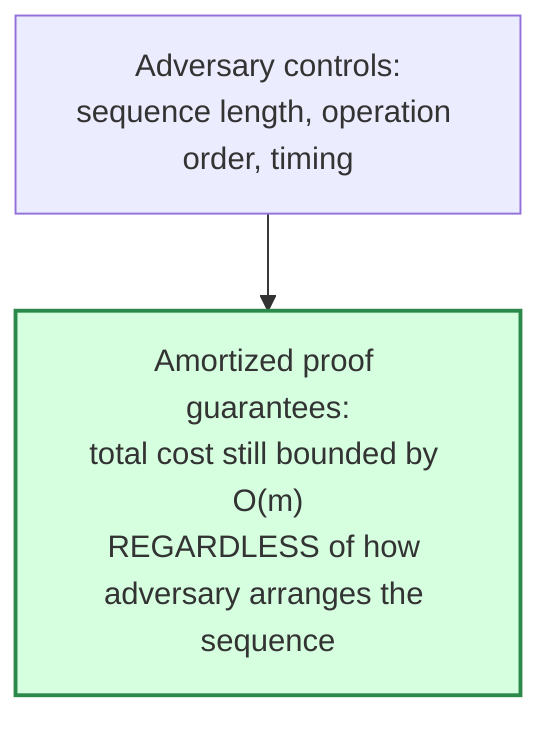

## What an Amortized-Cost Proof Is Protecting You Against, and What Kind of Adversarial Input It Does Not Protect You Against

### Reframing the Question: Every Guarantee Has a Threat Model

Recall from earlier in this chapter that an amortized-cost bound is a worst-case claim over any possible *sequence* of operations — a strong guarantee, proven by the aggregate method or the potential method, that holds regardless of how an adversary arranges the sequence. It is tempting, having just established that this guarantee is adversary-proof with respect to sequence arrangement, to conclude that amortized analysis makes a data structure immune to bad behavior of any kind. This item exists specifically to correct that overreach: an amortized-cost proof has a precise threat model — a specific, bounded notion of what "adversarial" means — and real systems are frequently subject to adversarial pressure of a *different kind* that the proof says nothing about at all.

**Grounding analogy.** A network protocol's congestion-control algorithm might be proven to guarantee fair bandwidth sharing under the assumption that all participants follow the protocol honestly. That proof is genuinely valuable and genuinely rigorous — but it says nothing about a participant who doesn't follow the protocol at all (a misbehaving client that ignores congestion signals), because "adversarial" in the proof's threat model meant "an honest participant with adversarially bad luck or timing," not "a participant who breaks the rules the proof assumed." An amortized-cost proof has an analogous, precisely bounded scope, and the rest of this item is about identifying exactly where that scope's boundary sits.

### What the Proof Genuinely Protects Against: Adversarial Sequence Construction

Restate the guarantee precisely, using the dynamic-array-doubling result as the running concrete anchor. The theorem proven earlier in this chapter says: for *any* sequence of $m$ insertions — any values, in any order, chosen by anyone, including an adversary trying to maximize total cost — the total cost is $O(m)$. This means an adversary gets full, unrestricted control over one specific thing: **the sequence of operations submitted to the structure.** The adversary can:

- Choose the exact number of insertions.
- Choose to insert values in any order (though for array doubling, the *values themselves* don't affect cost at all — only the *count* and *position* of operations in the sequence matters, since resizing is triggered by count, not by value).
- Time operations however they like, submit them one after another as fast as possible, interleave them with other operations if the structure supports other operation types.

And no matter how cleverly any of this is arranged, the total cost stays bounded by $3m$ (the constant derived earlier in this chapter). This is a genuinely strong and useful guarantee — it rules out an entire category of concern, namely "what if the input happens to be arranged in the worst possible way for triggering repeated expensive resizes back-to-back." The proof handles that category completely, for every possible arrangement, not just plausible or typical ones.

### What the Proof Does Not Cover: Everything Outside the Cost Model Itself

The threat model above is bounded by a silent but crucial assumption: it protects against adversarial *sequencing* of operations that the cost model already accounts for — but it says nothing about adversarial pressure applied to assumptions the cost model takes for granted. Three concrete categories where this gap shows up:

**Category 1 — adversarial manipulation of quantities the cost model treats as free or fixed.** The dynamic-array-doubling proof assumes each element write and each element copy costs exactly 1 unit, uniformly, regardless of the element's actual content. If the *real* cost of storing or copying a specific value could vary — for instance, if elements were variable-length strings and copying cost depended on string length rather than being a fixed unit — an adversary who controls the *content* of what's being inserted, not just the sequence structure, could potentially violate the uniform-unit-cost assumption the whole proof rests on. The amortized theorem, as proven, has nothing to say about this scenario, because it was never part of what the theorem modeled; it isn't that the theorem is wrong, it's that a different theorem, with a different cost model, would be needed.

**Category 2 — adversarial exploitation of a structural assumption the proof didn't examine.** This is the category most relevant to structures more complex than array doubling. Recall from the previous item in this chapter that a theorem of the shape "amortized cost is $O(1) + O(\Delta \cdot c)$" bounds cost in terms of a structural degree parameter $\Delta$. If the real system allows $\Delta$ itself to be influenced by adversarial input — for instance, if an attacker could somehow engineer inputs that push a structure's actual degree far above the $\Delta$ the theorem assumed as fixed — the amortized guarantee, still mathematically true as *stated*, would no longer describe what's actually happening in the deployed system, because the deployed system would have silently drifted outside the parameter regime the theorem covers.

**Category 3 — adversarial pressure on a resource the cost model didn't measure at all.** An amortized-cost theorem for array doubling measures *time* (or, equivalently, unit operations like writes and copies) — it says nothing whatsoever about *memory*. A doubling array can, immediately after a resize, be using up to roughly twice the memory strictly necessary for its current element count (the old array briefly coexists with the new one during the copy, and even after the copy, capacity $C$ can be up to $2n$). An adversary aware of this could construct a sequence — for instance, repeatedly inserting just past each power-of-2 threshold and never filling the resulting capacity further — that keeps the structure persistently near its worst memory-overhead ratio, a form of adversarial pressure the time-cost theorem is entirely silent about, because memory was never the quantity being bounded.

### A Worked Illustration: Same Structure, Two Different Adversarial Questions

Take the array-doubling structure and pose two adversarial questions about it side by side, to make the boundary between "covered" and "not covered" fully concrete:

| Adversarial question | Is this covered by the $O(1)$ amortized-time theorem? | Why |
| --- | --- | --- |
| "Can an adversary choose an insertion sequence that makes total time cost exceed $3m$?" | No — provably impossible | This is exactly the quantity and threat model the theorem was proven against |
| "Can an adversary choose an insertion sequence that maximizes the *ratio* of allocated capacity to actually-used elements, at some specific moment?" | Not addressed | The theorem bounds cumulative time cost, not the memory-overhead ratio at a snapshot in time — a legitimate and answerable question, but a different one requiring a different (space-focused) analysis |
| "Can an adversary supply elements whose *individual* write/copy cost is far higher than the unit cost the theorem assumed?" | Not addressed | The theorem's cost model assumes uniform per-element cost; if that assumption is false for the real workload, the theorem's numeric bound no longer describes real wall-clock cost, even though the theorem itself remains mathematically valid under its stated assumptions |
| "Can an adversary submit insertions concurrently from multiple threads to increase lock contention?" | Not addressed | The theorem, as proven, implicitly assumes sequential execution; concurrent execution introduces a cost source (contention, synchronization overhead) entirely outside the model |

The pattern across all three "not addressed" rows is the same: **the amortized theorem is airtight about the exact quantity it was proven to bound, under the exact cost model it assumed, and says nothing whatsoever about any other quantity or any violation of that cost model.** This is not a weakness specific to amortized analysis — every mathematical theorem has this property, since a proof only establishes what it was constructed to establish — but it is a weakness specific to *how amortized-analysis results tend to get cited casually*, where "amortized $O(1)$" is sometimes informally treated as a blanket assurance that a structure "behaves well" in every dimension, rather than the narrow, precise, and correct claim it actually is.

### Why This Distinction Matters Directly for Later Material

This item's boundary-drawing exercise is not academic housekeeping — it is the exact caution needed before the amortized-analysis toolkit gets applied to a genuinely open research question. Chapter 07: The Cost of Growing a Structure: Fusing the Vector Track and the Amortization Track will ask whether ANN-index insertion into a growing graph exhibits amortized-cheap behavior the way array doubling does. Answering that question well requires being explicit, in exactly the style of this item, about which threat model any claimed bound covers: does a claim that ANN-index insertion is "cheap on average as the graph grows" protect against *any* insertion order and *any* embedding distribution an adversary — or simply an unlucky real-world data stream — might produce? Or does it quietly assume, the way the array-doubling proof assumes uniform per-element cost, that embeddings arrive from a stable, well-behaved distribution, and would it silently stop applying if that assumption were violated by real data drifting into a new region of the vector space (the exact distribution-mismatch failure mode discussed in Chapter 04: Approximate Nearest-Neighbor Search and HNSW)? Asking "what threat model does this bound actually cover" before trusting any such claim is the single most transferable habit this item is meant to instill.

**Key Points**

- An amortized-cost proof genuinely protects against any adversarial *sequencing* of operations — order, timing, count — within the cost model the proof assumed.
- It does not protect against adversarial manipulation of quantities the cost model treated as fixed or uniform (e.g., per-element cost), against structural parameters drifting outside their assumed range, or against costs in a dimension the theorem never measured (e.g., memory, concurrency overhead).
- The same structure can have a rock-solid time-cost guarantee and simultaneously be vulnerable to adversarial pressure along a completely different axis, such as memory-overhead ratio, that the time-cost theorem never claimed to bound.
- Before trusting any amortized-cost claim, the useful habit is asking exactly what quantity it bounds, under what cost-model assumptions, and against what class of adversarial sequences — rather than treating "amortized $O(1)$" as a blanket assurance of good behavior in every respect.

**Conclusion**

An amortized-cost proof is a precise, narrow, and genuinely powerful guarantee — precise about exactly which quantity it bounds, narrow about exactly which kind of adversarial behavior it rules out, and powerful within that scope because it holds for literally any sequence an adversary could construct inside it. Recognizing where that scope ends — at the boundary of the cost model's own assumptions, not at the boundary of "bad things that could happen to this data structure" — is what separates correctly citing a theorem from silently overclaiming what it protects against, a distinction Chapter 07: The Cost of Growing a Structure: Fusing the Vector Track and the Amortization Track will need applied carefully the moment it asks whether a growing graph's insertion cost curve actually matches what an amortized-style theoretical bound would predict, or whether real, evolving data quietly violates the assumptions any such bound would have to make.

**Related Topics**

- Distinguishing a cost model's assumptions from the guarantee it produces, as a general skill for reading any complexity theorem
- Memory-overhead analysis for dynamic arrays as a separate concern from time-cost amortization
- Concurrent and multi-threaded amortized analysis as an extension beyond the sequential-execution assumption
- Distribution drift in streaming or growing datasets as a real-world analog of violating a proof's implicit input assumptions
- Applying threat-model boundary-drawing to evaluate whether ANN-index insertion cost claims hold under adversarial or drifting embedding distributions