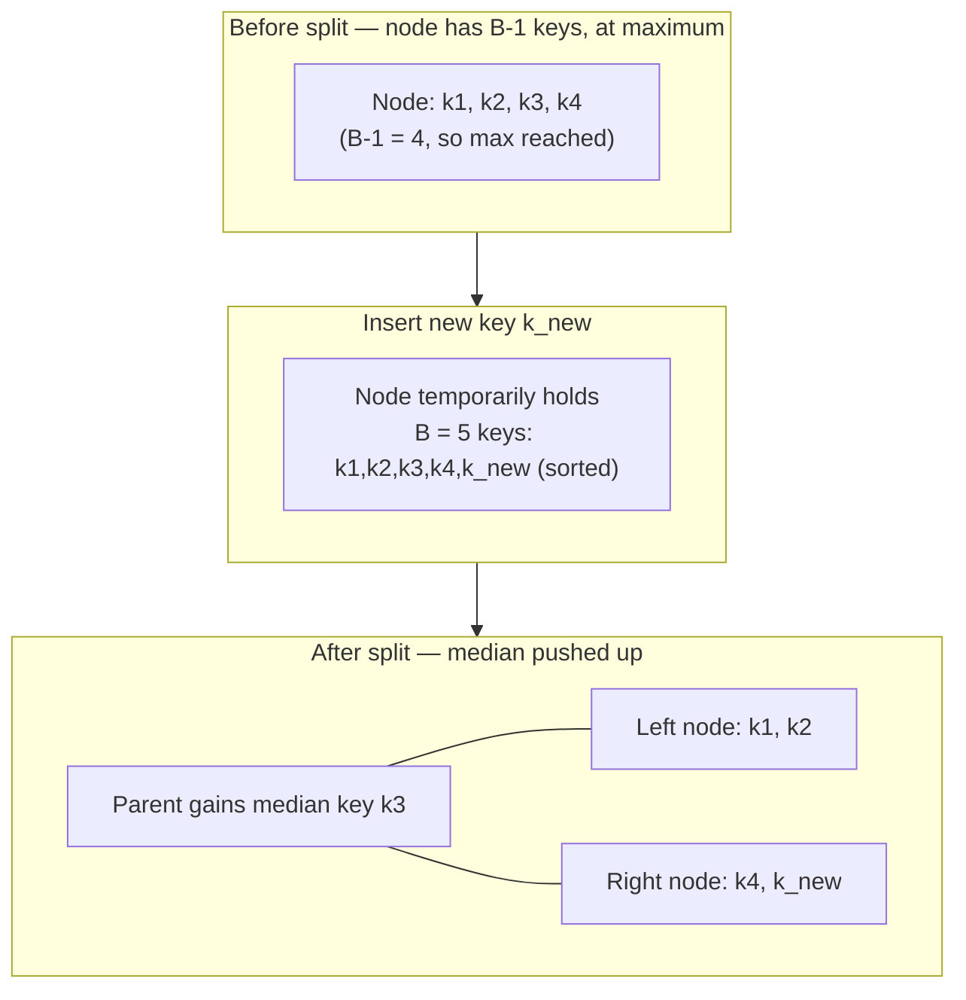

## B-Trees as a Bounded-Node-Size Data Structure, and Why Keeping Every Node Between a Minimum and Maximum Size Is the Key Design Choice

### Entering This Chapter: What's Assumed, What's New

Recall from Chapter 05: Amortized Analysis: Why "Sometimes Expensive" Can Still Be Provably Fine that both the aggregate method (summing a sequence's total cost directly) and the potential method (defining a state-dependent function $\Phi$ whose changes telescope to bound that same total) prove the identical class of claim: an occasional expensive operation, if properly rationed by preceding cheap ones, doesn't blow up the average cost per operation. This chapter's job is to walk that exact proof pattern through a sequence of real, load-bearing data structures — starting here with B-trees — and to show, concretely rather than by assertion, that the same rationing logic reappears every time. The reader is assumed to already know what a B-tree is structurally (a self-balancing search tree generalizing a binary search tree to nodes holding multiple keys and multiple children, widely used in databases and filesystems for exactly the reason this item is about to explain) — this item is not a general B-tree tutorial, it is specifically about *why the bounded-node-size design choice is the thing that makes amortized analysis of B-tree insertion possible at all.*

### The Design Choice, Stated Precisely

A B-tree of order $B$ enforces, for every internal node (except possibly the root): a **minimum** of $\lceil B/2 \rceil - 1$ keys, and a **maximum** of $B - 1$ keys. Equivalently, every internal node has between $\lceil B/2 \rceil$ and $B$ children. This dual bound — never too empty, never too full — is the single design decision this item is built around, and it is worth being explicit about why *both* bounds matter, since it's tempting to focus only on the maximum (the one that triggers a "split" operation, discussed below) and overlook that the minimum is doing equally important work.

**Grounding analogy.** Think of a database's fixed-size disk page: a B-tree node is designed to occupy exactly one such page, and a page has a hard physical maximum capacity — you cannot write more bytes onto a 4KB page than 4KB. That gives an obvious reason for the maximum bound. The minimum bound is less obviously physical but equally deliberate: a page that's allowed to become nearly empty wastes the fixed cost of a disk seek or a cache-line fetch to retrieve a page holding almost no useful data — if the tree allowed nodes to shrink to just one key, most of the tree's height would be spent traversing barely-populated pages, defeating the entire point of grouping many keys per node in the first place.

### Why the Maximum Bound Exists: Preventing Unbounded Node Growth

Without a maximum, a node could accept keys indefinitely, degrading in the worst case into something resembling an unsorted (or sorted, but unbalanced) list — searching within an oversized node, and updating it, would no longer be a cheap, bounded operation. The maximum bound of $B-1$ keys per node guarantees that any single node's internal search and update cost is a small constant *relative to* $B$ (with $B$ itself chosen as a fixed system parameter, typically sized to match a disk page or cache line), never growing with the total number of elements $n$ stored in the whole tree.

**What happens when the maximum is exceeded: the split operation.** Inserting into a node that is already at its maximum of $B-1$ keys triggers a **split**: the node's $B$ keys (the existing $B-1$ plus the new one) are divided into two nodes of $\lfloor (B-1)/2 \rfloor$ and $\lceil (B-1)/2 \rceil$ keys respectively, and the median key is pushed up into the parent node — which may, in turn, cause the parent to exceed *its* maximum, cascading the split upward. In the worst case, a single insertion can cascade splits all the way from a leaf up to the root, causing the tree's height to grow by one level (this is the single expensive case in B-tree insertion, structurally analogous to the resize event in dynamic array doubling from Chapter 05).

### Why the Minimum Bound Exists: Preventing Pathological Height Growth

The minimum bound does a different, equally essential job, one that only becomes visible when considering the tree's *height* rather than any single node's size. Because every internal node is guaranteed to have **at least** $\lceil B/2 \rceil$ children, the tree's height is provably bounded: with $n$ total keys stored, the height of a B-tree of order $B$ is $O(\log_{B} n)$ — specifically, height is at most $\log_{\lceil B/2 \rceil}(n+1)$, since the minimum branching factor at every level, compounded across levels, is what forces the tree to stay shallow. Without the minimum bound, nothing would stop the tree from becoming pathologically tall and thin — for instance, a tree where deletions were allowed to leave nodes nearly empty could, over enough operations, degrade toward something closer to a linked list of near-empty nodes, losing the $O(\log_B n)$ height guarantee entirely.

**What happens when the minimum is violated: merging or key-borrowing.** Although this item's central focus is insertion (deletion's mechanics are outside its scope), it's worth noting concretely what the minimum bound protects against and how it's maintained: when a deletion would drop a node below $\lceil B/2 \rceil - 1$ keys, the structure either **borrows** a key from an adjacent sibling that has keys to spare, or, if no sibling can spare one, **merges** the underfull node with a sibling, again potentially cascading the adjustment upward toward the root. The maximum bound is enforced going *up* the tree on insertion (a split can propagate toward the root); the minimum bound is enforced going *up* the tree on deletion (a merge can propagate toward the root) — a clean structural symmetry between the two directions of imbalance the bounds are designed to prevent.

### Why "Between a Minimum and a Maximum" Is the Key Phrase, Not Just "Bounded"

It would be possible to describe a B-tree node merely as "capped at $B-1$ keys," but that description alone misses half of what makes the structure work. A node that is only capped above (no floor on how small it can get) can still degrade toward pathological height under deletions, even though it would never violate the "capped at $B-1$" property. The *combination* — a floor and a ceiling, both expressed relative to the same parameter $B$ — is what jointly guarantees two properties simultaneously: (1) any single node's internal operations stay cheap, bounded by $B$; and (2) the tree's overall height stays logarithmic in $n$, because no level of the tree can ever become populated by near-empty nodes without triggering a corrective merge.

| Bound | What it directly prevents | What breaks without it |
|---|---|---|
| Maximum ($B-1$ keys) | A single node growing without limit | Per-node search/update cost would grow with $n$ rather than staying bounded by $B$ |
| Minimum ($\lceil B/2 \rceil - 1$ keys) | A node becoming nearly empty | Tree height could degrade toward $O(n)$ in the worst case, losing the $O(\log_B n)$ guarantee entirely |

### Setting Up the Amortized-Analysis Question This Design Choice Makes Answerable

Here is the connection back to Chapter 05 that this entire item has been building toward: the bounded-node-size design is precisely what makes B-tree insertion amenable to the *same style* of amortized argument used for dynamic array doubling. Recall the two-part cost split used repeatedly in Chapter 05 — a flat, always-charged baseline cost, plus an occasional, structurally-bounded surcharge (copying, in the array case). B-tree insertion has an exactly analogous two-part shape: every insertion pays a baseline cost of walking down the tree and inserting into a leaf ($O(\log_B n)$, from the height bound the minimum-size rule guarantees), plus, only occasionally, the surcharge of one or more cascading splits (triggered by the maximum-size rule). The question of *how often* that surcharge actually occurs, and how expensive it is when it does — the question that determines whether B-tree insertion achieves the same kind of small-amortized-constant result that array doubling did — is precisely what the next item in this chapter takes up directly, applying the aggregate or potential method to the split-cascade mechanism just described here.

**Key Points**
- A B-tree node's size is bounded on both ends — a minimum of $\lceil B/2 \rceil - 1$ keys and a maximum of $B-1$ keys — and both bounds are load-bearing, not redundant.
- The maximum bound keeps any single node's internal cost bounded by the fixed parameter $B$, independent of total tree size $n$; violating it triggers a split, which can cascade upward toward the root.
- The minimum bound keeps the tree's height provably $O(\log_B n)$ by guaranteeing a minimum branching factor at every level; violating it (via deletion) triggers borrowing or merging, which can also cascade upward.
- This bounded-node-size design produces exactly the two-part cost shape — flat baseline plus occasional, structurally-limited surcharge — that Chapter 05's amortized-analysis techniques are built to handle.

**Conclusion**
The decision to keep every B-tree node between a minimum and a maximum size, rather than bounding it in only one direction, is what simultaneously guarantees cheap per-node operations and a shallow overall tree — and, just as importantly for this chapter's purposes, is what produces an insertion-cost pattern structurally identical in shape to dynamic array doubling's flat-cost-plus-occasional-resize pattern from Chapter 05. Having established *why* this bound exists and *what* it guarantees structurally, the next item in this chapter turns to the amortized-cost question directly: given that a single insertion can, in the worst case, cascade a split all the way to the root, what is the true amortized cost of B-tree insertion, and how does the aggregate or potential method prove it?

**Related Topics**
- The split cascade traced step by step, and its amortized cost proven via the aggregate or potential method
- Borrowing versus merging on deletion, and the symmetric role the minimum bound plays there
- Choosing $B$ in practice to match disk page size or cache-line size in real database and filesystem implementations
- B+ trees as a leaf-linked variant optimized for range queries, contrasted with the plain B-tree described here
- How the bounded-node-size pattern reappears, in a different guise, in LSM-trees' bounded-size level structure