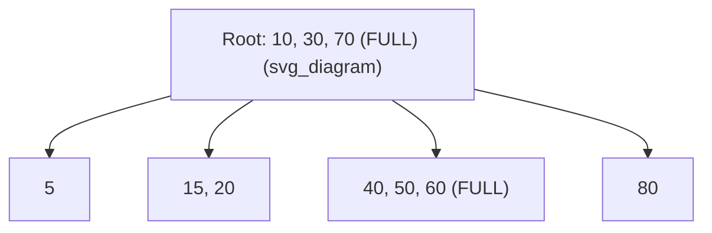
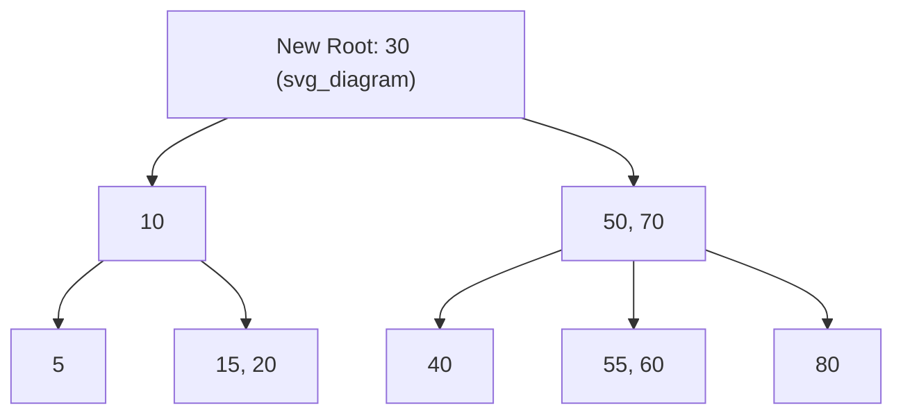

## Tracing a B-Tree Node Split Step by Step, and Why a Split Can Never Cascade Further Than a Small, Bounded Number of Ancestor Nodes

### Recap: What This Item Builds On

Recall the potential method from amortized analysis: you attach a numeric potential $\Phi$ to the data structure's current state, and the amortized cost of an operation is defined as $\hat{c}_i=c_i+\Delta\Phi$, where $c_i$ is the operation's actual cost and $\Delta\Phi$ is the change in potential caused by that operation. If $\Phi$ never drops below its starting value, the sum of amortized costs upper-bounds the sum of actual costs over any sequence of operations — so a structure can have occasional expensive operations and still be cheap "on average," as long as those expensive operations are shown to be paid for by potential that cheaper operations built up beforehand.

This item applies that machine to a single, concrete mechanism: a B-tree node overflowing on insert and splitting, with the split possibly propagating upward into ancestor nodes.

### The Working B-Tree Definitions Used Below

A B-tree of minimum degree $t$ constrains every node except the root to hold between $t-1$ and $2t-1$ keys, and every internal node to have one more child than it has keys. A node with exactly $2t-1$ keys is **full**: it has no room left, and the next key routed into it will force a split. For concreteness, every example below uses $t=2$, so every non-root node holds between $1$ and $3$ keys — small enough to trace by hand, structurally identical in behavior to any larger $t$.

### The Analogy: An Overflowing Directory Page

Picture a B-tree node as a fixed-size directory page in a database index — it can hold a bounded number of sorted key/pointer entries before it's physically full, the same way a disk page has a byte budget. When a new entry needs to go into a page that has no free slots, the page can't just grow; instead its contents are divided across two pages, and a single new entry — a pointer plus a separating key — has to be written into whichever page routes readers to those two new pages. That routing page is the parent. If *it* also happens to be completely full, the same problem recurs one level up. This is exactly the split-and-promote mechanism traced below.

### Anatomy of a Single Split

When a node holding $2t-1$ keys receives one more key, it momentarily holds $2t$ keys — over the limit. The split operation:

1. Sorts the $2t$ keys (they were already sorted; the new key is inserted in position).
2. Designates the key at index $t-1$ (0-indexed) as the **median**.
3. Keeps the first $t-1$ keys as a new left node.
4. Keeps the last $t$ keys as a new right node.
5. Removes the two original children lists and re-splits them between the new left and right nodes at the same boundary.
6. Inserts the median key — with pointers to the new left and right nodes — into the parent, in the parent's correct sorted position.

Step 6 is the only step that touches another node. Whether the split "cascades" depends entirely on whether the parent had room for that one extra key.

### Worked Example: The Common Case — A Split That Does Not Cascade

Take this tree ($t=2$, max 3 keys per node):

Root: `[10, 30, 70]` — **full**

- C1 (`< 10`): `[5]`
- C2 (`10–30`): `[15, 20]`
- C3 (`30–70`): `[40, 50, 60]` — **full**
- C4 (`> 70`): `[80]`

Insert `17` into C2. C2 is not full (`2` keys, max `3`), so `17` simply slots in: C2 becomes `[15, 17, 20]`. No overflow, no split, no touch to the parent at all. This is the ordinary case, and it's why B-tree inserts are usually cheap: most keys land in a node that still has slack.

### Worked Example: Tracing a Cascade All the Way to the Root

Now insert `55`, which routes into C3 = `[40, 50, 60]`.

**Step 1 — leaf overflow and split.** C3 already had `3` keys (full); adding `55` gives `[40, 50, 55, 60]` — `4` keys, over the limit for $t=2$. Split: left = `[40]`, median = `50` (promoted), right = `[55, 60]`.

**Step 2 — the promotion hits a full parent.** The root was already full at `[10, 30, 70]`. Inserting the promoted key `50` between `30` and `70` gives `[10, 30, 50, 70]` — `4` keys, over the limit again. The root must split too: left = `[10]`, median = `30` (promoted), right = `[50, 70]`.

**Step 3 — the split reaches the root itself.** Because the node that just split *was* the root, there's no parent left to absorb the promoted key `30`. A brand-new root is created holding only `[30]`, with the two halves of the old root as its two children. This is the one situation where a B-tree's height increases.

Before the insertion:

After the cascade resolves:

Two splits happened in this single insertion — the leaf and the root — because both nodes on the path happened to already be full. That's the mechanism. The question the rest of this item answers is why this doesn't make insertion expensive in general.

### Why the Amortized Cascade Length Is a Small Constant

Define the potential function

$$\Phi(T)=\text{the number of full nodes currently in }T$$

This satisfies the requirement the potential method needs: $\Phi$ is always $\ge0$, and an empty or freshly built small tree starts at $\Phi=0$ or some small constant, so it never has to "borrow from the future."

Track $\Phi$ across the three example cases above, using "number of splits performed" as the actual cost $c_i$:

| Case | Full nodes before | Full nodes after | $c_i$ (splits) | $\Delta\Phi$ | $\hat c_i=c_i+\Delta\Phi$ |
| --- | --- | --- | --- | --- | --- |
| Insert `17` into non-full C2, C2 stays non-full | Root, C3 → $\Phi=2$ | Root, C3 → $\Phi=2$ | $0$ | $0$ | $0$ |
| Insert `17` into non-full C2 in a variant where C2 *becomes* full | $\Phi=2$ | Root, C3, C2 → $\Phi=3$ | $0$ | $+1$ | $1$ |
| Insert `55`, full cascade to a new root | Root, C3 → $\Phi=2$ | none full → $\Phi=0$ | $2$ | $-2$ | $0$ |

The pattern in the third row generalizes. Every split takes one full node (contributing $1$ to $\Phi$) and replaces it with two nodes that are each guaranteed non-full — a node splitting from $2t$ keys into pieces of $t-1$ and $t$ keys can't reach $2t-1$ again for $t\ge2$. So each split in a cascade contributes exactly $-1$ to $\Phi$. Promoting a key upward either (a) lands in an already-full ancestor, which is forced to split too — consuming that ancestor's own pre-existing $+1$ of potential rather than adding new cost — or (b) lands in a non-full ancestor, which absorbs it and the cascade stops, contributing at most $+1$ if that absorption happens to make the ancestor newly full, or (c) reaches the root and creates a brand-new root, which is never full and so contributes $0$. Summing a cascade of $k$ splits:

$$\Delta\Phi=-k+\varepsilon,\qquad \varepsilon\in\{0,1\}$$

$$\hat c_i=c_i+\Delta\Phi=k+(-k+\varepsilon)=\varepsilon\le1$$

The $k$ cancels completely. **The amortized cost of any single insertion, measured in number of splits, is at most $1$ — a fixed small constant — no matter how many ancestors that particular insertion's cascade actually touches.** A worst-case single insertion can, if every node on its root-to-leaf path happens to be full, trigger a cascade of depth $O(\log n)$, reaching the root and growing the tree's height. But that expensive event is always "pre-paid" by the potential that accumulated across the earlier, cheaper insertions that filled each of those ancestors up to capacity one key at a time — each of which contributed its own $+1$ of amortized cost precisely to cover this moment. Summed over any sequence of $n$ insertions, the total number of splits performed is $O(n)$, not $O(n\log n)$: this is the "small, bounded" cascade cost the item title refers to, expressed as an amortized guarantee rather than a per-operation ceiling.

**Key Points**

- A single node split touches at most one other node directly: the parent that receives the promoted key. Whether the split cascades further depends only on whether that parent is already full.
- A split always leaves its two resulting nodes non-full. Consecutive splits within one cascade therefore consume potential rather than creating new obligations, which is what makes the telescoping sum in $\hat c_i=\varepsilon\le1$ work.
- "Never cascades further than a small bounded amount" is an amortized claim, not a per-operation worst-case cap: a single pathological insertion can still cascade all the way to the root ($O(\log n)$ splits), but this is provably rare enough, and paid-for enough, that it costs $O(1)$ on average.
- The base traversal cost of any B-tree operation — walking down from root to leaf — is $O(\log_t n)$ regardless of splitting, and is not part of this argument; this analysis is specifically about the extra cost splits add on top of that traversal.

### A Design Alternative: Eliminating the Cascade Structurally

The trace above uses the natural "insert first, then propagate splits upward as needed" strategy, which is what makes cascading a real (if amortized-cheap) phenomenon. A different, commonly taught implementation choice avoids cascading entirely: on the way *down* from the root to the target leaf, proactively split any full node encountered before descending into it. By the time the algorithm reaches the leaf, every ancestor on the path is already guaranteed to have room, so inserting into the leaf can require at most one split, and it never has to look back upward at all. This single-pass, top-down approach trades "occasionally do a few extra preemptive splits on nodes that might not have actually overflowed" for "never need a second, bottom-up pass." Production implementations vary in which strategy — and which further optimizations, such as redistributing keys to a sibling before resorting to a split — they use, so the exact split behavior of a given database engine's index implementation should be checked against its own documentation rather than assumed from either textbook variant.

**Related Topics**

- LSM-trees as a contrasting incremental structure — bounded compaction cost via a different potential argument, covered later in this chapter
- Incremental minimum spanning trees and incremental Voronoi diagrams — other worked case studies from the same "shared bounded-update proof family"
- The aggregate method vs. the potential method as two ways of proving the same amortized bound
- Dynamic array doubling — the simplest possible instance of "occasionally expensive, provably cheap on average"
- B+-tree leaf-splitting variants used in real database engines, where leaves are linked and often redistribute before splitting