## LSM-trees as a different bounded-size argument: buffering writes and merging them in controlled batches instead of updating in place

**Key Points**
- An LSM-tree (log-structured merge-tree) never modifies existing on-disk data in place. It buffers writes in memory, flushes them as small immutable sorted files, and periodically merges those files in geometrically-sized batches.
- The bounded-size argument here is not "bound the number of tree nodes touched per insert" (the B-tree style of argument); it is "bound the total volume of data any single record can be rewritten across, over its entire lifetime in the structure."
- A single insert can occasionally trigger a cascading merge that rewrites the entire dataset ($O(N)$ actual cost), yet the amortized cost per insert is $O(\log_T N)$, where $T$ is the size ratio between adjacent levels. This is proved with the same aggregate/potential machinery used for dynamic array doubling, applied to a structure that looks like a binary (or base-$T$) counter.

### An Analogy: The Inbox and the Filing Cabinet

Think about how a diligent but time-pressed archivist handles paperwork. Every new memo that arrives goes straight into a small "inbox" tray on the desk — fast to drop something in, no sorting required yet. The archivist never walks over to the filing cabinet and inserts a single memo into its correct alphabetical slot; that would mean shifting every folder behind it, over and over, for every single memo. Instead, once the inbox tray fills up, the archivist takes the whole tray, sorts it once, and merges it into the first drawer of the cabinet. Once that first drawer accumulates enough sorted batches, its contents get merged into a bigger, second drawer — a larger but far less frequent operation. The filing cabinet grows a hierarchy of drawers, each roughly some fixed multiple larger than the one before it, and each merge is a batch operation over an entire drawer's worth of material, never a single-memo edit buried inside an existing drawer.

This is precisely the LSM-tree's strategy applied to a sorted on-disk structure: absorb writes cheaply in a small, fast buffer; convert full buffers into immutable sorted units; and let those units combine into progressively larger, progressively less-frequently-touched levels. Nothing already written to a drawer (an on-disk sorted file) is ever edited in place — only replaced wholesale during a merge.

### Recalling the Vocabulary This Argument Needs

Recall that amortized analysis bounds the average cost per operation across a worst-case sequence of operations, even though individual operations in that sequence can vary enormously in cost. Recall that the aggregate method proves such a bound by totaling the actual cost of a sequence of $n$ operations and dividing by $n$. Recall that the potential method instead assigns a potential $\Phi$ to the structure's current state and defines the amortized cost of operation $i$ as

$$\hat{c}_i = c_i + \Phi_i - \Phi_{i-1}$$

choosing $\Phi$ so that cheap operations "bank" potential that expensive operations later "spend." Recall also that dynamic array doubling gets amortized $O(1)$ append cost because a resize that costs $O(n)$ only happens once every time the array's size doubles, so expensive resizes become exponentially rarer as $n$ grows. The LSM-tree argument below is a direct generalization of that same doubling trick, run at every level of a whole hierarchy rather than once.

### The Core Mechanism: Buffer, Flush, Compact

An LSM-tree's write path has four components:

- **Write-ahead log (WAL)**: a sequential, append-only log on disk that records every incoming write before it is acknowledged, purely for crash recovery — if the process dies before the in-memory buffer is flushed, replaying the WAL reconstructs it.
- **Memtable**: an in-memory sorted buffer (commonly a balanced tree or skip list) that absorbs new writes. Because it lives in RAM and is bounded in size, inserting into it is fast and requires no disk I/O.
- **SSTable (sorted-string table)**: an immutable, disk-resident file storing key-value pairs in sorted order, along with a sparse index for locating keys quickly. Once written, an SSTable is never edited — only read, and eventually deleted after being superseded by a merge.
- **Compaction**: the background process that merges multiple sorted SSTables at one level into a smaller number of larger, still-sorted SSTables at the next level, discarding duplicate or overwritten keys and tombstones (deletion markers) along the way.

The pipeline for a single write looks like this:

```mermaid
flowchart LR
    W[Client write] --> WAL[Write-Ahead Log]
    WAL --> MT[Memtable in RAM]
    MT -->|memtable full: flush| L0[Level 0 SSTable]
    L0 -->|L0 exceeds threshold: compact| L1[Level 1 SSTable]
    L1 -->|L1 exceeds threshold: compact| L2[Level 2 SSTable]
    L2 -->|cascades continue| L3[Level 3 SSTable ...]
```

Each level $i$ has a target capacity roughly $T$ times larger than level $i-1$, for some fixed fanout $T$ (real systems commonly use $T$ somewhere between 2 and 10). When level $i$ accumulates enough data to exceed its threshold, its contents merge into level $i+1$. Because levels grow geometrically, there are only $O(\log_T N)$ levels total for $N$ records — the same geometric-growth idea that keeps a doubling dynamic array's number of resizes down to $O(\log_2 N)$.

### The Bounded-Size Argument, Stated Precisely

The claim to prove is:

> Inserting $N$ records into an LSM-tree with fanout $T$ costs $O(N \log_T N)$ total rewrite work across the whole sequence, i.e. $O(\log_T N)$ amortized rewrite work per insert — even though a single insert can trigger a cascading compaction that rewrites $\Theta(N)$ records.

**Why it's true, intuitively.** Model the level structure as a base-$T$ counter, one "digit" per level, where digit $i$ holds a value of "weight" $T^i$ (for $T=2$ this is exactly a binary counter). Inserting one record is like incrementing the counter by one unit at the lowest digit. If that digit is empty (level 0 is not yet full), the increment is cheap — write one record, done. If that digit is full, it "carries": level 0's contents merge into level 1, at a cost proportional to level 0's full size. If level 1 was also full, the carry cascades again, at a cost proportional to level 1's (larger) size, and so on. This is structurally identical to incrementing a binary counter, where flipping a low-order bit is cheap and cascading carries through many 1-bits is expensive but rare.

Recall the potential-method idea: assign potential proportional to how "full" each level currently is (in the classic binary-counter proof, $\Phi$ = number of occupied digits). Every insert deposits a small, constant amount of potential at level 0. A merge at level $i$ is expensive in actual cost, but it also *empties* level $i$'s accumulated potential, and that release exactly offsets the merge's cost in the amortized accounting. Because a merge at level $i$ only occurs once every $T^i$ inserts (level $i$ must fill up first), the *average* contribution of level $i$'s merges to the amortized cost per insert is $O(1)$ — and since there are only $O(\log_T N)$ levels, the total amortized cost per insert across all levels is $O(\log_T N)$.

This is exactly the same proof pattern used across classical incremental structures generally: bound how much work any single element can be "charged" for across its entire lifetime in the structure, then divide by $N$. What makes the LSM-tree's version of this argument *different* from, say, a balanced search tree's is where the boundedness comes from. A balanced tree (such as a B-tree) bounds cost by keeping a root-to-leaf path short — recall that a B-tree bounds insertion cost by maintaining a small, uniform tree height via node splits, so each insert touches $O(\log N)$ nodes along one path, updating those nodes in place. An LSM-tree touches *no* existing on-disk structure in place at all; instead it bounds cost by capping how many times a record can be swept up into a larger and larger merge batch as it "ages" through geometrically growing levels. Same asymptotic shape, structurally unrelated mechanism.

### Worked Example: Tracing Eight Inserts Through a Three-Level LSM-tree

Take $T=2$. Let level 0 hold size-1 runs, up to 2 of them before merging; level 1 hold size-2 runs, up to 2 before merging; level 2 hold size-4 runs, up to 2 before merging; and so on — exactly a binary counter, where the "value" at each insert step equals that insert's index written in binary. Count "cost" in rewrite units: writing a new size-1 record costs 1 unit; merging two runs of total size $s$ into one larger run costs $s$ units (every element in the merge gets physically rewritten).

| Insert # | Binary state ($L2\,L1\,L0$) | Action | Cost | Running total |
|---|---|---|---|---|
| 1 | 001 | write new L0 run | 1 | 1 |
| 2 | 010 | write L0 (1), then L0+L0 → merge into L1 (2) | 1+2=3 | 4 |
| 3 | 011 | write new L0 run | 1 | 5 |
| 4 | 100 | write L0 (1), merge→L1 (2), L1+L1 → merge into L2 (4) | 1+2+4=7 | 12 |
| 5 | 101 | write new L0 run | 1 | 13 |
| 6 | 110 | write L0 (1), merge→L1 (2) | 1+2=3 | 16 |
| 7 | 111 | write new L0 run | 1 | 17 |
| 8 | 1000 | write L0 (1), merge→L1 (2), merge→L2 (4), L2+L2 → merge into L3 (8) | 1+2+4+8=15 | 32 |

Total actual cost across 8 inserts: 32 units. Amortized (average) cost per insert: $32/8=4$. Compare against the theoretical prediction $O(\log_T N)$: with $T=2$ and $N=8$, $\log_2 8 + 1 = 4$ — an exact match for this trace.

Notice what happened at insert 8: a single operation cost 15 units, nearly half of the entire sequence's total work, and close to $2N-1$ — an almost fully linear-cost single insert. That is the "worst-case operation can be expensive" half of the amortized guarantee. What makes the *average* still small is that an insert this expensive is rare by construction: it only recurs once every 8 inserts (once every time the counter overflows all the way), and the next time it recurs (at insert 16), it will be twice as expensive again but only half as frequent — the two effects cancel, level by level, which is exactly the geometric argument stated above.

The geometry of the level capacities driving this is:

<svg xmlns="http://www.w3.org/2000/svg" viewBox="0 0 640 320">
  <text x="320" y="30" text-anchor="middle" font-size="16" font-family="sans-serif" font-weight="bold">LSM Level Capacities Grow Geometrically (svg_diagram)</text>
  <line x1="20" y1="300" x2="620" y2="300" stroke="#333" stroke-width="2" />
  <rect x="40" y="280" width="100" height="20" fill="#4C78A8" />
  <text x="90" y="275" text-anchor="middle" font-size="12" font-family="sans-serif">1</text>
  <text x="90" y="315" text-anchor="middle" font-size="12" font-family="sans-serif">L0 (cap=1)</text>
  <rect x="180" y="260" width="100" height="40" fill="#4C78A8" />
  <text x="230" y="255" text-anchor="middle" font-size="12" font-family="sans-serif">2</text>
  <text x="230" y="315" text-anchor="middle" font-size="12" font-family="sans-serif">L1 (cap=2)</text>
  <rect x="320" y="220" width="100" height="80" fill="#4C78A8" />
  <text x="370" y="215" text-anchor="middle" font-size="12" font-family="sans-serif">4</text>
  <text x="370" y="315" text-anchor="middle" font-size="12" font-family="sans-serif">L2 (cap=4)</text>
  <rect x="460" y="140" width="100" height="160" fill="#4C78A8" />
  <text x="510" y="135" text-anchor="middle" font-size="12" font-family="sans-serif">8</text>
  <text x="510" y="315" text-anchor="middle" font-size="12" font-family="sans-serif">L3 (cap=8)</text>
</svg>

Real systems use larger memtables (thousands to millions of entries, not 1) and larger fanouts $T$ (often 4–10), which shifts constants but leaves the $O(\log_T N)$ amortized shape unchanged — a bigger $T$ means fewer levels (cheaper amortized cost, less frequent but larger merges), a smaller $T$ means more levels (more frequent but smaller merges). This is a real, tunable engineering tradeoff, not just an abstraction.

### Write Amplification and Read Amplification

Two standard LSM-specific costs are worth naming explicitly, since they are the practical price paid for avoiding in-place updates:

- **Write amplification**: the ratio of bytes physically written to disk (including every compaction rewrite) to bytes originally written by the client. Since a record can be rewritten once per level it passes through, write amplification scales with the number of levels, roughly $O(\log_T N)$ — the same quantity driving the amortized insert cost above.
- **Read amplification**: the number of separate on-disk locations a read might need to check, because a key with a given value could be sitting in the memtable or in an SSTable at any level (the most recent version wins). In the worst case a point lookup checks every level, i.e. $O(\log_T N)$ locations. This is why LSM implementations pair each SSTable with a **Bloom filter** — a compact probabilistic structure that can answer "definitely not present" or "possibly present" for a key without storing the key itself, at the cost of an occasional false positive — so that most levels can be skipped on a lookup without touching disk at all.

Compaction policy is itself a tunable design point: **leveling** merges each level fully into the next, keeping read amplification low at the cost of higher write amplification; **tiering** allows multiple unmerged runs to coexist at a level before merging, reducing write amplification at the cost of higher read amplification. Systems such as LevelDB and RocksDB default to leveled compaction; Cassandra historically favored tiered (size-tiered) compaction; both are production LSM-tree implementations built on exactly the buffer-flush-compact pipeline described above.

### Reading the Amortized Guarantee Correctly

Recall that an amortized-cost theorem is a statement about a *sequence* of operations, not about any individual operation in isolation — it never claims that every insert costs $O(\log_T N)$, only that the total cost of any sequence of $N$ inserts, divided by $N$, is bounded by $O(\log_T N)$. The worked trace above makes this concrete: insert 8 alone cost 15 units (nearly $O(N)$), yet the sequence average was 4 units, matching $O(\log_T N)$ exactly. A correct verbal reading of this guarantee is: "no adversarial pattern of inserts can make the *average* cost per insert grow faster than logarithmically in the current size of the structure, even though individual inserts can occasionally be expensive." An incorrect reading would be "every insert into an LSM-tree costs $O(\log_T N)$" — that conflates the amortized bound with a worst-case-per-operation bound, which this structure explicitly does not provide (and, per the trace, provably cannot provide, since some single insert must eventually trigger the full cascading merge).

**Related Topics**
- Incremental minimum spanning trees as a further worked amortization case study using a different bounded-size argument (edge-weight-based rather than level-based)
- Incremental Voronoi diagrams and the shared bounded-update proof family across geometric incremental structures
- Leveled versus tiered compaction as a concrete read/write amplification tradeoff in real systems (RocksDB, Cassandra)
- Bloom filters as a probabilistic technique for reducing LSM read amplification
- How insertion cost curves for growing structures (LSM-style batched merging versus B-tree-style in-place splitting) generalize to non-disk incremental structures, including graph-based indexes