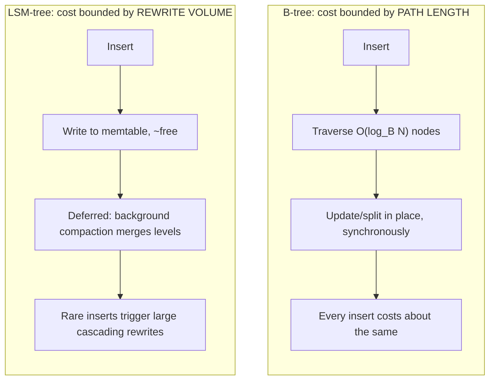

## Why B-trees and LSM-trees make different tradeoffs even though both rely on a bounded-size argument for their cost guarantees

**Key Points**

- Both structures prove their insertion-cost guarantees by bounding how much work any single element can be charged for across its lifetime in the structure — but they bound *different quantities*, and that difference is the entire source of their divergent tradeoffs.
- A B-tree bounds the *path length* a single insert must traverse and update: it keeps tree height at $O(\log_B N)$ by splitting full nodes, so every insert touches a small, fixed-shape set of nodes, in place, immediately.
- An LSM-tree bounds the *total rewrite volume* a single record accumulates as it ages through geometrically larger merge levels, deferring almost all physical rewriting to background batch compaction rather than performing it immediately in place.
- Same big-O shape for amortized cost per operation ($O(\log N)$-family), radically different constants, radically different I/O patterns, and radically different suitability for write-heavy versus read-heavy, in-place-update versus append-heavy workloads.

### An Analogy: Reshelving Immediately versus Reshelving in Batches

Picture two different librarians managing the same growing collection.

The first librarian reshelves every returned book the instant it arrives, walking it to its exact alphabetical position on the shelf, occasionally splitting an overcrowded shelf section into two half-full sections to keep browsing fast. The work per returned book is small and bounded — walk to roughly the same shelf depth every time, maybe split one section — and the collection is *always* in a fully sorted, ready-to-browse state. This is the B-tree librarian.

The second librarian tosses every returned book into a small inbox cart and, only when the cart fills up, sorts the whole cart at once and merges it into a bigger holding shelf; that holding shelf, once full, gets merged into an even bigger shelf, and so on. Individual returns are nearly free — just drop the book in the cart — but browsing the collection sometimes means checking several different shelves (the cart, the holding shelf, the bigger shelf) because a book's final resting place isn't decided until its next scheduled merge. This is the LSM-tree librarian.

Both librarians can honestly claim "average work per returned book stays small as the collection grows." But they arrived at that guarantee by bounding completely different things — one bounds *where a single book must travel and how far*, the other bounds *how many times a book gets picked up and rewritten before settling*. That structural difference is what this item unpacks precisely.

### Recalling the Two Underlying Arguments

Recall that a B-tree bounds insertion cost by maintaining a small, uniform tree height via node splits: every insert follows one root-to-leaf path of length $O(\log_B N)$, where $B$ is the branching factor, and updates a bounded number of nodes along that path in place, immediately, as part of the same operation that inserted the record.

Recall that an LSM-tree bounds insertion cost differently: writes are buffered in an in-memory memtable, flushed as immutable sorted SSTables, and merged through a hierarchy of geometrically growing levels via background compaction; a single record's amortized cost is $O(\log_T N)$, where $T$ is the level fanout, because — via a potential-method argument structurally identical to a base-$T$ counter's carry propagation — a record can only be swept into a level-$i$ merge once every $T^i$ inserts, so the expected cost contributed by each level averages to $O(1)$ across the whole sequence.

Recall also that the potential method proves an amortized bound by assigning a potential $\Phi$ to the structure's current state and defining $\hat{c}_i = c_i + \Phi_i - \Phi_{i-1}$, so that operations that build up "danger" (an overfull node, a full level) pay extra amortized cost precisely when that danger is defused. Both structures use *some version* of this proof strategy — but they apply it to different notions of "danger."

### Naming the Structural Difference Precisely

The key distinction is *what gets bounded*, and it splits into three related axes.

**1. What is bounded: path length vs. rewrite volume.**

A B-tree bounds the **number of nodes touched per operation** — a purely structural, topological quantity tied to tree height. It says nothing directly about *how many bytes* get physically rewritten; in fact, because $B$-way branching keeps height small, the number of nodes touched per insert is small by construction, and each touched node is a bounded-size block regardless of $N$.

An LSM-tree bounds the **cumulative bytes rewritten per record over its lifetime**, not the number of "nodes" in any topological sense — there is no fixed-height path being walked at insertion time at all. A record written once might be rewritten again at the next level-0 merge, again at the next level-1 merge, and so on; the bound is on the *sum of the sizes of all merges a record ever participates in*, which the geometric-level argument shows is $O(\log_T N)$ times the record's own size.

**2. When the bound is paid: immediately vs. deferred.**

A B-tree pays its bounded cost **synchronously**, as part of the insert operation itself. The caller who issues the insert waits for the path traversal and any necessary split to complete before the operation returns; there is no background process doing the structural maintenance later.

An LSM-tree pays almost none of its eventual cost synchronously. The insert itself only touches the memtable — an in-memory operation, essentially free relative to disk I/O. All the rewriting that the amortized bound is actually accounting for happens **asynchronously**, in background compaction threads, at a time decoupled from any particular client's insert call. This is why LSM-trees are prized for write-heavy workloads: the *client-visible* latency of a write is nearly constant and very low, even though the *system's total* amortized work per write is $O(\log_T N)$ exactly as the B-tree's is.

**3. In-place mutation vs. immutable append-then-merge.**

A B-tree updates existing on-disk pages **in place**. A split rewrites the affected node and its new sibling, but every other node in the tree is untouched; the data structure on disk at any moment is one single, current, directly-queryable sorted structure.

An LSM-tree never mutates an existing SSTable. Every merge **reads old immutable files and writes brand-new ones**, marking the old files for deletion only once the merge completes. This is precisely why an LSM-tree's amortized argument resembles a *binary counter's carry propagation* rather than a *tree-height* argument: what's being modeled is not "how deep is this path" but "how many old, still-live copies of overlapping key ranges currently coexist, waiting to be consolidated."

### Consequence Table: Same Big-O Family, Different Constants and Shape

| Property | B-tree | LSM-tree |
| --- | --- | --- |
| What insertion touches | $O(\log_B N)$ nodes, in place | Memtable only (amortized: $O(\log_T N)$ rewrite volume, deferred) |
| Write path | Synchronous read-modify-write of existing pages | Sequential append to WAL + memtable; disk rewrites deferred to compaction |
| Point-read cost | $O(\log_B N)$ node traversals, one location per key | Up to $O(\log_T N)$ levels checked, mitigated by Bloom filters |
| Write amplification | Low — only the touched path's pages are rewritten | Higher — a record is rewritten once per level it passes through |
| Read amplification | Low — data lives in exactly one place | Higher — a key can exist in several levels until compacted |
| Disk I/O pattern | Scattered random writes (in-place page updates) | Sequential writes (append-only WAL, sequential SSTable writes) |
| Best-suited workload | Read-heavy or balanced read/write, in-place updates | Write-heavy, append-heavy, high ingest rate |
| Deletion handling | Physically removes the key immediately | Tombstone marker, physically removed only at a later compaction |

### Why "Both Are $O(\log N)$-ish" Understates the Difference

It is tempting, on seeing $O(\log_B N)$ for a B-tree and $O(\log_T N)$ for an LSM-tree, to treat the two guarantees as interchangeable. They are not, for a concrete systems reason: the *constant factor hidden inside the big-O* is dominated by wildly different physical operations in each case.

For a B-tree, each of the $O(\log_B N)$ steps is a **random disk read/write of one page** — historically the expensive part of a B-tree's cost model, since random I/O has high per-operation latency on spinning disks (less so, though still non-trivial, on SSDs). Increasing $B$ (the branching factor) reduces tree height and thus the number of random I/Os per operation, which is exactly why on-disk B-trees traditionally use branching factors in the hundreds — sized to match disk page size — rather than the small branching factors typical of in-memory binary search trees.

For an LSM-tree, the $O(\log_T N)$ steps are amortized **sequential** I/O: writes to the WAL are append-only, SSTable flushes are append-only, and compaction reads old SSTables and writes new ones sequentially. Sequential I/O achieves much higher throughput than random I/O on both spinning disks and, to a lesser but still real degree, SSDs. This is the concrete physical reason LSM-trees are the standard choice underneath write-heavy systems (Cassandra, RocksDB, LevelDB, HBase) while B-trees remain the standard choice underneath read-heavy, general-purpose relational engines (traditional PostgreSQL and MySQL/InnoDB indexes) — not because one has a better asymptotic bound than the other (they don't; both are logarithmic-family), but because the *type* of I/O each bound is made of has different real hardware costs. [Inference: the relative advantage of sequential over random I/O narrows on modern NVMe SSDs compared to spinning disks, though sequential I/O still generally retains a throughput edge; the magnitude of this gap is hardware- and workload-dependent.]

### Worked Contrast: Same 8 Inserts, Two Structures

Take 8 sequential inserts into each structure, and count only "elements rewritten" as the cost unit (ignore split-triggering key distribution details for the B-tree, and assume $B=2$ so it splits identically to how the LSM-tree's level-0 in the earlier item filled at size 1).

**B-tree ($B=2$):** Each insert touches one leaf and, on a split, its parent. Across 8 inserts, at most $O(\log_2 8) = 3$ nodes are touched *per insert*, and the *total* structural work across all 8 inserts stays close to linear in $N$ overall (each element is written once to its leaf, plus a small number of split-related rewrites bounded by tree height) — there is no possibility of one single insert rewriting the *entire* dataset, because a split only ever touches the node that overflowed and its immediate neighbor/parent, never distant unrelated parts of the tree.

**LSM-tree ($T=2$):** As traced in the level-structure worked example for the prior item, insert 8 alone costs 15 rewrite units out of 32 total — nearly half the sequence's entire cost concentrated in a single operation, because that insert happens to trigger a full cascading merge through every level simultaneously.

This contrast is the clearest possible illustration of the difference: the B-tree's bounded-size argument guarantees that **no single insert can ever be much more expensive than any other** (worst-case-per-operation is already close to the amortized bound), while the LSM-tree's bounded-size argument only guarantees that **expensive inserts are rare enough that the average stays low** — individual inserts can and provably will occasionally be near-linear in cost.

### Reading the Two Guarantees Correctly Side by Side

A precise, technically defensible statement of each guarantee, phrased so as not to conflate them:

- **B-tree**: "For any sequence of $N$ inserts, every individual insert costs $O(\log_B N)$ node touches, performed synchronously and in place; the amortized and worst-case per-operation costs are asymptotically the same."
- **LSM-tree**: "For any sequence of $N$ inserts, the *total* rewrite work summed across the whole sequence is $O(N \log_T N)$, giving an *amortized* cost of $O(\log_T N)$ per insert; any individual insert's actual cost can range from $O(1)$ (memtable write only) up to $O(N)$ (a full cascading compaction), and this variance is not a flaw but the structural mechanism by which the bound is achieved."

Conflating these — saying an LSM-tree insert "costs $O(\log_T N)$" the same way a B-tree insert does — silently drops the fact that the LSM guarantee is only meaningful in aggregate, over a sequence, whereas the B-tree guarantee already holds per operation. Recall that an amortized-cost theorem is a statement about a *sequence* of operations, not a promise about any individual operation in isolation; the two structures compared here are a clean illustration of a case where a per-operation-uniform guarantee (B-tree) and a genuinely-only-in-aggregate guarantee (LSM-tree) both happen to land in the same asymptotic complexity class while behaving very differently at the level of any single operation.

**Next Steps**

- Incremental minimum spanning trees as a third bounded-size argument, this time bounded by edge-weight structure rather than either path length or level-merge volume
- Incremental Voronoi diagrams and identifying the shared bounded-update proof family across B-trees, LSM-trees, MSTs, and Voronoi diagrams
- Carrying the path-length-vs-rewrite-volume distinction forward into Chapter 07's reframing of graph-node insertion cost, where ANN-index insertion (HNSW) turns out to resemble the LSM-tree's deferred, batched character more than the B-tree's synchronous, in-place character