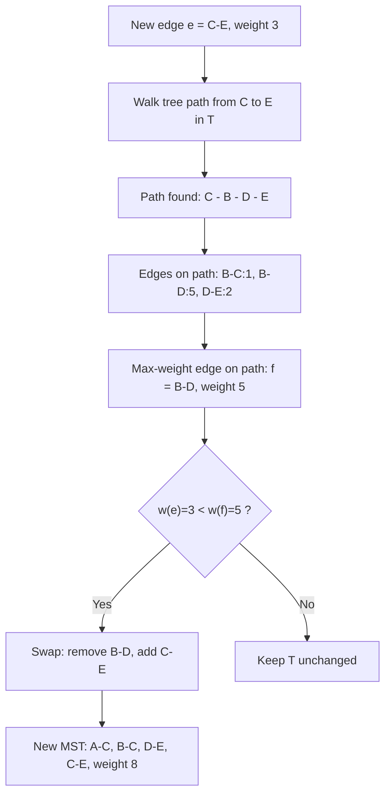

## Incremental minimum spanning trees: what changes and what stays provably unchanged when a single edge is added to an existing graph

**Key Points**

- When a single new edge is added to a graph that already has a computed minimum spanning tree (MST), the new MST differs from the old one by *at most one edge* — one edge is removed, one edge is added, and every other tree edge is provably untouched.
- This is a fundamentally different flavor of "bounded" than the geometric-growth arguments used for B-trees or LSM-trees: it is not a statement about amortized cost across a sequence of operations, it is a structural invariant about how small the *change to the solution itself* can be, per single insertion, in the worst case.
- The proof rests on the **cycle property**: on any cycle in a weighted graph, the maximum-weight edge on that cycle is never required by an MST (excluding ties). Adding one edge to an existing tree creates exactly one cycle, so the entire search for "what might need to change" collapses to examining that single cycle.
- Finding and applying the swap costs $O(V)$ per insertion with a naive tree-path walk — already a worst-case-per-operation bound, no amortization needed. Advanced dynamic-tree structures (link-cut trees) push this down to $O(\log V)$ *amortized* per insertion, which is where an amortized argument re-enters the picture.

### An Analogy: A Single New Cable in an Already-Optimal Network

Picture a network engineer who has already run cable to connect a set of buildings using the cheapest possible total length of cable, with no redundant loops — this is a spanning tree, and it happens to be the cheapest one, an MST. Now a construction crew lays one brand-new cable run between two buildings that weren't directly connected before. The engineer does not need to re-plan the entire network from scratch. Connecting the two endpoints of the new cable through the *existing* wiring traces out exactly one loop — walk from one endpoint back to the other through the tree, and you get precisely one cycle, no more, no fewer, because a tree plus any single extra edge always contains exactly one cycle. The engineer's only question is: is there a segment of *existing* cable on that loop that is more expensive than the new cable? If so, rip out the single most expensive segment on that loop and use the new cable in its place — strictly cheaper, and still a valid tree, since removing one edge from the one cycle just created restores acyclicity. If not, the new cable is simply never used for through-traffic, and the existing wiring plan is already optimal even with the new option available. Nothing else in the network changes.

### Recalling the Vocabulary This Argument Needs

Recall that a **spanning tree** of a connected graph with $V$ vertices is a subgraph with exactly $V-1$ edges that connects every vertex with no cycles, and a **minimum spanning tree (MST)** is a spanning tree whose total edge weight is minimum among all spanning trees.

Two structural facts about MSTs, standard but worth stating precisely since they carry the entire argument here:

- **Cycle property**: for any cycle in the graph, the maximum-weight edge on that cycle does not belong to *any* MST, unless there is a tie for maximum weight on that cycle (in which case some MST may include it, but at least one MST excludes it).
- **Cut property**: for any partition of the vertices into two nonempty sets (a *cut*), the minimum-weight edge crossing that cut belongs to *some* MST.

The incremental-update argument in this item relies almost entirely on the cycle property; the cut property is included here because it is the natural counterpart used to justify batch MST algorithms like Kruskal's and Prim's, and because later chapters may invoke it when discussing why greedy edge-selection is safe.

Recall also that a **fundamental cycle** of a non-tree edge $e=(u,v)$ with respect to a spanning tree $T$ is the unique cycle formed by adding $e$ to $T$ — specifically, the tree path from $u$ to $v$ in $T$, plus $e$ itself, closing the loop. Because $T$ is acyclic and connected, there is exactly one path from $u$ to $v$ within $T$, so this cycle is unique and well-defined; there is no ambiguity to resolve.

### The Core Claim, Stated Precisely

> Let $T$ be an MST of graph $G$. Let $G'=G+e$ for a single new edge $e=(u,v,w)$ not previously in $G$. Let $C$ be the fundamental cycle formed by adding $e$ to $T$, and let $f$ be the maximum-weight edge on $C$. Then:
>
> - If $w(e) \ge w(f)$: $T$ itself remains an MST of $G'$. **No edge changes at all.**
> - If $w(e) < w(f)$: $T' = T - f + e$ is an MST of $G'$, and $T'$ differs from $T$ in **exactly one removed edge and one added edge** — every other edge of $T$ is identical in $T'$.

This is the precise sense in which "what stays provably unchanged" is answered: regardless of how large $V$ is, an MST update in response to a single edge insertion can never require touching more than one edge of the existing tree. The other $V-2$ tree edges are not merely "likely unchanged" or "unchanged with high probability" — they are provably identical, by the argument below.

### Why This Is True: The Exchange Argument

**Case $w(e) \ge w(f)$.** Suppose for contradiction some MST $T^*$ of $G'$ uses $e$. Removing $e$ from $T^*$ splits it into two components; since $C$ (the fundamental cycle) crosses this split at some edge other than $e$ — because $T$ already connects $u$ and $v$ without $e$ — some tree edge on $C$ other than $e$ crosses the same cut. By the cut property, the minimum-weight edge crossing that cut is safe to use, and since every edge on $C$ other than $e$ has weight at most $w(f) \le w(e)$, swapping $e$ out for that cheaper crossing edge never increases total weight — so an MST avoiding $e$ exists, meaning $T$ itself (which already avoids $e$ and was already optimal for $G$) remains optimal for $G'$.

**Case $w(e) < w(f)$.** The cycle property applied directly to cycle $C$ says the maximum-weight edge on $C$ — which is $f$, since $w(e) < w(f)$ makes $f$, not $e$, the maximum — is not required by any MST of $G'$. Removing $f$ from $T+e$ breaks the one cycle $C$ and yields a spanning tree $T' = T - f + e$ whose weight is $w(T) - w(f) + w(e) < w(T)$, strictly less than the old MST weight. Since $T'$ is a valid spanning tree of $G'$ with lower weight than $T$, and $T$ was minimum for $G$ (a lower bound that only loosens by adding an edge option), $T'$ must be minimum for $G'$.

Neither case invokes any property of edges *outside* $C$ at all — the argument never has to reason about the rest of the tree, which is exactly why the rest of the tree is guaranteed untouched.

### Worked Example: Tracing One Insertion Through a Five-Node Graph

Take vertices $\{A,B,C,D,E\}$ with existing weighted edges:

$$A\text{-}B{:}4,\quad A\text{-}C{:}2,\quad B\text{-}C{:}1,\quad B\text{-}D{:}5,\quad C\text{-}D{:}8,\quad D\text{-}E{:}2$$

Running Kruskal's algorithm (sort edges ascending, add if it doesn't close a cycle) gives:

$$T = \{B\text{-}C{:}1,\ A\text{-}C{:}2,\ D\text{-}E{:}2,\ B\text{-}D{:}5\}, \quad w(T)=10$$

<svg xmlns="http://www.w3.org/2000/svg" viewBox="0 0 400 320">
<text x="200" y="24" text-anchor="middle" font-size="15" font-family="sans-serif" font-weight="bold">Existing MST T, weight 10 (svg_diagram)</text>
<line x1="100" y1="70" x2="300" y2="70" stroke="#aaa" stroke-width="1.5" stroke-dasharray="4,3" />
<text x="200" y="60" text-anchor="middle" font-size="11" font-family="sans-serif" fill="#888">4</text>
<line x1="100" y1="70" x2="200" y2="170" stroke="#4C78A8" stroke-width="3" />
<text x="135" y="130" text-anchor="middle" font-size="11" font-family="sans-serif">2</text>
<line x1="300" y1="70" x2="200" y2="170" stroke="#4C78A8" stroke-width="3" />
<text x="265" y="130" text-anchor="middle" font-size="11" font-family="sans-serif">1</text>
<line x1="200" y1="170" x2="300" y2="270" stroke="#aaa" stroke-width="1.5" stroke-dasharray="4,3" />
<text x="265" y="230" text-anchor="middle" font-size="11" font-family="sans-serif" fill="#888">8</text>
<line x1="300" y1="70" x2="300" y2="270" stroke="#4C78A8" stroke-width="3" />
<text x="315" y="170" text-anchor="middle" font-size="11" font-family="sans-serif">5</text>
<line x1="300" y1="270" x2="100" y2="270" stroke="#4C78A8" stroke-width="3" />
<text x="200" y="285" text-anchor="middle" font-size="11" font-family="sans-serif">2</text>
<circle cx="100" cy="70" r="16" fill="#F58518" /><text x="100" y="75" text-anchor="middle" font-size="13" font-family="sans-serif" fill="white">A</text>
<circle cx="300" cy="70" r="16" fill="#F58518" /><text x="300" y="75" text-anchor="middle" font-size="13" font-family="sans-serif" fill="white">B</text>
<circle cx="200" cy="170" r="16" fill="#F58518" /><text x="200" y="175" text-anchor="middle" font-size="13" font-family="sans-serif" fill="white">C</text>
<circle cx="300" cy="270" r="16" fill="#F58518" /><text x="300" y="275" text-anchor="middle" font-size="13" font-family="sans-serif" fill="white">D</text>
<circle cx="100" cy="270" r="16" fill="#F58518" /><text x="100" y="275" text-anchor="middle" font-size="13" font-family="sans-serif" fill="white">E</text>
</svg>

Note the tree $T$ happens to form a simple path: $A - C - B - D - E$.

Now insert a genuinely new edge, $C\text{-}E$ with weight $3$, not previously present in the graph.

The fundamental cycle formed by adding $C\text{-}E$ to $T$ is the tree path $C \to B \to D \to E$ plus the new edge $C\text{-}E$, i.e. cycle edges $\{B\text{-}C{:}1,\ B\text{-}D{:}5,\ D\text{-}E{:}2,\ C\text{-}E{:}3\}$. The maximum-weight edge on this cycle is $f = B\text{-}D$, weight $5$. Since $w(e)=3 < w(f)=5$, the swap applies:

$$T' = T - \{B\text{-}D\} + \{C\text{-}E\} = \{B\text{-}C{:}1,\ A\text{-}C{:}2,\ D\text{-}E{:}2,\ C\text{-}E{:}3\}, \quad w(T')=8$$

<svg xmlns="http://www.w3.org/2000/svg" viewBox="0 0 400 320">
<text x="200" y="24" text-anchor="middle" font-size="15" font-family="sans-serif" font-weight="bold">Updated MST T', weight 8 (svg_diagram)</text>
<line x1="100" y1="70" x2="300" y2="70" stroke="#aaa" stroke-width="1.5" stroke-dasharray="4,3" />
<text x="200" y="60" text-anchor="middle" font-size="11" font-family="sans-serif" fill="#888">4</text>
<line x1="100" y1="70" x2="200" y2="170" stroke="#4C78A8" stroke-width="3" />
<text x="135" y="130" text-anchor="middle" font-size="11" font-family="sans-serif">2</text>
<line x1="300" y1="70" x2="200" y2="170" stroke="#4C78A8" stroke-width="3" />
<text x="265" y="130" text-anchor="middle" font-size="11" font-family="sans-serif">1</text>
<line x1="200" y1="170" x2="300" y2="270" stroke="#aaa" stroke-width="1.5" stroke-dasharray="4,3" />
<text x="265" y="230" text-anchor="middle" font-size="11" font-family="sans-serif" fill="#888">8</text>
<line x1="300" y1="70" x2="300" y2="270" stroke="#d62728" stroke-width="2" stroke-dasharray="3,3" />
<text x="315" y="170" text-anchor="middle" font-size="11" font-family="sans-serif" fill="#d62728">5 (removed)</text>
<line x1="300" y1="270" x2="100" y2="270" stroke="#4C78A8" stroke-width="3" />
<text x="200" y="285" text-anchor="middle" font-size="11" font-family="sans-serif">2</text>
<line x1="200" y1="170" x2="100" y2="270" stroke="#54A24B" stroke-width="3.5" />
<text x="130" y="230" text-anchor="middle" font-size="11" font-family="sans-serif" fill="#2a6e1f">3 (added)</text>
<circle cx="100" cy="70" r="16" fill="#F58518" /><text x="100" y="75" text-anchor="middle" font-size="13" font-family="sans-serif" fill="white">A</text>
<circle cx="300" cy="70" r="16" fill="#F58518" /><text x="300" y="75" text-anchor="middle" font-size="13" font-family="sans-serif" fill="white">B</text>
<circle cx="200" cy="170" r="16" fill="#F58518" /><text x="200" y="175" text-anchor="middle" font-size="13" font-family="sans-serif" fill="white">C</text>
<circle cx="300" cy="270" r="16" fill="#F58518" /><text x="300" y="275" text-anchor="middle" font-size="13" font-family="sans-serif" fill="white">D</text>
<circle cx="100" cy="270" r="16" fill="#F58518" /><text x="100" y="275" text-anchor="middle" font-size="13" font-family="sans-serif" fill="white">E</text>
</svg>

Observe precisely what changed and what did not: $B\text{-}D$ was removed, $C\text{-}E$ was added — one edge out, one edge in. The edges $A\text{-}C$, $B\text{-}C$, and $D\text{-}E$ are byte-for-byte identical members of both $T$ and $T'$; they were never examined for potential removal, because they never lay on the fundamental cycle created by the new edge, and the exchange argument above guarantees that edges off the fundamental cycle can never be the ones removed.

### Cost of Finding the Change: Worst-Case, Not Amortized

Unlike the B-tree and LSM-tree case studies, this bound does not need an amortized argument at all in its basic form — it is already a **worst-case, per-single-operation** guarantee, structurally closer to the B-tree's flavor of bound (uniform per-operation cost) than to the LSM-tree's flavor (cheap-on-average, occasionally expensive).

The naive cost of applying one insertion is dominated by finding the maximum-weight edge on the tree path between $u$ and $v$:

- Walk from $u$ up to the lowest common ancestor of $u$ and $v$ in the tree (or simply walk both to the root and diff the paths, if the tree is stored rooted), tracking the maximum edge weight seen — this costs $O(V)$ in the worst case, since a tree path can have up to $V-1$ edges.
- Compare that maximum against $w(e)$ and swap if needed — $O(1)$ once the maximum is known.

So a single insertion costs $O(V)$ worst case, full stop, with no averaging required — every insertion, not just most of them, is bounded this way.

**Where amortization re-enters**: maintaining the tree under a long sequence of edge insertions using a **link-cut tree** (a self-adjusting dynamic-tree data structure built from splay trees) reduces path-maximum queries and tree restructuring to $O(\log V)$ **amortized** time per operation. [Unverified: exact worst-case vs. amortized guarantees for specific link-cut tree operations can vary by implementation detail and whether global rebalancing is included; the standard Sleator–Tarjan result is amortized $O(\log V)$ per operation using a potential-function argument over the splay trees' access patterns.] This is a direct instance of the potential method: recall that the potential method assigns potential to a structure's current state and charges expensive restructuring steps against potential released by that same restructuring, exactly as used to prove dynamic array doubling and the LSM-tree's level-merge cost — the mechanism reappears here applied to splay-tree rotations rather than array copies or SSTable merges.

### Where This Fits the Shared Bounded-Update Proof Family

This case study demonstrates a third *kind* of boundedness, distinct from both prior structures in this chapter:

- **B-tree**: bounds the *number of nodes touched*, via tree-height control (structural, synchronous, in place).
- **LSM-tree**: bounds the *total rewrite volume per element over its lifetime*, via geometric batching (amortized, deferred, immutable).
- **Incremental MST**: bounds the *size of the change to the solution itself*, via the cycle property — at most one edge is ever a candidate for removal, independent of how large the graph is. The *cost of finding* that one edge is a separate concern, solvable naively in worst-case $O(V)$ or, with a fancier self-adjusting structure, in amortized $O(\log V)$.

All three are members of the same family in spirit — each proves that a locally small, cheaply-characterized quantity bounds the true cost of an operation that could naively look like it requires touching the entire structure — but each identifies a different quantity as the one worth bounding, and each pairs that quantity with a different proof technique (height invariant, potential-method carry propagation, and cycle-property exchange argument, respectively).

**Related Topics**

- Incremental Voronoi diagrams as a fourth worked case study, and explicit identification of the shared bounded-update proof family across all four structures in this chapter
- Link-cut trees and splay-tree amortized analysis as a deeper dive into the $O(\log V)$ amortized claim raised here
- Cut property and its role in justifying batch MST algorithms (Kruskal's, Prim's), for contrast against the cycle property's role in incremental updates
- Carrying the "bound the size of the change, not just the cost of computing it" framing forward into Chapter 07, where insertion into a growing LLM-constructed graph is reframed as a growth-cost problem