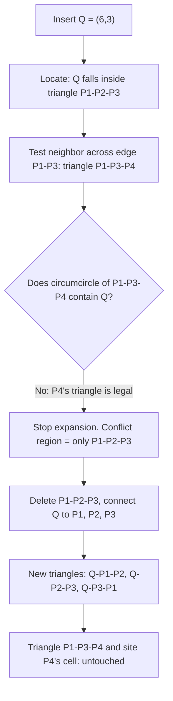

## Incremental Voronoi diagrams: what changes and what stays provably unchanged when a single new site is added to an existing diagram

**Key Points**

- Inserting one new site into an existing Voronoi diagram never requires recomputing the whole diagram: the cells that change are exactly the cells belonging to sites that end up as the new site's neighbors in the diagram's dual structure, the Delaunay triangulation. Every other cell is provably identical before and after.
- This is a fourth distinct flavor of bounded-size argument, different in kind from the prior three in this chapter: it does not rely on a height invariant (B-tree), a geometric-batching potential argument (LSM-tree), or a single-cycle exchange argument (MST). It relies on a **local emptiness test** — the empty-circumcircle property — that certifies, edge by edge, whether a piece of the old structure is still valid.
- The *number* of cells disturbed by one insertion can be as large as $O(n)$ in the worst case, but a separate and famous result — **randomized incremental construction with backward analysis** — shows that if sites are inserted in random order, the *expected* number of cells disturbed by any single insertion is $O(1)$, giving expected $O(n\log n)$ total cost to build the whole diagram one site at a time.

### An Analogy: A New Cell Tower Dropped Into an Existing Coverage Map

Picture a telecom operator's coverage map: every existing cell tower "owns" the region of geographic space closer to it than to any other tower — this is precisely what a Voronoi diagram formalizes, though the operator never called it that. Now the operator activates one brand-new tower somewhere on the map. Intuitively, the new tower can only steal territory from towers *physically near* it; a tower on the opposite side of the city, whose entire existing coverage region stays closer to itself than to the new tower everywhere within that region, needs no update at all — its boundary lines, its neighbors, its shape, all remain exactly as they were. Only the handful of towers whose coverage boundary passes near the new tower's location need their boundary lines redrawn, and the new tower's own coverage region is carved out of exactly those neighbors' territory. The operator never has to touch the record for a tower on the far side of town just because one new tower went live nearby.

### Recalling the Vocabulary This Argument Needs

A **Voronoi diagram** of a finite set of points ("sites") in the plane partitions the plane into regions called **cells**, one per site, where a site's cell is the set of all points strictly closer to it than to any other site. Cell boundaries are made of straight-line segments, each lying on the perpendicular bisector between two sites; boundary points equidistant from three or more sites become **Voronoi vertices** where several cells meet.

The **Delaunay triangulation** is the *dual* graph of the Voronoi diagram: connect two sites with a straight edge exactly when their cells share a boundary. For sites in general position (no four sites exactly cocircular), this dual graph is a full triangulation of the point set — every face is a triangle. The two structures carry the same information in complementary form, and it is almost always easier to reason about insertion using the triangulation rather than the cells directly, so the argument below is built on the triangulation and translated back to cells at the end.

The single fact that makes everything else work is the **empty-circumcircle property**: a triangulation of a point set is the Delaunay triangulation if and only if, for every triangle in it, the circle passing through that triangle's three vertices (its *circumcircle*) contains no other site in its interior. An edge shared by two triangles is called **illegal** if the circumcircle of one of those triangles contains the opposite vertex of the other triangle — this is the local, edge-by-edge test used to detect and repair violations of the empty-circumcircle property.

### The Core Claim, Stated Precisely

> Let $\mathcal{D}$ be the Delaunay triangulation (equivalently, the Voronoi diagram) of a site set $S$. Insert one new site $q \notin S$, forming $S' = S \cup \{q\}$. Then the set of triangles removed and added in constructing $\mathcal{D}'$ from $\mathcal{D}$ is exactly the set of old triangles whose circumcircle contains $q$ — call this the **conflict region** of $q$ — together with the new triangles formed by connecting $q$ to the boundary of that region. Every triangle of $\mathcal{D}$ *outside* the conflict region is identical in $\mathcal{D}'$, and correspondingly every Voronoi cell whose site was not Delaunay-adjacent to $q$ in the old diagram, and does not become Delaunay-adjacent to $q$ in the new one, is byte-for-byte unchanged.

This is the Voronoi/Delaunay analogue of the MST claim from the prior item — "at most one edge changes" there becomes "only the conflict region's triangles change" here — but the mechanism certifying *which* piece of the structure is affected is entirely different, as the next section makes precise.

### Why It's True: The Empty-Circle Argument, Sketched

The insertion procedure (the classical **Bowyer–Watson algorithm**) works in three steps, each of which only ever touches triangles inside the conflict region:

1. **Locate.** Find the triangle of $\mathcal{D}$ containing $q$ (or, in the degenerate case, the triangle whose circumcircle $q$ falls inside first).
2. **Identify the conflict region.** Starting from that triangle, walk outward across shared edges, testing each neighboring triangle's circumcircle for $q$. Every triangle whose circumcircle contains $q$ is added to the conflict region; the walk stops the moment a triangle's circumcircle does *not* contain $q$, because the empty-circumcircle property guarantees that triangle — and everything beyond it — is still legal and therefore untouched.
3. **Retriangulate.** Delete every triangle in the conflict region, which leaves a star-shaped polygonal hole; connect $q$ to every vertex on the boundary of that hole, producing new triangles that provably satisfy the empty-circumcircle property with respect to $S'$ (a short argument, omitted here in full formal detail, shows that no site can lie inside the circumcircle of any newly formed triangle, precisely because $q$ was the site that invalidated the old triangles' circumcircles, and the boundary vertices were already legal with respect to each other under $S$).

The key move that bounds the affected region is step 2: the walk is a **local propagation test**, not a global recomputation. A triangle far from $q$ is never even visited, because the walk only expands across an edge when the neighboring triangle actively fails the circumcircle test — and the moment it encounters a triangle that passes, it stops expanding in that direction. This is structurally different from the MST's exchange argument (which examines exactly one fixed cycle determined algebraically by the new edge) and from the B-tree's height invariant (which examines exactly one fixed root-to-leaf path) — here, the *size and shape* of the affected region is not fixed in advance at all; it is discovered dynamically by local testing, and can in principle be small or large depending on where $q$ falls.

### Worked Example: Inserting One Site Into a Five-Site Diagram

Take four existing sites forming a quadrilateral: $P_1=(0,0)$, $P_2=(8,0)$, $P_3=(8,8)$, $P_4=(0,8)$. Suppose the existing Delaunay triangulation splits this quadrilateral along the diagonal $P_1$-$P_3$, giving two triangles: $\triangle P_1P_2P_3$ and $\triangle P_1P_3P_4$.

Now insert a new site $Q=(6,3)$, which falls inside $\triangle P_1P_2P_3$.

**Before insertion:**

<svg xmlns="http://www.w3.org/2000/svg" viewBox="0 0 360 320">
<text x="180" y="24" text-anchor="middle" font-size="14" font-family="sans-serif" font-weight="bold">Delaunay triangulation before Q (svg_diagram)</text>
<polygon points="40,280 320,280 320,40" fill="#4C78A8" fill-opacity="0.25" stroke="#4C78A8" stroke-width="2" />
<polygon points="40,280 320,40 40,40" fill="#72B7B2" fill-opacity="0.25" stroke="#72B7B2" stroke-width="2" />
<line x1="40" y1="280" x2="320" y2="40" stroke="#333" stroke-width="2" />
<circle cx="40" cy="280" r="7" fill="#F58518" /><text x="40" y="300" text-anchor="middle" font-size="12" font-family="sans-serif">P1</text>
<circle cx="320" cy="280" r="7" fill="#F58518" /><text x="320" y="300" text-anchor="middle" font-size="12" font-family="sans-serif">P2</text>
<circle cx="320" cy="40" r="7" fill="#F58518" /><text x="335" y="45" text-anchor="middle" font-size="12" font-family="sans-serif">P3</text>
<circle cx="40" cy="40" r="7" fill="#F58518" /><text x="25" y="45" text-anchor="middle" font-size="12" font-family="sans-serif">P4</text>
</svg>

**After inserting Q:**

<svg xmlns="http://www.w3.org/2000/svg" viewBox="0 0 360 320">
<text x="180" y="24" text-anchor="middle" font-size="14" font-family="sans-serif" font-weight="bold">Delaunay triangulation after Q (svg_diagram)</text>
<polygon points="40,280 320,40 40,40" fill="#72B7B2" fill-opacity="0.25" stroke="#72B7B2" stroke-width="2" />
<line x1="40" y1="280" x2="320" y2="40" stroke="#333" stroke-width="1.5" stroke-dasharray="3,3" />
<polygon points="40,280 320,280 230,200" fill="#54A24B" fill-opacity="0.3" stroke="#2a6e1f" stroke-width="2" />
<polygon points="320,280 320,40 230,200" fill="#F58518" fill-opacity="0.3" stroke="#c9660b" stroke-width="2" />
<polygon points="320,40 40,280 230,200" fill="#E45756" fill-opacity="0.25" stroke="#b83c3c" stroke-width="2" />
<circle cx="40" cy="280" r="7" fill="#4C78A8" /><text x="40" y="300" text-anchor="middle" font-size="12" font-family="sans-serif">P1</text>
<circle cx="320" cy="280" r="7" fill="#4C78A8" /><text x="320" y="300" text-anchor="middle" font-size="12" font-family="sans-serif">P2</text>
<circle cx="320" cy="40" r="7" fill="#4C78A8" /><text x="335" y="45" text-anchor="middle" font-size="12" font-family="sans-serif">P3</text>
<circle cx="40" cy="40" r="7" fill="#4C78A8" /><text x="25" y="45" text-anchor="middle" font-size="12" font-family="sans-serif">P4</text>
<circle cx="230" cy="200" r="7" fill="#d62728" /><text x="250" y="205" text-anchor="middle" font-size="12" font-family="sans-serif" fill="#d62728">Q</text>
</svg>

The single old triangle $\triangle P_1P_2P_3$ is replaced by three new triangles $\triangle QP_1P_2$, $\triangle QP_2P_3$, $\triangle QP_3P_1$. Because the shared edge $P_1$-$P_3$ passed its circumcircle test against $P_4$ (the walk in step 2 stopped there), triangle $\triangle P_1P_3P_4$ is not merely *approximately* the same — it is the exact same triangle object, untouched by the insertion. Translated to Voronoi cells: $P_4$'s cell is completely unchanged in shape and boundary, since $P_4$ never became a Delaunay neighbor of $Q$; the cells of $P_1$, $P_2$, and $P_3$ shrink to make room for $Q$'s new cell, which appears where none existed before.

### Cost of Applying the Change: Worst Case vs. Expected via Backward Analysis

**Worst case.** The conflict region can, in principle, include up to $O(n)$ old triangles — for instance, a new site inserted so that its circumcircle happens to enclose a long chain of existing triangles forces the walk to propagate across the whole chain before finding a legal boundary. So, unlike the B-tree's uniformly small per-operation cost, a single Voronoi insertion offers no such uniform per-operation guarantee: some individual insertions really can cost $\Theta(n)$.

**Expected case, via backward analysis.** The result that makes incremental Voronoi/Delaunay construction practical is a probabilistic one, not a worst-case one: if the $n$ sites are inserted in a **uniformly random order**, the *expected* number of triangles created (equivalently, destroyed) by the insertion of the $i$-th site is $O(1)$, and the expected total number of triangles created across all $n$ insertions is $O(n)$.

The proof technique, **backward analysis**, is worth naming explicitly because it is a genuinely different tool from the potential method used for LSM-trees or the exchange argument used for MSTs: instead of reasoning forward ("if I insert this point, how much does it cost"), it reasons backward from a *fixed final configuration* of $i$ points — asking, "of the $i$ points already present, how many of them, if it had been the *last* one inserted, would have been responsible for creating this particular triangle?" Since any of the $i$ points is equally likely (under random order) to have been inserted last, and a bounded number of triangles are typically "owned" by their most-recently-inserted vertex, the expected cost attributable to the $i$-th insertion works out to $O(1)$, summed with a $O(\log i)$ point-location cost per insertion when a suitable search structure is layered on top — giving the standard result that randomized incremental construction builds the full Voronoi diagram or Delaunay triangulation of $n$ points in expected $O(n\log n)$ total time. This is the same *style* of claim as an amortized bound — "occasionally expensive individual operations, cheap on average" — but the averaging here is over the *randomness of insertion order*, not over a potential function tracking structural fullness the way it did for the LSM-tree's level hierarchy.

### Where This Sits Among the Chapter's Proof Techniques

Four structurally different tools have now appeared in this chapter for proving that a single insertion's cost stays small: a **height invariant** enforced by node splits (B-tree), a **potential-method argument over geometric batching** (LSM-tree), a **single-cycle exchange argument** licensed by the cycle property (incremental MST), and a **local emptiness test propagated outward until it fails**, analyzed in expectation via backward analysis (incremental Voronoi/Delaunay). What all four share, despite using different machinery, is the same underlying shape: each proves that a single insertion's true cost is governed by a *small, locally-characterized* piece of the existing structure — a path, a level, a cycle, a conflict region — rather than requiring a full pass over the whole structure to figure out what needs to change.

**Related Topics**

- A dedicated synthesis of the shared bounded-update proof family across B-trees, LSM-trees, incremental MSTs, and incremental Voronoi diagrams, contrasting height invariants, potential-method batching, exchange arguments, and backward analysis side by side
- Randomized incremental construction as a general algorithm-design paradigm, beyond Voronoi diagrams, including its use in constructing convex hulls and trapezoidal maps
- Point-location data structures (e.g. the randomized incremental search structure paired with Delaunay construction) as the mechanism achieving the $O(\log i)$-per-insertion location cost referenced above
- Carrying "bound the local conflict/affected region rather than recomputing globally" forward into Chapter 07's reframing of node insertion cost in a growing graph, where the ANN-index insertion case (HNSW) will echo this same local-propagation character