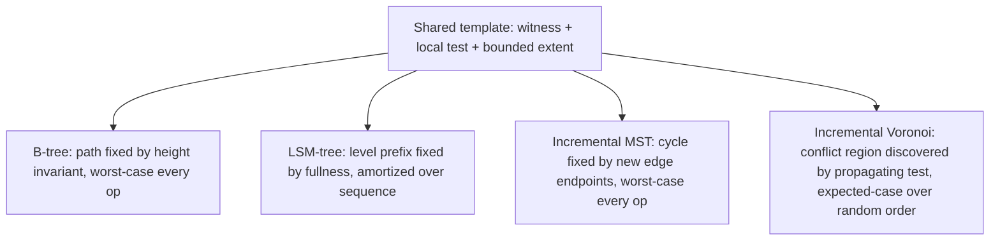

## Recognizing the shared shape across B-trees, LSM-trees, incremental MST, and incremental Voronoi diagrams as the same family of bounded-size, bounded-update argument

**Key Points**

- Four structures, four different proof techniques — a height invariant, a potential-method argument over geometric batching, a single-cycle exchange argument, and a local emptiness test analyzed by backward analysis — but all four are instances of one shared template: *identify a small, locally-characterized witness that certifies how much of the existing structure a single update can possibly disturb, then bound the cost of finding and repairing that witness.*
- The four case studies split cleanly along two independent axes: whether the bound is a **worst-case guarantee on every single operation** or only an **average guarantee over a sequence/distribution of operations**, and whether the affected region is **fixed in advance by the structure's topology** or **discovered dynamically by testing**.
- Recognizing this shared template is the actual payoff of the chapter: it is the exact lens Chapter 07 needs to evaluate whether insertion into a growing LLM-constructed graph has *any* such witness available to it, and if not, why brute-force and embedding-threshold insertion are stuck with linear cost while an ANN index changes the shape of the curve.

### An Analogy: Four Different Ways an Inspector Limits the Scope of a Recheck

Picture four different quality inspectors, each responsible for verifying a large existing system stays correct after one new item is added, and each using a genuinely different method to avoid re-inspecting everything from scratch.

The first inspector works from a **fixed rulebook about shape**: a filing system is only allowed to have shelves of a certain depth, so adding one folder can only ever cascade along one predictable shelf-path, never further — the rulebook itself guarantees the blast radius before the new folder is even filed. This is the B-tree.

The second inspector works from a **standing batch schedule**: small check-ins get logged into a daily tray, and only when a tray fills up does anything get formally merged into the permanent record, with merges cascading up through weekly, then monthly, then yearly batches. Any single check-in is cheap; the schedule guarantees that expensive full-cascade merges are rare exactly in proportion to how expensive they are, so the *average* cost stays low even though a single day's check-in can occasionally trigger a huge merge. This is the LSM-tree.

The third inspector works from a **provable one-shortcut rule**: given an already-optimal delivery route network, adding one new road can only ever possibly replace the single most expensive road segment on the one loop that road creates — everything else in the network is provably still optimal, and the inspector doesn't even need to look at it. This is the incremental MST.

The fourth inspector works from a **local spot-check that stops itself**: given a map of who's-closest-to-whom, dropping in one new location only requires re-checking neighboring regions until a boundary is found where the old assignment is still clearly correct — the check simply stops propagating the moment it hits ground that's still valid, and how far it has to walk before that happens isn't known in advance. This is the incremental Voronoi diagram.

All four inspectors reach the same *kind* of promise — "I don't need to re-verify the whole system" — but they earn that promise through four genuinely different certification mechanisms. Naming exactly what each one is certifying, and how, is the point of this synthesis.

### Recalling Each Structure's Core Guarantee

Recall that a **B-tree** bounds insertion cost by maintaining a small, uniform tree height via node splits, so every insert touches $O(\log_B N)$ nodes along one root-to-leaf path, updated in place, synchronously — a guarantee that holds identically for *every* individual insert, not just on average.

Recall that an **LSM-tree** bounds insertion cost by buffering writes in a memtable and merging immutable SSTables through a hierarchy of geometrically growing levels, giving amortized $O(\log_T N)$ rewrite cost per insert via a potential-method argument structurally identical to a base-$T$ counter's carry propagation — while any *individual* insert can cost as much as $\Theta(N)$ when a full cascading compaction triggers.

Recall that an **incremental MST** update, when a single new edge is added to a graph with an existing MST, changes at most one tree edge: the maximum-weight edge on the unique fundamental cycle formed by the new edge, found and removed via the cycle property, at worst-case cost $O(V)$ per insertion using a naive tree-path walk (or amortized $O(\log V)$ with a link-cut tree).

Recall that an **incremental Voronoi diagram / Delaunay triangulation** update, when a single new site is inserted, replaces exactly the triangles whose circumcircle contains the new site — the *conflict region* — found by a local propagation test that stops the moment it reaches a triangle whose circumcircle is still empty, with worst-case cost $O(N)$ per insertion but expected $O(1)$ triangles disturbed per insertion under randomized insertion order, via backward analysis.

### The Shared Template, Made Explicit

Strip away each structure's specific machinery and the same four-step template appears every time:

1. **Identify the witness.** There is always some small, well-defined piece of the existing structure whose state fully determines how much of the rest can possibly need to change. A root-to-leaf path. A single fundamental cycle. A conflict region of triangles. A set of "full" levels in a geometric hierarchy.
2. **Certify locality with a local test.** Whether or not something *outside* the witness needs to change is always decided by a test that only examines the witness's boundary, never the far reaches of the structure. A node either overflows its capacity or it doesn't. An edge either is or isn't the maximum-weight edge on one specific cycle. A triangle's circumcircle either does or doesn't contain the new site. A level either is or isn't full.
3. **Bound the update's extent by the witness's size, not the structure's size.** The actual work performed is proportional to the witness — one path, one cycle, one conflict region, one cascading run of full levels — never to $N$ directly (except in the rare worst-case blow-up, discussed below).
4. **Prove the bound holds either always or on average**, using whichever proof technique fits the witness's behavior: a structural invariant that makes the witness provably small on every operation (B-tree height, MST's single cycle), or a probabilistic/amortized argument that makes the witness small *often enough* that the average stays small even though it is occasionally large (LSM-tree's potential method, Voronoi's backward analysis).

### The Two Axes That Actually Distinguish the Four Structures

Despite sharing the template above, the four structures land in meaningfully different places along two independent axes.

**Axis 1 — Guarantee strength: worst-case-per-operation vs. average-over-a-sequence-or-distribution.**

- B-tree: worst-case-per-operation. Every single insert costs $O(\log_B N)$, full stop, because the height invariant is a hard structural guarantee re-established after every operation.
- Incremental MST: also worst-case-per-operation, for a different reason — the exchange argument guarantees *at most one edge changes*, always, regardless of graph shape; the only variability is in the cost of *finding* that edge (which is where an amortized refinement, link-cut trees, can optionally be layered in).
- LSM-tree: amortized over a worst-case *sequence* of operations. Individual operations can be adversarially expensive (the geometric-counter carry cascade), but the sequence total is bounded, via the potential method.
- Incremental Voronoi diagram: expected-case over a random *distribution* of insertion orders. Individual operations can still be adversarially expensive in the worst case (a conflict region touching $\Theta(N)$ triangles is possible), but under the assumption of random insertion order, the expected cost per operation is small, via backward analysis.

**Axis 2 — How the witness's extent is determined: fixed by topology in advance vs. discovered dynamically by testing.**

- B-tree: fixed in advance. The path from root to the relevant leaf is determined purely by the tree's height and the key being inserted — no search or testing is needed to discover *how far* the affected region extends, only to find *which* path it is.
- Incremental MST: fixed in advance, in a different sense — the fundamental cycle is uniquely and exactly determined the moment the new edge's endpoints are known (it is the tree path between those two endpoints), even though *walking* that path still costs work proportional to its length.
- LSM-tree: fixed in advance by the level structure's current fullness — whether a cascade of length $k$ occurs is determined entirely by which prefix of levels are currently full, not by any property of the new record's value.
- Incremental Voronoi diagram: **not** fixed in advance. The conflict region's size and shape depend on exactly where the new site falls relative to the existing triangulation, and can only be discovered by actively propagating a local test outward until it fails — this is the one structure in the set whose witness genuinely has to be *searched for* rather than computed directly from structural bookkeeping.

### Side-by-Side Comparison

| Structure | The witness | Local test that bounds it | Guarantee flavor | Typical per-op cost |
| --- | --- | --- | --- | --- |
| B-tree | One root-to-leaf path | Node capacity overflow | Worst-case, every operation | $O(\log_B N)$ |
| LSM-tree | Prefix of full levels | Level-fullness threshold | Amortized, over a sequence | $O(\log_T N)$ amortized; up to $\Theta(N)$ single-op |
| Incremental MST | One fundamental cycle | Cycle property (max-weight edge) | Worst-case, every operation | $O(V)$ naive; $O(\log V)$ amortized with link-cut trees |
| Incremental Voronoi/Delaunay | Conflict region of triangles | Empty-circumcircle test | Expected-case, over random order | $O(1)$ expected triangles disturbed; up to $O(N)$ worst-case |

### Worked Contrast: The Same Question, Four Different Answers

Ask the same question of each structure: *"After one insertion, how do I know I'm done checking, without checking everything?"*

- **B-tree**: "I'm done the moment I reach a node with room to spare, or the moment a split doesn't propagate to the parent — and I know *in advance* this will happen within $O(\log_B N)$ steps, because the tree's height is never more than that."
- **LSM-tree**: "I'm done the moment I reach a level that wasn't already full — and whether that's immediately (level 0 wasn't full) or after cascading through several levels, the *total* work this can cost across many insertions is capped, even though I can't promise this particular insertion is cheap."
- **Incremental MST**: "I'm done after examining exactly one cycle — the one the new edge creates — because the cycle property guarantees no edge outside that cycle could possibly need to change, so there is nothing else to check by construction."
- **Incremental Voronoi diagram**: "I'm done the moment every triangle on the current frontier of my search passes the empty-circumcircle test — I don't know in advance how many triangles that will take, but I know the test itself is what tells me when to stop, and on average, for a random insertion order, it stops quickly."

The first three answers describe a stopping condition whose *timing* is knowable before the operation begins (from height, from fullness bookkeeping, from the algebraic identity of a fundamental cycle). The fourth describes a stopping condition that can only be discovered by actually running the test outward — a meaningful qualitative difference hidden underneath the shared "don't recompute everything" headline.

### Why This Synthesis Matters for What Comes Next

The reason this chapter assembled four case studies rather than one is that a **growing, LLM-constructed knowledge graph's insertion problem does not automatically come with any of these four kinds of witness for free**. There is no built-in height invariant the way a B-tree enforces one. There is no built-in geometric batching schedule the way an LSM-tree imposes one. There is no automatic single-cycle characterization the way the cycle property provides one for MSTs. And whether an empty-circumcircle-style local test even exists — something that can certify "everything outside this small region is still correct" without inspecting the whole graph — is exactly the open engineering question that separates a brute-force or embedding-threshold insertion strategy (which, absent such a witness, must fall back to comparing against every existing node) from an ANN-index-based insertion strategy (which is specifically designed to manufacture a witness, in the form of a small candidate neighbor set found via graph-based routing, playing a role directly analogous to the conflict region or the fundamental cycle above). Recall that HNSW's routing mechanism narrows a search from the full node set down to a small candidate set via greedy graph traversal — that narrowing step *is* this chapter's witness-identification template, applied to vector similarity search rather than tree height, batch levels, cycles, or circumcircles.

**Next Steps**

- Chapter 07's reframing of insertion cost as a growth-cost problem, applying this exact witness/local-test template to ask which insertion strategies for a growing graph possess a witness and which are forced into full linear comparison
- Revisiting HNSW's greedy routing (Chapter 04) explicitly as an instance of this chapter's shared template, to make the parallel between graph-based ANN search and the four classical structures fully concrete
- The distinction between a structurally guaranteed witness (B-tree, MST) and a probabilistically small one (LSM-tree, Voronoi diagram) as a lens for evaluating whether an insertion strategy's empirically measured cost curve should be expected to match its theoretical bound