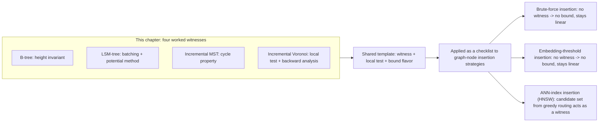

## Why this bounded-update family of arguments is the direct proof technique later applied to growing knowledge graphs

**Key Points**

- Every bounded-update argument in this chapter answers one question in a structure-specific way: *"After one insertion, what is the smallest, locally-certifiable piece of the existing structure I must examine to know I'm done?"* A growing knowledge graph's node-insertion problem is exactly this same question, asked about semantic proximity instead of tree height, batch fullness, cycles, or circumcircles.
- The four techniques surveyed — height invariant, potential-method batching, cycle-property exchange, and local-test propagation with backward analysis — are not just historical curiosities; they are a checklist of the *only known ways* a bounded-cost insertion guarantee has ever been earned for a growing structure. Evaluating any new insertion strategy, including one for LLM-constructed graphs, means checking which of these four templates it can actually claim — or admitting it claims none of them and therefore inherits no bound at all.
- This item is explicitly a bridge: it does not introduce new proof machinery, and it does not yet perform the fusion Chapter 07 is responsible for. It states precisely what carries forward and why the carrying-forward is legitimate, so that Chapter 07's reframing of insertion cost is read as an application of already-justified tools rather than a new, unmotivated claim.

### An Analogy: Reusing an Inspector's Method on a New Kind of System

Recall the four inspectors introduced when this chapter's shared template was made explicit: one who works from a fixed rulebook about shape, one who works from a standing batch schedule, one who works from a provable one-shortcut rule, and one who works from a local spot-check that stops itself. Each inspector was built to certify a specific *kind* of system — filing depth, batch schedules, road networks, closest-location maps. None of those four inspectors was built with knowledge graphs in mind.

Now imagine a fifth system arrives: a knowledge graph that grows one new entity at a time, where "correctness" after each insertion means the new entity ended up connected to the *right* existing entities, and no existing entity's correct connections were silently invalidated. The natural move is not to invent a fifth inspector from nothing. It is to ask, of each of the four existing inspectors in turn: *does this system have anything analogous to what your method certifies?* Does it have a height-like invariant to enforce? A batch schedule to exploit? A single cycle to examine? A local test that can be propagated and trusted to stop? The answer to each of these questions, for a growing knowledge graph, turns out to be genuinely different depending on *which* insertion strategy is used to build it — and that is precisely the question Chapter 07 is built to answer.

### Recalling What Each Technique Actually Certifies

Recall that a **B-tree** earns its bound by enforcing a structural invariant — node capacity, which bounds tree height — so that the affected region of any insertion is *fixed in advance*, before the insertion even runs, purely as a function of the tree's current height.

Recall that an **LSM-tree** earns its bound by imposing a batching schedule on writes — buffer, flush, merge in geometrically growing levels — analyzed via the potential method, so that the affected region is occasionally large but provably rare in exact proportion to its size, summing to a small average.

Recall that an **incremental MST** earns its bound via the cycle property: adding one edge to a tree creates exactly one cycle, and the maximum-weight edge on that cycle is the only edge in the entire structure that could possibly need to change — an algebraically fixed, uniquely determined witness, not a searched-for one.

Recall that an **incremental Voronoi diagram** earns its bound via the empty-circumcircle property, propagated as a local test outward from the new site until the test first passes — a witness that must be *discovered dynamically*, unlike the first three, with its expected size controlled only under a randomness assumption over insertion order (backward analysis).

### The Precise Transfer: What Carries Forward and What Does Not

It is essential to be exact about what this chapter licenses Chapter 07 to do, because overclaiming here would undermine the rest of the curriculum's rigor.

**What carries forward.** The *template itself* carries forward as a well-justified analytical lens: given any growing structure and any insertion procedure for it, ask (a) is there a small, locally-characterizable witness whose state determines how much of the existing structure must be touched, (b) is there a local test that certifies when the search for that witness can stop, and (c) does the resulting bound hold on every operation, in amortized total, or only in expectation over some randomness assumption. This is a general-purpose checklist, independent of trees, batches, cycles, or circles specifically — it is what those four case studies have in common, stripped of their structure-specific content.

**What does not carry forward automatically.** None of the four *specific* techniques transfers directly to a knowledge graph without justification. A knowledge graph has no built-in notion of "height" the way a search tree does. It has no built-in batching schedule the way an LSM-tree's level hierarchy does. Whether a "new edge creates exactly one cycle" style argument applies depends entirely on what "correct insertion" even means for a semantic graph — and unlike an MST, there is no single scalar (like total edge weight) that a knowledge-graph insertion is straightforwardly minimizing, so the cycle property's exact algebraic guarantee has no immediate analogue. Whether a Voronoi-style local test — some check that can be run on a small neighborhood and trusted to certify "nothing further away needs to change" — exists for semantic similarity is an open, structure-dependent question, not a fact inherited for free from the geometric case.

This is exactly why Chapter 07 is described as *fusing* two tracks rather than simply restating one: the vector-embedding track (Chapters 01–04) supplies the specific geometric/algorithmic objects a knowledge-graph insertion strategy might use — cosine similarity thresholds, exact linear scan, HNSW's layered routing — while this chapter supplies the *proof vocabulary* needed to ask, rigorously, whether any given choice among those objects earns a bounded-cost guarantee or not.

### A Preview, Not a Proof: Why Brute-Force and Threshold Insertion Fail the Checklist

Without yet performing Chapter 07's own analysis in full, it is worth naming — as a direct consequence of the checklist above, not as new content — why two of the thesis's four compared insertion strategies are already suspect candidates for a bounded-cost guarantee, based purely on whether they can name a witness at all.

**Brute-force insertion** — comparing a new node against every existing node before deciding where it attaches — by construction never restricts its search to any small region. There is no witness: the entire existing node set is examined every time, by design, which immediately rules out any of the four templates above. A witness-based bound cannot rescue a procedure that never attempts to identify a witness in the first place.

**Embedding-threshold insertion** — comparing a new node's embedding against existing nodes and attaching based on a fixed similarity cutoff — sounds closer to having a witness (only nodes above the threshold are used), but the *search* for which nodes clear that threshold still requires computing similarity against the full existing set, unless it is paired with an index that narrows the search first. The threshold is a *filter* applied after a linear scan, not a *witness-discovery mechanism* in the sense the four case studies use the term; it does not shrink the search, only the result.

**ANN-index insertion (HNSW)**, by contrast, is specifically designed around a witness-discovery mechanism: greedy graph-based routing narrows the candidate set from the full node population down to a small local neighborhood before any fine-grained comparison happens, echoing the *propagate-a-local-test-until-it-stops* character of the incremental Voronoi diagram's conflict-region search far more than it echoes brute-force scanning.

Naming this now is explicitly a preview: whether this intuition survives rigorous treatment, what precisely plays the role of "the local test," and how the resulting cost curve compares to the theoretical bound versus what is empirically measured, is the full content of Chapter 07 and is not claimed to be established here.

### Reading This Chapter's Role Correctly

The correct summary of what Chapter 06 has established, stated precisely: it has **not** proven anything about knowledge graphs, embeddings, or LLM-driven insertion. It has proven four independent, self-contained results about four classical structures, and extracted from them a single reusable analytical template — witness, local test, guarantee flavor — that is *general enough* to be meaningfully applied to a new domain, while being careful to note that its specific mechanisms (height, batching, cycles, circumcircles) do not transfer without domain-specific justification. Chapter 07's task is precisely that justification: applying this template, honestly, to insertion strategies for a growing LLM-constructed graph, and reporting faithfully which strategies can claim a witness-backed bound and which cannot.

**Next Steps**

- Chapter 07: insertion into a growing graph reframed explicitly as a growth-cost problem, applying this chapter's witness/local-test checklist to brute-force, embedding-threshold, ANN-index, and bounded-bucket insertion strategies in turn
- Revisiting HNSW's greedy routing and layered hierarchy (Chapter 04) as the candidate witness-discovery mechanism for ANN-index insertion, examined against the same rigor applied to the Voronoi diagram's conflict region in this chapter
- The distinction between a theoretical bound and an empirically measured cost curve, introduced in Chapter 07, as the natural next question once a candidate witness has been proposed for a given insertion strategy