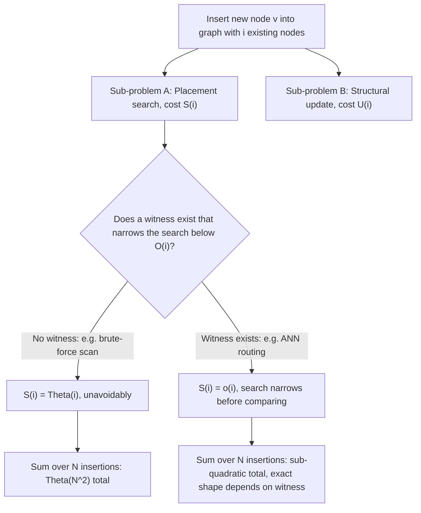

## Reframing "inserting a new node into an existing graph" explicitly as a growth-cost problem in the amortized-analysis sense

**Key Points**

- "Insert a new node into a growing graph" is not, by itself, a well-posed cost question. It only becomes one once it is restated in the same form every case study in this curriculum's amortization track has used: *what is the cost of the $i$-th insertion, as a function of $i$, and what is the total and average cost across a full sequence of $N$ insertions?*
- This reframing separates two questions that are easy to accidentally conflate: the cost of *deciding where a new node attaches* (a search/comparison problem) and the cost of *actually attaching it and maintaining the graph's invariants* (a structural-update problem). Different insertion strategies distribute cost differently across these two questions.
- Once reframed this way, the witness/local-test checklist assembled from B-trees, LSM-trees, incremental MSTs, and incremental Voronoi diagrams becomes directly applicable: the question "does this insertion strategy have a witness that bounds its cost below $O(i)$?" is now stated in a form that can actually be answered per strategy, which is exactly what the rest of this chapter does.

### An Analogy: Two Different Questions a New Hire Faces on Day One

Picture a new employee joining a large, already-established organization. Two genuinely separate costs are involved in getting them correctly placed. The first is a **search cost**: someone has to figure out which team, which manager, which existing colleagues this person should actually be connected to — and doing that badly (say, by having them individually meet every single person in the entire company before deciding) gets more expensive the larger the company already is. The second is a **maintenance cost**: once placed, does anything about the existing org chart need to change — does a manager's reporting line shift, does a team roster need updating, does an internal directory need reindexing? A company with almost no onboarding process might make the search cost enormous (meet everyone) while keeping maintenance cost trivial (just add one row to a spreadsheet). A company with a rigorous, hierarchical structure might make the search cost small (a fixed few interviews determined by org-chart depth) while occasionally requiring real maintenance work (a team reorganization) when growth crosses some threshold.

Recall that a **B-tree** bounds insertion cost by maintaining a small, uniform tree height via node splits, so every insert touches $O(\log_B N)$ nodes along one path — this is the "rigorous hierarchy" pattern: search cost and maintenance cost are both kept small and both fixed in advance by structure. Recall that an **LSM-tree** defers almost all its cost to background batch compaction, keeping the client-visible write cost nearly free — this is closer to "meet no one, sort it out later in bulk." A growing knowledge graph's node-insertion problem sits somewhere on this same spectrum, and which point on the spectrum it occupies depends entirely on which insertion strategy is chosen — which is precisely what this reframing exists to make precise enough to analyze.

### Recalling the Amortized-Analysis Vocabulary This Reframing Needs

Recall that amortized analysis bounds the average cost per operation across a worst-case sequence of operations, even though individual operations in that sequence can vary enormously in cost, and recall that reading such a bound correctly means treating it as a statement about a *sequence*, never a guarantee about any single operation in isolation.

Recall that the aggregate method proves such a bound by totaling the actual cost of a sequence of $n$ operations and dividing by $n$; this is the most direct tool for the reframing below, since "insert $N$ nodes into a graph, one at a time" is exactly the shape of sequence the aggregate method is built to analyze.

Recall the chapter-06 synthesis template: any bounded-cost insertion guarantee, across every classical case study examined, rests on identifying a **witness** — a small, locally-characterizable piece of the existing structure whose state determines how much must be touched — certified by a **local test**, with the resulting bound holding either on every operation, in amortized total, or only in expectation over some randomness assumption.

### Stating the Reframing Precisely

The informal request "insert a new node into an existing graph" conceals two independently costed sub-problems that must be separated before any cost analysis is possible:

> **Sub-problem A — Placement search.** Given a graph $G_i$ with $i$ existing nodes and a new node $v_{i+1}$ to be added, what is the cost of determining *which* existing nodes $v_{i+1}$ should connect to? Call this cost $S(i)$.
>
> **Sub-problem B — Structural update.** Once the target attachment points are known, what is the cost of physically inserting $v_{i+1}$, updating any auxiliary index structures, and re-establishing whatever invariants the graph or its supporting index is meant to maintain? Call this cost $U(i)$.

The total cost of the $i$-th insertion is $C(i) = S(i) + U(i)$, and the object of interest — exactly as in every Chapter 06 case study — is not $C(i)$ for a single $i$, but the behavior of $\sum_{i=1}^{N} C(i)$ as $N$ grows, and in particular whether the *amortized* cost $\frac{1}{N}\sum_{i=1}^N C(i)$ stays sub-linear in $N$ or degrades toward $O(N)$ per insertion, i.e. $O(N^2)$ total, as the graph grows.

This split matters because the four classical case studies distribute cost across $S(i)$ and $U(i)$ very differently, and a growing knowledge graph's insertion strategies will turn out to do the same:

- A B-tree's $S(i)$ (finding the right leaf) and $U(i)$ (splitting nodes if needed) are both $O(\log_B i)$ — search and update are both bounded by the same height invariant.
- An LSM-tree's $S(i)$ is essentially $O(1)$ (just write to the memtable) while $U(i)$ is where all the real, amortized-but-occasionally-large cost lives (compaction cascades).
- An incremental MST's $S(i)$ is the cost of walking the fundamental cycle to find the maximum-weight edge ($O(V)$ naive, or amortized $O(\log V)$ with a link-cut tree), and $U(i)$ — the actual edge swap — is $O(1)$ once the witness edge is found: nearly all the cost lives in search, almost none in update.
- An incremental Voronoi diagram's $S(i)$ (locating the triangle containing the new site) and $U(i)$ (retriangulating the conflict region) are both wrapped into the same conflict-region discovery process, with expected $O(1)$ total work per insertion under random order.

### Why the Naive Framing ("Just Compare to Everything") Already Fails This Reframing

Stating the reframing this explicitly immediately exposes why the crudest possible insertion strategy is a degenerate case rather than a baseline worth taking for granted. If $S(i)$ is defined as "compare the new node against every one of the $i$ existing nodes," then $S(i) = \Theta(i)$ by construction — not because any adversarial worst case forces it, but because the *procedure itself* is defined to do this on every single call, with no witness, no local test, and no possibility of a smaller answer. Summed across $N$ insertions:

$$\sum_{i=1}^{N} S(i) = \sum_{i=1}^{N} \Theta(i) = \Theta(N^2)$$

giving amortized cost $\Theta(N)$ per insertion — not sub-linear, not even constant-with-occasional-spikes the way the LSM-tree's amortized bound works out, but *uniformly and unavoidably linear in the current graph size, every single time*. This is worth stating precisely because it is the single most important consequence of the reframing: without a witness of some kind, $S(i)$ has no mechanism available to be anything other than $\Theta(i)$, and $\Theta(N^2)$ total cost across a full build-up is the honest, unavoidable consequence — not a pessimistic worst-case bound that a lucky sequence might avoid, but the guaranteed behavior of a procedure that never attempts to narrow its search.

### Worked Example: Totaling Cost Across a Small Insertion Sequence

Take a toy scenario where a graph grows from 0 to 6 nodes, one insertion at a time, and compare two placement strategies for $S(i)$: **brute-force** ($S(i) = i$, i.e. one comparison per existing node) against a **hypothetical witness-based strategy** where a candidate witness narrows the search to a small fixed neighborhood, giving $S(i) = \lceil \log_2(i+1) \rceil$ as a stand-in for "some sub-linear search cost" (the exact functional form for a real ANN-index strategy is addressed later in this chapter; this worked example exists only to make the arithmetic of the reframing concrete, not to claim this specific formula for any real system).

| Insertion $i$ | Brute-force $S(i)=i$ | Witness-based $S(i)=\lceil\log_2(i+1)\rceil$ |
| --- | --- | --- |
| 1 | 0 | 1 |
| 2 | 1 | 2 |
| 3 | 2 | 2 |
| 4 | 3 | 3 |
| 5 | 4 | 3 |
| 6 | 5 | 3 |
| **Total** | **15** | **14** |
| **Amortized (total/6)** | **2.5** | **2.33** |

At this tiny scale the two totals look deceptively similar — this is precisely why the reframing insists on the *asymptotic* behavior as $N$ grows, not a small worked instance. Extending the same two formulas out to $N=1000$: brute-force totals $\sum_{i=1}^{1000} i = 500{,}500$, amortized cost $500.5$ per insertion — growing linearly with $N$ forever. The witness-based stand-in totals $\sum_{i=1}^{1000}\lceil\log_2(i+1)\rceil \approx 8{,}973$ [Inference: this is an approximate sum computed from the formula given, not a benchmarked or empirically measured figure], amortized cost roughly $9$ per insertion, and critically, that amortized figure grows only logarithmically as $N$ increases further, rather than linearly. The small table above and this extended comparison exist to make one point concrete: *the gap between "has a witness" and "has no witness" is invisible at small $N$ and becomes the entire story at large $N$* — which is exactly the empirical-versus-theoretical distinction this chapter goes on to examine directly for real insertion strategies.

### What This Reframing Does and Does Not Yet Claim

This item has deliberately not yet asserted which real insertion strategy — brute-force, embedding-threshold, ANN-index, or bounded-bucket — achieves which $S(i)$ and $U(i)$ in practice; that is the specific content of the items that follow in this chapter. What this item has established is narrower and more foundational: that "insert a new node into a growing graph" is only a well-posed *cost* question once restated as a sequence-indexed pair of functions $S(i)$ and $U(i)$, summed and averaged across $N$ insertions in the same aggregate-method style used for every classical structure in Chapter 06, and that the presence or absence of a witness narrowing $S(i)$ below $\Theta(i)$ is — as the worked comparison above shows numerically — the single factor separating an insertion strategy whose amortized cost stays flat or grows slowly from one whose amortized cost grows linearly with the graph's own size, forever, as a direct and unavoidable arithmetic consequence rather than an unlucky edge case.

**Related Topics**

- Why brute-force and embedding-threshold insertion both remain linear in $S(i)$, examined next with the specific mechanics of each strategy rather than the placeholder formula used in this item's worked example
- Why an ANN index changes the shape of the cost curve, connecting HNSW's greedy routing (Chapter 04) to the witness role this item has now defined precisely as $S(i) = o(i)$
- The distinction between a theoretical bound on $S(i)$ and $U(i)$ and an empirically measured cost curve, needed once real insertion strategies are substituted for this item's illustrative placeholder