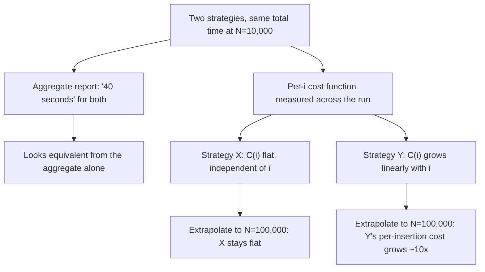

## What it precisely means to measure insertion cost as a function of the size of the structure already built, rather than as a single aggregate number

**Key Points**

- A single aggregate number — "inserting 10,000 nodes took 40 seconds" — collapses away exactly the information needed to answer this thesis's central question, because it cannot distinguish a strategy whose cost stays flat as the graph grows from one whose cost grows linearly or worse with graph size.
- The correct object of study is a **cost function** $C(i)$: the cost of the $i$-th insertion, expressed as a function of $i$, the number of nodes already present *before* this insertion happens. Reporting only $\sum_i C(i)$ or its average throws away the shape of $C(i)$ — and the shape is the entire empirical question this thesis is asking.
- This distinction is not pedantry. It is the difference between measuring *whether* a system was fast on one occasion and measuring *how* its cost scales — the second is a claim about behavior at sizes not yet tested, and only a per-$i$ cost function, not an aggregate, can license that kind of claim.

### An Analogy: Timing a Commute vs. Modeling Traffic

Picture two different ways of describing how bad a city's traffic is. The first: "The average commute across the whole city last year was 32 minutes." This single number is real, honestly computed, and almost useless for predicting anything — it says nothing about whether a commute at 7am differs from one at 7pm, or whether commutes have been getting worse as the city's population grows, or whether a commuter driving 3 miles experiences roughly the same delay as one driving 30 miles. The second way: "Commute time as a function of distance traveled, measured separately at each distance, holds roughly constant per mile at off-peak times but grows worse than linearly with distance during peak hours because congestion compounds." This second description is a *function*, not a number, and it is the only one of the two that can be used to predict what happens on a commute *not yet measured* — a new 40-mile peak-hour trip, say.

Reporting "total insertion time for 10,000 nodes" is the first kind of statement. Reporting "cost of the $i$-th insertion, measured at $i=100$, $i=1{,}000$, $i=10{,}000$, and $i=100{,}000$" is the second kind, and it is the only kind that can support a claim like "this strategy's cost grows logarithmically with graph size" rather than merely "this strategy processed 10,000 nodes in 40 seconds on one occasion."

### Recalling the Vocabulary This Distinction Needs

Recall that amortized analysis bounds the *average* cost per operation across a sequence, and that this average is computed by summing actual per-operation costs and dividing by the number of operations — recall the aggregate method specifically, which proves an amortized bound this exact way. Note carefully what this means: even a *correct* amortized-cost claim is, in its proof, built from a sequence of individual $C(i)$ values, not skipped straight to a single total. The proof technique itself insists on looking at cost as a function of position in the sequence before collapsing it to an average — collapsing to the average is the *last* step of the argument, not something that can be done first without losing information.

Recall also, from the reframing established in the item introducing insertion as a growth-cost problem, that the total cost of the $i$-th insertion was defined as $C(i) = S(i) + U(i)$ — placement-search cost plus structural-update cost — both explicitly written as functions of $i$, the number of nodes already present, precisely so that their *growth behavior* in $i$ could be examined rather than only their sum across a fixed run.

### Why an Aggregate Number Cannot Answer the Question This Thesis Asks

State the failure mode precisely. Suppose two insertion strategies, $X$ and $Y$, are each used to build a graph from 0 to $N=10{,}000$ nodes, and suppose both produce the *same total time*, say 40 seconds. An aggregate report — "both strategies took 40 seconds for 10,000 insertions" — would suggest the two strategies are equivalent. But this can easily be consistent with two entirely different cost functions:

$$C_X(i) = c \quad \text{(constant per insertion, independent of } i\text{)}$$

$$C_Y(i) = c' \cdot \frac{2i}{N} \quad \text{(cost grows linearly with } i\text{, chosen so the total matches } X\text{'s)}$$

Strategy $X$'s cost per insertion is flat: inserting the 10,000th node costs the same as inserting the 5th. Strategy $Y$'s cost per insertion at $i=10{,}000$ is roughly *twice* its average, and — critically — if the graph were grown further to $N=100{,}000$, $Y$'s cost at $i=100{,}000$ would be roughly $10\times$ its cost at $i=10{,}000$, while $X$'s cost would be unchanged. The aggregate totals at $N=10{,}000$ are equal by construction; the *behavior as $N$ continues to grow* is not remotely equal, and no amount of staring at the two 40-second totals reveals this. Only measuring $C(i)$ across a range of $i$ values — not just totaling across one fixed run — distinguishes them.

### Worked Example: Reconstructing $C(i)$ From Raw Timings

Take a concrete, small trace. Suppose 8 nodes are inserted one at a time into a graph, and each insertion's wall-clock cost (in arbitrary cost units) is individually recorded rather than only summed:

| Insertion $i$ (nodes already present before this insertion) | $C(i)$, measured |
| --- | --- |
| 0 | 1 |
| 1 | 1 |
| 2 | 2 |
| 3 | 2 |
| 4 | 3 |
| 5 | 3 |
| 6 | 3 |
| 7 | 4 |

An aggregate report would say: total cost $= 1+1+2+2+3+3+3+4 = 19$, average $= 19/8 = 2.375$. That single number, $2.375$, is the entire content of an aggregate report — and it is compatible with *many* different growth shapes. But because $C(i)$ was recorded individually, a much stronger statement is available: $C(i)$ appears to grow roughly like $\lceil \log_2(i+2) \rceil$ (check: $i=0 \to 1$, $i=1 \to 1$ or $2$, $i=3 \to 2$, $i=7 \to 3$ — roughly consistent with a logarithmic shape, though this small trace alone is not enough data to confirm the exact functional form rigorously). This is the qualitative difference the reframing insists on: the aggregate gives a single descriptive statistic; the per-$i$ trace gives a *shape*, and shape is what supports an extrapolated claim like "cost grows logarithmically with graph size" — the exact kind of claim this thesis's cost-curve comparisons depend on.

<svg xmlns="http://www.w3.org/2000/svg" viewBox="0 0 420 300">
<text x="210" y="24" text-anchor="middle" font-size="14" font-family="sans-serif" font-weight="bold">Per-insertion cost C(i) vs. a single average (svg_diagram)</text>
<line x1="50" y1="260" x2="400" y2="260" stroke="#333" stroke-width="1.5" />
<line x1="50" y1="260" x2="50" y2="50" stroke="#333" stroke-width="1.5" />
<text x="225" y="285" text-anchor="middle" font-size="11" font-family="sans-serif">insertion index i</text>
<text x="20" y="150" text-anchor="middle" font-size="11" font-family="sans-serif" transform="rotate(-90 20 150)">cost C(i)</text>
<line x1="50" y1="200" x2="400" y2="200" stroke="#d62728" stroke-width="1.5" stroke-dasharray="5,4" />
<text x="395" y="195" text-anchor="end" font-size="10" font-family="sans-serif" fill="#d62728">average = 2.375</text>
<circle cx="70" cy="220" r="4" fill="#4C78A8" />
<circle cx="110" cy="220" r="4" fill="#4C78A8" />
<circle cx="150" cy="180" r="4" fill="#4C78A8" />
<circle cx="190" cy="180" r="4" fill="#4C78A8" />
<circle cx="230" cy="140" r="4" fill="#4C78A8" />
<circle cx="270" cy="140" r="4" fill="#4C78A8" />
<circle cx="310" cy="140" r="4" fill="#4C78A8" />
<circle cx="350" cy="100" r="4" fill="#4C78A8" />
<path d="M70,220 L110,220 L150,180 L190,180 L230,140 L270,140 L310,140 L350,100" stroke="#4C78A8" stroke-width="2" fill="none" />
</svg>

The dashed red line is everything an aggregate report communicates. The blue step curve — $C(i)$ traced across the sequence — is what the reframing in this chapter requires actually collecting, and is the only one of the two that visibly rises with $i$ rather than sitting at a fixed height.

### Precisely What Must Be Measured, and at What Granularity

Stated as a concrete measurement protocol, applicable to any of the insertion strategies this thesis compares:

- Record $C(i)$ individually for each insertion, tagged with $i$, the number of nodes present *immediately before* that insertion — not the index in some external enumeration, and not a batch-averaged figure over every 100 insertions, since batching re-introduces exactly the information loss an aggregate number has.
- Take measurements across a wide enough range of $i$ — ideally spanning at least one or two orders of magnitude — to distinguish a constant cost function from a logarithmic one, and a logarithmic one from a linear one, since at small $i$ these shapes can look deceptively similar (this echoes the earlier worked comparison where brute-force and a sub-linear alternative nearly coincided at $N=6$ and diverged sharply by $N=1{,}000$).
- Keep $S(i)$ (placement search cost) and $U(i)$ (structural update cost) separable in the recorded data where possible, since a cost function that blends both can mask which sub-problem is responsible for a given growth shape — a strategy might have flat $U(i)$ but linearly growing $S(i)$, and only a report that keeps the two apart reveals which one to attribute a bad curve to.
- Treat any single-run total, even a large and carefully measured one, as at most a sanity check against the per-$i$ curve's implied total — never as a substitute for the curve itself.

### The Distinction This Sets Up for the Rest of the Chapter

This item does not yet claim what shape $C(i)$ takes for any real insertion strategy — brute-force, embedding-threshold, ANN-index, or bounded-bucket — nor does it yet address whether a strategy's *theoretical* cost function (the $O(\cdot)$ bound a proof licenses) actually matches its *empirically measured* one once implemented and run. What it establishes is the measurement discipline those later questions depend on: that "cost of growing this graph" is only a meaningful, falsifiable claim when expressed and collected as $C(i)$ across a range of $i$, and that any report collapsing this down to one aggregate number — however accurately computed — has already discarded the one thing a scaling claim needs in order to be checked.

**Related Topics**

- Why brute-force and embedding-threshold insertion both remain linear in $S(i)$, now statable and checkable directly against a measured $C(i)$ curve rather than a single total
- Why an ANN index changes the shape of the cost curve, examined as a claim about $C(i)$'s asymptotic shape rather than a claim about any single run's total time
- The distinction between a theoretical bound and an empirically measured curve, which depends entirely on having collected $C(i)$ at the granularity this item specifies, rather than an aggregate figure