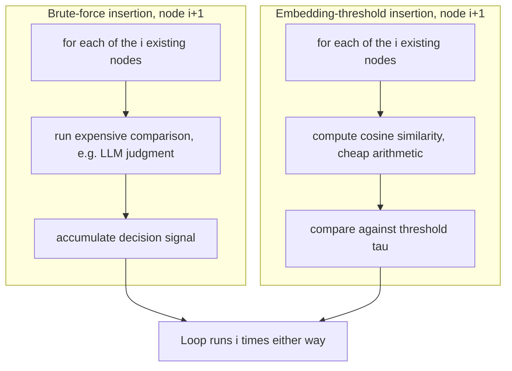

## Why brute-force insertion and embedding-threshold insertion both remain linear in existing structure size, even though one is cheaper per comparison than the other

**Key Points**

- Brute-force insertion and embedding-threshold insertion differ in *what* they compute per comparison and in *what decision rule* they apply afterward, but neither one changes *how many* existing nodes get examined before a placement decision is made — both examine all $i$ existing nodes, every time, for the $i$-th insertion.
- This means both strategies have placement-search cost $S(i) = \Theta(i)$, exactly the degenerate case identified when insertion was first reframed as a growth-cost problem: no witness, no local test, no narrowing — and therefore $\sum_{i=1}^{N} S(i) = \Theta(N^2)$ total cost for either one, despite embedding-threshold insertion being, per individual comparison, considerably cheaper than whatever brute-force is compared against.
- The lesson this item exists to make precise: a cheaper per-comparison operation is a **constant-factor** improvement, not a **complexity-class** improvement. Multiplying $\Theta(i)$ by a smaller constant is still $\Theta(i)$; it never becomes $o(i)$. Confusing "faster per comparison" with "asymptotically better" is exactly the mistake this chapter's reframing is built to prevent.

### An Analogy: Two Ways of Reading Every Resume in a Filing Cabinet

Picture two hiring managers, each trying to decide which team a new candidate should join, given an existing filing cabinet of every current employee's file. The first manager reads every single file cover to cover — full work history, every project, every reference — before making a judgment call about fit. The second manager has a much faster method: each file has a one-line summary tag stuck to its front, and the manager just glances at that tag on every file, checking whether it clears some fixed bar of relevance, before deciding. The second manager is clearly faster *per file* — glancing at a tag takes a fraction of a second, reading a full dossier takes minutes. But both managers still walk past **every single file in the cabinet** before making their decision. If the cabinet has 10,000 files, both managers touch all 10,000, every single time a new candidate arrives — one just touches each file more cheaply than the other. Adding a thousand more employees to the company doesn't change this structural fact for either manager: both keep touching the *entire* growing cabinet on every new hire, and the gap between "minutes per file" and "a glance per file" is a constant multiplier on an ever-growing count, never a way of touching fewer files.

This is exactly the relationship between brute-force insertion and embedding-threshold insertion. One does more expensive work per existing node; the other does cheaper work per existing node. Neither one reduces *how many* existing nodes get touched.

### Recalling the Vocabulary This Argument Needs

Recall that cosine similarity measures the angle between two vectors while ignoring their magnitude, and that a similarity threshold is an empirically chosen cutoff value above which two embeddings are treated as sufficiently close to warrant some downstream action — recall also that this threshold is an empirical engineering choice with real failure modes, not a value derivable from first principles.

Recall the placement-search cost $S(i)$ defined when insertion was reframed as a growth-cost problem: the cost of determining, given $i$ existing nodes, which of them a new node $v_{i+1}$ should connect to. Recall that a witness-based strategy narrows this search before performing detailed comparisons, and that absent such a witness, $S(i)$ has no available mechanism to be anything smaller than $\Theta(i)$ — this is precisely the situation both strategies examined in this item are shown to be in.

### Defining the Two Strategies Precisely

**Brute-force insertion**, for the purposes of this comparison, means: given a new node $v_{i+1}$ and $i$ existing nodes, perform some full, expensive comparison against every existing node — this could mean an LLM-as-judge call assessing semantic relationship for each pair, a full-text or structural comparison, or any per-pair operation whose cost is large relative to a single arithmetic operation — and use the results to decide $v_{i+1}$'s placement (which existing nodes to connect to, or whether to merge $v_{i+1}$ with an existing node entirely).

**Embedding-threshold insertion** means: given a new node $v_{i+1}$'s embedding and the $i$ existing nodes' embeddings, compute the cosine similarity (or another vector similarity metric) between $v_{i+1}$ and every existing node, and connect $v_{i+1}$ to every existing node whose similarity clears a fixed threshold $\tau$.

The critical shared feature, despite everything that differs between them, is stated in the next section.

### The Shared Structural Fact: Both Iterate Over the Full Existing Set

Write out each strategy's placement-search step as a loop over the existing node set, to make the shared structure impossible to miss:

Both loops execute exactly $i$ times for the $i$-th insertion — this is not an incidental implementation detail, it is a direct consequence of how each strategy is defined: neither one specifies any rule for skipping, pruning, or narrowing which existing nodes get examined before a comparison is performed. The *cost of a single loop iteration* differs enormously — call the brute-force per-comparison cost $k_{BF}$ (large: an LLM call, or a heavyweight structural comparison) and the embedding-threshold per-comparison cost $k_{ET}$ (small: one dot product and one normalization, both $O(d)$ in embedding dimension $d$, but $d$ is fixed and does not grow with $i$). The total placement-search cost for the $i$-th insertion under each strategy is:

$$S_{BF}(i) = k_{BF} \cdot i, \qquad S_{ET}(i) = k_{ET} \cdot i$$

Both are of the form (constant)$\times i$ — both are $\Theta(i)$. The constants $k_{BF}$ and $k_{ET}$ can differ by orders of magnitude in practice, and $k_{ET} \ll k_{BF}$ is a completely realistic and expected relationship. But an order-of-magnitude difference in a multiplicative constant does not change the *functional form* of the growth: both functions are straight lines through the origin when plotted against $i$, merely with very different slopes.

### Why This Is a Complexity-Class Distinction, Not a Speed Distinction

State the general principle this item exists to establish, since it recurs constantly once real systems are involved: for any two functions of the form $c_1 \cdot i$ and $c_2 \cdot i$ with $c_1 \ne c_2$ both positive constants, both are $\Theta(i)$ — membership in an asymptotic complexity class is a statement about *growth shape as $i \to \infty$*, and multiplying by a constant, however large or small, never changes that shape. Contrast this against what *would* actually change the complexity class: replacing the "for each of the $i$ existing nodes" loop with something that examines only $O(\log i)$ or $O(1)$ nodes on average, regardless of how expensive each individual examination is. That is a change to the *shape* of $S(i)$, not merely its constant — and that is exactly the kind of change a witness-based strategy (examined in the next item, for ANN-index insertion) is built to achieve.

Summed across a full build from $0$ to $N$ nodes, this distinction has dramatic real consequences despite looking like a minor technicality when stated abstractly:

$$\sum_{i=1}^{N} S_{BF}(i) = k_{BF}\sum_{i=1}^N i = k_{BF}\cdot\frac{N(N+1)}{2} = \Theta(N^2)$$

$$\sum_{i=1}^{N} S_{ET}(i) = k_{ET}\sum_{i=1}^N i = k_{ET}\cdot\frac{N(N+1)}{2} = \Theta(N^2)$$

Both totals are quadratic in $N$. The only difference between them is the constant multiplier out front — embedding-threshold insertion's total will be a smaller number in practice, potentially by a large factor, but it grows exactly as fast, in shape, as brute-force's total does.

### Worked Numeric Comparison: Watching the Gap Stay Proportional, Not Shrink

Take illustrative constants $k_{BF} = 100$ (cost units per comparison, representing something like an expensive per-pair judgment) and $k_{ET} = 1$ (cost units per comparison, representing cheap embedding arithmetic) — chosen only to make the arithmetic below concrete, not as a measured or benchmarked ratio for any real system. [Inference: the 100-to-1 ratio is illustrative, chosen to make the constant-factor point vivid; a real ratio between an LLM-based comparison and a vector dot product would depend heavily on implementation and hardware and is not asserted here.]

| $N$ (final graph size) | $\sum S_{BF}(i) = 100\cdot\frac{N(N+1)}{2}$ | $\sum S_{ET}(i) = 1\cdot\frac{N(N+1)}{2}$ | Ratio |
| --- | --- | --- | --- |
| 100 | 505,000 | 5,050 | 100 |
| 1,000 | 50,050,000 | 500,500 | 100 |
| 10,000 | 5,000,500,000 | 50,005,000 | 100 |

The ratio between the two totals stays fixed at exactly $100$ — the constant $k_{BF}/k_{ET}$ — no matter how large $N$ grows, which is the numeric signature of "same complexity class, different constant." If embedding-threshold insertion were instead achieving a genuinely different complexity class — say $\Theta(N\log N)$ instead of $\Theta(N^2)$ — the ratio in that rightmost column would *grow* with $N$ rather than staying flat, because the two totals would be diverging in shape, not merely in scale. The fact that the ratio in this table holds constant across three orders of magnitude of $N$ is exactly what "both strategies remain linear in $i$ per insertion, hence quadratic in total" looks like when checked numerically rather than asserted symbolically.

<svg xmlns="http://www.w3.org/2000/svg" viewBox="0 0 420 300">
<text x="210" y="24" text-anchor="middle" font-size="14" font-family="sans-serif" font-weight="bold">S(i) for both strategies: same shape, different slope (svg_diagram)</text>
<line x1="50" y1="260" x2="400" y2="260" stroke="#333" stroke-width="1.5" />
<line x1="50" y1="260" x2="50" y2="40" stroke="#333" stroke-width="1.5" />
<text x="225" y="285" text-anchor="middle" font-size="11" font-family="sans-serif">existing nodes i</text>
<text x="20" y="150" text-anchor="middle" font-size="11" font-family="sans-serif" transform="rotate(-90 20 150)">S(i)</text>
<line x1="50" y1="260" x2="380" y2="60" stroke="#d62728" stroke-width="2.5" />
<text x="330" y="70" text-anchor="start" font-size="10" font-family="sans-serif" fill="#d62728">brute-force, steep slope</text>
<line x1="50" y1="260" x2="380" y2="220" stroke="#4C78A8" stroke-width="2.5" />
<text x="330" y="235" text-anchor="start" font-size="10" font-family="sans-serif" fill="#4C78A8">embedding-threshold, shallow slope</text>
</svg>

Both lines are straight; both pass through the origin; both extend forever with no flattening. This is the visual signature of $\Theta(i)$ regardless of slope — and it is the direct contrast to what a genuinely sub-linear $S(i)$ curve looks like, which bends and flattens rather than continuing as a straight line.

### Why the Threshold Rule Itself Does Not Rescue Embedding-Threshold Insertion

It is worth addressing directly why the *decision rule* half of embedding-threshold insertion — clearing a fixed similarity cutoff $\tau$ — does not, by itself, constitute a witness in the Chapter 06 sense, even though it superficially resembles one. Recall that a witness is a mechanism that *narrows which existing nodes are examined* before comparison happens — the B-tree's height invariant determines which single path to walk without visiting other paths; the incremental Voronoi diagram's local test stops propagating outward once it finds legal ground, without visiting distant triangles at all. The threshold $\tau$ in embedding-threshold insertion is applied strictly *after* the similarity to every existing node has already been computed — it filters the *result set* of an already-complete linear scan, rather than filtering *which nodes get scanned* in the first place. A rule that decides what to do with $i$ already-computed values is not the same as a rule that avoids computing some of those $i$ values, and only the latter kind of rule is capable of changing $S(i)$'s complexity class.

### What This Sets Up

This item has shown, precisely, that two insertion strategies which look meaningfully different in engineering practice — one built on expensive per-pair judgments, one built on cheap vector arithmetic — are nonetheless asymptotic siblings: both $\Theta(i)$ per insertion, both $\Theta(N^2)$ in total, separated only by a constant factor that can be made arbitrarily large or small without altering that shared shape. The natural next question, addressed directly in the next item, is what a strategy would have to do differently to actually escape $\Theta(i)$ — and the answer is exactly the witness-and-local-test mechanism this curriculum's amortization track has been assembling since Chapter 06, now applied to an ANN index's graph-based routing.

**Related Topics**

- Why an ANN index changes the shape of the cost curve, examined as the first strategy in this chapter to genuinely narrow $S(i)$ below $\Theta(i)$ rather than merely reducing its constant
- The distinction between a theoretical bound and an empirically measured curve, applicable to checking whether a real embedding-threshold implementation's measured $S(i)$ actually matches the $\Theta(i)$ shape derived here
- Revisiting similarity thresholds as an empirical engineering choice with real failure modes, now viewed specifically through its cost implications rather than only its placement-quality implications