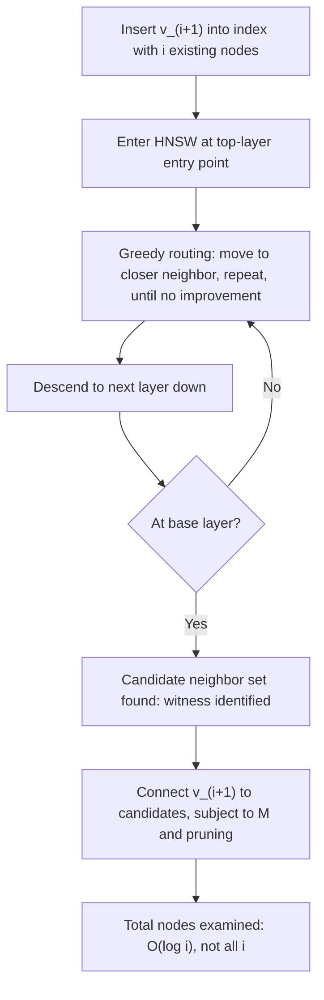

## Why an ANN index changes the shape of the insertion-cost curve rather than just lowering a constant factor

**Key Points**
- Brute-force and embedding-threshold insertion were both shown to have placement-search cost $S(i) = \Theta(i)$ — a straight line through the origin, differing only in slope. An ANN-index insertion strategy built on HNSW changes the *functional form* of $S(i)$ itself, from linear to logarithmic: $S(i) = O(\log i)$, a curve that bends and flattens rather than continuing straight.
- This is possible precisely because HNSW's greedy routing supplies exactly what brute-force and embedding-threshold insertion lack: a witness, discovered by a local test, that narrows which existing nodes get examined *before* fine-grained comparison happens — the same structural role played by a B-tree's height-bounded path or a Voronoi diagram's conflict region.
- The distinction from the prior item still applies in the other direction here: HNSW's per-comparison cost is not free, and its build/maintenance cost is not zero — so this item is careful to state exactly what shrinks (the *number* of nodes examined) and what does not automatically vanish (the cost of maintaining the index structure itself, addressed by $U(i)$ rather than $S(i)$).

### An Analogy: Consulting a Directory Instead of Reading Every File

Recall the two hiring managers from the prior item: one reading every dossier in a filing cabinet cover to cover, one glancing at a one-line tag on every dossier — both touching all $i$ files, at different cost per file. Now imagine a third manager who works differently in kind, not just in speed. This manager has access to a **directory structure imposed on the cabinet itself**: files are organized so that a small set of "hub" files point toward clusters of related files, which in turn point toward more specific sub-clusters, and so on. Given a new candidate, this manager starts at a hub, asks "which of this hub's few pointers looks most relevant," follows that pointer, and repeats — narrowing from the entire cabinet down to a small relevant handful *before* ever opening a file in detail. This manager touches perhaps a dozen files total, not all $i$ of them, regardless of whether the cabinet holds a hundred files or a hundred thousand. The first two managers' speed differed by a constant; this third manager's approach differs in *how many files get touched at all*, and that is a difference in kind, not degree.

This third manager is what an ANN index, specifically HNSW, provides for placement search.

### Recalling the Vocabulary This Argument Needs

Recall that HNSW builds a layered hierarchy of navigable small-world graphs, with sparser, longer-range connections at upper layers and denser, shorter-range connections at the base layer, and that a query proceeds via **greedy routing**: starting at an entry point in the topmost layer, repeatedly move to the neighbor closest to the query vector until no neighbor improves the distance, then drop down one layer and repeat, narrowing toward the query's true nearest neighbors as the search descends toward the base layer.

Recall that this querying process is governed by parameters $M$ (the maximum number of neighbor connections maintained per node) and $ef$ (the size of the candidate list explored during search, controlling the breadth-versus-speed tradeoff) — both fixed, tunable constants that do not grow with the size of the indexed set $i$.

Recall the shared template extracted from B-trees, LSM-trees, incremental MSTs, and incremental Voronoi diagrams: a bounded-cost insertion guarantee always rests on identifying a small, locally-characterizable **witness** whose state determines how much of the existing structure must be touched, certified by a **local test** that determines when the search for that witness can stop.

### Stating Precisely What Changes

Recall the placement-search cost $S(i)$ defined when insertion was first reframed as a growth-cost problem, and recall the conclusion of the prior item: for both brute-force and embedding-threshold insertion, $S(i) = \Theta(i)$, because neither strategy has any mechanism for skipping which existing nodes are examined.

An ANN-index insertion strategy inserts a new node $v_{i+1}$ by using HNSW's own greedy-routing mechanism — the same mechanism used to *answer a query* — to find $v_{i+1}$'s approximate nearest neighbors among the $i$ existing indexed nodes, then attaches $v_{i+1}$ to those neighbors (subject to $M$ and pruning rules) rather than comparing $v_{i+1}$ against all $i$ nodes directly. Recall that greedy routing's descent through the layered hierarchy takes expected $O(\log i)$ hops to converge on a good candidate set, a consequence of the hierarchy's layer structure (each layer up thins the node population geometrically, echoing the same geometric-batching intuition seen in the LSM-tree's level hierarchy, though here applied to graph layers rather than merge levels). This gives:

$$S_{ANN}(i) = O(\log i)$$

Contrast the three placement-search cost functions side by side, in their exact functional form rather than only their leading constant:

$$S_{BF}(i) = k_{BF}\cdot i \qquad S_{ET}(i) = k_{ET}\cdot i \qquad S_{ANN}(i) = k_{ANN}\cdot \log i$$

The first two are members of the same family — linear functions of $i$ — differing only in the multiplier $k$. The third is a member of a *different* family entirely: no choice of constant $k_{ANN}$, however large, makes $k_{ANN}\log i$ eventually exceed $c\cdot i$ for any fixed $c>0$, once $i$ is large enough. This is precisely what "changes the shape of the curve" means, stated with the same rigor used to distinguish complexity classes throughout this chapter: it is not that $k_{ANN}$ happens to be small — even a large $k_{ANN}$ still eventually loses to any linear function as $i\to\infty$ — it is that $\log i$ and $i$ are not in the same asymptotic family at all.

### Why This Is a Witness in the Chapter 06 Sense

State the parallel explicitly, since it is the reason this item belongs where it does in the curriculum rather than being treated as an isolated engineering fact. The candidate set that greedy routing converges on — a small handful of existing nodes found via descent through the layered hierarchy — plays exactly the role that a B-tree's single root-to-leaf path, an incremental MST's single fundamental cycle, or an incremental Voronoi diagram's conflict region played in Chapter 06: it is a small, locally-discovered piece of the existing structure that a local test (here, "does moving to this neighbor improve distance to the query?") certifies as sufficient, without requiring examination of the full node population. Greedy routing's *character* — a local test propagated until it stops improving, with the stopping point not known in advance and only discoverable by running the test — most closely echoes the incremental Voronoi diagram's conflict-region search among the four classical case studies, rather than the B-tree's structurally-fixed-in-advance path or the MST's algebraically-determined cycle. Recall that the Voronoi diagram's local test (the empty-circumcircle check) is propagated outward until it first finds legal, untouched ground; HNSW's greedy routing propagates a "closer neighbor exists" test until it first finds a locally optimal point, at which point the layer is descended and the same process repeats one level down.

### Worked Numeric Comparison: Watching the Curves Diverge

Take the same illustrative constants used previously, $k_{BF}=100$, $k_{ET}=1$, and add $k_{ANN}=50$ [Inference: these constants are illustrative, chosen to make the shape difference vivid at readable scale; a real per-hop cost for HNSW routing depends on implementation, $M$, $ef$, and hardware, and is not asserted here], comparing total placement-search cost across a full build to size $N$:

| $N$ | $\sum S_{BF}(i)$ | $\sum S_{ET}(i)$ | $\sum S_{ANN}(i) \approx k_{ANN}\sum_{i=1}^N \log_2 i$ |
|---|---|---|---|
| 100 | 505,000 | 5,050 | ≈ 31,000 |
| 1,000 | 50,050,000 | 500,500 | ≈ 480,000 |
| 10,000 | 5,000,500,000 | 50,005,000 | ≈ 6,470,000 |
| 100,000 | 500,005,000,000 | 5,000,050,000 | ≈ 79,400,000 |

At $N=100$, ANN's total (≈31,000) is actually *larger* than embedding-threshold's total (5,050) — the constant $k_{ANN}$ is large enough, at small scale, to make the "asymptotically better" strategy look worse in absolute terms. This is worth stating plainly because it is a genuine and important caveat: an asymptotic advantage says nothing about behavior at small $N$, only about behavior as $N\to\infty$. But watch the ratio of embedding-threshold's total to ANN's total across the table: roughly $0.16$ at $N=100$, growing to roughly $0.42$ at $N=1{,}000$, roughly $7.7$ at $N=10{,}000$, and roughly $63$ at $N=100{,}000$ — the ratio is not fixed the way it was between brute-force and embedding-threshold in the prior item's table, it is *climbing*, and it will keep climbing without bound as $N$ grows further. That climbing ratio, rather than any single row's comparison, is the numeric signature of a genuine complexity-class separation, in direct contrast to the flat, unchanging ratio that characterized two strategies sharing the same shape.

<svg xmlns="http://www.w3.org/2000/svg" viewBox="0 0 420 300">
  <text x="210" y="24" text-anchor="middle" font-size="14" font-family="sans-serif" font-weight="bold">S(i): linear strategies vs. logarithmic ANN routing (svg_diagram)</text>
  <line x1="50" y1="260" x2="400" y2="260" stroke="#333" stroke-width="1.5" />
  <line x1="50" y1="260" x2="50" y2="40" stroke="#333" stroke-width="1.5" />
  <text x="225" y="285" text-anchor="middle" font-size="11" font-family="sans-serif">existing nodes i</text>
  <text x="20" y="150" text-anchor="middle" font-size="11" font-family="sans-serif" transform="rotate(-90 20 150)">S(i)</text>
  <line x1="50" y1="260" x2="380" y2="60" stroke="#d62728" stroke-width="2.5" />
  <text x="300" y="70" text-anchor="start" font-size="10" font-family="sans-serif" fill="#d62728">brute-force, straight, steep</text>
  <line x1="50" y1="260" x2="380" y2="200" stroke="#4C78A8" stroke-width="2.5" />
  <text x="300" y="215" text-anchor="start" font-size="10" font-family="sans-serif" fill="#4C78A8">embedding-threshold, straight, shallow</text>
  <path d="M50,258 C120,250 200,220 380,150" stroke="#54A24B" stroke-width="2.5" fill="none" />
  <text x="300" y="140" text-anchor="start" font-size="10" font-family="sans-serif" fill="#2a6e1f">ANN routing, bends and flattens</text>
</svg>

The green curve is qualitatively different from the two straight lines: it bends. That bend — not any particular height at any particular point — is the visual signature of a changed complexity class.

### What This Item Does Not Yet Claim

Two deliberate limits on scope, both important for accuracy. First, this item has addressed only $S(i)$, the placement-search cost; it has not yet addressed HNSW's structural-update cost $U(i)$ — the cost of actually inserting $v_{i+1}$'s edges, updating neighbor lists, and potentially re-pruning existing nodes' connections to respect $M$ — which is a separate question with its own cost profile, addressed by build-cost-versus-query-cost tradeoffs already introduced when HNSW itself was covered. Second, and more important for this thesis's own methodology, this item has stated a *theoretical* shape for $S_{ANN}(i)$, derived from HNSW's routing mechanism — it has not claimed that any particular implementation, run on any particular dataset, will empirically exhibit exactly this shape. Recall that a theoretical bound and an empirically measured cost curve are conceptually distinct claims, and whether they match in practice — for any of the four strategies compared across this chapter — is itself an open empirical question this thesis is positioned to investigate, not one this curriculum item is entitled to answer in advance.

**Next Steps**
- The distinction between a theoretical bound and an empirically measured curve, addressed next as the chapter's explicit treatment of whether $S_{ANN}(i)=O(\log i)$ and the linear shapes derived for brute-force and embedding-threshold actually hold up when measured rather than only derived
- Revisiting HNSW's build cost versus query cost tradeoff and the $M$ and $ef$ parameters, now specifically in terms of their contribution to $U(i)$ rather than $S(i)$
- Bounded-bucket insertion as the fourth strategy this thesis compares, whose cost-curve shape has not yet been derived in this curriculum and stands as a natural next case to analyze using the same $S(i)/U(i)$ framework