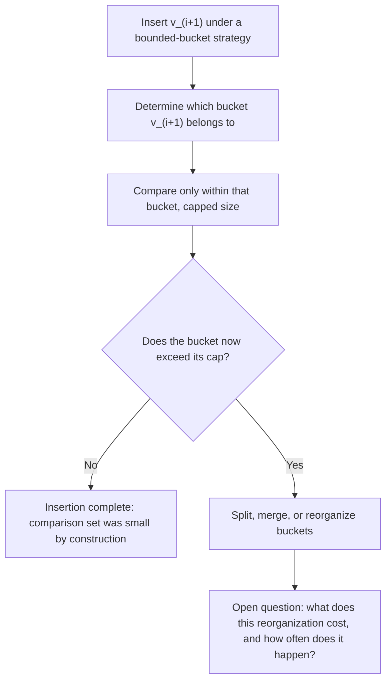

## Previewing, by name only, why a bounded-bucket or bounded-size structure is the natural next step for controlling insertion cost as a graph grows

**Key Points**

- This item does not derive a cost function for bounded-bucket insertion — that derivation is reserved for wherever this curriculum treats bounded-bucket insertion as its own fully worked item. What this item does is explain, by name only, *why* a strategy built around a bounded bucket size is the structurally obvious next move to consider, given everything established so far about $S(i)$ for the other three strategies.
- Brute-force and embedding-threshold insertion both fail to narrow $S(i)$ below $\Theta(i)$ because neither imposes any cap on how large a comparison set can grow. ANN-index insertion narrows $S(i)$ to $O(\log i)$ by routing through a layered hierarchy — powerful, but dependent on the hierarchy itself being built and maintained correctly. A bounded-bucket approach suggests a third, structurally simpler idea: instead of routing cleverly through an unbounded population, refuse to let any single comparison set grow past a fixed cap in the first place.
- Naming this now, without yet deriving its cost curve, previews the same question this chapter has asked of every other strategy: does capping bucket size actually supply a witness in the Chapter 06 sense, or does it only look like one? That question is left open here on purpose.

### An Analogy: A Filing Cabinet With a Hard Rule on Drawer Size

Recall, from the comparison of brute-force and embedding-threshold insertion, the image of two managers walking past every file in a growing cabinet before making a decision — one reading every file in full, one glancing at a cheap tag on each. Recall also the third manager, from the ANN-index item, who instead follows a directory of hub-pointers down through a layered hierarchy, touching only a small handful of files regardless of the cabinet's total size.

Now imagine a fourth approach to managing the same cabinet, different in spirit from all three. Instead of reading every file, and instead of building an elaborate hierarchical directory, this fourth manager enforces a simple standing rule: **no drawer is ever allowed to hold more than, say, twenty files.** The moment a drawer would exceed twenty, its contents get split, merged into a related drawer, or otherwise reorganized so that the twenty-file cap is restored. A new candidate's file only ever needs to be compared against the contents of *one* drawer — never the whole cabinet — because the rule guarantees no drawer can ever contain more than a fixed, small number of files, no matter how large the cabinet as a whole becomes. This is the intuitive shape of a bounded-bucket structure: cap the size of whatever local comparison set an insertion touches, and enforce that cap as an invariant the structure maintains on every insertion, rather than relying on a routing mechanism to find a small set out of an otherwise-unbounded population.

### Recalling Why the Other Three Strategies Leave This Gap Open

Recall that brute-force and embedding-threshold insertion were both shown to have $S(i) = \Theta(i)$ precisely because neither strategy places any limit on how large the comparison set grows as $i$ grows — the "for each of the $i$ existing nodes" loop has no exit condition tied to a size cap, only a condition tied to having visited every existing node.

Recall that ANN-index insertion achieves $S(i) = O(\log i)$ not by capping anything directly, but by routing greedily through a layered hierarchy whose structure happens to produce a small candidate set as a side effect of its layer geometry — recall that HNSW's parameters $M$ and $ef$ govern *how many neighbor connections* and *how wide a candidate list* are maintained, which are themselves a kind of local bound, but one embedded inside a routing mechanism rather than stated as a direct cap on comparison-set size.

A bounded-bucket structure previews a more direct route to the same kind of goal: rather than relying on routing through a hierarchy to arrive at a small set, state the size cap itself as the primary invariant — closer in spirit to how a B-tree's node-capacity invariant directly bounds tree height, than to how HNSW's layered routing indirectly produces a small candidate set through geometric layer structure.

### Naming the Open Question This Preview Sets Up

Stating this by name, without yet deriving anything, makes it possible to ask the exact question this chapter has now asked of every strategy in turn: does a fixed bucket-size cap, by itself, supply a genuine witness — a small, locally-characterizable piece of the structure whose state determines how much must be touched, certified by a local test — or does it merely relocate the $\Theta(i)$-style cost problem somewhere else, such as into the cost of *deciding which bucket* a new node belongs in, or into the cost of *rebalancing buckets* once a cap is exceeded?

Notice the parallel this diagram draws, deliberately left unresolved here: step B — "determine which bucket $v_{i+1}$ belongs to" — is itself a placement decision that has not yet been shown to be cheap. If determining the right bucket requires comparing against representatives of every existing bucket, or against every node in a bucket before confirming membership, the cap on bucket size may not, by itself, prevent $S(i)$ from still growing with $i$ in some other form. This is exactly the kind of question the four classical case studies in Chapter 06 trained this curriculum to ask before accepting any claimed bound at face value — recall that a witness must be certified by an actual local test, not merely asserted to exist because a size cap sounds intuitively bounded.

### Why Naming It Now, Rather Than Deriving It Now, Is the Right Scope

This item is deliberately narrow. Deriving $S_{bucket}(i)$ and $U_{bucket}(i)$ properly requires specifying, precisely, how bucket assignment is decided, how a cap violation triggers reorganization, and what that reorganization costs when amortized across a full insertion sequence — a derivation with the same shape and rigor as the ones already completed for brute-force, embedding-threshold, and ANN-index insertion, but requiring its own dedicated treatment rather than being folded into a preview. What this item accomplishes instead is narrower and specific to its own title: establishing, by name, that a bounded-bucket approach is the natural fourth strategy to examine — motivated directly by the gap left open between "no size limit at all" (brute-force, embedding-threshold) and "a size limit achieved indirectly through hierarchical routing" (ANN-index) — and flagging, honestly, that whether it actually earns a witness-backed bound, or merely relocates the cost elsewhere, is a question this preview raises but does not answer.

**Related Topics**

- A full derivation of bounded-bucket insertion's $S(i)$ and $U(i)$, addressing directly whether bucket-membership determination and cap-triggered reorganization together produce a genuine sub-linear cost curve or merely redistribute a $\Theta(i)$-style cost
- Revisiting the B-tree's node-capacity invariant (Chapter 06) as the closest classical analogue to a bounded-bucket approach, and checking precisely where the analogy holds and where it breaks down for a semantic graph rather than an ordered key space
- The distinction between a theoretical bound and an empirically measured curve, to be applied to bounded-bucket insertion once its theoretical shape is actually derived, exactly as already done for the other three strategies in this chapter