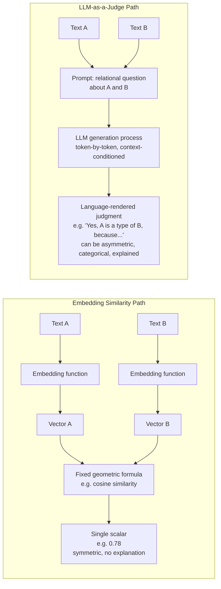

## LLM-as-a-Judge as a Concept Distinct from an Embedding Similarity Score: A Judgment Rendered in Language Versus a Single Number

### A Database Analogy for the Two Kinds of Answers

A database engine gives you two very different kinds of answers depending on what you ask it. A `SELECT similarity_score(a, b)` style query — computing something like a numeric distance or a ranking score — hands back a single float. That float carries no explanation of itself: it does not say *why* two rows are close, only *how* close a predefined formula judged them to be. A stored procedure that runs a chain of conditional business logic and returns a structured verdict — "APPROVED, because balance exceeds threshold and account is not flagged" — hands back something categorically richer: a decision, expressed in terms a human can inspect, argue with, and audit.

Embedding similarity is the first kind of answer. LLM-as-a-judge is the second. This item is about why that difference is not cosmetic — it is a difference in what kind of computation is happening underneath, what kind of output comes out, and therefore what kind of question each tool can honestly be asked to answer.

### Recalling What an Embedding Similarity Score Actually Is

Recall that an embedding is the output of a black-box function that maps a piece of text to a vector of real numbers, engineered so that vectors close together in that space correspond to text the model considers semantically similar. Recall further that cosine similarity measures the angle between two vectors while ignoring their magnitude, and that this angle-based measurement is one of several standard ways of turning "closeness in vector space" into a single number.

Whichever similarity formula is used, the essential shape of the computation is fixed: two vectors go in, one scalar comes out. That scalar is computed by a fixed geometric formula — a dot product, a normalization, an angle — applied identically regardless of *what* the two pieces of text actually mean. The formula has no access to world knowledge, no capacity to reason about the relationship between the two concepts, and no ability to explain its own output beyond "the vectors were this close." If two vectors embedding the phrases "cardiac arrest" and "heart attack" land close together, the score can only tell you that they landed close together — it has no mechanism for saying *why*, whether that closeness reflects true synonymy, mere topical overlap, or an artifact of the training data the embedding model happened to see.

### What LLM-as-a-Judge Actually Is

LLM-as-a-judge is a different kind of computation entirely. Instead of asking a fixed geometric formula to compare two vectors, you construct a prompt that poses a specific relational question about two pieces of text — "Is entity A a type of entity B?", "Do these two node labels refer to the same real-world concept?", "Does statement A logically follow from statement B?" — and you give that prompt to a large language model, which generates a response in natural language (or in a constrained output format derived from natural language, such as a forced "yes/no" token or a short structured label).

The critical distinction is what is happening mechanically. An embedding similarity score is the output of applying a single, fixed, non-reasoning geometric formula to two static vectors. An LLM judgment is the output of an autoregressive generation process — the model producing a sequence of tokens conditioned on the full context of the prompt, drawing on the patterns of relational, causal, and categorical reasoning it acquired during training. The model is not measuring an angle. It is, functionally, *reasoning its way to an answer* and then expressing that answer in language, even if what is happening under the hood is still, mechanically, next-token prediction rather than reasoning in any human sense. [Inference] Whether that process constitutes "genuine reasoning" in a philosophically meaningful sense is a separate and unsettled question; what is not in dispute is that the *output* is a language-structured judgment rather than a geometric distance, and that the computation producing it is sensitive to relational structure that a fixed similarity formula cannot represent at all.

### Why "A Judgment in Language" Is a Different Kind of Object Than "A Number"

A single number, however it was produced, is a total order slice: it tells you *how much* along one predefined axis, and nothing else. A language-rendered judgment can express things a scalar structurally cannot:

**Asymmetric relations.** "Is a cardiologist a type of physician?" and "Is a physician a type of cardiologist?" are different questions with different correct answers — the first is true, the second is false. This is a subsumption relationship: one category is a subset of another, and subsumption is inherently directional. Cosine similarity between the two embeddings, by construction, is symmetric — $\cos(\vec{a}, \vec{b}) = \cos(\vec{b}, \vec{a})$ always, for any pair of vectors, no exceptions. A geometric distance simply has no way to represent "A implies B but B does not imply A," because a single scalar carries no direction. An LLM prompted separately in each direction can, in principle, give two different answers, because it is evaluating a directional relational question each time rather than measuring an undirected gap.

**Categorical structure versus graded proximity.** Embedding similarity is continuous by construction: 0.71 and 0.74 are both just numbers, and nothing about the representation forces a hard boundary between "same category" and "different category" — that boundary has to be imposed externally, as an arbitrary threshold. An entailment judgment, by contrast, is naturally categorical: A either does or does not logically follow from B, at least as the LLM is being asked to render it. The judgment task is shaped like a classification with a defensible boundary; the similarity task is shaped like a measurement with no boundary at all.

**A stated reason.** An LLM can be prompted to output a brief justification alongside its verdict — "these are the same entity because both refer to the municipal health department, despite the differing abbreviation" — turning the judgment into something that can be audited, spot-checked, and debugged by a human reading the explanation. A similarity score of 0.83 offers no equivalent artifact; there is nothing to read that explains the 0.83.

### A Small Worked Example: Same Score, Different Judgments

Consider three short phrases a hypothetical knowledge-graph pipeline might be comparing while deciding whether to merge nodes:

- A: "City Health Office"
- B: "Municipal Health Department"
- C: "Health Insurance Office"

Suppose an embedding model, applied to all three, happens to produce:

$$\cos(\vec{A}, \vec{B}) \approx 0.78 \qquad \cos(\vec{A}, \vec{C}) \approx 0.78$$

[Speculation] These exact figures are illustrative rather than measured from any specific embedding model, but the scenario they represent — two unrelated pairs landing at a numerically similar cosine score for different underlying reasons — is a well-documented, realistic failure pattern for embedding-based similarity, not a contrived edge case. If both pairs land at the same similarity score, a threshold-based system with a fixed cutoff (say, "merge if similarity > 0.75") would treat A–B and A–C *identically* — both above threshold, both merged, or both rejected, entirely as a coincidence of where the numeric cutoff happens to sit. The score cannot distinguish "these are the same office under two different names" (A and B — a true match) from "these are two different offices that happen to share several words about health administration" (A and C — a false match) if both pairs happen to produce similar geometric proximity.

Now pose the equivalent question to an LLM: "Do 'City Health Office' and 'Municipal Health Department' refer to the same real-world entity? Do 'City Health Office' and 'Health Insurance Office' refer to the same real-world entity?" A competent LLM judge, drawing on its trained-in understanding of what these institutional names denote, can correctly answer "yes" to the first and "no" to the second — because it is reasoning about what each phrase *refers to*, not measuring how many word-level or contextual features happen to overlap in a fixed vector representation. This is the concrete anatomy of the gap this item is naming: the numeric approach collapses two structurally different situations into the same undifferentiated score, while the language-based judgment can separate them because it is answering a relational question rather than reporting a distance.

### Why This Distinction Matters for a Knowledge-Graph Insertion Pipeline

This distinction is not an abstract preference for one tool's aesthetics over another's — it maps directly onto a concrete architectural choice for any pipeline that decides whether a new entity should be merged into an existing graph node or added as a new one. A similarity score alone can only ever answer "how close are these two representations," which is a reasonable *first-pass filter* for narrowing a large candidate set down to a small one cheaply, but it structurally cannot answer "are these the same real-world entity," "is one a subtype of the other," or "does the graph's existing hierarchy actually support merging these two nodes." Those are relational, categorical, often asymmetric questions, and answering them well is exactly the kind of task an LLM-as-a-judge step is suited for — at the cost of being far more computationally expensive per comparison than evaluating a geometric formula, which is precisely why a well-designed pipeline tends to use the cheap numeric score to cut a large candidate pool down first, and reserve the expensive language-rendered judgment for the smaller set of candidates where a genuinely relational decision is actually needed.

### Illustration: Two Different Computations, Two Different Kinds of Output

The two paths take the same raw inputs — two pieces of text — but diverge immediately into structurally different computations. The top path funnels everything through a fixed formula that can only ever emit a scalar. The bottom path funnels everything through a generative reasoning process that can emit a directional, categorical, self-explaining verdict. Neither path is strictly better in isolation; they answer different questions, at different costs, and the failure mode this chapter goes on to examine emerges precisely when a pipeline asks the wrong one of these two tools to answer a question only the other one is actually equipped to answer.

**Related Topics**

- Subsumption and entailment as the specific relational judgment types an LLM judge is asked to render
- Why transitivity of LLM judgments is desired but not structurally guaranteed
- The Healthcare Facilities and Hospitals worked failure example as a concrete instance of this gap causing downstream harm
- Two-stage embedding-plus-LLM pipelines: using similarity as a cheap candidate filter before an expensive judgment step
- Calibration and consistency of LLM judgments across repeated or reordered queries
- Designing prompts that elicit a structured, auditable verdict rather than free-form prose