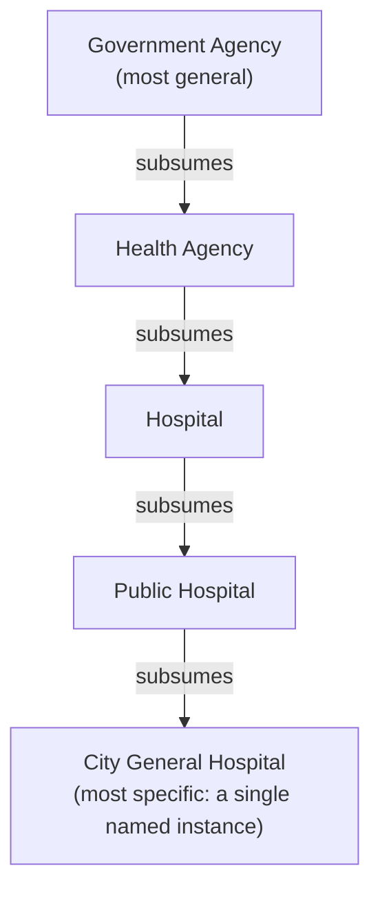

## What a Subsumption or Entailment Judgment Is: Asking Whether One Concept Is a More General Category That Contains Another

### A Filesystem Analogy for Containment

Anyone who has organized a directory tree already has the core intuition for this concept, just under a different name. A file at path `/documents/finance/invoices/2024/march.pdf` sits *inside* the directory `/documents/finance/invoices/2024`, which itself sits inside `/documents/finance`, which sits inside `/documents`. Each level is a more general container that holds everything beneath it. Asking "does the directory `/documents/finance` contain the file `march.pdf`?" is asking exactly the same *shape* of question as asking "is a cardiologist a type of physician?" — in both cases, you are asking whether a more specific thing falls inside the boundary drawn by a more general thing. Subsumption is this containment relationship, lifted out of filesystems and applied to concepts and categories.

### Defining Subsumption

Subsumption is the relationship that holds between two concepts when one concept — the more general one — fully contains the other as a special case. If concept $B$ subsumes concept $A$, then every instance of $A$ is also, necessarily, an instance of $B$, though the reverse need not hold. "Physician" subsumes "cardiologist," because every cardiologist is a physician, but not every physician is a cardiologist. "Vehicle" subsumes "car," because every car is a vehicle, but plenty of vehicles — bicycles, ships, airplanes — are not cars.

The standard way to state this formally, borrowing the vocabulary of set theory that a reader with general CS maturity already has, is as a subset relationship between the *instances* of each concept: if $\text{instances}(A) \subseteq \text{instances}(B)$, then $B$ subsumes $A$. Every member of the set of cardiologists is also a member of the set of physicians; the set of cardiologists is a subset of the set of physicians. This is precisely the same subset relationship a reader would recognize from any prior exposure to sets, applied here to the extension of a category rather than to an arbitrary collection of elements.

### Defining Entailment

Entailment is the same underlying idea of "guaranteed to follow," stated over propositions rather than over categories. Statement $P$ entails statement $Q$ if, whenever $P$ is true, $Q$ must also be true — there is no possible situation in which $P$ holds and $Q$ fails. "This patient has bacterial pneumonia" entails "this patient has an infection," because having bacterial pneumonia guarantees having an infection, with no exception. "This patient has a fever" does not entail "this patient has bacterial pneumonia," because plenty of situations produce a fever with no bacterial pneumonia present at all.

Subsumption and entailment are, structurally, the same logical shape wearing two different outfits. Subsumption asks the containment question at the level of categories: is every instance of A also an instance of B? Entailment asks the identical containment question at the level of statements: is every situation that makes P true also a situation that makes Q true? A subsumption claim like "cardiologist is a type of physician" can be rephrased, without changing its truth value, as an entailment claim: "X is a cardiologist" entails "X is a physician." This chapter treats the two as the same relational judgment applied to two different kinds of objects, because the reasoning an LLM must perform to answer either one is the same reasoning: checking whether the more specific thing's defining conditions are a strict superset of conditions that guarantee the more general thing.

### Directionality Is the Load-Bearing Property

The single most important structural fact about subsumption is that it is a directed relationship, not a symmetric one. "Cardiologist is a type of physician" is true. "Physician is a type of cardiologist" is false. These are two different claims, and getting the direction backward does not produce a slightly-wrong answer — it produces a categorically false one, because it asserts that a general category is a special case of one of its own narrower subcategories, which is nonsensical: it would claim that every physician is specifically a heart specialist.

This directionality is precisely what distinguishes a subsumption judgment from a symmetric distance measurement. Recall that cosine similarity measures the angle between two vectors while ignoring their magnitude, and that this measurement is symmetric by construction: $\cos(\vec{a}, \vec{b})$ and $\cos(\vec{b}, \vec{a})$ are numerically identical, no exceptions, because the formula computing an angle has no way to privilege one vector as "the general one" and the other as "the specific one." A directed relationship like subsumption cannot be represented faithfully by an inherently undirected number. This is the same gap named when distinguishing an LLM's language-rendered judgment from a similarity score: recall that a fixed geometric formula produces a single symmetric scalar, while a language-rendered judgment can express an asymmetric relation because it is answering a directional relational question rather than reporting an undirected distance. Subsumption is the specific, concrete relation where that asymmetry actually bites: any system that tries to detect "is A a type of B" using an undirected similarity score is, by the shape of the tool alone, unable to represent the fact that the correct answer to "is A a type of B" and the correct answer to "is B a type of A" can differ.

### A Worked Example: Building Out a Small Subsumption Hierarchy

Consider five category labels a knowledge-graph construction pipeline might encounter while processing text about a city's public services:

- Government Agency
- Health Agency
- Hospital
- Public Hospital
- City General Hospital (a specific, named hospital)

Laid out as a containment hierarchy, each level subsumes everything below it:

Reading this chain, each arrow states a true subsumption claim: every health agency is a government agency (in this simplified worked world where health agencies are assumed to be government-run); every hospital is a health agency; every public hospital is a hospital; and "City General Hospital" is a single specific instance of a public hospital. Crucially, subsumption is also transitive across this chain in the specific worked sense that if $A$ subsumes $B$ and $B$ subsumes $C$, then $A$ subsumes $C$: since "Government Agency" subsumes "Hospital" (via "Health Agency" in between), and "Hospital" subsumes "City General Hospital" (via "Public Hospital"), it correctly follows that "Government Agency" subsumes "City General Hospital" — every general city hospital is, transitively, a government agency. [Inference] This transitivity holds cleanly for *this specific worked chain* because each step was deliberately constructed as an unambiguous, uncontroversial containment; whether an LLM asked to *judge* subsumption reliably preserves transitivity across chains it discovers or is asked to verify on real, messier data is a separate and much less settled question, taken up directly as this chapter's next concern rather than assumed here.

Now consider a near-miss that a naive similarity-based approach could easily get wrong but that a subsumption judgment handles correctly by construction. "Health Insurance Office" is topically close to "Health Agency" — both involve the word "health," both concern administrative bodies, both could easily land near each other in embedding space — but a health insurance office is not a type of health agency in the relevant institutional sense, and is certainly not a type of hospital. A subsumption judgment, correctly posed as "is every health insurance office necessarily a health agency?", forces an evaluator to check the actual containment condition rather than surface topical overlap, and a competent judgment process should answer "no" — insurance administration and health service delivery are different functions, even though the vocabulary describing them overlaps heavily.

### Posing Subsumption as a Question an LLM Can Be Asked to Judge

Because subsumption is a directed, categorical, containment-style claim, it can be posed to an LLM as a direct relational question rather than as a numeric comparison — this is the concrete instance of the LLM-as-a-judge pattern applied to this specific relation type. A prompt template of the shape "Is every instance of [A] necessarily an instance of [B]? Answer yes or no, and justify your answer" asks the model to evaluate the strict-containment condition directly, in language, rather than asking it (or a similarity formula) to report how topically close the two labels happen to sit. The worked example above shows why this framing matters in practice: "Health Insurance Office" and "Health Agency" might well produce a high embedding similarity score due to shared vocabulary and topical proximity, while the correctly posed subsumption question — does every instance of the first necessarily belong to the second? — has a clear, correct "no," which only a relational judgment, and not a distance measurement, is structurally equipped to produce.

### Why This Matters for Incremental Graph Construction

A knowledge graph is, in large part, a structure whose edges frequently encode exactly this relationship: a "type-of," "is-a," or "part-of" edge between a specific node and a more general category node is a subsumption claim made concrete as graph structure. Deciding where to attach a newly extracted entity — should "City General Hospital" be linked under "Public Hospital," under the broader "Hospital," or under an entirely new category the graph does not yet have — is, at its core, a sequence of subsumption judgments: for each candidate parent category, does this new entity's category fall strictly inside it? Getting this judgment right, including getting its direction right, is a direct prerequisite for the insertion strategies at the center of this curriculum's earlier chapters producing a graph whose hierarchy is actually navigable and semantically correct, rather than one where entities are attached to whichever existing node happened to look superficially close.

**Related Topics**

- Why transitivity of subsumption judgments is desired but not guaranteed when an LLM is doing the judging rather than a formal ontology
- The Healthcare Facilities and Hospitals worked failure example as a concrete transitivity breakdown
- Distinguishing an LLM judgment from an embedding similarity score in terms of what each can and cannot represent
- Formal ontology and taxonomy design as a longer-standing discipline for encoding subsumption hierarchies by hand
- Prompt design strategies for eliciting consistent directional judgments from an LLM
- The downstream cost, in a graph construction pipeline, of assuming a subsumption chain is valid without verifying each link